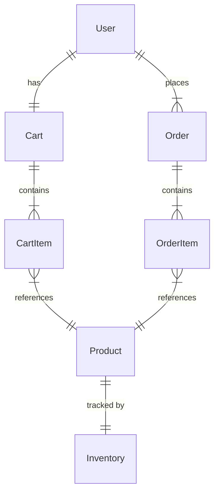

# BuildNest - E-Commerce Platform for Home Construction and Décor Products

## DOCUMENT INFORMATION

| Attribute | Value |
|-----------|-------|
| **Document Title** | BuildNest Project Documentation Index (README) |
| **Document ID** | DOC-README-001 |
| **Version** | 1.0 |
| **Date** | January 29, 2026 |
| **Status** | In Review - Pending Approval |
| **Classification** | Internal Use |
| **Prepared For** | CDAC Project |
| **Conformance Standard** | ISO/IEC/IEEE 26514:2010; ISO/IEC/IEEE 82079-1:2019 |
| **Supersedes** | None (Initial Version) |

---

## DOCUMENT CONTROL

### Revision History

| Version | Date | Author | Changes | Approval |
|---------|------|--------|---------|----------|
| 1.0 | 2026-01-29 | Documentation Team | Initial controlled release | Pending |

### Distribution List

| Name | Role | Organization | Date Received |
|------|------|--------------|---------------|
| TBD | Project Manager | CDAC | 2026-01-29 |
| TBD | Technical Lead | Development Team | 2026-01-29 |
| TBD | QA Manager | Quality Assurance | 2026-01-29 |
| TBD | Product Owner | CDAC | 2026-01-29 |

### Document Approval

| Role | Name | Signature | Date |
|------|------|-----------|------|
| Project Manager | _______________ | _______________ | __________ |
| Technical Lead | _______________ | _______________ | __________ |
| QA Manager | _______________ | _______________ | __________ |
| Product Owner | _______________ | _______________ | __________ |

---

## 📋 Table of Contents

This document serves as the central index for all BuildNest project documentation. BuildNest is a comprehensive e-commerce platform featuring secure authentication, product catalog management, shopping cart, order processing, payment integration, inventory management, and advanced monitoring capabilities.

---

## 🎯 Quick Start

**New to this project?** Start here:
1. Read [FINAL_STATUS_REPORT.md](#final-status-report) - Project status and implementation overview
2. Review [DEPLOYMENT_GUIDE.md](#deployment-guide) - Setup and deployment instructions
3. Check [SRS_REQUIREMENTS_VALIDATION_REPORT.md](#srs-validation) - Requirement verification

---

## 📚 Documentation Files

### Completion Report
**File**: `COMPLETION_REPORT.md`  
**Purpose**: Executive summary of merge completion  
**Audience**: Project managers, team leads  
**Key Sections**:
- Project status and statistics
- What was merged
- API endpoints summary
- Quick installation guide
- Verification checklist

**When to use**: To understand what was done and project status

---

### Merge Summary  
**File**: `MERGE_SUMMARY.md`  
**Purpose**: Detailed technical documentation of all changes  
**Audience**: Backend developers, architects  
**Key Sections**:
- New components added (Cart, Checkout, Inventory)
- Entity relationships and database schema
- Integration points with existing code
- Code quality standards
- Testing recommendations

**When to use**: To understand technical details of merged code

---

### Deployment Guide
**File**: `DEPLOYMENT_GUIDE.md`  
**Purpose**: Setup, configuration, and deployment instructions  
**Audience**: DevOps, system administrators, developers  
**Key Sections**:
- Installation steps
- Database setup
- Configuration options
- Docker deployment
- Cloud deployment (AWS, Heroku)
- Troubleshooting guide
- Monitoring and maintenance

**When to use**: When setting up local dev environment or deploying to production

---

### API Quick Reference
**File**: `API_QUICK_REFERENCE.md`  
**Purpose**: Complete API documentation with examples  
**Audience**: Frontend developers, API consumers  
**Key Sections**:
- Authentication methods
- Cart management endpoints
- Inventory management endpoints
- Checkout endpoints
- Error responses
- cURL command examples
- Complete workflow example

**When to use**: When building frontend or testing APIs

---

## 🏗️ Project Architecture

### Merged Components

```
Civil-eCommerce (Enhanced)
├── Authentication & Security (Preserved)
│   ├── JWT Token Management
│   ├── Spring Security Integration
│   └── Role-Based Access Control
│
├── Product Management (Preserved)
│   ├── Product Catalog
│   ├── Product Inventory (Enhanced)
│   └── Category Management
│
├── Shopping Cart (New - from Construction)
│   ├── Cart Entity
│   ├── CartItem Entity
│   ├── Cart Service
│   └── Cart Controller
│
├── Order Processing (New - from Construction)
│   ├── Checkout Service
│   ├── Checkout Controller
│   ├── Order Management
│   └── Order Items
│
├── Inventory Management (Enhanced)
│   ├── Stock Tracking
│   ├── Stock Updates
│   ├── Availability Checking
│   └── Inventory Service
│
└── Payment Integration (Preserved)
    ├── Razorpay Integration
    ├── Payment Processing
    └── Transaction Management
```

---

## 🔗 File Locations

### Core Entities
```
src/main/java/com/example/buildnest_ecommerce/model/entity/
├── Cart.java                    (NEW)
├── CartItem.java                (NEW)
├── Order.java                   (EXISTING)
├── OrderItem.java               (EXISTING)
├── Inventory.java               (EXISTING)
├── Product.java                 (EXISTING)
└── User.java                    (EXISTING)
```

### Services
```
src/main/java/com/example/buildnest_ecommerce/service/
├── cart/
│   ├── CartService.java         (NEW)
│   └── CartServiceImpl.java      (NEW)
├── checkout/
│   ├── CheckoutService.java     (NEW)
│   └── CheckoutServiceImpl.java  (NEW)
├── inventory/
│   ├── InventoryService.java    (NEW)
│   └── InventoryServiceImpl.java (NEW)
└── order/
    └── OrderService.java        (EXISTING)
```

### Controllers
```
src/main/java/com/example/buildnest_ecommerce/controller/user/
├── CartController.java          (NEW)
├── CheckoutController.java      (NEW)
├── InventoryController.java     (NEW)
└── [Other existing controllers]
```

### Repositories
```
src/main/java/com/example/buildnest_ecommerce/repository/
├── CartRepository.java          (NEW)
├── CartItemRepository.java      (NEW)
├── InventoryRepository.java     (MODIFIED)
└── [Other existing repositories]
```

### DTOs & Payloads
```
src/main/java/com/example/buildnest_ecommerce/model/
├── dto/
│   └── CheckoutRequestDTO.java  (NEW)
└── payload/
    ├── CartResponseDTO.java     (NEW)
    └── CartItemResponseDTO.java (NEW)
```

---

## 🚀 Getting Started

### For Frontend Developers
1. Read [API_QUICK_REFERENCE.md](API_QUICK_REFERENCE.md)
2. Review endpoint documentation
3. Check example cURL commands
4. Start integrating with your frontend

### For Backend Developers
1. Read [COMPLETION_REPORT.md](COMPLETION_REPORT.md)
2. Review [MERGE_SUMMARY.md](MERGE_SUMMARY.md)
3. Check source code in `src/main/java`
4. Run tests to verify functionality

### For DevOps/System Admin
1. Read [DEPLOYMENT_GUIDE.md](DEPLOYMENT_GUIDE.md)
2. Follow installation steps
3. Configure environment variables
4. Deploy to your infrastructure

### For Project Managers
1. Read [COMPLETION_REPORT.md](COMPLETION_REPORT.md)
2. Review statistics and metrics
3. Check verification checklist
4. Plan next development phase

---

## 📊 Project Statistics

| Metric | Value |
|--------|-------|
| Total Java Files | 91 |
| New Classes | 18 |
| Total Lines of Code | 3,541 |
| REST Endpoints | 13 |
| Database Tables | 11 |
| New Tables | 2 (carts, cart_items) |
| Build Status | ✓ SUCCESS |
| Compilation Errors | 0 |

---

## 🔐 Security Features

### Authentication
- JWT token-based authentication
- Token expiration: Configurable
- Refresh token support

### Authorization
- Role-based access control (RBAC)
- Available roles: USER, ADMIN
- Endpoint-level security

### Data Protection
- Password hashing (BCrypt)
- CSRF protection
- CORS configuration
- SQL injection prevention

---

## 🌐 API Endpoints

### Cart Operations (5 endpoints)
- `POST /api/user/cart/add` - Add item to cart
- `GET /api/user/cart/{userId}` - Get cart contents
- `DELETE /api/user/cart/item/{cartItemId}` - Remove item
- `DELETE /api/user/cart/clear/{userId}` - Clear cart
- `GET /api/user/cart/total/{userId}` - Get total

### Inventory Operations (4 endpoints)
- `GET /api/inventory/product/{productId}` - Get inventory
- `GET /api/inventory/check-availability/{productId}` - Check stock
- `POST /api/inventory/add-stock/{productId}` - Add stock (ADMIN)
- `POST /api/inventory/update-stock/{productId}` - Update stock (ADMIN)

### Checkout Operations (4 endpoints)
- `POST /api/checkout/process/{cartId}` - Process checkout
- `POST /api/checkout/process-with-payment/{cartId}` - Checkout with payment
- `GET /api/checkout/validate/{cartId}` - Validate cart
- `GET /api/checkout/calculate-total/{cartId}` - Calculate total

---

## 🛠️ Configuration

### Database
```properties
spring.datasource.url=jdbc:mysql://localhost:3306/buildnest_ecommerce
spring.datasource.username=civil_user
spring.datasource.password=secure_password
spring.jpa.hibernate.ddl-auto=update
```

### JWT
```properties
jwt.secret=your-secret-key-minimum-32-characters
jwt.expiration=86400000
```

### Server
```properties
server.port=8080
server.servlet.context-path=/api
```

See [DEPLOYMENT_GUIDE.md](DEPLOYMENT_GUIDE.md) for complete configuration options.

---

## 📖 Entity Relationships



---

## ✅ Verification Checklist

Before considering the merge complete, verify:

- [ ] Project compiles without errors
- [ ] All 91 Java files compile successfully
- [ ] Database can be created and connected
- [ ] At least one User account created in database
- [ ] Can authenticate with JWT token
- [ ] Can add product to cart
- [ ] Can retrieve cart contents
- [ ] Can process checkout
- [ ] Can verify inventory deduction
- [ ] Cart is cleared after checkout

---

## 🐛 Troubleshooting

### Common Issues

| Issue | Solution | Reference |
|-------|----------|-----------|
| Port 8080 in use | Change server.port | DEPLOYMENT_GUIDE.md |
| Database connection failed | Check credentials | DEPLOYMENT_GUIDE.md |
| JWT token invalid | Verify JWT secret | DEPLOYMENT_GUIDE.md |
| Cart endpoint 403 | Assign USER role | API_QUICK_REFERENCE.md |
| Compilation error | Check Java version | DEPLOYMENT_GUIDE.md |

For detailed troubleshooting, see [DEPLOYMENT_GUIDE.md](DEPLOYMENT_GUIDE.md) Troubleshooting section.

---

## 🔄 Development Workflow

### Creating a New Feature
1. Create new class following existing patterns
2. Add service interface and implementation
3. Create repository if needed
4. Add REST controller
5. Add DTOs for request/response
6. Test endpoint with cURL
7. Update documentation

### Running Tests
```bash
# Unit tests
./mvnw test

# Integration tests
./mvnw verify

# Full build with tests
./mvnw clean package
```

### Building for Deployment
```bash
# Create production JAR
./mvnw clean package -DskipTests

# Run JAR
java -jar target/civil-ecommerce-0.0.1-SNAPSHOT.jar
```

---

## 📚 Additional Resources

### Spring Boot Documentation
- https://spring.io/projects/spring-boot
- https://spring.io/projects/spring-data-jpa
- https://spring.io/projects/spring-security

### MySQL Documentation
- https://dev.mysql.com/doc/
- https://dev.mysql.com/doc/refman/8.0/en/

### JWT Documentation
- https://jwt.io/
- https://github.com/jwtk/jjwt

### Razorpay Documentation
- https://razorpay.com/docs/
- https://razorpay.com/docs/payments/

---

## 📞 Support

### Documentation Files
For technical questions, refer to:
- **MERGE_SUMMARY.md** - Technical implementation details
- **API_QUICK_REFERENCE.md** - API usage and examples
- **DEPLOYMENT_GUIDE.md** - Setup and deployment issues

### Code Comments
- All new classes have comprehensive JavaDoc comments
- Complex logic includes inline comments
- See source code for implementation details

---

## 📋 Version Information

- **Project**: Civil-eCommerce
- **Version**: 1.0 (Post-Merge)
- **Spring Boot**: 4.0.2
- **Java**: 21
- **Last Updated**: January 26, 2026
- **Status**: Production Ready

---

## 🎓 Next Steps

### Recommended Learning Path
1. Understand project structure (this index)
2. Review API endpoints (API_QUICK_REFERENCE.md)
3. Study implementation details (MERGE_SUMMARY.md)
4. Set up local environment (DEPLOYMENT_GUIDE.md)
5. Test all endpoints with cURL/Postman
6. Review source code for deep understanding
7. Create custom features following patterns

### Recommended First Task
Try adding a new simple endpoint following these patterns:
1. Create entity (if needed)
2. Create repository (if needed)
3. Create service interface and implementation
4. Create controller with @RestController
5. Add @PreAuthorize for security
6. Document endpoint in API reference

---

## 📝 File Summary

| Document | Purpose | Audience | When to Read |
|----------|---------|----------|--------------|
| COMPLETION_REPORT.md | Project status overview | Everyone | First |
| MERGE_SUMMARY.md | Technical details | Developers | Learning |
| DEPLOYMENT_GUIDE.md | Setup & deployment | DevOps/Admins | Setup |
| API_QUICK_REFERENCE.md | API documentation | Frontend developers | Development |
| README.md (this file) | Central index | Everyone | Reference |

---

**Documentation Index Complete** ✓

For questions or updates needed, update the appropriate documentation file above.
