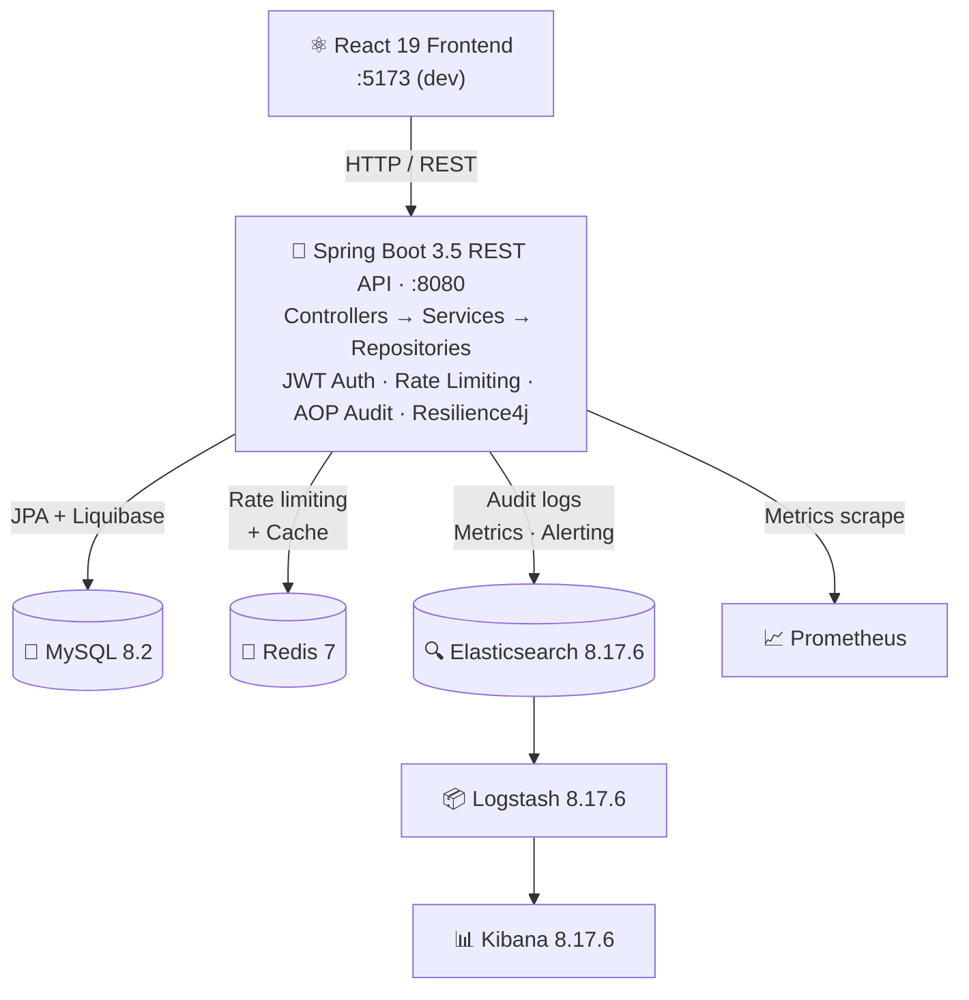

# BuildNest

> E-commerce platform for home construction materials and home décor products.

[](https://github.com/pradip9096/buildnest-ecommerce-platform/actions/workflows/ci.yml)
[](https://github.com/pradip9096/buildnest-ecommerce-platform/actions/workflows/security.yml)
[](CHANGELOG.md)
[](https://openjdk.org/projects/jdk/21/)
[](https://spring.io/projects/spring-boot)
[](LICENSE)

---

## Table of Contents

- [Overview](#overview)
- [Architecture](#architecture)
- [Tech Stack](#tech-stack)
- [Project Structure](#project-structure)
- [Prerequisites](#prerequisites)
- [Getting Started](#getting-started)
- [Running Tests](#running-tests)
- [API Documentation](#api-documentation)
- [Environment Variables](#environment-variables)
- [CI/CD](#cicd)
- [Roadmap](#roadmap)
- [Changelog](#changelog)

---

## Overview

BuildNest is a full-stack e-commerce platform targeting the home construction and décor market. It exposes a Spring Boot REST API backed by MySQL, Redis, and Elasticsearch, with a React 19 + TypeScript frontend covering the full customer and admin journey — home, product listing/detail, cart, checkout, order confirmation, login/register, forgot/reset-password, account dashboard, and an admin dashboard.

**Key capabilities:**

- Product catalogue with category hierarchy, search, and dual API versioning (v1/v2)
- Shopping cart, wishlist, and checkout flows
- Order management with inventory tracking
- JWT-based authentication with refresh token rotation and role/permission RBAC
- Audit logging via AOP — every auditable action is captured and ingested into Elasticsearch
- Redis-backed rate limiting (Bucket4j) and response caching
- Elasticsearch-driven metrics collection, alerting, and query optimisation
- Circuit breaker and time-limiter resilience patterns (Resilience4j)
- Prometheus metrics endpoint for observability

---

## Architecture


```mermaid
graph TD
    FE["⚛️ React 19 Frontend\n:5173 (dev)"]
    API["🍃 Spring Boot 3.5 REST API · :8080\nControllers → Services → Repositories\nJWT Auth · Rate Limiting · AOP Audit · Resilience4j"]

    FE -->|HTTP / REST| API

    API -->|JPA + Liquibase| DB[("🐬 MySQL 8.2")]
    API -->|Rate limiting\n+ Cache| REDIS[("🔴 Redis 7")]
    API -->|Audit logs\nMetrics · Alerting| ES[("🔍 Elasticsearch 8.17.6")]

    ES --> LS["📦 Logstash 8.17.6"]
    LS --> KB["📊 Kibana 8.17.6"]

    API -->|Metrics scrape| PROM["📈 Prometheus"]
```

Schema changes are managed exclusively through **Liquibase** changesets (`backend/db/changelog/`). DDL auto is set to `validate` — no schema changes via Hibernate.

---

## Tech Stack

| Layer | Technology |
|---|---|
| Language | Java 21 |
| Framework | Spring Boot 3.5 |
| Security | Spring Security, JWT (access 15 min / refresh 30 days) |
| Persistence | Spring Data JPA, Hibernate, MySQL 8.2 |
| Migrations | Liquibase |
| Cache / Rate Limiting | Redis 7, Bucket4j |
| Search / Analytics | Elasticsearch 8.17.6, Spring Data Elasticsearch |
| Logging | Logback, Logstash JSON encoder, Kibana |
| Resilience | Resilience4j (circuit breaker, time limiter) |
| API Docs | SpringDoc OpenAPI (Swagger UI) |
| Observability | Spring Boot Actuator, Prometheus |
| Build | Maven 3, Maven Wrapper |
| Containerisation | Docker, Docker Compose |
| Frontend | React 19, Vite, TypeScript, Tailwind CSS v4 |
| CI/CD | GitHub Actions |
| Security scanning | OWASP Dependency-Check (CVSS ≥ 7.0 fails build; SARIF report surfaced via GitHub's code-scanning UI using the `codeql-action/upload-sarif` action), CodeQL (own semantic-analysis engine, `java-kotlin` + `javascript-typescript`, dedicated `codeql.yml` workflow — #358), SonarCloud (`SonarQube Code Analysis` PR check) |
| Code quality | CheckStyle (**blocking**, baseline + ratchet — fails only above a documented violation ceiling), SpotBugs (non-blocking, untriaged findings) |
| Test quality | JaCoCo (≥ 85% instruction coverage per package, `ci` profile), PIT mutation testing (≥ 77% mutation score, ratcheting to 83% through M5), Codecov (`codecov/patch` diff-coverage PR check) |
| Testing frameworks | JUnit 5, Mockito, ArchUnit (naming-convention enforcement), REST Assured, Gatling (load tests) |

---

## Project Structure

```
BuildNest/
├── backend/                        # Spring Boot API
│   ├── src/
│   │   ├── main/java/com/example/buildnest_ecommerce/
│   │   │   ├── controller/
│   │   │   │   ├── public_/        # Unauthenticated endpoints
│   │   │   │   ├── auth/           # Login, registration, password reset
│   │   │   │   ├── user/           # Customer-facing endpoints
│   │   │   │   ├── admin/          # Admin-only endpoints
│   │   │   │   └── inventory/      # Inventory status
│   │   │   ├── service/            # Domain services (interface + impl)
│   │   │   ├── model/
│   │   │   │   ├── entity/         # JPA entities
│   │   │   │   ├── dto/            # Output DTOs
│   │   │   │   ├── payload/        # Request/response payloads
│   │   │   │   └── elasticsearch/  # Elasticsearch document models
│   │   │   ├── repository/         # Spring Data JPA + Elasticsearch repositories
│   │   │   ├── security/           # JWT filter, entry point, token provider
│   │   │   ├── config/             # Spring configuration beans
│   │   │   ├── aspect/             # @Auditable AOP aspect
│   │   │   ├── interceptor/        # Rate-limit headers, API sunset warnings
│   │   │   └── exception/          # GlobalExceptionHandler + domain exceptions
│   │   └── main/resources/
│   │       ├── application.properties
│   │       ├── db/changelog/       # Liquibase changesets
│   │       └── logback-spring.xml
│   ├── docker-compose.yml
│   ├── .env.example                # All 87 required variables documented
│   └── pom.xml
├── frontend/                       # React 19 / Vite / TypeScript / Tailwind CSS v4
├── docs/SDLC-docs/                 # SRS, SDD, RTM, Test Plan, SDP, and more
├── CHANGELOG.md
└── README.md
```

---

## Prerequisites

| Tool | Version |
|---|---|
| JDK | 21+ |
| Maven | 3.9+ (or use `./mvnw`) |
| Docker & Docker Compose | 24+ |
| Node.js | 20+ (frontend only) |

---

## Getting Started

### 1. Clone and configure

```bash
git clone https://github.com/pradip9096/buildnest-ecommerce-platform.git
cd buildnest-ecommerce-platform/backend
cp .env.example .env
# Edit .env and populate all required values (see .env.example for descriptions)
```

### 2. Start infrastructure

```bash
# Minimum required services
docker compose up -d mysql redis elasticsearch

# Full stack (includes Kibana, Logstash, Prometheus)
docker compose up -d
```

### 3. Run the API

```bash
./mvnw spring-boot:run
# API available at http://localhost:8080
# Swagger UI at http://localhost:8080/swagger-ui/index.html
```

### 4. Run the frontend (optional)

```bash
cd ../frontend
npm install
npm run dev
# Dev server at http://localhost:5173
```

---

## Running Tests

All commands run from the `backend/` directory.

```bash
# Full test suite
./mvnw test

# Single test class
./mvnw test -Dtest=OrderServiceImplTest

# Single test method
./mvnw test -Dtest=OrderServiceImplTest#shouldPlaceOrder

# Coverage report (opens at target/site/jacoco/index.html)
./mvnw verify

# With OWASP Dependency-Check (slow — pulls NVD data)
./mvnw verify -Powasp

# CheckStyle (blocking in CI, baseline + ratchet — see CI/CD table)
./mvnw checkstyle:check -Dcheckstyle.maxAllowedViolations=8305

# SpotBugs (non-blocking in CI, untriaged findings)
./mvnw spotbugs:check
```

Integration tests use an H2 in-memory database and mock all Elasticsearch beans — no running infrastructure required for `./mvnw test`.

---

## API Documentation

Swagger UI is served at `/swagger-ui/index.html` when the application is running.

### Auth flow

```
POST /api/auth/register    → create account
POST /api/auth/login       → returns { accessToken, refreshToken }
POST /api/auth/refresh     → rotate refresh token, get new access token
POST /api/auth/logout      → invalidate refresh token

POST /api/password/forgot  → request a reset token (?email=)
POST /api/password/reset   → reset with token (?token=&newPassword=)
POST /api/password/change  → authenticated password change
```

Access tokens expire after 15 minutes. Include them as `Authorization: Bearer <token>`.

`/api/password/forgot` and `/api/password/reset` take their parameters as a URL query string, not a JSON body — unlike every other endpoint above.

### Versioning

Product endpoints are available at `/api/v1/products` (deprecated, sunset headers added) and `/api/v2/products`. All other endpoints are unversioned.

---

## Environment Variables

All 87 required variables are documented with descriptions and example values in `backend/.env.example`. Key groups:

| Group | Variables |
|---|---|
| Database | `DB_HOST`, `DB_PORT`, `DB_NAME`, `DB_USERNAME`, `DB_PASSWORD` |
| Redis | `REDIS_HOST`, `REDIS_PORT`, `REDIS_PASSWORD` |
| Elasticsearch | `ELASTICSEARCH_HOST`, `ELASTICSEARCH_PORT`, `ELASTICSEARCH_USERNAME`, `ELASTICSEARCH_PASSWORD` |
| JWT | `JWT_SECRET`, `JWT_ACCESS_EXPIRATION_MS`, `JWT_REFRESH_EXPIRATION_MS` |
| Mail | `MAIL_HOST`, `MAIL_PORT`, `MAIL_USERNAME`, `MAIL_PASSWORD` |

---

## CI/CD

GitHub Actions workflows in `.github/workflows/` that actively trigger on `master`:

| Workflow | Trigger | Purpose |
|---|---|---|
| `ci.yml` | Push / PR to master (+ weekly schedule) | Build, test, JaCoCo coverage gate (≥ 85% per package), dependency check. Deploy depends on this workflow completing. |
| `ci-cd-pipeline.yml` | Push / PR to master (+ weekly schedule) | Broader test orchestration: unit, integration, reliability, security, load, and stress test jobs, plus PIT mutation-score reporting on PRs |
| `security.yml` | Push / PR to master (+ weekly schedule) | OWASP Dependency-Check (SARIF report surfaced via GitHub's code-scanning UI using the `codeql-action/upload-sarif` action), SonarCloud analysis (`SonarQube Code Analysis` PR check, [dashboard](https://sonarcloud.io/dashboard?id=buildnest-ecommerce)), CheckStyle (**blocking, baseline + ratchet** — fails only if violations exceed 8,305, the verified baseline as of #354; lower the ceiling as violations are triaged), SpotBugs (non-blocking by deliberate decision — 103 untriaged findings (#353), not yet triaged) |
| `codeql.yml` | Push / PR to master (+ weekly schedule) | CodeQL's own semantic-analysis engine (`init`/`analyze`) — distinct from `security.yml`'s `upload-sarif` step above, which only displays OWASP's report and never ran CodeQL itself. Scans `java-kotlin` (backend, `build-mode: autobuild`) and `javascript-typescript` (frontend). Non-blocking (advisory findings in the Security tab), added in #358. |
| `deploy.yml` | On `ci.yml` completing on master, or manual dispatch | Docker image build and push |
| `performance.yml` | Manual / weekly schedule | JMeter load test suite |

`ci-cd.yml` also exists in this directory but only triggers on `main`/`develop` branches (a leftover from before the repo's default branch was `master`) — it does not currently run and is not listed above.

**Known overlap:** `ci.yml` and `ci-cd-pipeline.yml` both run on every push/PR to master with genuinely overlapping build/test concerns — this is real, current duplication of CI compute, not just a naming quirk. Worth consolidating; not yet done.

---

## Roadmap

| Milestone | Scope | Target | Status |
|---|---|---|---|
| M1 — Stabilisation | Critical test defect fixes | 2026-07-04 | **Complete** (v0.2.0) — 16/16 issues |
| M2 — Quality Foundation | Test coverage, OWASP, env docs | 2026-07-18 | **Complete** (v0.3.0) — 17/17 issues |
| M3 — Technical Debt Reduction | ES upgrade, CSP hardening, circuit breaker fallbacks, coverage gate ratchet, CheckStyle debt reduction | 2026-08-01 | **In progress** — 15/41 issues closed |
| M4 — Feature Development | Core commerce features + bug fixes | 2026-10-24 | **In progress** — 203/233 issues closed |
| M5 — Production Readiness | Security hardening, deployment, observability, compliance | 2026-11-21 | **In progress** — 53/94 issues closed |

---

## Changelog

See [CHANGELOG.md](CHANGELOG.md) for a full history of changes by version.
