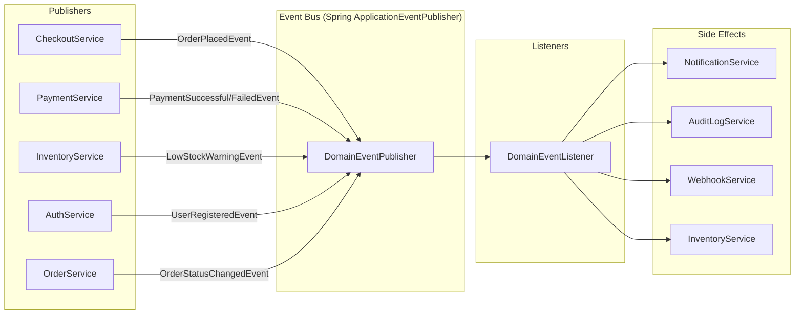

# Interface Control Document (ICD)

## BuildNest E-Commerce Platform

---

## DOCUMENT INFORMATION

| Attribute                | Value                                                                   |
| :----------------------- | :---------------------------------------------------------------------- |
| **Document Title**       | Interface Control Document                                              |
| **Document ID**          | ICD-BUILDNEST-001                                                       |
| **Version**              | 2.0                                                                     |
| **Date**                 | February 11, 2026                                                       |
| **Status**               | Baselined                                                               |
| **Classification**       | Internal Use                                                            |
| **Conformance Standard** | ISO/IEC/IEEE 42010:2022                                                 |
| **Parent Document**      | [SAD (SAD-BUILDNEST-001)](Software_Architecture_Document_IEEE_42010.md) |

---

## DOCUMENT CONTROL

### Revision History

| Version | Date       | Author   | Changes                                                                               | Approval    |
| :------ | :--------- | :------- | :------------------------------------------------------------------------------------ | :---------- |
| 1.0     | 2026-02-10 | Dev Team | Initial draft — Internal, External, Event interfaces                                  | ✅ Approved |
| 2.0     | 2026-02-11 | Dev Team | ISO 42010 compliance: added Doc Control, Definitions, Conformance, Interface Strategy | ✅ Pending  |

### Document Approval

| Role                 | Name         | Signature      | Date             |
| :------------------- | :----------- | :------------- | :--------------- |
| **Integration Lead** | Int Lead     | \***\*\_\*\*** | \***\*\_\_\*\*** |
| **Project Manager**  | Project Lead | \***\*\_\*\*** | \***\*\_\_\*\*** |
| **Technical Lead**   | Dev Lead     | \***\*\_\*\*** | \***\*\_\_\*\*** |

---

## 1. Introduction

### 1.1 Purpose

This Interface Control Document (ICD) defines every interface in the BuildNest platform — **internal** (module-to-module), **external** (third-party), **infrastructure** (data stores), and **event-based** (async domain events). Each interface is specified with its protocol, data format, error handling, and owning module.

### 1.2 Scope

- **10 Internal Interfaces** (module-to-module method calls)
- **6 Domain Event Interfaces** (async event-driven)
- **4 External Interfaces** (Razorpay, SMTP, Webhook, Frontend)
- **4 Infrastructure Interfaces** (MySQL, Redis, Elasticsearch, Actuator)

### 1.3 Normative References

| Reference                                           | Description                                   |
| :-------------------------------------------------- | :-------------------------------------------- |
| **ISO/IEC/IEEE 42010:2022**                         | Architecture Description (governing standard) |
| [SAD](Software_Architecture_Document_IEEE_42010.md) | Software Architecture Document                |
| [LLD](Low_Level_Design_IEEE_42010.md)               | Low-Level Design                              |

### 1.4 Definitions & Abbreviations

| Term / Abbr | Definition                             |
| :---------- | :------------------------------------- |
| **ICD**     | Interface Control Document             |
| **API**     | Application Programming Interface      |
| **REST**    | Representational State Transfer        |
| **HMAC**    | Hash-based Message Authentication Code |
| **AOP**     | Aspect-Oriented Programming            |

### 1.5 Conformance Statement

> This document conforms to **ISO/IEC/IEEE 42010:2022** by defining the content and semantics of interfaces (Clause 5.7.3), ensuring rigorous control over boundaries between system elements.

---

## 2. Interface Catalog

| ID            | Interface Name                | Type           | Protocol           | Consumer               | Provider                | Auth                |
| :------------ | :---------------------------- | :------------- | :----------------- | :--------------------- | :---------------------- | :------------------ |
| **IF-INT-01** | Auth Token Validation         | Internal       | Method Call        | All Modules            | Auth Service            | N/A (Internal)      |
| **IF-INT-02** | Cart-to-Checkout Handoff      | Internal       | Method Call        | Checkout Service       | Cart Service            | N/A                 |
| **IF-INT-03** | Stock Reservation & Deduction | Internal       | Method Call        | Checkout Service       | Inventory Service       | N/A                 |
| **IF-INT-04** | Wishlist Management           | Internal       | Method Call        | Wishlist Controller    | Wishlist Service        | JWT                 |
| **IF-INT-05** | Review Submission             | Internal       | Method Call        | Review Controller      | Review Service          | JWT                 |
| **IF-INT-06** | Admin User Management         | Internal       | Method Call        | Admin Controller       | Admin Service           | ROLE_ADMIN          |
| **IF-INT-07** | Notification Dispatch         | Internal       | Method Call        | Event Listener         | Notification Service    | N/A                 |
| **IF-INT-08** | Audit Logging (AOP)           | Internal       | AOP Aspect         | All @Auditable methods | Audit Service           | N/A                 |
| **IF-INT-09** | Rate Limiting                 | Internal       | Servlet Filter     | All Requests           | RateLimiter Service     | N/A                 |
| **IF-INT-10** | Performance Monitoring        | Internal       | Method Call        | Monitoring Controller  | Perf Monitoring Service | ROLE_ADMIN          |
| **IF-EVT-01** | OrderPlacedEvent              | Event          | Spring Events      | Event Listener         | Checkout Service        | N/A                 |
| **IF-EVT-02** | PaymentSuccessfulEvent        | Event          | Spring Events      | Event Listener         | Payment Service         | N/A                 |
| **IF-EVT-03** | PaymentFailedEvent            | Event          | Spring Events      | Event Listener         | Payment Service         | N/A                 |
| **IF-EVT-04** | LowStockWarningEvent          | Event          | Spring Events      | Event Listener         | Inventory Service       | N/A                 |
| **IF-EVT-05** | UserRegisteredEvent           | Event          | Spring Events      | Event Listener         | Auth Service            | N/A                 |
| **IF-EVT-06** | OrderStatusChangedEvent       | Event          | Spring Events      | Event Listener         | Order Service           | N/A                 |
| **IF-EXT-01** | Razorpay Order Creation       | External       | HTTPS/REST         | Backend API            | Razorpay                | API Key             |
| **IF-EXT-02** | Razorpay Payment Verification | External       | HTTPS/REST         | Backend API            | Razorpay                | API Key + HMAC      |
| **IF-EXT-03** | Webhook Event Delivery        | External       | HTTPS/POST         | External Systems       | Webhook Service         | HMAC Signature      |
| **IF-EXT-04** | Email Notification (SMTP)     | External       | SMTP/TLS           | Backend API            | Email Provider          | Username + Password |
| **IF-INF-01** | MySQL Database                | Infrastructure | JDBC/TCP           | Backend API            | MySQL Server            | Username + Password |
| **IF-INF-02** | Redis Cache                   | Infrastructure | Redis Protocol/TCP | Backend API            | Redis Server            | Password            |
| **IF-INF-03** | Elasticsearch                 | Infrastructure | REST/HTTP          | Backend API            | ES Cluster              | Username + Password |
| **IF-INF-04** | Frontend REST API             | Infrastructure | HTTPS/REST         | React SPA              | Backend API             | JWT Bearer          |

---

## 3. Internal Interface Specifications

### 3.1 IF-INT-01: Auth Token Validation

| Attribute          | Value                                                                 |
| :----------------- | :-------------------------------------------------------------------- |
| **Mechanism**      | `JwtAuthenticationFilter` → `JwtProvider.validateToken(String token)` |
| **Input**          | JWT access token from `Authorization: Bearer <token>` header          |
| **Output**         | `Authentication` object set in `SecurityContextHolder`                |
| **Error Handling** | Returns HTTP `401 Unauthorized` via `JwtAuthenticationEntryPoint`     |
| **Concurrency**    | Stateless — each request independently validated                      |

### 3.2 IF-INT-02: Cart-to-Checkout Handoff

| Attribute          | Value                                                         |
| :----------------- | :------------------------------------------------------------ |
| **Consumer**       | `CheckoutService.processCheckout()`                           |
| **Provider**       | `CartService.getCart(Long userId)`                            |
| **Input**          | User ID                                                       |
| **Output**         | `Cart` object with `CartItem` list (product, quantity, price) |
| **Error Handling** | Throws `CartEmptyException` if cart has no items              |

### 3.3 IF-INT-03: Stock Reservation & Deduction

| Attribute       | Value                                                                                                   |
| :-------------- | :------------------------------------------------------------------------------------------------------ |
| **Provider**    | `InventoryService.reserve()`, `InventoryService.deductStock()`, `InventoryService.releaseReservation()` |
| **Input**       | Product ID, Quantity                                                                                    |
| **Output**      | `void` (success) or `InsufficientStockException` / `OutOfStockException`                                |
| **Concurrency** | Uses `@Version` optimistic locking — `SELECT ... FOR UPDATE` semantics                                  |
| **Rollback**    | `releaseReservation()` called on checkout failure                                                       |

### 3.4 IF-INT-04: Wishlist Management

| Attribute       | Value                                                                                                     |
| :-------------- | :-------------------------------------------------------------------------------------------------------- |
| **Provider**    | `WishlistService`                                                                                         |
| **Operations**  | `addToWishlist`, `removeFromWishlist`, `getWishlist`, `isInWishlist`, `clearWishlist`, `getWishlistCount` |
| **Input**       | Product ID + authenticated `UserDetails`                                                                  |
| **Output**      | Wishlist state or boolean/count                                                                           |
| **Constraints** | One wishlist per user (`user_id` UNIQUE), M:N with products via `wishlist_products`                       |

### 3.5 IF-INT-05: Review Submission

| Attribute      | Value                                                                                           |
| :------------- | :---------------------------------------------------------------------------------------------- |
| **Provider**   | `ProductReviewService`                                                                          |
| **Operations** | `submitReview`, `getReviews`, `getRatingSummary`, `markHelpful`, `updateReview`, `deleteReview` |
| **Input**      | Product ID, `ReviewDTO` (rating 1-5, comment ≤2000 chars)                                       |
| **Output**     | `ProductReview` entity or summary statistics                                                    |
| **Validation** | `@Min(1) @Max(5)` rating, `@Size(max=2000)` comment, `verifiedPurchase` auto-set                |

### 3.6 IF-INT-08: Audit Logging (AOP)

| Attribute       | Value                                                                         |
| :-------------- | :---------------------------------------------------------------------------- |
| **Mechanism**   | `AuditAspect` intercepts methods annotated with `@Auditable`                  |
| **Captures**    | User ID, action type, entity type, entity ID, timestamp, IP address           |
| **Storage**     | `AuditLogService` → MySQL `audit_log` table + `ElasticsearchIngestionService` |
| **Performance** | Async processing to avoid latency impact on business methods                  |

---

## 4. Domain Event Interface Specifications

### 4.1 Event Architecture

### 4.2 Event Payloads

| Event                     | Publisher          | Payload Fields                                               |
| :------------------------ | :----------------- | :----------------------------------------------------------- |
| `OrderPlacedEvent`        | `CheckoutService`  | `orderId`, `userId`, `orderNumber`, `totalAmount`, `items[]` |
| `PaymentSuccessfulEvent`  | `PaymentService`   | `orderId`, `paymentId`, `amount`, `method`                   |
| `PaymentFailedEvent`      | `PaymentService`   | `orderId`, `reason`, `failedAt`                              |
| `LowStockWarningEvent`    | `InventoryService` | `productId`, `productName`, `currentStock`, `threshold`      |
| `UserRegisteredEvent`     | `AuthService`      | `userId`, `username`, `email`, `registeredAt`                |
| `OrderStatusChangedEvent` | `OrderService`     | `orderId`, `previousStatus`, `newStatus`, `changedBy`        |

---

## 5. External Interface Specifications

### 5.1 IF-EXT-01: Razorpay Order Creation

| Attribute    | Value                                                                    |
| :----------- | :----------------------------------------------------------------------- |
| **Endpoint** | `https://api.razorpay.com/v1/orders`                                     |
| **Method**   | `POST`                                                                   |
| **Auth**     | Basic Auth (Key ID + Key Secret)                                         |
| **Request**  | `{"amount": 19998, "currency": "INR", "receipt": "ORD-20260211-ABC123"}` |
| **Response** | `{"id": "order_xxx", "amount": 19998, "status": "created"}`              |
| **Timeout**  | 30 seconds                                                               |
| **Retry**    | 1 retry on network failure                                               |

### 5.2 IF-EXT-02: Razorpay Payment Verification

| Attribute     | Value                                                   |
| :------------ | :------------------------------------------------------ | ------------------------ |
| **Mechanism** | HMAC-SHA256 signature verification                      |
| **Input**     | `razorpay_order_id + "                                  | " + razorpay_payment_id` |
| **Secret**    | Razorpay Key Secret                                     |
| **Provider**  | `PaymentSignatureValidationService`                     |
| **Success**   | Order status → `CONFIRMED`                              |
| **Failure**   | `PaymentVerificationException`, Order remains `PENDING` |

### 5.3 IF-EXT-03: Webhook Event Delivery

| Attribute      | Value                                                               |
| :------------- | :------------------------------------------------------------------ |
| **Management** | `WebhookAdminController`                                            |
| **Entity**     | `WebhookSubscription` (event type, target URL, secret, active flag) |
| **Delivery**   | HTTP POST to target URL with event payload                          |
| **Security**   | HMAC signature in `X-Webhook-Signature` header                      |
| **Retry**      | Increment `failure_count`, disable after threshold                  |

### 5.4 IF-EXT-04: Email Notification (SMTP)

| Attribute     | Value                                                 |
| :------------ | :---------------------------------------------------- |
| **Protocol**  | SMTP over TLS (Port 587)                              |
| **Provider**  | Configurable (Gmail, SendGrid, AWS SES)               |
| **Templates** | Order confirmation, Password reset, Low stock alert   |
| **Async**     | Dispatched via `NotificationService` on domain events |

---

## 6. Infrastructure Interface Specifications

### 6.1 IF-INF-01: MySQL Database

| Attribute             | Value                                                  |
| :-------------------- | :----------------------------------------------------- |
| **Protocol**          | JDBC over TCP (Port 3306)                              |
| **Driver**            | MySQL Connector/J (Spring Data JPA)                    |
| **Connection Pool**   | HikariCP (default)                                     |
| **Tables**            | 17+ (see [LLD §2](Low_Level_Design_IEEE_42010.md))     |
| **Migrations**        | Liquibase (`db.changelog-master.yaml`)                 |
| **Optimized Queries** | `DatabaseQueryOptimizationConfig`, performance indexes |

### 6.2 IF-INF-02: Redis Cache

| Attribute         | Value                                           |
| :---------------- | :---------------------------------------------- |
| **Protocol**      | Redis Protocol over TCP (Port 6379)             |
| **Client**        | Lettuce (Spring Data Redis default)             |
| **Key Patterns**  | `product:view:{id}`, `auth:refresh:{username}`  |
| **Serialization** | JSON (`GenericJackson2JsonRedisSerializer`)     |
| **Default TTL**   | 1 Hour (Product Cache), 30 Days (Refresh Token) |
| **Configuration** | `CacheConfig`                                   |

### 6.3 IF-INF-03: Elasticsearch

| Attribute         | Value                                                                      |
| :---------------- | :------------------------------------------------------------------------- |
| **Protocol**      | REST/HTTP (Port 9200)                                                      |
| **Client**        | Spring Data Elasticsearch                                                  |
| **Indexes**       | `buildnest-audit-logs`, `buildnest-metrics`                                |
| **Documents**     | `ElasticsearchAuditLog`, `ElasticsearchMetrics`                            |
| **Configuration** | `ElasticsearchConfig`                                                      |
| **Services**      | Ingestion, Query Optimization, Alerting, Metrics Collector, Threshold Mgmt |

### 6.4 IF-INF-04: Frontend REST API

| Attribute             | Value                                            |
| :-------------------- | :----------------------------------------------- |
| **Protocol**          | HTTPS/REST                                       |
| **Format**            | JSON (`application/json`)                        |
| **Auth**              | JWT Bearer token in `Authorization` header       |
| **CORS**              | Origins: `buildnest.com`, `www.buildnest.com`    |
| **Versioning**        | URI-based (`/api/v1/...`, `/api/v2/...`)         |
| **Response Envelope** | `{"success": bool, "message": str, "data": ...}` |

---

## 7. Interface Interaction Matrix

| Source ↓ / Dest → | Auth | Catalog | Cart | Order | Payment | Inventory | Wishlist | Review | Notification | MySQL | Redis | ES  |
| :---------------- | :--: | :-----: | :--: | :---: | :-----: | :-------: | :------: | :----: | :----------: | :---: | :---: | :-: |
| **Auth**          |  —   |         |      |       |         |           |          |        |      ✓       |   ✓   |   ✓   |  ✓  |
| **Catalog**       |  ✓   |    —    |      |       |         |     ✓     |          |        |              |   ✓   |   ✓   |  ✓  |
| **Cart**          |  ✓   |    ✓    |  —   |       |         |           |          |        |              |   ✓   |       |     |
| **Order**         |  ✓   |         |  ✓   |   —   |    ✓    |     ✓     |          |        |      ✓       |   ✓   |       |     |
| **Payment**       |      |         |      |   ✓   |    —    |           |          |        |      ✓       |   ✓   |       |     |
| **Inventory**     |      |    ✓    |      |       |         |     —     |          |        |      ✓       |   ✓   |       |     |
| **Wishlist**      |  ✓   |    ✓    |      |       |         |           |    —     |        |              |   ✓   |       |     |
| **Review**        |  ✓   |    ✓    |      |       |         |           |          |   —    |              |   ✓   |       |     |
| **Admin**         |  ✓   |    ✓    |      |   ✓   |         |     ✓     |          |        |              |   ✓   |       |  ✓  |
| **Monitoring**    |      |         |      |       |         |           |          |        |              |       |       |  ✓  |
| **Frontend**      |  ✓   |    ✓    |  ✓   |   ✓   |         |           |    ✓     |   ✓    |              |       |       |     |

---

## 8. Traceability

| Interface ID                    | SRS Requirements                                   |
| :------------------------------ | :------------------------------------------------- |
| **IF-INT-01** (Auth Validation) | [FR-AUTH-03, FR-AUTH-04](SRS_IEEE_29148_2018.md)   |
| **IF-INT-02** (Cart Handoff)    | [FR-CART-01 to FR-CART-06](SRS_IEEE_29148_2018.md) |
| **IF-INT-03** (Stock Deduction) | [FR-INV-01 to FR-INV-07](SRS_IEEE_29148_2018.md)   |
| **IF-INT-04** (Wishlist)        | [FR-WISH-01 to FR-WISH-05](SRS_IEEE_29148_2018.md) |
| **IF-INT-05** (Review)          | [FR-REV-01 to FR-REV-05](SRS_IEEE_29148_2018.md)   |
| **IF-EVT-01** (OrderPlaced)     | [FR-CHK-01, FR-NOT-01](SRS_IEEE_29148_2018.md)     |
| **IF-EVT-04** (LowStock)        | [FR-INV-06, FR-ADM-10](SRS_IEEE_29148_2018.md)     |
| **IF-EXT-01** (Razorpay Order)  | [FR-PAY-01](SRS_IEEE_29148_2018.md)                |
| **IF-EXT-02** (Payment Verify)  | [FR-PAY-02](SRS_IEEE_29148_2018.md)                |
| **IF-EXT-03** (Webhook)         | [FR-NOT-03 to FR-NOT-05](SRS_IEEE_29148_2018.md)   |
| **IF-INF-04** (Frontend API)    | [FR-FE-01 to FR-FE-25](SRS_IEEE_29148_2018.md)     |

---

## 9. Revision History

See [Document Control](#document-control) for full revision history and approvals.

---

**— End of Document —**

_This document was prepared in compliance with ISO/IEC/IEEE 42010:2022 for the BuildNest E-Commerce Platform._
