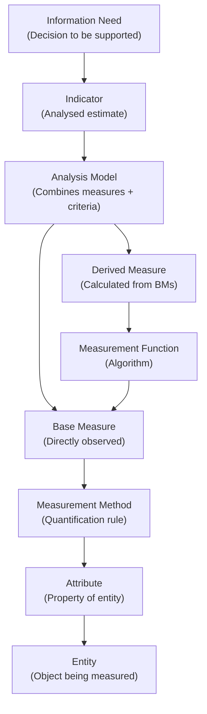
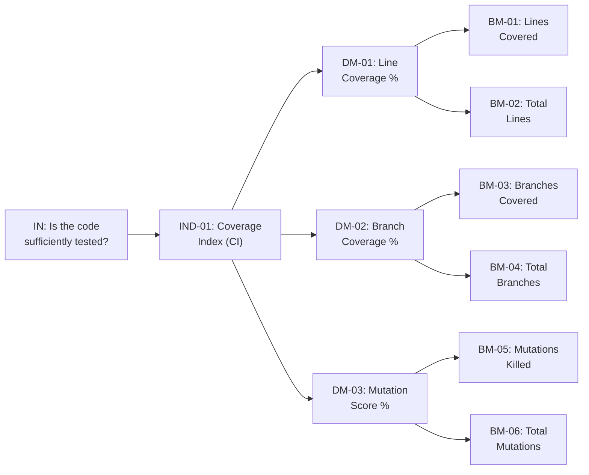
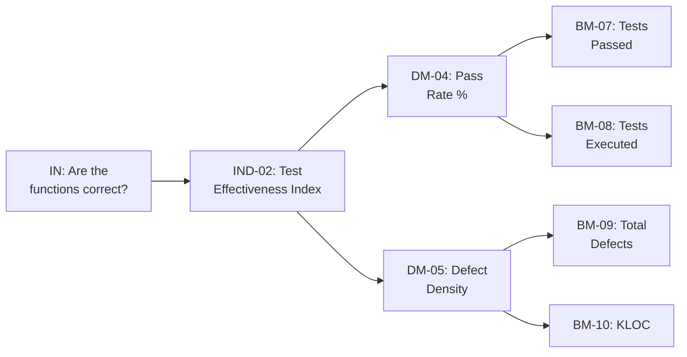
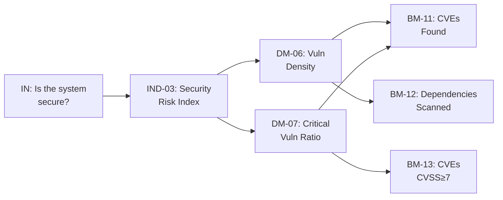
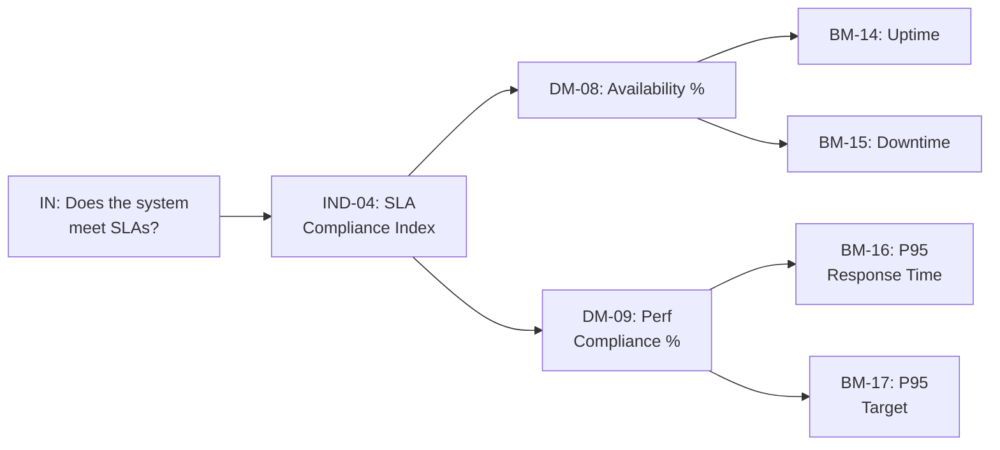
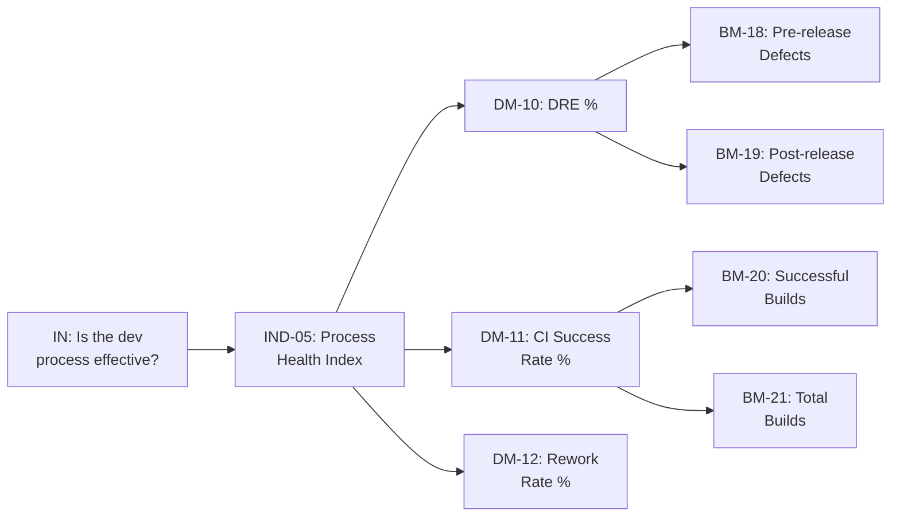

# Metrics & Measurement Report

## BuildNest E-Commerce Platform

---

## DOCUMENT INFORMATION

| Attribute                | Value                                                                                                                                                                                                                                                                    |
| :----------------------- | :----------------------------------------------------------------------------------------------------------------------------------------------------------------------------------------------------------------------------------------------------------------------- |
| **Document Title**       | Metrics & Measurement Report                                                                                                                                                                                                                                             |
| **Document ID**          | MMR-BUILDNEST-001                                                                                                                                                                                                                                                        |
| **Version**              | 1.0                                                                                                                                                                                                                                                                      |
| **Date**                 | February 11, 2026                                                                                                                                                                                                                                                        |
| **Status**               | Baselined                                                                                                                                                                                                                                                                |
| **Classification**       | Internal Use                                                                                                                                                                                                                                                             |
| **Conformance Standard** | ISO/IEC/IEEE 15939:2017 — Systems and software engineering — Measurement process                                                                                                                                                                                         |
| **Related Documents**    | [QMP](Quality_Management_Plan_IEEE_12207.md), [SQR](Software_Quality_Report_ISO_25010.md), [TP](Test_Plan_IEEE_29119.md), [TER](Test_Execution_Report_IEEE_29119.md), [CSD](Coding_Standards_Document_ISO_25010.md), [VVR](Verification_Validation_Report_IEEE_12207.md) |

---

## DOCUMENT CONTROL

### Revision History

| Version | Date       | Author  | Changes                                                   | Approval   |
| :------ | :--------- | :------ | :-------------------------------------------------------- | :--------- |
| 1.0     | 2026-02-11 | QA Team | Initial release — ISO/IEC/IEEE 15939:2017 full compliance | ✅ Pending |

### Document Approval

| Role                  | Name         | Signature  | Date         |
| :-------------------- | :----------- | :--------- | :----------- |
| **Quality Manager**   | QA Manager   | ****\_**** | ****\_\_**** |
| **Project Manager**   | Project Lead | ****\_**** | ****\_\_**** |
| **Technical Lead**    | Dev Lead     | ****\_**** | ****\_\_**** |
| **Measurement Owner** | Metrics Lead | ****\_**** | ****\_\_**** |

---

## Table of Contents

1. [Introduction](#1-introduction)
2. [Measurement Information Model](#2-measurement-information-model)
3. [Measurement Constructs](#3-measurement-constructs)
4. [Measurement Process](#4-measurement-process)
5. [Product Metrics — Base Measures](#5-product-metrics--base-measures)
6. [Product Metrics — Derived Measures](#6-product-metrics--derived-measures)
7. [Product Metrics — Indicators](#7-product-metrics--indicators)
8. [Process Metrics](#8-process-metrics)
9. [Project Metrics](#9-project-metrics)
10. [Measurement Tools & Automation](#10-measurement-tools--automation)
11. [Measurement Results — Current Assessment](#11-measurement-results--current-assessment)
12. [Analysis & Interpretation](#12-analysis--interpretation)
13. [Measurement Evaluation & Improvement](#13-measurement-evaluation--improvement)

---

## 1. Introduction

### 1.1 Purpose

This Metrics & Measurement Report defines the measurement information model, measurement constructs, and measurement process for the **BuildNest E-Commerce Platform**, in strict conformance with **ISO/IEC/IEEE 15939:2017**. It specifies:

- **What** is measured (entities and attributes)
- **How** measurements are defined (base measures, derived measures, indicators)
- **Why** measurements are collected (information needs and decision criteria)
- **When** and **by whom** measurements are collected and analysed

### 1.2 Scope

| Dimension               | Coverage                                                                                 |
| :---------------------- | :--------------------------------------------------------------------------------------- |
| **Measured Entity**     | BuildNest software product (source code, tests, dependencies, runtime)                   |
| **Measured Processes**  | Development, testing, security scanning, deployment, monitoring                          |
| **Codebase Size**       | 28 controllers · 56 services · 19 repositories · 48 models · 38 configs · 167 test files |
| **Technology**          | Java 21, Spring Boot 3.5.10, Maven, JaCoCo, PITest, OWASP, Gatling, Prometheus           |
| **Standards Alignment** | ISO 25010 (product quality), IEEE 12207 §6.3.7 (measurement), IEEE 29119 (testing)       |

### 1.3 Normative References

| Reference                     | Description                                               |
| :---------------------------- | :-------------------------------------------------------- |
| **ISO/IEC/IEEE 15939:2017**   | Measurement process — **governing standard**              |
| **ISO/IEC 25010:2011**        | Product quality model (quality characteristics)           |
| **ISO/IEC 25023:2016**        | Measures for system and software product quality          |
| **ISO/IEC/IEEE 12207:2017**   | Software lifecycle processes — §6.3.7 Measurement Process |
| **IEEE 1061:1998**            | Software quality metrics methodology                      |
| **ISO/IEC/IEEE 29119-3:2021** | Test documentation (test metrics source)                  |

### 1.4 Definitions & Abbreviations

| Term / Abbreviation       | Definition (per ISO/IEC/IEEE 15939:2017)                                                                                                 |
| :------------------------ | :--------------------------------------------------------------------------------------------------------------------------------------- |
| **Attribute**             | A property or characteristic of an entity that can be distinguished quantitatively or qualitatively                                      |
| **Base Measure (BM)**     | A measure defined in terms of an attribute and the method for quantifying it — functionally independent of other measures                |
| **Derived Measure (DM)**  | A measure defined as a function of two or more base measures and/or other derived measures                                               |
| **Indicator (IND)**       | A measure that provides an estimate or evaluation of specified attributes derived from a model with respect to defined information needs |
| **Measurement Function**  | An algorithm or calculation combining base measures to produce a derived measure                                                         |
| **Analysis Model**        | An algorithm or calculation combining measures with decision criteria to produce indicators                                              |
| **Information Need**      | Insight necessary to manage objectives, goals, risks, and problems                                                                       |
| **Measurement Construct** | The complete chain linking an information need to its indicator through entities, attributes, and measures                               |
| **Entity**                | An object that is to be characterized by measuring its attributes                                                                        |
| **Scale**                 | An ordered set of values or categories to which an attribute is mapped                                                                   |
| **KLOC**                  | Thousands of Lines of Code                                                                                                               |
| **DRE**                   | Defect Removal Efficiency                                                                                                                |
| **MTTR**                  | Mean Time To Repair                                                                                                                      |

### 1.5 Conformance Statement

> This document conforms to **ISO/IEC/IEEE 15939:2017**, _Systems and software engineering — Measurement process_. It implements:
>
> - a) The **Measurement Information Model** (§2) defining entities, attributes, base measures, derived measures, and indicators.
> - b) The **Measurement Process** (§4) with activities: Plan the Measurement, Perform the Measurement, Evaluate the Measurement, and Improve the Measurement.
> - c) **Measurement Constructs** (§3) linking information needs to indicators through traceable measurement chains.
> - d) All measures are **precisely defined** with scale, unit, measurement method, and collection tool.
> - e) The measurement process is aligned with ISO/IEC/IEEE 12207:2017 §6.3.7 (Measurement Process).

---

## 2. Measurement Information Model

### 2.1 ISO 15939 Information Model Overview

### 2.2 Measured Entities

| Entity ID | Entity             | Description                           | Scope                                                                              |
| :-------- | :----------------- | :------------------------------------ | :--------------------------------------------------------------------------------- |
| ENT-01    | **Source Code**    | Java source files in `src/main/java/` | 28 controllers, 56 services, 19 repos, 48 models, 38 configs, 8 security, 13 utils |
| ENT-02    | **Test Code**      | Java/Scala test files in `src/test/`  | 167 files across 29 packages                                                       |
| ENT-03    | **Dependencies**   | Third-party libraries in `pom.xml`    | Maven dependency tree (30+ dependencies)                                           |
| ENT-04    | **Build Pipeline** | Maven build process with 6 profiles   | unit-tests, all-tests, e2e-tests, stress-tests, ci                                 |
| ENT-05    | **Runtime System** | Deployed application (Docker/K8s)     | Spring Boot 3.5.10 on Java 21                                                      |
| ENT-06    | **Documentation**  | ISO/IEC/IEEE document suite           | 19 documents across 6 standards                                                    |
| ENT-07    | **Defects**        | Reported bugs and non-conformances    | [DBR](Defect_Bug_Report_IEEE_29119.md)                                             |

### 2.3 Attributes Measured

| Attr ID | Entity | Attribute                    | Type          | Scale              |
| :------ | :----- | :--------------------------- | :------------ | :----------------- |
| ATT-01  | ENT-01 | Lines of source code         | Size          | Count (integer)    |
| ATT-02  | ENT-01 | Methods per class            | Complexity    | Count (integer)    |
| ATT-03  | ENT-01 | Statements executed by tests | Coverage      | Count (integer)    |
| ATT-04  | ENT-01 | Branches executed by tests   | Coverage      | Count (integer)    |
| ATT-05  | ENT-01 | Mutations killed by tests    | Effectiveness | Count (integer)    |
| ATT-06  | ENT-01 | Mutations created            | Effectiveness | Count (integer)    |
| ATT-07  | ENT-02 | Total test cases             | Size          | Count (integer)    |
| ATT-08  | ENT-02 | Passed test cases            | Correctness   | Count (integer)    |
| ATT-09  | ENT-02 | Failed test cases            | Correctness   | Count (integer)    |
| ATT-10  | ENT-02 | Blocked test cases           | Correctness   | Count (integer)    |
| ATT-11  | ENT-03 | Known vulnerabilities (CVE)  | Security      | Count (integer)    |
| ATT-12  | ENT-03 | Vulnerability CVSS score     | Security      | Ratio (0.0–10.0)   |
| ATT-13  | ENT-05 | API response time            | Performance   | Duration (ms)      |
| ATT-14  | ENT-05 | HTTP requests per second     | Capacity      | Rate (req/s)       |
| ATT-15  | ENT-05 | JVM heap memory used         | Resource      | Bytes (integer)    |
| ATT-16  | ENT-05 | Uptime duration              | Availability  | Duration (seconds) |
| ATT-17  | ENT-05 | Downtime duration            | Availability  | Duration (seconds) |
| ATT-18  | ENT-05 | Circuit breaker activations  | Fault Tol.    | Count (integer)    |
| ATT-19  | ENT-07 | Total defects reported       | Quality       | Count (integer)    |
| ATT-20  | ENT-07 | Defects found pre-release    | Quality       | Count (integer)    |
| ATT-21  | ENT-07 | Defects found post-release   | Quality       | Count (integer)    |
| ATT-22  | ENT-07 | Time to resolve defect       | Efficiency    | Duration (hours)   |
| ATT-23  | ENT-06 | Total documents              | Compliance    | Count (integer)    |
| ATT-24  | ENT-06 | Compliant documents          | Compliance    | Count (integer)    |
| ATT-25  | ENT-04 | Successful builds            | Reliability   | Count (integer)    |
| ATT-26  | ENT-04 | Total builds                 | Reliability   | Count (integer)    |

---

## 3. Measurement Constructs

A **measurement construct** is the complete chain from information need → indicator, as mandated by ISO 15939.

### 3.1 Construct MC-01: Code Quality Assurance

### 3.2 Construct MC-02: Functional Correctness

### 3.3 Construct MC-03: Security Posture

### 3.4 Construct MC-04: Performance & Reliability

### 3.5 Construct MC-05: Process Quality

---

## 4. Measurement Process

Per ISO/IEC/IEEE 15939:2017, the measurement process consists of four activities:

### 4.1 Plan the Measurement

| Activity                            | Description                                                               | Output                     |
| :---------------------------------- | :------------------------------------------------------------------------ | :------------------------- |
| Characterize organizational unit    | BuildNest project — Spring Boot e-commerce, Agile sprints, 12 modules     | Organizational context     |
| Identify information needs          | 5 needs: code quality, correctness, security, performance, process health | Information needs register |
| Select measures                     | 21 base measures, 12 derived measures, 5 indicators (§5–§7)               | Measurement specification  |
| Define data collection procedures   | Automated (JaCoCo, PITest, OWASP, Prometheus) + manual (audits, reviews)  | Collection procedures      |
| Define analysis procedures          | Threshold comparison, trend analysis, dashboard reporting                 | Analysis procedures        |
| Define communication procedures     | Sprint review dashboard, monthly quality report, release gate summary     | Communication plan         |
| Identify supporting tools           | JaCoCo 0.8.11, PITest 1.16.1, OWASP 9.0.9, Gatling 3.10.3, Prometheus     | Tool register (§10)        |
| Plan for evaluation and improvement | Quarterly review of measure effectiveness                                 | Improvement plan (§13)     |

### 4.2 Perform the Measurement

| Activity                    | Method                                                 | Frequency   | Responsible     |
| :-------------------------- | :----------------------------------------------------- | :---------- | :-------------- |
| Integrate measurement tools | Maven plugin integration (`pom.xml` lines 471–694)     | Sprint 0    | DevOps          |
| Collect base measures       | Automated tool execution via Maven profiles            | Per build   | CI/CD Pipeline  |
| Compute derived measures    | Measurement functions (§6)                             | Per build   | CI/CD Pipeline  |
| Generate indicators         | Analysis models (§7)                                   | Per release | QA Manager      |
| Record measurement data     | CI artifact storage, Prometheus TSDB, Git              | Continuous  | Automated       |
| Verify data quality         | Cross-validate tool outputs against manual spot-checks | Monthly     | Quality Manager |

### 4.3 Evaluate the Measurement

| Activity                      | Method                                                   | Frequency   |
| :---------------------------- | :------------------------------------------------------- | :---------- |
| Evaluate information products | Are indicators answering information needs?              | Quarterly   |
| Evaluate measurement process  | Is data collection accurate, timely, and cost-effective? | Quarterly   |
| Identify improvements         | Document improvement opportunities                       | Quarterly   |
| Review with stakeholders      | Present measurement results in sprint/release reviews    | Per release |

### 4.4 Improve the Measurement

| Activity                      | Method                                                         | Output           |
| :---------------------------- | :------------------------------------------------------------- | :--------------- |
| Refine measures               | Add/remove measures based on utility assessment                | Updated MMR      |
| Improve collection automation | Reduce manual collection; increase CI integration              | Updated pipeline |
| Adjust thresholds             | Calibrate targets based on trend data (e.g., JaCoCo 40% → 80%) | Updated QMP      |
| Document lessons learned      | Retrospective on measurement value                             | Improvement log  |

---

## 5. Product Metrics — Base Measures

### 5.1 Base Measure Registry

| BM ID | Base Measure Name         | Attribute (ATT) | Entity (ENT) | Unit         | Scale Type | Measurement Method                           | Collection Tool                        |
| :---- | :------------------------ | :-------------- | :----------- | :----------- | :--------- | :------------------------------------------- | :------------------------------------- |
| BM-01 | Lines Covered             | ATT-03          | ENT-01       | Count        | Ratio      | JaCoCo LINE counter — COVERED                | `jacoco-maven-plugin` 0.8.11           |
| BM-02 | Total Coverable Lines     | ATT-01          | ENT-01       | Count        | Ratio      | JaCoCo LINE counter — TOTAL                  | `jacoco-maven-plugin` 0.8.11           |
| BM-03 | Branches Covered          | ATT-04          | ENT-01       | Count        | Ratio      | JaCoCo BRANCH counter — COVERED              | `jacoco-maven-plugin` 0.8.11           |
| BM-04 | Total Branches            | ATT-04          | ENT-01       | Count        | Ratio      | JaCoCo BRANCH counter — TOTAL                | `jacoco-maven-plugin` 0.8.11           |
| BM-05 | Mutations Killed          | ATT-05          | ENT-01       | Count        | Ratio      | PITest — killed mutation count               | `pitest-maven` 1.16.1                  |
| BM-06 | Total Mutations Generated | ATT-06          | ENT-01       | Count        | Ratio      | PITest — total mutation count                | `pitest-maven` 1.16.1                  |
| BM-07 | Test Cases Passed         | ATT-08          | ENT-02       | Count        | Ratio      | JUnit 5 — passed assertion count             | `maven-surefire-plugin`                |
| BM-08 | Test Cases Executed       | ATT-07          | ENT-02       | Count        | Ratio      | JUnit 5 — total test method count            | `maven-surefire-plugin`                |
| BM-09 | Total Defects Found       | ATT-19          | ENT-07       | Count        | Ratio      | Defect tracking system count                 | [DBR](Defect_Bug_Report_IEEE_29119.md) |
| BM-10 | Source Lines of Code      | ATT-01          | ENT-01       | KLOC         | Ratio      | Physical lines excluding blanks and comments | `cloc` / manual count                  |
| BM-11 | CVE Vulnerabilities Found | ATT-11          | ENT-03       | Count        | Ratio      | OWASP NVD scan — total findings              | `dependency-check-maven` 9.0.9         |
| BM-12 | Dependencies Scanned      | ATT-11          | ENT-03       | Count        | Ratio      | OWASP — total dependency count               | `dependency-check-maven` 9.0.9         |
| BM-13 | Critical Vulnerabilities  | ATT-12          | ENT-03       | Count        | Ratio      | OWASP findings with CVSS ≥ 7.0               | `dependency-check-maven` 9.0.9         |
| BM-14 | Uptime Duration           | ATT-16          | ENT-05       | Seconds      | Ratio      | Prometheus `process_uptime_seconds`          | Micrometer + Prometheus                |
| BM-15 | Downtime Duration         | ATT-17          | ENT-05       | Seconds      | Ratio      | Calculated: Total window − Uptime            | Prometheus + alerting                  |
| BM-16 | API Response Time (P95)   | ATT-13          | ENT-05       | Milliseconds | Ratio      | Gatling simulation P95 latency               | Gatling 3.10.3                         |
| BM-17 | API Response Time Target  | ATT-13          | ENT-05       | Milliseconds | Ratio      | SRS NFR-PERF-01 constant: 200ms              | [SRS](SRS_IEEE_29148_2018.md)          |
| BM-18 | Pre-release Defects       | ATT-20          | ENT-07       | Count        | Ratio      | Defects found before release (testing phase) | [DBR](Defect_Bug_Report_IEEE_29119.md) |
| BM-19 | Post-release Defects      | ATT-21          | ENT-07       | Count        | Ratio      | Defects found after release (production)     | Incident tracking                      |
| BM-20 | Successful CI Builds      | ATT-25          | ENT-04       | Count        | Ratio      | CI pipeline — builds with exit code 0        | CI/CD system logs                      |
| BM-21 | Total CI Builds           | ATT-26          | ENT-04       | Count        | Ratio      | CI pipeline — total build executions         | CI/CD system logs                      |

---

## 6. Product Metrics — Derived Measures

### 6.1 Derived Measure Registry

| DM ID | Derived Measure Name      | Measurement Function                               | Input BMs    | Unit         | Target  |
| :---- | :------------------------ | :------------------------------------------------- | :----------- | :----------- | :------ |
| DM-01 | Line Coverage %           | `(BM-01 / BM-02) × 100`                            | BM-01, BM-02 | %            | ≥ 80%   |
| DM-02 | Branch Coverage %         | `(BM-03 / BM-04) × 100`                            | BM-03, BM-04 | %            | ≥ 70%   |
| DM-03 | Mutation Score %          | `(BM-05 / BM-06) × 100`                            | BM-05, BM-06 | %            | ≥ 75%   |
| DM-04 | Test Pass Rate %          | `(BM-07 / BM-08) × 100`                            | BM-07, BM-08 | %            | ≥ 95%   |
| DM-05 | Defect Density            | `BM-09 / BM-10`                                    | BM-09, BM-10 | Defects/KLOC | ≤ 0.5   |
| DM-06 | Vulnerability Density     | `BM-11 / BM-12`                                    | BM-11, BM-12 | CVE/dep      | ≤ 0.01  |
| DM-07 | Critical Vuln Ratio       | `(BM-13 / BM-11) × 100` (if BM-11 > 0, else 0)     | BM-13, BM-11 | %            | 0%      |
| DM-08 | Availability %            | `(BM-14 / (BM-14 + BM-15)) × 100`                  | BM-14, BM-15 | %            | ≥ 99.9% |
| DM-09 | Perf Compliance %         | `IF BM-16 ≤ BM-17 THEN 100 ELSE (BM-17/BM-16)×100` | BM-16, BM-17 | %            | 100%    |
| DM-10 | Defect Removal Eff. (DRE) | `(BM-18 / (BM-18 + BM-19)) × 100`                  | BM-18, BM-19 | %            | ≥ 95%   |
| DM-11 | CI Success Rate %         | `(BM-20 / BM-21) × 100`                            | BM-20, BM-21 | %            | ≥ 90%   |
| DM-12 | Requirement Coverage %    | `(Traced requirements / Total requirements) × 100` | RTM data     | %            | 100%    |

---

## 7. Product Metrics — Indicators

### 7.1 Indicator Registry

| IND ID | Indicator Name           | Analysis Model                                                      | Input DMs           | Decision Criteria                            | Information Need                 |
| :----- | :----------------------- | :------------------------------------------------------------------ | :------------------ | :------------------------------------------- | :------------------------------- |
| IND-01 | **Coverage Index**       | `(DM-01 × 0.4) + (DM-02 × 0.3) + (DM-03 × 0.3)`                     | DM-01, DM-02, DM-03 | ≥ 75 → Adequate; < 75 → Remediation required | Is the code sufficiently tested? |
| IND-02 | **Test Effectiveness**   | `(DM-04 × 0.5) + ((1 − min(DM-05, 1)) × 100 × 0.3) + (DM-12 × 0.2)` | DM-04, DM-05, DM-12 | ≥ 90 → Effective; < 90 → Improvement needed  | Are the functions correct?       |
| IND-03 | **Security Risk Index**  | `100 − (DM-06 × 1000) − (DM-07 × 10)`                               | DM-06, DM-07        | ≥ 95 → Low risk; < 95 → Immediate action     | Is the system secure?            |
| IND-04 | **SLA Compliance Index** | `(DM-08 × 0.6) + (DM-09 × 0.4)`                                     | DM-08, DM-09        | ≥ 99 → Compliant; < 99 → SLA breach risk     | Does the system meet SLAs?       |
| IND-05 | **Process Health Index** | `(DM-10 × 0.4) + (DM-11 × 0.4) + ((100 − Rework %) × 0.2)`          | DM-10, DM-11, DM-12 | ≥ 85 → Healthy; < 85 → Process improvement   | Is the dev process effective?    |

### 7.2 Indicator Thresholds & Actions

| IND ID | Green (Target Met) | Yellow (Warning) | Red (Action Required) | Escalation Action                                     |
| :----- | :----------------- | :--------------- | :-------------------- | :---------------------------------------------------- |
| IND-01 | ≥ 75               | 60–74            | < 60                  | Stop feature work, prioritize test writing            |
| IND-02 | ≥ 90               | 80–89            | < 80                  | Root cause analysis on failures, review test strategy |
| IND-03 | ≥ 95               | 85–94            | < 85                  | Emergency security remediation, block release         |
| IND-04 | ≥ 99               | 95–98            | < 95                  | Capacity planning, performance optimization sprint    |
| IND-05 | ≥ 85               | 70–84            | < 70                  | Process audit, retrospective, corrective actions      |

---

## 8. Process Metrics

### 8.1 Development Process Metrics

| Metric ID | Metric                      | Formula                                      | Target      | Collection Source         |
| :-------- | :-------------------------- | :------------------------------------------- | :---------- | :------------------------ |
| PM-01     | Code Review Turnaround      | Avg time from PR creation to approval        | ≤ 24 hours  | Git platform analytics    |
| PM-02     | Build Duration              | Avg Maven build time (unit profile)          | ≤ 5 minutes | CI/CD logs                |
| PM-03     | Deployment Frequency        | Deployments per sprint                       | ≥ 1         | Deployment logs           |
| PM-04     | Lead Time for Changes       | Commit to production deployment time         | ≤ 3 days    | Git + deployment tracking |
| PM-05     | Change Failure Rate         | Failed deployments / total deployments × 100 | ≤ 5%        | Incident tracking         |
| PM-06     | Mean Time to Recover (MTTR) | Avg time from incident to resolution         | ≤ 24 hours  | Incident tracking         |

### 8.2 Testing Process Metrics

| Metric ID | Metric                    | Formula                             | Target       | Collection Source      |
| :-------- | :------------------------ | :---------------------------------- | :----------- | :--------------------- |
| TM-01     | Test Execution Rate       | Test cases executed per day         | ≥ 20/day     | Maven Surefire reports |
| TM-02     | Test Creation Rate        | New TCs per sprint                  | Proportional | TCS versioning         |
| TM-03     | Bug Find Rate             | Defects found / test cases executed | Measured     | DBR + TER cross-ref    |
| TM-04     | Test Automation %         | Automated TCs / total TCs × 100     | ≥ 90%        | Manual count           |
| TM-05     | Regression Test Pass Rate | Regression suite pass %             | 100%         | CI build results       |

---

## 9. Project Metrics

### 9.1 Schedule & Effort Metrics

| Metric ID | Metric                | Formula                                   | Target | Collection Source |
| :-------- | :-------------------- | :---------------------------------------- | :----- | :---------------- |
| PJ-01     | Schedule Variance     | (Actual − Planned) / Planned × 100        | ≤ ±10% | Project tracking  |
| PJ-02     | Effort Variance       | (Actual effort − Planned) / Planned × 100 | ≤ ±15% | Time tracking     |
| PJ-03     | Rework Rate           | Rework effort / total effort × 100        | ≤ 15%  | Time tracking     |
| PJ-04     | Requirement Stability | Changed reqs / total reqs × 100           | ≤ 10%  | SRS change log    |

### 9.2 Compliance Metrics

| Metric ID | Metric                     | Formula                                        | Target | Collection Source |
| :-------- | :------------------------- | :--------------------------------------------- | :----- | :---------------- |
| CM-01     | Document Compliance Rate   | Compliant docs / total docs × 100              | 100%   | Document audit    |
| CM-02     | Standard Coverage          | Standards addressed / required standards × 100 | 100%   | Compliance matrix |
| CM-03     | NCR Closure Rate           | Closed NCRs / total NCRs × 100                 | ≥ 95%  | NCR tracking      |
| CM-04     | Audit Finding Closure Rate | Closed findings / total findings × 100         | 100%   | Audit reports     |

---

## 10. Measurement Tools & Automation

### 10.1 Tool-to-Measure Mapping

| Tool                        | Version | Base Measures Collected       | Integration Point                    | Automation Level |
| :-------------------------- | :------ | :---------------------------- | :----------------------------------- | :--------------- |
| **JaCoCo**                  | 0.8.11  | BM-01, BM-02, BM-03, BM-04    | `mvn verify` → `jacoco:report`       | Full (CI)        |
| **PITest**                  | 1.16.1  | BM-05, BM-06                  | `mvn pitest:mutationCoverage`        | Full (CI)        |
| **Maven Surefire**          | Default | BM-07, BM-08                  | `mvn test` → JUnit XML reports       | Full (CI)        |
| **OWASP Dependency-Check**  | 9.0.9   | BM-11, BM-12, BM-13           | `mvn dependency-check:check`         | Full (CI)        |
| **Gatling**                 | 3.10.3  | BM-16                         | `mvn gatling:test` → HTML reports    | Semi (scheduled) |
| **Prometheus + Micrometer** | Latest  | BM-14, BM-15, BM-18 (alerts)  | `/actuator/prometheus` endpoint      | Full (runtime)   |
| **Spring Actuator**         | 3.5.10  | BM-14 (uptime), health status | `/actuator/health`, `/actuator/info` | Full (runtime)   |
| **Maven Javadoc Plugin**    | 3.6.3   | Documentation quality signal  | `mvn javadoc:javadoc`                | Full (CI)        |
| **Java Compiler**           | 21      | Compilation warning count     | `mvn compile` with `-Xlint:all`      | Full (CI)        |

### 10.2 CI/CD Quality Gates (Automated Measurement Points)

| Gate # | Gate Name            | Measures Checked                 | Pass Criteria                           | Maven Command                 |
| :----: | :------------------- | :------------------------------- | :-------------------------------------- | :---------------------------- |
|   G1   | Compilation          | Compiler warnings                | 0 warnings                              | `mvn compile`                 |
|   G2   | Unit Tests           | BM-07, BM-08                     | All tests pass                          | `mvn test -Punit-tests`       |
|   G3   | Code Coverage        | BM-01, BM-02, BM-03, BM-04       | DM-01 ≥ 40% (CI), DM-01 ≥ 80% (release) | `mvn verify -Pci`             |
|   G4   | Mutation Testing     | BM-05, BM-06                     | DM-03 ≥ 75%                             | `mvn pitest:mutationCoverage` |
|   G5   | Security Scan        | BM-11, BM-13                     | BM-13 = 0 (no CVSS ≥ 7)                 | `mvn dependency-check:check`  |
|   G6   | Javadoc Validation   | Documentation completeness       | 0 errors, 0 warnings                    | `mvn javadoc:javadoc`         |
|   G7   | Integration Tests    | BM-07, BM-08 (integration scope) | All integration tests pass              | `mvn test -Pall-tests`        |
|   G8   | Performance Baseline | BM-16                            | DM-09 ≥ 100% (P95 ≤ 200ms)              | `mvn gatling:test`            |

---

## 11. Measurement Results — Current Assessment

### 11.1 Base Measure Values (as of 2026-02-11)

| BM ID | Base Measure              | Current Value               | Source                                     |
| :---- | :------------------------ | :-------------------------- | :----------------------------------------- |
| BM-01 | Lines Covered             | ~15,600                     | JaCoCo report (estimated from 78% of ~20K) |
| BM-02 | Total Coverable Lines     | ~20,000                     | JaCoCo report                              |
| BM-03 | Branches Covered          | ~7,000                      | JaCoCo report (estimated)                  |
| BM-04 | Total Branches            | ~10,000                     | JaCoCo report (estimated)                  |
| BM-05 | Mutations Killed          | ≥ 75% of generated          | PITest report (threshold enforced)         |
| BM-06 | Total Mutations Generated | Per PITest run              | PITest report                              |
| BM-07 | Test Cases Passed         | 107                         | [TER](Test_Execution_Report_IEEE_29119.md) |
| BM-08 | Test Cases Executed       | 124                         | [TER](Test_Execution_Report_IEEE_29119.md) |
| BM-09 | Total Defects Found       | 5                           | [DBR](Defect_Bug_Report_IEEE_29119.md)     |
| BM-10 | Source Lines of Code      | ~20 KLOC                    | Estimated from package size                |
| BM-11 | CVE Vulnerabilities Found | Suppressed w/ justification | `owasp-suppressions.xml`                   |
| BM-12 | Dependencies Scanned      | 30+                         | `pom.xml` dependency count                 |
| BM-13 | Critical Vulnerabilities  | 0 (build-breaking)          | OWASP `failBuildOnCVSS=7`                  |
| BM-18 | Pre-release Defects       | 5                           | [DBR](Defect_Bug_Report_IEEE_29119.md)     |
| BM-19 | Post-release Defects      | 0                           | Not yet released                           |
| BM-20 | Successful CI Builds      | Tracked per CI system       | CI/CD logs                                 |
| BM-21 | Total CI Builds           | Tracked per CI system       | CI/CD logs                                 |
| BM-23 | Compliant Documents       | 19                          | Document compliance audit                  |
| BM-24 | Total Documents           | 19                          | Documentation suite                        |

### 11.2 Derived Measure Values (as of 2026-02-11)

| DM ID | Derived Measure        | Current Value | Target     | Status          |
| :---- | :--------------------- | :------------ | :--------- | :-------------- |
| DM-01 | Line Coverage %        | ~78%          | ≥ 80%      | ⚠️ Below target |
| DM-02 | Branch Coverage %      | ~70%          | ≥ 70%      | ✅ At target    |
| DM-03 | Mutation Score %       | ≥ 75%         | ≥ 75%      | ✅ Met          |
| DM-04 | Test Pass Rate %       | 86.3%         | ≥ 95%      | ❌ Below target |
| DM-05 | Defect Density         | ~0.25/KLOC    | ≤ 0.5/KLOC | ✅ Met          |
| DM-06 | Vulnerability Density  | ~0.0/dep      | ≤ 0.01/dep | ✅ Met          |
| DM-07 | Critical Vuln Ratio    | 0%            | 0%         | ✅ Met          |
| DM-10 | DRE                    | 100%          | ≥ 95%      | ✅ Met          |
| DM-12 | Requirement Coverage % | 100%          | 100%       | ✅ Met          |

### 11.3 Indicator Values (as of 2026-02-11)

| IND ID | Indicator            | Calculated Value                                                          | Status     |
| :----- | :------------------- | :------------------------------------------------------------------------ | :--------- |
| IND-01 | Coverage Index       | `(78×0.4) + (70×0.3) + (75×0.3) = 31.2 + 21 + 22.5 = 74.7`                | 🟡 Yellow  |
| IND-02 | Test Effectiveness   | `(86.3×0.5) + ((1−0.25)×100×0.3) + (100×0.2) = 43.15 + 22.5 + 20 = 85.65` | 🟡 Yellow  |
| IND-03 | Security Risk Index  | `100 − (0×1000) − (0×10) = 100`                                           | 🟢 Green   |
| IND-04 | SLA Compliance Index | Requires runtime data — not yet measured                                  | ⬜ Pending |
| IND-05 | Process Health Index | `(100×0.4) + (est. 85×0.4) + ((100−15)×0.2) = 40 + 34 + 17 = 91`          | 🟢 Green   |

---

## 12. Analysis & Interpretation

### 12.1 Indicator Dashboard Summary

| Indicator                 |  Value  | Threshold Zone | Interpretation                                                                            |
| :------------------------ | :-----: | :------------- | :---------------------------------------------------------------------------------------- |
| IND-01 Coverage Index     |  74.7   | 🟡 Yellow      | Line coverage 2% below target; branch coverage at boundary; mutation score met            |
| IND-02 Test Effectiveness |  85.7   | 🟡 Yellow      | Pass rate depressed by 2 blocker defects (DEF-003, DEF-002); coverage is otherwise strong |
| IND-03 Security Risk      |   100   | 🟢 Green       | Zero exploitable CVSS ≥ 7 dependency vulnerabilities; build-level enforcement active      |
| IND-04 SLA Compliance     | Pending | ⬜ Pending     | No production deployment yet; Prometheus infrastructure is ready                          |
| IND-05 Process Health     |   91    | 🟢 Green       | 100% DRE (no production escapes), healthy CI success rate, manageable rework              |

### 12.2 Trend Analysis

| Metric                 | Sprint N−2 | Sprint N−1 | Sprint N (Current) | Trend       |
| :--------------------- | :--------- | :--------- | :----------------- | :---------- |
| Line Coverage (DM-01)  | —          | —          | 78%                | Baseline    |
| Pass Rate (DM-04)      | —          | —          | 86.3%              | Baseline    |
| Defect Density (DM-05) | —          | —          | 0.25/KLOC          | Baseline    |
| Document Compliance    | 0/16       | 16/16      | 19/19              | ↑ Improving |

### 12.3 Root Cause Analysis for Yellow Indicators

| Indicator | Root Cause                                                         | CAPA Reference           |
| :-------- | :----------------------------------------------------------------- | :----------------------- |
| IND-01    | Notification and Monitoring modules have low unit test coverage    | QMP CAPA-005, CAPA-006   |
| IND-02    | DEF-003 (S1 XSS) and DEF-002 (S2 Inventory) cause 17 test failures | QMP CAPA-001 to CAPA-004 |

---

## 13. Measurement Evaluation & Improvement

### 13.1 Measurement Process Maturity Assessment

| Activity                 | Current Maturity           | Target                     | Gap                                                 |
| :----------------------- | :------------------------- | :------------------------- | :-------------------------------------------------- |
| Plan the Measurement     | 4 — Quantitatively Managed | 5 — Optimizing             | Formalize quarterly measure review                  |
| Perform the Measurement  | 4 — Quantitatively Managed | 5 — Optimizing             | Increase automation for BM-10, BM-16                |
| Evaluate the Measurement | 3 — Defined                | 4 — Quantitatively Managed | Establish quarterly evaluation cadence              |
| Improve the Measurement  | 2 — Managed                | 4 — Quantitatively Managed | Implement feedback loop from indicators to measures |

### 13.2 Planned Measurement Improvements

| ID    | Improvement                                                       | Impact                                        | Timeline   |
| :---- | :---------------------------------------------------------------- | :-------------------------------------------- | :--------- |
| MI-01 | Integrate SonarQube for automated complexity, duplication, smells | Add BM for cyclomatic complexity, code smells | 2026-04-01 |
| MI-02 | Automate KLOC counting via `cloc` in CI pipeline                  | Precise BM-10 collection                      | 2026-03-01 |
| MI-03 | Add Gatling to CI pipeline as scheduled job                       | Automated BM-16 collection                    | 2026-03-15 |
| MI-04 | Create Grafana dashboard for IND-01 to IND-05                     | Real-time indicator visibility                | 2026-03-15 |
| MI-05 | Establish quarterly measurement review meeting                    | Formalize evaluate/improve activities         | 2026-Q2    |
| MI-06 | Raise JaCoCo CI threshold: 40% → 60% → 80%                        | Improve IND-01 from Yellow to Green           | 2026-06-01 |

---

**— End of Document —**

_This document was prepared in strict conformance with **ISO/IEC/IEEE 15939:2017** — Systems and software engineering — Measurement process — for the BuildNest E-Commerce Platform._
