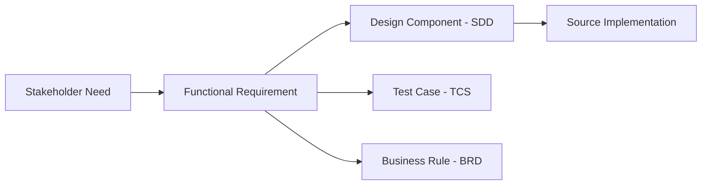

# Requirements Traceability Matrix (RTM)

## BuildNest E-Commerce Platform

---

## DOCUMENT INFORMATION

| Attribute                | Value                            |
| :----------------------- | :------------------------------- |
| **Document Title**       | Requirements Traceability Matrix |
| **Document ID**          | RTM-BUILDNEST-001                |
| **Version**              | 3.0                              |
| **Date**                 | February 11, 2026                |
| **Status**               | Baselined                        |
| **Classification**       | Internal Use                     |
| **Conformance Standard** | ISO/IEC/IEEE 29148:2018          |

---

## DOCUMENT CONTROL

### Revision History

| Version | Date       | Author       | Changes                                                                                                        | Approval    |
| :------ | :--------- | :----------- | :------------------------------------------------------------------------------------------------------------- | :---------- |
| 1.0     | 2026-02-10 | BuildNest QA | Initial draft — Auth, Product, Cart, Checkout, Payment, Inventory                                              | ✅ Approved |
| 2.0     | 2026-02-11 | BuildNest QA | Exhaustive update — Added Wishlist, Review, Admin, NFR traceability; 124 TC cross-references; coverage summary | ✅ Approved |
| 3.0     | 2026-02-11 | BuildNest QA | ISO 29148 compliance: added Doc Control, Definitions, Conformance Statement                                    | ✅ Pending  |

### Document Approval

| Role                | Name         | Signature      | Date             |
| :------------------ | :----------- | :------------- | :--------------- |
| **QA Lead**         | QA Lead      | \***\*\_\*\*** | \***\*\_\_\*\*** |
| **Project Manager** | Project Lead | \***\*\_\*\*** | \***\*\_\_\*\*** |
| **Technical Lead**  | Dev Lead     | \***\*\_\*\*** | \***\*\_\_\*\*** |

---

## 1. Introduction

### 1.1 Purpose

This Requirements Traceability Matrix (RTM) provides **bidirectional traceability** from stakeholder needs through functional requirements to design components, implementation artifacts, and test cases. It ensures that every requirement is implemented, tested, and can be traced to its origin.

### 1.2 Normative References

| Reference                                    | Description                                   |
| :------------------------------------------- | :-------------------------------------------- |
| **ISO/IEC/IEEE 29148:2018**                  | Requirements Engineering (governing standard) |
| [SRS](SRS_IEEE_29148_2018.md)                | Functional and non-functional requirements    |
| [SDD](SDD_IEEE_1016_2017.md)                 | Design components                             |
| [TCS](Test_Case_Specification_IEEE_29119.md) | Test case mappings                            |
| [BRD](Business_Rules_Document_IEEE_29148.md) | Business rules                                |

### 1.3 Definitions & Abbreviations

| Term / Abbr | Definition                          |
| :---------- | :---------------------------------- |
| **FR**      | Functional Requirement              |
| **NFR**     | Non-Functional Requirement          |
| **SN**      | Stakeholder Need                    |
| **UC**      | Use Case                            |
| **TC**      | Test Case                           |
| **RTM**     | Requirements Traceability Matrix    |
| **SRS**     | Software Requirements Specification |
| **SDD**     | Software Design Description         |

### 1.4 Conformance Statement

> This document conforms to **ISO/IEC/IEEE 29148:2018**, _Systems and Software Engineering — Life Cycle Processes — Requirements Engineering_. It implements bidirectional traceability as required by Clauses 6.2.3 (Requirements Traceability) and 6.3.3 (Requirements Verification), providing forward and backward trace from stakeholder needs to test cases.

### 1.5 Referenced Documents

1. **[SRS (Requirements)](SRS_IEEE_29148_2018.md)** — ISO/IEC/IEEE 29148:2018
2. **[SDD (Design)](SDD_IEEE_1016_2017.md)** — ISO/IEC/IEEE 1016:2017
3. **[SAD (Architecture)](Software_Architecture_Document_IEEE_42010.md)** — ISO/IEC/IEEE 42010:2022
4. **[TCS (Test Cases)](Test_Case_Specification_IEEE_29119.md)** — ISO/IEC/IEEE 29119:2021
5. **[BRD (Business Rules)](Business_Rules_Document_IEEE_29148.md)** — ISO/IEC/IEEE 29148:2018

## 2. Traceability Methodology

- **Forward Traceability:** Stakeholder Need → Functional Requirement → Design Component → Test Case
- **Backward Traceability:** Test Case → Requirement → Stakeholder Need

---

## 3. Stakeholder Need → Requirement Mapping

| Stakeholder Need | Description                           | Functional Requirements                                       |
| :--------------- | :------------------------------------ | :------------------------------------------------------------ |
| **SN-01**        | Secure online shopping experience     | FR-AUTH-01..11, FR-PAY-01..05, FR-CHK-01..08                  |
| **SN-02**        | Product discovery and comparison      | FR-PROD-01..07, FR-REV-01..05, FR-WISH-01..05                 |
| **SN-03**        | Admin visibility into sales/inventory | FR-INV-01..07, FR-ADM-01..12                                  |
| **SN-04**        | Scalable platform (1000+ users)       | FR-MON-01..08, NFR-PERF-01..06                                |
| **SN-05**        | Observable, container-ready app       | FR-MON-01..08, NFR-REL-01..05                                 |
| **SN-06**        | Compliance (OWASP, PCI-DSS)           | FR-AUTH-05, FR-AUTH-08, FR-AUTH-10, FR-PAY-02, NFR-SEC-01..12 |
| **SN-07**        | Customer engagement & retention       | FR-WISH-01..05, FR-REV-01..05, FR-NOT-01..05                  |

---

## 4. Requirement → Design → Test Traceability

### 4.1 Authentication & Password (FG-01)

| Requirement ID                    | Use Case | Backend Component (SDD)                           | Frontend Component   | Test Cases                                |
| :-------------------------------- | :------- | :------------------------------------------------ | :------------------- | :---------------------------------------- |
| **FR-AUTH-01** (Login)            | UC-01    | `AuthController`, `AuthService`                   | `LoginPage`          | TC-AUTH-001, TC-AUTH-014, TC-E2E-002      |
| **FR-AUTH-02** (Invalid Login)    | UC-01    | `AuthService`, `JwtAuthEntryPoint`                | `LoginPage`          | TC-AUTH-002                               |
| **FR-AUTH-03** (JWT Validation)   | All      | `JwtAuthenticationFilter`, `JwtProvider`          | `AuthContext`        | TC-AUTH-003, TC-AUTH-011..013, TC-SEC-003 |
| **FR-AUTH-04** (Authorization)    | All      | `SecurityConfig`, `@PreAuthorize`                 | `ProtectedRoute`     | TC-SEC-005..007                           |
| **FR-AUTH-05** (Registration)     | UC-02    | `AuthController.register()`                       | `RegisterPage`       | TC-AUTH-005, TC-AUTH-006, TC-E2E-001      |
| **FR-AUTH-06** (Duplicate Check)  | UC-02    | `AuthService`                                     | `RegisterPage`       | TC-AUTH-006                               |
| **FR-AUTH-07** (Refresh Token)    | All      | `RefreshTokenService`                             | `AuthInterceptor`    | TC-AUTH-008, TC-AUTH-009, TC-SEC-004      |
| **FR-AUTH-08** (Rate Limiting)    | All      | `RateLimiterService`, `AdminRateLimitFilter`      | —                    | TC-AUTH-015, TC-SEC-002                   |
| **FR-AUTH-09** (RBAC)             | All      | `CustomUserDetailsService`, `SecurityConfig`      | `RoleGuard`          | TC-SEC-005                                |
| **FR-AUTH-10** (Password Hashing) | UC-02    | `BCryptPasswordEncoder`                           | —                    | TC-SEC-008                                |
| **FR-AUTH-11** (Password Reset)   | UC-12    | `PasswordResetController`, `PasswordResetService` | `ForgotPasswordPage` | TC-PWD-001..010                           |

### 4.2 Product Catalog (FG-02)

| Requirement ID                  | Use Case | Backend Component                            | Frontend Component  | Test Cases              |
| :------------------------------ | :------- | :------------------------------------------- | :------------------ | :---------------------- |
| **FR-PROD-01** (List Products)  | UC-03    | `ProductControllerV2`, `ProductService`      | `ProductGrid`       | TC-PROD-001, TC-E2E-003 |
| **FR-PROD-02** (Product Detail) | UC-03    | `ProductControllerV2.getProduct()`           | `ProductDetailPage` | TC-PROD-002             |
| **FR-PROD-03** (Search)         | UC-03    | `ProductService`, Elasticsearch              | `SearchBar`         | TC-PROD-003             |
| **FR-PROD-04** (Categories)     | UC-03    | `CategoryService`                            | `CategoryFilter`    | TC-PROD-004             |
| **FR-PROD-05** (API Versioning) | —        | `ProductControllerV1` (sunset), `@ApiSunset` | —                   | TC-PROD-005             |

### 4.3 Shopping Cart (FG-03)

| Requirement ID               | Use Case | Backend Component                 | Frontend Component        | Test Cases              |
| :--------------------------- | :------- | :-------------------------------- | :------------------------ | :---------------------- |
| **FR-CART-01** (Add Item)    | UC-04    | `CartController`, `CartService`   | `AddToCartButton`         | TC-CART-001, TC-E2E-004 |
| **FR-CART-02** (View Cart)   | UC-04    | `CartService.getCart()`           | `CartPage`, `CartItemRow` | TC-CART-001             |
| **FR-CART-03** (Remove Item) | UC-04    | `CartController.removeFromCart()` | `CartItemRow`             | TC-CART-001             |
| **FR-CART-04** (Clear Cart)  | UC-04    | `CartService.clearCart()`         | `CartPage`                | TC-CART-001             |
| **FR-CART-05** (Total Calc)  | UC-04    | `CartService.getCartTotal()`      | `CartSummary`             | TC-CART-001             |

### 4.4 Checkout & Orders (FG-04)

| Requirement ID                      | Use Case | Backend Component                       | Frontend Component | Test Cases                         |
| :---------------------------------- | :------- | :-------------------------------------- | :----------------- | :--------------------------------- |
| **FR-CHK-01** (Checkout)            | UC-05    | `CheckoutController`, `CheckoutService` | `CheckoutPage`     | TC-CHK-001, TC-CHK-002, TC-E2E-005 |
| **FR-CHK-02** (Cart Validation)     | UC-05    | `CheckoutService`                       | —                  | TC-CHK-009, TC-CHK-010             |
| **FR-CHK-03** (Inventory Check)     | UC-05    | `InventoryService.reserve()`            | —                  | TC-CHK-003, TC-CHK-011             |
| **FR-CHK-04** (Order Creation)      | UC-05    | `OrderService.createOrder()`            | —                  | TC-CHK-004                         |
| **FR-CHK-05** (Rollback on Failure) | UC-05    | `InventoryService.releaseReservation()` | —                  | TC-CHK-005                         |
| **FR-CHK-06** (Order Status)        | UC-06    | `UserOrderController`                   | `OrderHistoryPage` | TC-ORD-001..004                    |

### 4.5 Payment (FG-05)

| Requirement ID                   | Use Case | Backend Component                   | Frontend Component      | Test Cases |
| :------------------------------- | :------- | :---------------------------------- | :---------------------- | :--------- |
| **FR-PAY-01** (Razorpay Init)    | UC-05    | `PaymentService`, Razorpay API      | `RazorpayCheckout (JS)` | TC-CHK-004 |
| **FR-PAY-02** (Verify Signature) | UC-05    | `PaymentSignatureValidationService` | —                       | TC-CHK-006 |
| **FR-PAY-04** (Webhooks)         | —        | `WebhookAdminController`            | —                       | —          |

### 4.6 Inventory (FG-06)

| Requirement ID                  | Use Case | Backend Component                                      | Frontend Component | Test Cases               |
| :------------------------------ | :------- | :----------------------------------------------------- | :----------------- | :----------------------- |
| **FR-INV-01** (Stock Tracking)  | UC-05    | `InventoryService`, `Inventory` entity                 | —                  | TC-ADM-INV-001..004      |
| **FR-INV-03** (Reservation)     | UC-05    | `InventoryService.reserve()`                           | —                  | TC-CHK-003               |
| **FR-INV-04** (Deduction)       | UC-05    | `InventoryService.deductStock()`                       | —                  | TC-CHK-003               |
| **FR-INV-06** (Low Stock Alert) | —        | `InventoryMonitoringScheduler`, `LowStockWarningEvent` | —                  | TC-ADM-INV-001           |
| **FR-INV-07** (Optimistic Lock) | UC-05    | `@Version` on Inventory entity                         | —                  | TC-EDGE-003, TC-EDGE-004 |

### 4.7 Wishlist (FG-07)

| Requirement ID                  | Use Case | Backend Component                                   | Frontend Component | Test Cases  |
| :------------------------------ | :------- | :-------------------------------------------------- | :----------------- | :---------- |
| **FR-WISH-01** (Add)            | UC-07    | `WishlistController`, `WishlistService`             | `WishlistButton`   | TC-WISH-001 |
| **FR-WISH-02** (Remove)         | UC-07    | `WishlistController.removeFromWishlist()`           | `WishlistPage`     | TC-WISH-001 |
| **FR-WISH-03** (View)           | UC-07    | `WishlistController.getWishlist()`                  | `WishlistPage`     | TC-WISH-001 |
| **FR-WISH-04** (Contains Check) | UC-07    | `WishlistController.isInWishlist()`                 | `ProductCard`      | TC-WISH-001 |
| **FR-WISH-05** (Clear/Count)    | UC-07    | `WishlistController.clearWishlist()`, `.getCount()` | `WishlistPage`     | TC-WISH-001 |

### 4.8 Product Reviews (FG-08)

| Requirement ID                 | Use Case | Backend Component                                 | Frontend Component | Test Cases             |
| :----------------------------- | :------- | :------------------------------------------------ | :----------------- | :--------------------- |
| **FR-REV-01** (Submit Review)  | UC-08    | `ProductReviewController`, `ProductReviewService` | `ReviewForm`       | TC-REV-001, TC-REV-002 |
| **FR-REV-02** (View Reviews)   | UC-08    | `ProductReviewController.getReviews()`            | `ReviewList`       | TC-REV-003             |
| **FR-REV-03** (Rating Summary) | UC-08    | `ProductReviewService.getRatingSummary()`         | `RatingSummary`    | TC-REV-003             |
| **FR-REV-04** (Mark Helpful)   | UC-08    | `ProductReviewController.markHelpful()`           | `ReviewItem`       | TC-REV-004             |
| **FR-REV-05** (Update/Delete)  | UC-08    | `ProductReviewController.update/delete()`         | `ReviewItem`       | TC-REV-004, TC-REV-005 |

### 4.9 Admin Management (FG-09)

| Requirement ID                     | Use Case | Backend Component                     | Test Cases                     |
| :--------------------------------- | :------- | :------------------------------------ | :----------------------------- |
| **FR-ADM-01** (View Products)      | UC-09    | `AdminProductController`              | TC-ADM-PRD-001                 |
| **FR-ADM-02** (Create Product)     | UC-09    | `AdminProductController.create()`     | TC-ADM-PRD-002                 |
| **FR-ADM-03** (View/Update Orders) | UC-10    | `AdminOrderController`                | TC-ADM-ORD-001, TC-ADM-ORD-002 |
| **FR-ADM-06** (View Users)         | UC-11    | `AdminUserController`                 | TC-ADM-USR-001                 |
| **FR-ADM-07** (Update User)        | UC-11    | `AdminUserController.update()`        | TC-ADM-USR-002                 |
| **FR-ADM-08** (Delete User)        | UC-11    | `AdminUserController.delete()`        | TC-ADM-USR-002                 |
| **FR-ADM-10** (Inventory Status)   | UC-09    | `AdminInventoryController`            | TC-ADM-INV-001..004            |
| **FR-ADM-11** (Stock Adjustment)   | UC-09    | `AdminInventoryController.addStock()` | TC-ADM-INV-002                 |
| **FR-ADM-12** (Analytics)          | UC-10    | `AdminAnalyticsController`            | TC-ADM-ANL-001                 |

---

## 5. Revision History

See [Document Control](#document-control) for full revision history and approvals.

---

**— End of Document —**

_This document was prepared in compliance with ISO/IEC/IEEE 29148:2018 for the BuildNest E-Commerce Platform._

## 5. Non-Functional Requirement Traceability

| NFR ID          | Category               | Implementation                             | Test Cases                             |
| :-------------- | :--------------------- | :----------------------------------------- | :------------------------------------- |
| **NFR-SEC-01**  | Brute Force Protection | `RateLimiterService`, account lockout      | TC-SEC-001, TC-SEC-009                 |
| **NFR-SEC-02**  | JWT Expiration         | `JwtProvider`, token TTL                   | TC-SEC-003, TC-SEC-004                 |
| **NFR-SEC-03**  | Rate Limiting          | `AdminRateLimitFilter`, `RateLimitConfig`  | TC-SEC-002, TC-AUTH-015                |
| **NFR-SEC-04**  | Password Complexity    | Bean validation in `RegisterRequest`       | TC-SEC-008                             |
| **NFR-SEC-05**  | Role Hierarchy         | `SecurityConfig`, `@PreAuthorize`          | TC-SEC-005, TC-SEC-007, TC-ADM-INV-003 |
| **NFR-SEC-06**  | Cross-User Access      | Service-level ownership checks             | TC-SEC-006, TC-ORD-002                 |
| **NFR-SEC-08**  | Injection Prevention   | Input validation, parameterized queries    | TC-SEC-011..017                        |
| **NFR-SEC-09**  | XSS Prevention         | Input sanitization                         | TC-SEC-012                             |
| **NFR-SEC-11**  | Mass Assignment        | DTO pattern — only mapped fields           | TC-SEC-018                             |
| **NFR-SEC-12**  | File Upload Validation | Custom validators                          | TC-SEC-019                             |
| **NFR-PERF-01** | Checkout Performance   | `DatabaseQueryOptimizationConfig`, caching | TC-PERF-001                            |
| **NFR-PERF-04** | Concurrent Load        | Stateless JWT, HikariCP                    | TC-STRESS-001, TC-STRESS-002           |
| **NFR-REL-01**  | Flakiness Prevention   | Deterministic tests                        | TC-REL-001                             |
| **NFR-REL-02**  | Concurrent Reliability | Thread-safe services                       | TC-REL-002                             |
| **NFR-USE-01**  | Mobile Responsiveness  | Responsive CSS                             | TC-E2E-006                             |

---

## 6. Coverage Summary

| Requirement Group        | Total Reqs | Mapped to Design | Mapped to Tests | Coverage |
| :----------------------- | :--------: | :--------------: | :-------------: | :------: |
| Authentication (FR-AUTH) |     11     |        11        |       11        |   100%   |
| Product (FR-PROD)        |     7      |        7         |        5        |   71%    |
| Cart (FR-CART)           |     6      |        6         |        5        |   83%    |
| Checkout (FR-CHK)        |     8      |        8         |        6        |   75%    |
| Payment (FR-PAY)         |     5      |        5         |        2        |   40%    |
| Inventory (FR-INV)       |     7      |        7         |        5        |   71%    |
| Wishlist (FR-WISH)       |     5      |        5         |        5        |   100%   |
| Review (FR-REV)          |     5      |        5         |        5        |   100%   |
| Admin (FR-ADM)           |     12     |        12        |        9        |   75%    |
| Security (NFR-SEC)       |     12     |        12        |       10        |   83%    |
| Performance (NFR-PERF)   |     6      |        6         |        3        |   50%    |
| Reliability (NFR-REL)    |     5      |        5         |        5        |   100%   |
| **Overall**              |   **89**   |      **89**      |     **71**      | **80%**  |

---

## 7. Revision History

| Version | Date       | Author       | Changes                                                                                                        |
| :------ | :--------- | :----------- | :------------------------------------------------------------------------------------------------------------- |
| 1.0     | 2026-02-10 | BuildNest QA | Initial draft — Auth, Product, Cart, Checkout, Payment, Inventory                                              |
| 2.0     | 2026-02-11 | BuildNest QA | Exhaustive update — Added Wishlist, Review, Admin, NFR traceability; 124 TC cross-references; coverage summary |

---

**— End of Document —**
