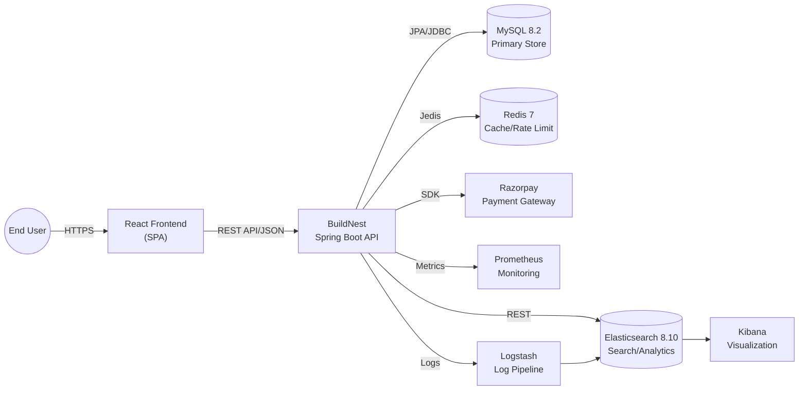
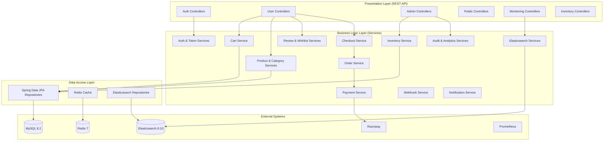
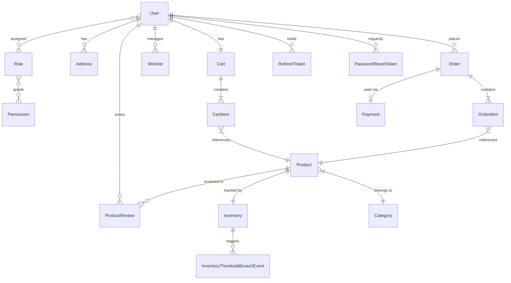
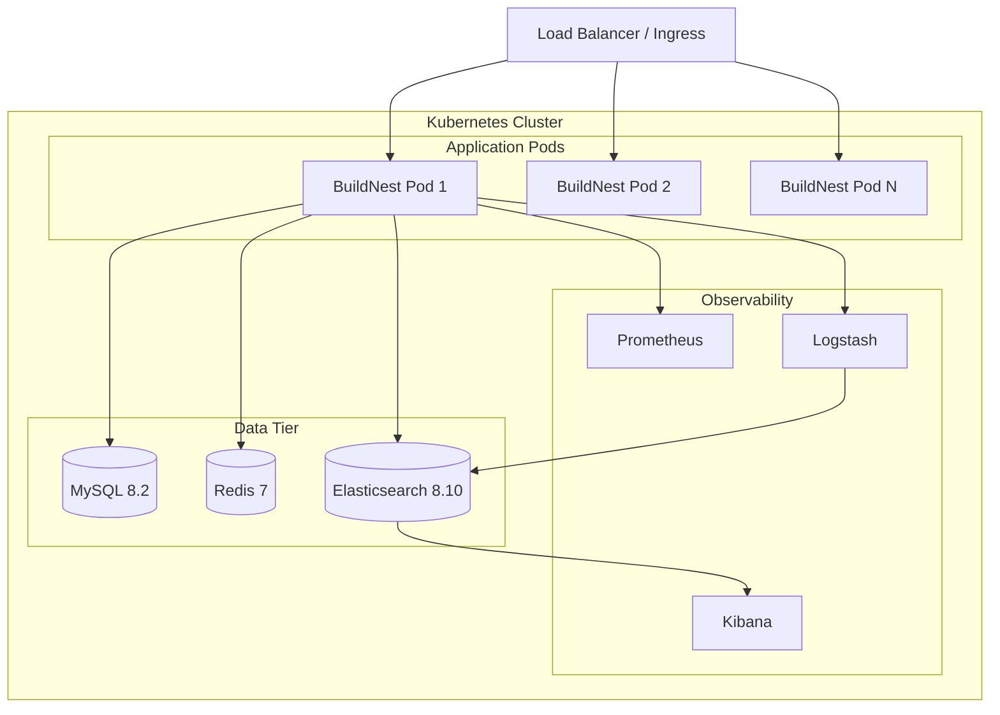

# Software Requirements Specification (SRS)

## BuildNest — E-Commerce Platform for Home Construction and Décor Products

---

## DOCUMENT INFORMATION

| Attribute                | Value                                     |
| ------------------------ | ----------------------------------------- |
| **Document Title**       | Software Requirements Specification (SRS) |
| **Document ID**          | DOC-SRS-001                               |
| **Version**              | 1.0                                       |
| **Date**                 | February 10, 2026                         |
| **Status**               | Baselined                                 |
| **Classification**       | Internal Use                              |
| **Prepared For**         | CDAC Project                              |
| **Conformance Standard** | ISO/IEC/IEEE 29148:2018                   |
| **Supersedes**           | N/A (Initial Release)                     |

---

## DOCUMENT CONTROL

### Revision History

| Version | Date       | Author             | Changes                                                                                                                           | Approval   |
| ------- | ---------- | ------------------ | --------------------------------------------------------------------------------------------------------------------------------- | ---------- |
| 1.0     | 2026-02-10 | Documentation Team | Initial controlled release per ISO/IEC/IEEE 29148:2018                                                                            | ✅ Pending |
| 1.1     | 2026-02-10 | Documentation Team | Frontend requirements, compliance audit fixes                                                                                     | ✅ Pending |
| 2.0     | 2026-02-11 | Documentation Team | Expanded API appendix to 19 sections (83+ endpoints); added Product V1/V2, Wishlist, Review, Password, Order, Admin full listings | ✅ Pending |
| 3.0     | 2026-02-11 | Documentation Team | ISO 29148:2018 compliance: added Conformance Statement                                                                            | ✅ Pending |

### Distribution List

| Name | Role            | Organization      | Date Received |
| ---- | --------------- | ----------------- | ------------- |
| TBD  | Project Manager | CDAC              | 2026-02-10    |
| TBD  | Technical Lead  | Development Team  | 2026-02-10    |
| TBD  | QA Manager      | Quality Assurance | 2026-02-10    |
| TBD  | Product Owner   | CDAC              | 2026-02-10    |

### Document Approval

| Role            | Name                   | Signature              | Date             |
| --------------- | ---------------------- | ---------------------- | ---------------- |
| Project Manager | **\*\***\_\_\_**\*\*** | **\*\***\_\_\_**\*\*** | \***\*\_\_\*\*** |
| Technical Lead  | **\*\***\_\_\_**\*\*** | **\*\***\_\_\_**\*\*** | \***\*\_\_\*\*** |
| QA Manager      | **\*\***\_\_\_**\*\*** | **\*\***\_\_\_**\*\*** | \***\*\_\_\*\*** |
| Product Owner   | **\*\***\_\_\_**\*\*** | **\*\***\_\_\_**\*\*** | \***\*\_\_\*\*** |

### Document Change Procedure

All changes to this document shall follow this change control process:

1. **Change Request (CR)** — Submit with rationale and impact assessment.
2. **Review** — Technical Lead and QA Manager review the proposed change.
3. **Approval** — Project Manager approves or rejects the CR.
4. **Implementation** — Approved changes are implemented and peer-reviewed.
5. **Baseline Update** — New version is baselined and distributed per the Distribution List.

---

## Table of Contents

1. [Introduction](#1-introduction)
   - 1.1 [Purpose](#11-purpose)
   - 1.2 [Scope](#12-scope)
   - 1.3 [Product Overview](#13-product-overview)
   - 1.4 [Intended Audience and Document Use](#14-intended-audience-and-document-use)
   - 1.5 [Definitions, Acronyms, and Abbreviations](#15-definitions-acronyms-and-abbreviations)
   - 1.6 [References](#16-references)
   - 1.7 [Document Overview](#17-document-overview)
2. [Overall Description](#2-overall-description)
   - 2.1 [Product Perspective](#21-product-perspective)
     - 2.1.1 [Operating Environment](#211-operating-environment)
   - 2.2 [Product Functions](#22-product-functions)
   - 2.3 [User Characteristics](#23-user-characteristics)
   - 2.4 [Constraints](#24-constraints)
   - 2.5 [Assumptions and Dependencies](#25-assumptions-and-dependencies)
   - 2.6 [Apportioning of Requirements](#26-apportioning-of-requirements)
   - 2.7 [Stakeholder Needs and Requirements](#27-stakeholder-needs-and-requirements)
3. [Specific Requirements](#3-specific-requirements)
   - 3.1 [External Interface Requirements](#31-external-interface-requirements)
   - 3.2 [Functional Requirements](#32-functional-requirements)
     - 3.2.10 [Frontend Application Requirements](#3210-frontend-application-requirements-fg-10)
   - 3.3 [Usability Requirements](#33-usability-requirements)
   - 3.4 [Performance Requirements](#34-performance-requirements)
   - 3.5 [Logical Database Requirements](#35-logical-database-requirements)
   - 3.6 [Design Constraints](#36-design-constraints)
   - 3.7 [Standards Compliance](#37-standards-compliance)
   - 3.8 [Software System Attributes](#38-software-system-attributes)
     - 3.8.7 [Safety](#387-safety)
   - 3.9 [Licensing Requirements](#39-licensing-requirements)
4. [Verification](#4-verification)
5. [Appendices](#5-appendices)
   - [Appendix E: Use Case Scenarios](#appendix-e-use-case-scenarios)
   - [Appendix F: Licensing Summary](#appendix-f-licensing-summary)

---

## 1. Introduction

### 1.1 Purpose

This Software Requirements Specification (SRS) document defines the complete functional and non-functional requirements for the **BuildNest E-Commerce Platform**. It is prepared in conformance with **ISO/IEC/IEEE 29148:2018** — _Systems and software engineering — Life cycle processes — Requirements engineering_.

The purpose of this document is to:

- Provide a clear, complete, and verifiable description of all software requirements.
- Serve as a contractual basis between stakeholders, developers, and quality assurance teams.
- Enable traceability from stakeholder needs through system requirements to software requirements.
- Establish acceptance criteria for verification and validation activities.

### 1.2 Scope

**BuildNest** is a web-based e-commerce platform specializing in home construction materials and décor products. The system provides a backend REST API that supports the full e-commerce lifecycle:

| Capability                     | Description                                                         |
| ------------------------------ | ------------------------------------------------------------------- |
| **User Management**            | Registration, authentication, profile management, role-based access |
| **Product Catalog**            | Product listing, categorization, search, filtering, reviews         |
| **Shopping Cart**              | Cart management, item addition/removal, quantity updates            |
| **Order Processing**           | Checkout, order placement, order history, order tracking            |
| **Payment Integration**        | Razorpay payment gateway, transaction management                    |
| **Inventory Management**       | Stock tracking, availability checking, threshold alerts             |
| **Admin Operations**           | Analytics, reports, user management, inventory administration       |
| **Monitoring & Observability** | Health checks, metrics, alerting, log aggregation                   |
| **Frontend Application**       | Responsive React SPA, dynamic UI, client-side routing, state mgmt   |

**System Boundary:** This SRS covers the entire **BuildNest** platform, including the **Spring Boot backend API** and the **React Frontend Application**.

**Out of Scope:**

- Native mobile applications (iOS/Android)
- Third-party payment gateway internals (Razorpay)
- Physical logistics and shipping systems
- Customer support and ticketing systems

### 1.3 Product Overview

#### 1.3.1 Product Perspective

BuildNest is a **full-stack web application** comprising a **React 18+ Single Page Application (SPA)** frontend and a **Spring Boot 3.2 backend API**. It operates within a broader ecosystem of external services:

The system is designed for deployment on **Kubernetes** (with manifests provided) or **AWS** (with Terraform IaC definitions).

#### 1.3.2 Product Functions (Summary)

The major functions of the system are:

1. **Authentication & Identity Management** — Secure user registration, login, JWT token lifecycle, password reset, OAuth2 support.
2. **Product Catalog Management** — CRUD operations for products and categories with versioned APIs (v1, v2).
3. **Shopping Cart Operations** — Add/remove items, view cart, calculate totals, clear cart.
4. **Checkout & Order Processing** — Cart validation, checkout with/without payment, order creation, order history.
5. **Payment Processing** — Razorpay integration for payment creation, verification, and webhook handling.
6. **Inventory Management** — Stock tracking, availability checks, threshold-based alerts, admin stock operations.
7. **Product Reviews & Wishlists** — User reviews with ratings, wishlist management.
8. **Admin Analytics & Reporting** — Sales analytics, inventory reports, user management, audit logs.
9. **Monitoring & Observability** — Health checks, Prometheus metrics, Elasticsearch alerting, webhook events.

#### 1.3.3 System Interfaces

| Interface          | Technology                | Purpose                                      |
| ------------------ | ------------------------- | -------------------------------------------- |
| MySQL 8.2          | JDBC/JPA (HikariCP)       | Primary relational data store                |
| Redis 7            | Jedis client              | Caching, rate limiting, session data         |
| Elasticsearch 8.10 | Spring Data Elasticsearch | Full-text search, analytics, log aggregation |
| Razorpay           | REST SDK                  | Payment processing                           |
| Prometheus         | Micrometer registry       | Metrics collection                           |
| Logstash           | TCP/JSON                  | Log ingestion pipeline                       |
| Kibana             | REST (via ES)             | Visualization dashboard                      |

### 1.4 Intended Audience and Document Use

| Audience                          | Use of Document                                                    |
| --------------------------------- | ------------------------------------------------------------------ |
| **Project Managers**              | Project scope, scheduling, milestone tracking                      |
| **Software Developers**           | Implementation guidance, API contract, design constraints          |
| **QA/Test Engineers**             | Test case derivation, acceptance criteria, verification plan       |
| **System Architects**             | Architecture decisions, integration requirements, technology stack |
| **DevOps Engineers**              | Deployment requirements, infrastructure needs, monitoring setup    |
| **Security Auditors**             | Security requirements, compliance verification (PCI-DSS, OWASP)    |
| **Product Owners / Stakeholders** | Feature validation, scope agreement, acceptance sign-off           |

### 1.5 Definitions, Acronyms, and Abbreviations

#### 1.5.1 Definitions

| Term                | Definition                                                                                              |
| ------------------- | ------------------------------------------------------------------------------------------------------- |
| **BuildNest**       | The e-commerce platform for home construction and décor products                                        |
| **Cart**            | A temporary collection of products selected by a user before checkout                                   |
| **Checkout**        | The process of converting a cart into a confirmed order with payment                                    |
| **Inventory**       | The quantity and availability status of products in stock                                               |
| **Threshold Alert** | An automated notification triggered when inventory falls below a configured level                       |
| **Rate Limiting**   | Restricting the number of API requests per time window to prevent abuse                                 |
| **Circuit Breaker** | A resilience pattern that prevents cascading failures by short-circuiting calls to failing dependencies |
| **Webhook**         | An HTTP callback triggered by system events (payments, orders, inventory changes)                       |

#### 1.5.2 Acronyms and Abbreviations

| Acronym  | Expansion                                       |
| -------- | ----------------------------------------------- |
| API      | Application Programming Interface               |
| CORS     | Cross-Origin Resource Sharing                   |
| CRUD     | Create, Read, Update, Delete                    |
| CSRF     | Cross-Site Request Forgery                      |
| DTO      | Data Transfer Object                            |
| GDPR     | General Data Protection Regulation              |
| HikariCP | High-performance JDBC connection pool           |
| JPA      | Java Persistence API                            |
| JWT      | JSON Web Token                                  |
| LCP      | Largest Contentful Paint                        |
| OWASP    | Open Web Application Security Project           |
| PCI-DSS  | Payment Card Industry Data Security Standard    |
| RBAC     | Role-Based Access Control                       |
| REST     | Representational State Transfer                 |
| SPA      | Single Page Application                         |
| SRS      | Software Requirements Specification             |
| SSL/TLS  | Secure Sockets Layer / Transport Layer Security |
| TTL      | Time To Live                                    |
| WCAG     | Web Content Accessibility Guidelines            |

### 1.6 References

| ID     | Document / Standard                                      | Version |
| ------ | -------------------------------------------------------- | ------- |
| REF-01 | ISO/IEC/IEEE 29148:2018 — Requirements Engineering       | 2018    |
| REF-02 | ISO/IEC/IEEE 12207:2017 — Software Life Cycle Processes  | 2017    |
| REF-03 | ISO/IEC 25010:2011 — Systems and Software Quality Models | 2011    |
| REF-04 | OWASP Top 10 — Web Application Security Risks            | 2021    |
| REF-05 | PCI-DSS — Payment Card Industry Data Security Standard   | v4.0    |
| REF-06 | GDPR — General Data Protection Regulation                | 2018    |
| REF-07 | Spring Boot Reference Documentation                      | 3.2.2   |
| REF-08 | Razorpay API Documentation                               | Latest  |
| REF-09 | BuildNest README.md                                      | 2.0     |
| REF-10 | BuildNest PRODUCTION_READINESS_ASSESSMENT.md             | 1.0     |
| REF-11 | BuildNest API_QUICK_REFERENCE.md                         | 1.0     |

### 1.7 Document Overview

This SRS is organized into five major sections:

- **Section 1 — Introduction:** Purpose, scope, audience, terminology, and references.
- **Section 2 — Overall Description:** Product perspective, high-level functions, user characteristics, constraints, and assumptions.
- **Section 3 — Specific Requirements:** Detailed functional requirements, non-functional requirements, external interfaces, database schema, design constraints, and system attributes.
- **Section 4 — Verification:** Traceability matrix and verification methods.
- **Section 5 — Appendices:** Supplementary information, data models, and API endpoint summary.

---

## 2. Overall Description

### 2.1 Product Perspective

BuildNest is a new, self-contained product developed as part of the CDAC academic project. It is not a replacement for or enhancement of any existing system. The platform uses a **layered monolithic architecture**:

#### 2.1.1 Operating Environment

| Environment          | Specification                                                                             |
| -------------------- | ----------------------------------------------------------------------------------------- |
| **Server OS**        | Linux (Alpine/Debian in Docker containers)                                                |
| **Backend Runtime**  | JDK 21 (Eclipse Temurin)                                                                  |
| **Frontend Runtime** | Node.js 18+ (build-time); Modern browsers (Chrome 90+, Firefox 90+, Edge 90+, Safari 15+) |
| **Container Engine** | Docker 24+ with multi-stage builds                                                        |
| **Orchestration**    | Kubernetes 1.28+ or AWS ECS                                                               |
| **CI/CD**            | GitHub Actions / Jenkins                                                                  |

### 2.2 Product Functions

The system provides the following high-level feature groups:

| ID    | Feature Group             | Description                                                                           |
| ----- | ------------------------- | ------------------------------------------------------------------------------------- |
| FG-01 | Authentication & Security | User registration, login, JWT lifecycle, password reset, RBAC, OAuth2, rate limiting  |
| FG-02 | Product Catalog           | Product CRUD, category management, versioned APIs (v1/v2), search and filtering       |
| FG-03 | Shopping Cart             | Add/remove/update items, view cart, calculate totals, clear cart                      |
| FG-04 | Checkout & Orders         | Cart validation, checkout processing, payment integration, order history              |
| FG-05 | Payment Processing        | Razorpay order creation, payment verification, webhook event handling                 |
| FG-06 | Inventory Management      | Stock tracking, availability checking, threshold alerts, admin stock operations       |
| FG-07 | Reviews & Wishlists       | Product reviews with ratings, wishlist add/remove/view                                |
| FG-08 | Admin Operations          | User management, order management, product management, analytics, reports, audit logs |
| FG-09 | Monitoring & Alerting     | Health checks (DB, Redis), Prometheus metrics, Elasticsearch alerting, webhook events |
| FG-10 | Frontend Experience       | Responsive UI, client-side routing, form validation, error handling, state management |

### 2.3 User Characteristics

| User Role                    | Description                                                       | Technical Expertise                                             | Primary Functions                                                           |
| ---------------------------- | ----------------------------------------------------------------- | --------------------------------------------------------------- | --------------------------------------------------------------------------- |
| **End User (USER)**          | Registered customer browsing and purchasing products              | Low to moderate; interacts via frontend UI                      | Browse products, manage cart, place orders, write reviews, manage wishlist  |
| **Administrator (ADMIN)**    | Platform operator managing products, inventory, and system health | Moderate to high; may interact via admin UI or direct API calls | Manage products/inventory, view analytics/reports, manage users, audit logs |
| **API Consumer (Developer)** | Frontend or third-party developer integrating with the API        | High; direct REST API interaction                               | All API endpoints per granted role                                          |
| **DevOps/SRE**               | Operations team managing deployment and monitoring                | High; infrastructure and monitoring tools                       | Deployment, health monitoring, alerting, disaster recovery                  |

### 2.4 Constraints

| ID     | Constraint             | Description                                                           |
| ------ | ---------------------- | --------------------------------------------------------------------- |
| CON-01 | **Language & Runtime** | Java 21 (LTS) is required                                             |
| CON-02 | **Framework**          | Spring Boot 3.2.2 with Spring Security, Spring Data JPA               |
| CON-03 | **Database**           | MySQL 8.2.0 is the primary relational data store                      |
| CON-04 | **Cache**              | Redis 7 with Jedis client is required for caching and rate limiting   |
| CON-05 | **Payment Gateway**    | Razorpay is the sole supported payment provider                       |
| CON-06 | **Security**           | JWT tokens with 512-bit secret minimum; HTTPS mandatory in production |
| CON-07 | **Build System**       | Apache Maven with Maven Wrapper                                       |
| CON-08 | **Deployment**         | Docker containers on Kubernetes or AWS (Terraform)                    |
| CON-09 | **Regulatory**         | Must comply with PCI-DSS for payment data and GDPR for personal data  |
| CON-10 | **API Versioning**     | Backward-compatible API versioning (v1, v2)                           |

### 2.5 Assumptions and Dependencies

#### 2.5.1 Assumptions

| ID     | Assumption                                                                                                            |
| ------ | --------------------------------------------------------------------------------------------------------------------- |
| ASM-01 | The frontend application will be a Single Page Application (SPA) built with React                                     |
| ASM-02 | All users will access the system through HTTPS in production                                                          |
| ASM-03 | Razorpay service will maintain its published API contract                                                             |
| ASM-04 | Database schema migrations will be managed through Liquibase changelogs                                               |
| ASM-05 | Redis will be available for rate limiting; the system falls back gracefully if Redis is unavailable (circuit breaker) |
| ASM-06 | Elasticsearch is optional for core functionality; the system operates without it for basic e-commerce features        |

#### 2.5.2 Dependencies

| ID     | Dependency         | Impact if Unavailable                                                             |
| ------ | ------------------ | --------------------------------------------------------------------------------- |
| DEP-01 | MySQL 8.2          | **Critical** — System cannot operate; all data persistence fails                  |
| DEP-02 | Redis 7            | **High** — Rate limiting disabled, caching unavailable; circuit breaker activates |
| DEP-03 | Razorpay API       | **High** — Payment processing unavailable; orders without payment still possible  |
| DEP-04 | Elasticsearch 8.10 | **Low** — Search/analytics unavailable; core e-commerce functions unaffected      |
| DEP-05 | Prometheus/Grafana | **Low** — Monitoring data unavailable; application functions normally             |
| DEP-06 | JDK 21             | **Critical** — Backend cannot compile or run                                      |
| DEP-07 | Node.js 18+ / NPM  | **Critical** — Frontend build and development environment                         |

### 2.6 Apportioning of Requirements

The following requirements are deferred to future releases:

| ID     | Requirement                                                                                               | Target Release |
| ------ | --------------------------------------------------------------------------------------------------------- | -------------- |
| FUT-01 | Blue-green deployment with Argo Rollouts                                                                  | v1.1           |
| FUT-02 | Frontend SPA (React) — **Moved to v1.0 scope** ([§3.2.10](#3210-frontend-application-requirements-fg-10)) | v1.0 (Current) |
| FUT-03 | Multi-vendor marketplace support                                                                          | v2.0           |
| FUT-04 | Mobile application (iOS/Android)                                                                          | v2.0           |
| FUT-05 | Kafka-based event streaming                                                                               | v1.1           |
| FUT-06 | Multi-region deployment                                                                                   | v2.0           |

### 2.7 Stakeholder Needs and Requirements

Per ISO/IEC/IEEE 29148:2018 Clause 6.3, the following stakeholder needs drive the system requirements:

| ID    | Stakeholder       | Need                                                           | Traced To                  |
| ----- | ----------------- | -------------------------------------------------------------- | -------------------------- |
| SN-01 | End Users         | Intuitive product browsing and seamless checkout experience    | FG-02, FG-03, FG-04, FG-10 |
| SN-02 | End Users         | Secure account management and trusted payment processing       | FG-01, FG-05               |
| SN-03 | Administrators    | Real-time visibility into sales, inventory, and user activity  | FG-06, FG-08, FG-09        |
| SN-04 | Business Owners   | Scalable platform supporting growth to 1,000+ concurrent users | PR-02, SCL-01–04           |
| SN-05 | DevOps/SRE        | Observable, container-ready app with zero-downtime deploys     | FG-09, PRT-01–04           |
| SN-06 | Security Auditors | Compliance with OWASP, PCI-DSS, and GDPR standards             | SEC-01–13                  |

---

## 3. Specific Requirements

### 3.1 External Interface Requirements

#### 3.1.1 User Interfaces

| ID    | Requirement                                                                            | Priority |
| ----- | -------------------------------------------------------------------------------------- | -------- |
| UI-01 | The primary user interface shall be a **React-based Single Page Application (SPA)**    | High     |
| UI-02 | The system shall expose a Swagger/OpenAPI UI at `/swagger-ui.html` for API exploration | Medium   |
| UI-03 | The OpenAPI specification shall be available at `/v3/api-docs` in JSON format          | Medium   |
| UI-04 | All API responses shall use JSON format with consistent error response structures      | High     |

#### 3.1.2 Hardware Interfaces

This system has no direct hardware interfaces. It runs as a containerized application on standard server hardware or cloud infrastructure.

#### 3.1.3 Software Interfaces

| ID    | External System          | Interface Type       | Protocol     | Data Format   |
| ----- | ------------------------ | -------------------- | ------------ | ------------- |
| SI-01 | MySQL 8.2                | JDBC via HikariCP    | TCP/3306     | SQL           |
| SI-02 | Redis 7                  | Jedis client         | TCP/6379     | RESP protocol |
| SI-03 | Elasticsearch 8.10       | REST client          | HTTP(S)/9200 | JSON          |
| SI-04 | Razorpay Payment Gateway | REST SDK             | HTTPS        | JSON          |
| SI-05 | Prometheus               | HTTP scrape endpoint | HTTP/8080    | OpenMetrics   |
| SI-06 | Logstash                 | TCP log shipper      | TCP/5000     | JSON          |

#### 3.1.4 Communication Interfaces

| ID    | Requirement                                                                                | Priority |
| ----- | ------------------------------------------------------------------------------------------ | -------- |
| CI-01 | The system shall communicate over HTTP/HTTPS using REST conventions                        | High     |
| CI-02 | The system shall enforce HTTPS (TLS 1.2+) in the production profile                        | High     |
| CI-03 | The system shall support CORS with configurable allowed origins (default: `buildnest.com`) | High     |
| CI-04 | The system shall expose health endpoints at `/actuator/health` for Kubernetes probes       | High     |
| CI-05 | The system shall expose Prometheus metrics at `/actuator/prometheus`                       | Medium   |

---

### 3.2 Functional Requirements

#### Priority Classification

| Level      | Definition                                                              |
| ---------- | ----------------------------------------------------------------------- |
| **High**   | Must-have for v1.0 release; system is non-functional without it         |
| **Medium** | Should-have; significant business value but not blocking for launch     |
| **Low**    | Could-have; desirable feature that can be deferred without major impact |

#### 3.2.1 Authentication and Identity Management (FG-01)

| ID         | Requirement                                                                                               | Priority | Verification |
| ---------- | --------------------------------------------------------------------------------------------------------- | -------- | ------------ |
| FR-AUTH-01 | The system shall allow new users to register with username, email, and password                           | High     | Test         |
| FR-AUTH-02 | The system shall authenticate users via username/password and return a JWT access token and refresh token | High     | Test         |
| FR-AUTH-03 | JWT access tokens shall expire after a configurable period (default: 15 minutes / 900,000 ms)             | High     | Test         |
| FR-AUTH-04 | JWT refresh tokens shall expire after a configurable period (default: 30 days / 2,592,000,000 ms)         | High     | Test         |
| FR-AUTH-05 | The system shall require a minimum 512-bit JWT secret key and fail fast if not configured                 | High     | Test         |
| FR-AUTH-06 | The system shall support token refresh to obtain new access tokens without re-authentication              | High     | Test         |
| FR-AUTH-07 | The system shall support user logout by invalidating refresh tokens                                       | High     | Test         |
| FR-AUTH-08 | The system shall support password reset via email with tokens expiring in 15 minutes (OWASP compliant)    | Medium   | Test         |
| FR-AUTH-09 | The system shall enforce role-based access control (RBAC) with roles: `USER` and `ADMIN`                  | High     | Test         |
| FR-AUTH-10 | The system shall hash passwords using BCrypt with 10 rounds                                               | High     | Inspection   |
| FR-AUTH-11 | The system shall support OAuth2 client integration                                                        | Medium   | Test         |

#### 3.2.2 Product Catalog Management (FG-02)

| ID         | Requirement                                                                               | Priority | Verification |
| ---------- | ----------------------------------------------------------------------------------------- | -------- | ------------ |
| FR-PROD-01 | The system shall allow users to retrieve a list of products with pagination               | High     | Test         |
| FR-PROD-02 | The system shall allow users to retrieve product details by product ID                    | High     | Test         |
| FR-PROD-03 | The system shall support product categorization with hierarchical categories              | Medium   | Test         |
| FR-PROD-04 | The system shall allow admins to create, update, and delete products                      | High     | Test         |
| FR-PROD-05 | The system shall provide versioned product APIs (v1 and v2) for backward compatibility    | Medium   | Inspection   |
| FR-PROD-06 | The system shall cache product data in Redis with a configurable TTL (default: 5 minutes) | Medium   | Test         |
| FR-PROD-07 | The system shall cache category data in Redis with a configurable TTL (default: 1 hour)   | Low      | Test         |

#### 3.2.3 Shopping Cart Operations (FG-03)

| ID         | Requirement                                                                                                         | Priority | Verification |
| ---------- | ------------------------------------------------------------------------------------------------------------------- | -------- | ------------ |
| FR-CART-01 | The system shall allow authenticated users to add items to their cart via `POST /api/user/cart/add`                 | High     | Test         |
| FR-CART-02 | The system shall allow users to retrieve their cart contents via `GET /api/user/cart/{userId}`                      | High     | Test         |
| FR-CART-03 | The system shall allow users to remove individual items from the cart via `DELETE /api/user/cart/item/{cartItemId}` | High     | Test         |
| FR-CART-04 | The system shall allow users to clear their entire cart via `DELETE /api/user/cart/clear/{userId}`                  | Medium   | Test         |
| FR-CART-05 | The system shall allow users to get the cart total price via `GET /api/user/cart/total/{userId}`                    | High     | Test         |
| FR-CART-06 | Each user shall have exactly one cart (one-to-one relationship)                                                     | High     | Inspection   |

#### 3.2.4 Checkout and Order Processing (FG-04)

| ID        | Requirement                                                                                                    | Priority | Verification |
| --------- | -------------------------------------------------------------------------------------------------------------- | -------- | ------------ |
| FR-CHK-01 | The system shall validate cart contents before checkout via `GET /api/checkout/validate/{cartId}`              | High     | Test         |
| FR-CHK-02 | The system shall calculate the total amount for checkout via `GET /api/checkout/calculate-total/{cartId}`      | High     | Test         |
| FR-CHK-03 | The system shall process checkout without payment via `POST /api/checkout/process/{cartId}`                    | High     | Test         |
| FR-CHK-04 | The system shall process checkout with Razorpay payment via `POST /api/checkout/process-with-payment/{cartId}` | High     | Test         |
| FR-CHK-05 | The system shall create an Order entity with associated OrderItems upon successful checkout                    | High     | Test         |
| FR-CHK-06 | The system shall deduct inventory stock upon successful order placement                                        | High     | Test         |
| FR-CHK-07 | The system shall allow users to view their order history via user order endpoints                              | Medium   | Test         |
| FR-CHK-08 | The system shall allow admins to view and manage all orders                                                    | Medium   | Test         |

#### 3.2.5 Payment Processing (FG-05)

| ID        | Requirement                                                                                                         | Priority | Verification |
| --------- | ------------------------------------------------------------------------------------------------------------------- | -------- | ------------ |
| FR-PAY-01 | The system shall integrate with Razorpay for payment order creation                                                 | High     | Test         |
| FR-PAY-02 | The system shall verify Razorpay payment signatures to prevent fraud                                                | High     | Test         |
| FR-PAY-03 | The system shall record payment transactions with status tracking                                                   | High     | Test         |
| FR-PAY-04 | The system shall handle Razorpay webhook events for asynchronous payment updates                                    | Medium   | Test         |
| FR-PAY-05 | Razorpay API credentials shall be externalized via environment variables (`RAZORPAY_KEY_ID`, `RAZORPAY_KEY_SECRET`) | High     | Inspection   |

#### 3.2.6 Inventory Management (FG-06)

| ID        | Requirement                                                                                                        | Priority | Verification |
| --------- | ------------------------------------------------------------------------------------------------------------------ | -------- | ------------ |
| FR-INV-01 | The system shall allow users to check product inventory via `GET /api/inventory/product/{productId}`               | High     | Test         |
| FR-INV-02 | The system shall allow users to check product availability via `GET /api/inventory/check-availability/{productId}` | High     | Test         |
| FR-INV-03 | The system shall allow admins to add stock via `POST /api/inventory/add-stock/{productId}`                         | High     | Test         |
| FR-INV-04 | The system shall allow admins to update stock via `POST /api/inventory/update-stock/{productId}`                   | High     | Test         |
| FR-INV-05 | The system shall track inventory status (e.g., IN_STOCK, LOW_STOCK, OUT_OF_STOCK)                                  | Medium   | Test         |
| FR-INV-06 | The system shall emit `InventoryThresholdBreachEvent` when stock falls below configurable thresholds               | Medium   | Test         |
| FR-INV-07 | The system shall provide inventory analytics and reports for admins                                                | Medium   | Test         |

#### 3.2.7 Reviews and Wishlists (FG-07)

| ID         | Requirement                                                                       | Priority | Verification |
| ---------- | --------------------------------------------------------------------------------- | -------- | ------------ |
| FR-REV-01  | The system shall allow authenticated users to submit product reviews with ratings | Medium   | Test         |
| FR-REV-02  | The system shall allow users to view product reviews                              | Medium   | Test         |
| FR-REV-03  | The system shall allow users to update and delete their own reviews               | Medium   | Test         |
| FR-WISH-01 | The system shall allow authenticated users to add products to their wishlist      | Low      | Test         |
| FR-WISH-02 | The system shall allow users to view and manage their wishlist                    | Low      | Test         |

#### 3.2.8 Admin Operations (FG-08)

| ID        | Requirement                                                                      | Priority | Verification |
| --------- | -------------------------------------------------------------------------------- | -------- | ------------ |
| FR-ADM-01 | The system shall provide sales analytics dashboards for admins                   | Medium   | Test         |
| FR-ADM-02 | The system shall provide inventory analytics and reports for admins              | Medium   | Test         |
| FR-ADM-03 | The system shall allow admins to manage user accounts (view, update, deactivate) | Medium   | Test         |
| FR-ADM-04 | The system shall maintain audit logs of administrative actions                   | High     | Test         |
| FR-ADM-05 | The system shall provide admin-accessible reporting endpoints                    | Medium   | Test         |
| FR-ADM-06 | The system shall allow admins to configure inventory alert thresholds            | Medium   | Test         |
| FR-ADM-07 | The system shall allow admins to manage webhook subscriptions                    | Low      | Test         |
| FR-ADM-08 | Access to all admin endpoints shall require the `ADMIN` role                     | High     | Test         |

#### 3.2.9 Monitoring and Observability (FG-09)

| ID        | Requirement                                                                                                                        | Priority | Verification |
| --------- | ---------------------------------------------------------------------------------------------------------------------------------- | -------- | ------------ |
| FR-MON-01 | The system shall expose health check endpoints at `/actuator/health`                                                               | High     | Test         |
| FR-MON-02 | Health checks shall include database (MySQL) connectivity indicator                                                                | High     | Test         |
| FR-MON-03 | Health checks shall include Redis connectivity indicator with response time                                                        | High     | Test         |
| FR-MON-04 | Health checks shall include circuit breaker state indicators                                                                       | Medium   | Test         |
| FR-MON-05 | The system shall expose Prometheus metrics at `/actuator/prometheus`                                                               | Medium   | Test         |
| FR-MON-06 | The system shall support Kubernetes liveness and readiness probes                                                                  | High     | Test         |
| FR-MON-07 | The system shall integrate with Elasticsearch for event indexing and alerting                                                      | Low      | Test         |
| FR-MON-08 | 13 Prometheus alert rules shall be configured across 6 categories (Application, Performance, Resources, Database, Cache, Security) | Medium   | Inspection   |

#### 3.2.10 Frontend Application Requirements (FG-10)

##### 3.2.10.1 Core Architecture Requirements

| ID       | Requirement                                                                                                         | Priority | Verification  |
| -------- | ------------------------------------------------------------------------------------------------------------------- | -------- | ------------- |
| FR-FE-01 | The frontend shall be a Single Page Application (SPA) developed using **React 18+**                                 | High     | Inspection    |
| FR-FE-02 | The frontend shall interact with the backend API using **Axios** or **Fetch API** with interceptors for auth tokens | High     | Inspection    |
| FR-FE-03 | The frontend shall implement client-side routing using **React Router v6+**                                         | High     | Test          |
| FR-FE-04 | The frontend shall provide a responsive design supporting Desktop (≥1024px), Tablet (≥768px), and Mobile (<768px)   | High     | Demonstration |
| FR-FE-05 | The frontend shall manage global state (User Session, Cart) using **Context API** or **Redux Toolkit**              | High     | Inspection    |
| FR-FE-06 | The frontend shall implement protected routes that redirect unauthenticated users to the login page                 | High     | Test          |
| FR-FE-07 | The frontend shall display loading indicators (spinners/skeletons) during asynchronous API calls                    | Medium   | Demonstration |
| FR-FE-08 | The frontend shall display user-friendly toast notifications for success and error messages                         | Medium   | Demonstration |
| FR-FE-09 | The frontend shall validate forms client-side using **Formik** or **React Hook Form** with **Yup** schemas          | Medium   | Test          |
| FR-FE-10 | The frontend shall automatically refresh the JWT access token using the refresh token when a 401 error occurs       | High     | Test          |

##### 3.2.10.2 Page and Component Requirements

| ID       | Requirement                                                                                                                          | Priority | Verification  |
| -------- | ------------------------------------------------------------------------------------------------------------------------------------ | -------- | ------------- |
| FR-FE-11 | The **Home Page** shall display featured products, category navigation, a search bar, and promotional banners                        | High     | Demonstration |
| FR-FE-12 | The **Product Listing Page** shall support pagination, sorting (price, name, rating), and filtering by category and price range      | High     | Test          |
| FR-FE-13 | The **Product Detail Page** shall display product images, description, price, stock status, reviews, and an "Add to Cart" button     | High     | Demonstration |
| FR-FE-14 | The **Shopping Cart Page** shall display cart items, allow quantity updates, show subtotals, and provide a "Proceed to Checkout" CTA | High     | Test          |
| FR-FE-15 | The **Checkout Page** shall collect shipping address, display order summary, and integrate Razorpay payment modal                    | High     | Test          |
| FR-FE-16 | The **Login Page** shall provide username/password fields, form validation, error display, and a link to registration                | High     | Test          |
| FR-FE-17 | The **Registration Page** shall collect username, email, password (with strength indicator), and confirm password                    | High     | Test          |
| FR-FE-18 | The **User Profile Page** shall display and allow editing of user details, addresses, and password change                            | Medium   | Test          |
| FR-FE-19 | The **Order History Page** shall list past orders with status, date, total, and a link to order detail view                          | Medium   | Test          |
| FR-FE-20 | The **Wishlist Page** shall display saved products with options to move items to cart or remove them                                 | Low      | Test          |
| FR-FE-21 | The **Search Results Page** shall display products matching the query with highlighted terms and sorting options                     | Medium   | Test          |
| FR-FE-22 | The **Admin Dashboard** shall display summary cards for total sales, orders, users, and low-stock items                              | Medium   | Demonstration |
| FR-FE-23 | The **Admin Product Management Page** shall provide a table with CRUD actions, image upload, and category assignment                 | Medium   | Test          |
| FR-FE-24 | The **Admin Inventory Page** shall display stock levels with color-coded status indicators and threshold configuration               | Medium   | Test          |
| FR-FE-25 | The **Admin Order Management Page** shall list all orders with status filters and the ability to update order status                 | Medium   | Test          |

##### 3.2.10.3 Shared Component Requirements

| ID       | Requirement                                                                                                              | Priority | Verification  |
| -------- | ------------------------------------------------------------------------------------------------------------------------ | -------- | ------------- |
| FR-FE-26 | A **Navbar** component shall display logo, search bar, cart icon (with item count badge), and user menu across all pages | High     | Demonstration |
| FR-FE-27 | A **Footer** component shall display links (About, Contact, Terms, Privacy) and copyright information                    | Low      | Demonstration |
| FR-FE-28 | A **ProductCard** component shall display product image, name, price, rating, and "Add to Cart" button                   | High     | Demonstration |
| FR-FE-29 | A **Breadcrumb** component shall show navigation hierarchy on product and category pages                                 | Low      | Demonstration |
| FR-FE-30 | An **ErrorBoundary** component shall catch React rendering errors and display a fallback UI                              | Medium   | Test          |

---

### 3.3 Usability Requirements

| ID       | Requirement                                                                                     | Priority | Verification  |
| -------- | ----------------------------------------------------------------------------------------------- | -------- | ------------- |
| UR-01    | All API responses shall follow a consistent JSON structure with standard HTTP status codes      | High     | Test          |
| UR-02    | Error responses shall include a machine-readable error code and human-readable message          | High     | Test          |
| UR-03    | The OpenAPI/Swagger documentation shall be auto-generated and always current                    | Medium   | Inspection    |
| UR-04    | API versioning (v1/v2) shall ensure backward compatibility for existing consumers               | Medium   | Test          |
| UR-05    | Deprecated API endpoints shall include `Sunset` headers per API sunset configuration            | Low      | Inspection    |
| UR-FE-01 | The frontend shall comply with **WCAG 2.1 AA** accessibility standards (contrast, keyboard nav) | High     | Inspection    |
| UR-FE-02 | The frontend shall achieve a Largest Contentful Paint (LCP) of < 2.5 seconds                    | High     | Analysis      |
| UR-FE-03 | The frontend shall provide visual feedback (hover/focus states) for all interactive elements    | Medium   | Demonstration |

---

### 3.4 Performance Requirements

| ID    | Requirement                                                                        | Priority | Target        |
| ----- | ---------------------------------------------------------------------------------- | -------- | ------------- |
| PR-01 | API response time for 95th percentile shall be less than 500 ms under normal load  | High     | P95 < 500 ms  |
| PR-02 | The system shall handle 1,000 concurrent users as validated by load testing        | High     | 1,000 users   |
| PR-03 | Throughput shall exceed 10,000 requests per minute under load test conditions      | High     | > 10K req/min |
| PR-04 | Error rate shall remain below 0.1% under load testing conditions                   | High     | < 0.1%        |
| PR-05 | Database connection pool shall support 20 maximum connections with 10 minimum idle | Medium   | Configurable  |
| PR-06 | Connection timeout shall not exceed 30 seconds                                     | Medium   | 30,000 ms     |
| PR-07 | Redis cache TTL for products shall be 5 minutes with configurable override         | Medium   | 300,000 ms    |
| PR-08 | Docker image build time shall not exceed 2 minutes with layer caching              | Low      | < 2 min       |

---

### 3.5 Logical Database Requirements

#### 3.5.1 Entity-Relationship Model

#### 3.5.2 Core Entities and Frontend State

| Entity                | Description                      | Key Fields                                   |
| --------------------- | -------------------------------- | -------------------------------------------- |
| `User`                | Registered platform user         | id, username, email, password_hash, roles    |
| `Role`                | Authorization role (USER, ADMIN) | id, name, permissions                        |
| `Permission`          | Granular permission unit         | id, name                                     |
| `Product`             | Sellable item in catalog         | id, name, description, price, category       |
| `Category`            | Product classification           | id, name, description                        |
| `Cart`                | User's shopping cart             | id, user_id                                  |
| `CartItem`            | Item in a cart                   | id, cart_id, product_id, quantity            |
| `Order`               | Confirmed purchase order         | id, user_id, total_amount, status, date      |
| `OrderItem`           | Line item in an order            | id, order_id, product_id, quantity, price    |
| `Payment`             | Payment transaction record       | id, order_id, razorpay_id, status, amount    |
| `Inventory`           | Stock tracking per product       | id, product_id, quantity, status, thresholds |
| `ProductReview`       | User review with rating          | id, user_id, product_id, rating, comment     |
| `Wishlist`            | User's saved products            | id, user_id, products                        |
| `RefreshToken`        | JWT refresh token store          | id, user_id, token, expiry_date              |
| `PasswordResetToken`  | Password reset token             | id, user_id, token, expiry_date              |
| `AuditLog`            | System audit trail               | id, action, entity_type, user_id, timestamp  |
| `Address`             | User shipping/billing address    | id, user_id, street, city, state, zip        |
| `WebhookSubscription` | Webhook endpoint registration    | id, url, event_type, active                  |

#### 3.5.3 Database Configuration

| Parameter         | Value      | Notes                                   |
| ----------------- | ---------- | --------------------------------------- |
| Database Engine   | MySQL 8.2  | InnoDB storage engine                   |
| Schema Management | Liquibase  | Version-controlled migrations           |
| DDL Strategy      | `validate` | Production-safe; no auto-schema changes |
| Connection Pool   | HikariCP   | Max 20, Min Idle 10                     |
| Leak Detection    | 60,000 ms  | Logs connections held > 60 seconds      |

---

### 3.6 Design Constraints

| ID    | Constraint                                                                                | Rationale                                                      |
| ----- | ----------------------------------------------------------------------------------------- | -------------------------------------------------------------- |
| DC-01 | Monolithic architecture with layered packages (Controller → Service → Repository → Model) | Simplicity for academic project; future decomposition possible |
| DC-02 | RESTful API design following HTTP conventions                                             | Industry standard for web APIs                                 |
| DC-03 | All configuration externalized via environment variables                                  | 12-factor app compliance; secure credential management         |
| DC-04 | Stateless authentication via JWT                                                          | Horizontal scalability; no server-side session storage         |
| DC-05 | Graceful shutdown with 30-second drain period                                             | Zero-downtime deployments on Kubernetes                        |
| DC-06 | Multi-stage Docker builds                                                                 | Optimized image size and build caching                         |

---

### 3.7 Standards Compliance

| Standard                | Applicability               | Compliance Status                       |
| ----------------------- | --------------------------- | --------------------------------------- |
| ISO/IEC/IEEE 29148:2018 | This SRS document structure | ✅ This document                        |
| ISO/IEC/IEEE 26514:2010 | System documentation        | ✅ README and docs                      |
| ISO/IEC 25010:2011      | Software quality model      | ✅ Quality attributes in Section 3.8    |
| OWASP Top 10 (2021)     | Web application security    | ✅ Addressed in security requirements   |
| PCI-DSS v4.0            | Payment data handling       | ⚠️ Partial (Razorpay handles card data) |
| GDPR                    | Personal data protection    | ⚠️ Partial (data handling policies TBD) |

---

### 3.8 Software System Attributes

#### 3.8.1 Reliability

| ID     | Requirement                                                                            | Target   |
| ------ | -------------------------------------------------------------------------------------- | -------- |
| REL-01 | The system shall achieve 99.9% uptime in production                                    | 99.9%    |
| REL-02 | The system shall implement circuit breakers for Redis (threshold: 70% failure rate)    | Failsafe |
| REL-03 | The system shall implement circuit breakers for database (threshold: 50% failure rate) | Failsafe |
| REL-04 | RTO (Recovery Time Objective) shall be 15 minutes                                      | 15 min   |
| REL-05 | RPO (Recovery Point Objective) shall be 5 minutes                                      | 5 min    |

#### 3.8.2 Availability

| ID     | Requirement                                                         | Target    |
| ------ | ------------------------------------------------------------------- | --------- |
| AVL-01 | Kubernetes liveness and readiness probes shall be enabled           | Always    |
| AVL-02 | Health checks shall cover database, Redis, and disk space           | Composite |
| AVL-03 | Graceful shutdown shall allow 30 seconds for in-flight requests     | 30 sec    |
| AVL-04 | Connection pool shall auto-recover from transient database failures | Auto      |

#### 3.8.3 Security

| ID     | Requirement                                                                                 | Priority |
| ------ | ------------------------------------------------------------------------------------------- | -------- |
| SEC-01 | All passwords shall be hashed using BCrypt (10 rounds)                                      | High     |
| SEC-02 | JWT secret key shall be minimum 512-bit, externalized via `JWT_SECRET` environment variable | High     |
| SEC-03 | HTTPS/TLS shall be enforced in the production profile with PKCS12 keystore                  | High     |
| SEC-04 | CSRF protection shall be enabled for browser-based clients                                  | High     |
| SEC-05 | CORS shall restrict allowed origins to configured domains                                   | High     |
| SEC-06 | SQL injection shall be prevented via JPA parameterized queries                              | High     |
| SEC-07 | Rate limiting shall protect against brute-force attacks on login (3 requests / 5 minutes)   | High     |
| SEC-08 | Rate limiting shall protect password reset (3 requests / 1 hour)                            | High     |
| SEC-09 | Admin API rate limit: 50 requests / minute                                                  | Medium   |
| SEC-10 | User API rate limit: 500 requests / minute                                                  | Medium   |
| SEC-11 | Product search rate limit: 60 requests / minute                                             | Medium   |
| SEC-12 | JWT secret rotation shall follow documented procedures (every 90 days)                      | Medium   |
| SEC-13 | Database password rotation shall follow documented procedures (every 180 days)              | Medium   |

#### 3.8.4 Maintainability

| ID     | Requirement                                                              | Target    |
| ------ | ------------------------------------------------------------------------ | --------- |
| MNT-01 | 100% Javadoc coverage enforced via Maven build plugin                    | 100%      |
| MNT-02 | Test coverage shall exceed 60% (enforced by JaCoCo)                      | > 60%     |
| MNT-03 | All 316+ tests shall pass with 0 failures                                | 100% pass |
| MNT-04 | Database schema changes shall be managed through Liquibase migrations    | Always    |
| MNT-05 | Structured JSON logging shall be used for machine-parseable log analysis | Always    |

#### 3.8.5 Portability

| ID     | Requirement                                                                            | Target    |
| ------ | -------------------------------------------------------------------------------------- | --------- |
| PRT-01 | The system shall be containerized via Docker with multi-stage builds                   | Docker    |
| PRT-02 | The system shall provide Kubernetes deployment manifests                               | K8s       |
| PRT-03 | The system shall provide Terraform IaC for AWS deployment (VPC, RDS, ElastiCache, ALB) | AWS       |
| PRT-04 | All configuration shall be environment-variable-driven for any deployment target       | 12-factor |

#### 3.8.6 Scalability

| ID     | Requirement                                                                      | Target       |
| ------ | -------------------------------------------------------------------------------- | ------------ |
| SCL-01 | Stateless JWT authentication shall enable horizontal pod scaling                 | Horizontal   |
| SCL-02 | HikariCP connection pooling shall be configurable per deployment environment     | Configurable |
| SCL-03 | Redis-backed rate limiting shall be shared across multiple application instances | Distributed  |
| SCL-04 | The system shall support at least 1,000 concurrent users                         | 1,000        |

#### 3.8.7 Safety

This system does not control safety-critical hardware or processes. No physical harm can result from system failure. Therefore, formal safety requirements per IEC 61508 are **not applicable**.

| ID     | Requirement                                                                                 | Target         |
| ------ | ------------------------------------------------------------------------------------------- | -------------- |
| SAF-01 | System failure shall not result in unauthorized financial transactions                      | Zero tolerance |
| SAF-02 | Payment processing errors shall fail-safe (no charge without order confirmation)            | Fail-safe      |
| SAF-03 | Inventory data corruption shall be prevented via database transactions with ACID guarantees | ACID           |

---

### 3.9 Licensing Requirements

| ID     | Component                      | License                    | Obligation                                           |
| ------ | ------------------------------ | -------------------------- | ---------------------------------------------------- |
| LIC-01 | Spring Boot / Spring Framework | Apache 2.0                 | Include license notice in distribution               |
| LIC-02 | React                          | MIT                        | Include copyright notice                             |
| LIC-03 | MySQL                          | GPL v2 (CE)                | Client library (Connector/J) is GPL; use via network |
| LIC-04 | Redis                          | BSD 3-Clause               | Include copyright notice                             |
| LIC-05 | Elasticsearch                  | Elastic License 2.0 / SSPL | Review usage restrictions                            |
| LIC-06 | Lombok                         | MIT                        | Include copyright notice                             |

---

## 4. Verification

### 4.1 Verification Methods

| Method            | Description                                | Applicable Requirements |
| ----------------- | ------------------------------------------ | ----------------------- |
| **Test**          | Automated unit, integration, and E2E tests | All FR-\* requirements  |
| **Inspection**    | Code review and configuration audit        | SEC-_, DC-_, MNT-\*     |
| **Analysis**      | Performance and load testing               | PR-_, SCL-_             |
| **Demonstration** | Live system demonstration                  | UI-_, CI-_, AVL-\*      |

### 4.2 Traceability Matrix (Summary)

| Requirement Group                   | Count   | Priority Distribution      | Verification                    |
| ----------------------------------- | ------- | -------------------------- | ------------------------------- |
| Authentication (FR-AUTH)            | 11      | 8 High, 2 Medium, 1 Medium | Test, Inspection                |
| Product Catalog (FR-PROD)           | 7       | 2 High, 3 Medium, 2 Low    | Test, Inspection                |
| Shopping Cart (FR-CART)             | 6       | 4 High, 1 Medium, 1 High   | Test, Inspection                |
| Checkout (FR-CHK)                   | 8       | 6 High, 2 Medium           | Test                            |
| Payment (FR-PAY)                    | 5       | 3 High, 1 Medium, 1 High   | Test, Inspection                |
| Inventory (FR-INV)                  | 7       | 3 High, 4 Medium           | Test                            |
| Reviews/Wishlists (FR-REV/WISH)     | 5       | 3 Medium, 2 Low            | Test                            |
| Admin (FR-ADM)                      | 8       | 2 High, 5 Medium, 1 Low    | Test                            |
| Monitoring (FR-MON)                 | 8       | 3 High, 3 Medium, 2 Low    | Test, Inspection                |
| Frontend (FR-FE)                    | 30      | 15 High, 10 Medium, 5 Low  | Test, Inspection, Demonstration |
| **Total Functional**                | **95**  |                            |                                 |
| Non-Functional (PR, SEC, REL, etc.) | **46+** |                            | Test, Inspection, Analysis      |

### 4.3 Test Infrastructure

| Component           | Tool                           | Purpose                           |
| ------------------- | ------------------------------ | --------------------------------- |
| Unit Testing        | JUnit 5, Mockito               | Service and controller tests      |
| Integration Testing | Spring Boot Test, @DataJpaTest | Database and security integration |
| E2E Testing         | Selenium WebDriver 4.16        | End-to-end browser testing        |
| Load Testing        | JMeter (1,000 users), Gatling  | Performance validation            |
| Mutation Testing    | PIT (pitest)                   | Test quality validation           |
| Coverage            | JaCoCo (60%+ threshold)        | Code coverage enforcement         |
| Security            | OWASP Dependency Check         | Vulnerability scanning            |
| API Testing         | Swagger UI, cURL               | Manual API validation             |

---

## 5. Appendices

### Appendix A: API Endpoint Summary

#### A.1 Authentication Endpoints

| Method | Endpoint                    | Auth          | Description               |
| ------ | --------------------------- | ------------- | ------------------------- |
| POST   | `/api/auth/register`        | Public        | User registration         |
| POST   | `/api/auth/login`           | Public        | User login (returns JWT)  |
| POST   | `/api/auth/refresh-token`   | Public        | Refresh access token      |
| POST   | `/api/auth/logout`          | Authenticated | Invalidate refresh token  |
| POST   | `/api/auth/forgot-password` | Public        | Request password reset    |
| POST   | `/api/auth/reset-password`  | Public        | Reset password with token |

#### A.2 Product Endpoints (V1 — Sunset Scheduled)

| Method | Endpoint                             | Auth   | Description                |
| ------ | ------------------------------------ | ------ | -------------------------- |
| GET    | `/api/public/products`               | Public | List all products (paged)  |
| GET    | `/api/public/products/{id}`          | Public | Get product by ID          |
| GET    | `/api/public/products/search`        | Public | Search products by keyword |
| GET    | `/api/public/products/category/{id}` | Public | Filter by category         |

#### A.3 Product Endpoints (V2 — Current)

| Method | Endpoint                                | Auth   | Description                     |
| ------ | --------------------------------------- | ------ | ------------------------------- |
| GET    | `/api/v2/public/products`               | Public | List products (paged, enhanced) |
| GET    | `/api/v2/public/products/{id}`          | Public | Get product detail (V2 fields)  |
| GET    | `/api/v2/public/products/search`        | Public | Search with V2 response format  |
| GET    | `/api/v2/public/products/category/{id}` | Public | Filter by category (V2)         |

#### A.4 Category Endpoints

| Method | Endpoint                      | Auth   | Description         |
| ------ | ----------------------------- | ------ | ------------------- |
| GET    | `/api/public/categories`      | Public | List all categories |
| GET    | `/api/public/categories/{id}` | Public | Get category by ID  |

#### A.5 User Profile Endpoints

| Method | Endpoint                    | Auth | Description         |
| ------ | --------------------------- | ---- | ------------------- |
| GET    | `/api/user/profile`         | USER | Get user profile    |
| PUT    | `/api/user/profile`         | USER | Update user profile |
| PUT    | `/api/user/change-password` | USER | Change password     |

#### A.6 Cart Endpoints

| Method | Endpoint                           | Auth | Description       |
| ------ | ---------------------------------- | ---- | ----------------- |
| POST   | `/api/user/cart/add`               | USER | Add item to cart  |
| GET    | `/api/user/cart/{userId}`          | USER | Get cart contents |
| PUT    | `/api/user/cart/update`            | USER | Update item qty   |
| DELETE | `/api/user/cart/item/{cartItemId}` | USER | Remove cart item  |
| DELETE | `/api/user/cart/clear/{userId}`    | USER | Clear entire cart |
| GET    | `/api/user/cart/total/{userId}`    | USER | Get cart total    |

#### A.7 Checkout Endpoints

| Method | Endpoint                                      | Auth | Description                |
| ------ | --------------------------------------------- | ---- | -------------------------- |
| POST   | `/api/checkout/process/{cartId}`              | USER | Process checkout           |
| POST   | `/api/checkout/process-with-payment/{cartId}` | USER | Checkout with Razorpay     |
| GET    | `/api/checkout/validate/{cartId}`             | USER | Validate cart for checkout |
| GET    | `/api/checkout/calculate-total/{cartId}`      | USER | Calculate checkout total   |

#### A.8 Order Endpoints

| Method | Endpoint                     | Auth | Description       |
| ------ | ---------------------------- | ---- | ----------------- |
| GET    | `/api/user/orders`           | USER | Get order history |
| GET    | `/api/user/orders/{orderId}` | USER | Get order by ID   |

#### A.9 Wishlist Endpoints

| Method | Endpoint                                | Auth | Description                  |
| ------ | --------------------------------------- | ---- | ---------------------------- |
| POST   | `/api/user/wishlist/add/{productId}`    | USER | Add product to wishlist      |
| DELETE | `/api/user/wishlist/remove/{productId}` | USER | Remove product from wishlist |
| GET    | `/api/user/wishlist`                    | USER | Get wishlist contents        |
| GET    | `/api/user/wishlist/check/{productId}`  | USER | Check if product in wishlist |
| GET    | `/api/user/wishlist/count`              | USER | Get wishlist item count      |
| DELETE | `/api/user/wishlist/clear`              | USER | Clear entire wishlist        |

#### A.10 Product Review Endpoints

| Method | Endpoint                                          | Auth   | Description             |
| ------ | ------------------------------------------------- | ------ | ----------------------- |
| POST   | `/api/user/reviews/product/{productId}`           | USER   | Submit a review         |
| GET    | `/api/public/reviews/product/{productId}`         | Public | Get reviews for product |
| GET    | `/api/public/reviews/product/{productId}/summary` | Public | Get rating summary      |
| PUT    | `/api/user/reviews/{reviewId}`                    | USER   | Update own review       |
| DELETE | `/api/user/reviews/{reviewId}`                    | USER   | Delete own review       |
| POST   | `/api/user/reviews/{reviewId}/helpful`            | USER   | Mark review as helpful  |

#### A.11 Password Management Endpoints

| Method | Endpoint                         | Auth   | Description                 |
| ------ | -------------------------------- | ------ | --------------------------- |
| POST   | `/api/auth/forgot-password`      | Public | Request password reset      |
| POST   | `/api/auth/reset-password`       | Public | Reset with token            |
| GET    | `/api/auth/validate-reset-token` | Public | Validate reset token        |
| PUT    | `/api/user/change-password`      | USER   | Change password (logged in) |

#### A.12 Inventory Endpoints

| Method | Endpoint                                        | Auth  | Description              |
| ------ | ----------------------------------------------- | ----- | ------------------------ |
| GET    | `/api/inventory/product/{productId}`            | USER  | Get product inventory    |
| GET    | `/api/inventory/check-availability/{productId}` | USER  | Check stock availability |
| POST   | `/api/inventory/add-stock/{productId}`          | ADMIN | Add stock                |
| POST   | `/api/inventory/update-stock/{productId}`       | ADMIN | Update stock             |

#### A.13 Admin Product Management

| Method | Endpoint                   | Auth  | Description       |
| ------ | -------------------------- | ----- | ----------------- |
| GET    | `/api/admin/products`      | ADMIN | List all products |
| POST   | `/api/admin/products`      | ADMIN | Create product    |
| PUT    | `/api/admin/products/{id}` | ADMIN | Update product    |
| DELETE | `/api/admin/products/{id}` | ADMIN | Delete product    |

#### A.14 Admin Order Management

| Method | Endpoint                             | Auth  | Description         |
| ------ | ------------------------------------ | ----- | ------------------- |
| GET    | `/api/admin/orders`                  | ADMIN | List all orders     |
| GET    | `/api/admin/orders/{orderId}`        | ADMIN | Get order details   |
| PUT    | `/api/admin/orders/{orderId}/status` | ADMIN | Update order status |
| DELETE | `/api/admin/orders/{orderId}`        | ADMIN | Soft delete order   |

#### A.15 Admin User Management

| Method | Endpoint                    | Auth  | Description      |
| ------ | --------------------------- | ----- | ---------------- |
| GET    | `/api/admin/users`          | ADMIN | List all users   |
| GET    | `/api/admin/users/{userId}` | ADMIN | Get user details |
| PUT    | `/api/admin/users/{userId}` | ADMIN | Update user      |
| DELETE | `/api/admin/users/{userId}` | ADMIN | Soft delete user |

#### A.16 Admin Inventory Management

| Method | Endpoint                                     | Auth  | Description               |
| ------ | -------------------------------------------- | ----- | ------------------------- |
| GET    | `/api/admin/inventory/low-stock`             | ADMIN | Get low-stock products    |
| GET    | `/api/admin/inventory/out-of-stock`          | ADMIN | Get out-of-stock products |
| POST   | `/api/admin/inventory/add-stock/{productId}` | ADMIN | Add stock to product      |
| GET    | `/api/admin/inventory/available/{productId}` | ADMIN | Check available quantity  |

#### A.17 Admin Analytics & Reports

| Method | Endpoint                         | Auth  | Description             |
| ------ | -------------------------------- | ----- | ----------------------- |
| GET    | `/api/admin/analytics/dashboard` | ADMIN | Get dashboard metrics   |
| GET    | `/api/admin/analytics/sales`     | ADMIN | Get sales analytics     |
| GET    | `/api/admin/analytics/inventory` | ADMIN | Get inventory analytics |
| GET    | `/api/admin/reports/audit-logs`  | ADMIN | Get audit log history   |
| GET    | `/api/admin/reports/errors`      | ADMIN | Get error analytics     |

#### A.18 Admin Webhook Management

| Method | Endpoint                              | Auth  | Description                 |
| ------ | ------------------------------------- | ----- | --------------------------- |
| POST   | `/api/admin/webhooks`                 | ADMIN | Create webhook subscription |
| GET    | `/api/admin/webhooks`                 | ADMIN | List all webhooks           |
| PUT    | `/api/admin/webhooks/{id}/activate`   | ADMIN | Activate webhook            |
| PUT    | `/api/admin/webhooks/{id}/deactivate` | ADMIN | Deactivate webhook          |

#### A.19 Monitoring Endpoints

| Method | Endpoint                      | Auth       | Description           |
| ------ | ----------------------------- | ---------- | --------------------- |
| GET    | `/actuator/health`            | Public     | System health status  |
| GET    | `/actuator/prometheus`        | Public     | Prometheus metrics    |
| GET    | `/actuator/info`              | Public     | Application info      |
| GET    | `/actuator/metrics`           | Authorized | Detailed metrics      |
| GET    | `/api/monitoring/performance` | ADMIN      | Performance metrics   |
| GET    | `/api/monitoring/pool`        | ADMIN      | Connection pool stats |

---

### Appendix B: Rate Limiting Configuration

| Endpoint Group | Requests | Duration (sec) | Rationale                              |
| -------------- | -------- | -------------- | -------------------------------------- |
| Login          | 3        | 300            | Anti-brute-force (OWASP)               |
| Password Reset | 3        | 3,600          | Abuse prevention                       |
| Token Refresh  | 10       | 60             | Moderate access                        |
| Product Search | 60       | 60             | Tuned from P99 traffic analysis (+20%) |
| Admin API      | 50       | 60             | Tuned for bulk operations (+67%)       |
| User API       | 500      | 60             | General user activity                  |
| General API    | 200      | 60             | Catch-all protection                   |

---

### Appendix C: Deployment Architecture

---

### Appendix D: Glossary Cross-Reference

See [Section 1.5 — Definitions, Acronyms, and Abbreviations](#15-definitions-acronyms-and-abbreviations).

---

### Appendix E: Use Case Scenarios

#### E.1 UC-01: User Browses and Purchases a Product

| Step | Actor | Action                                   | System Response                                            |
| ---- | ----- | ---------------------------------------- | ---------------------------------------------------------- |
| 1    | User  | Opens BuildNest home page                | Displays featured products and category navigation         |
| 2    | User  | Searches for "cement"                    | Returns paginated product listing matching "cement"        |
| 3    | User  | Clicks on a product                      | Displays product detail page with reviews and stock status |
| 4    | User  | Clicks "Add to Cart"                     | Product added; cart icon badge updated                     |
| 5    | User  | Navigates to Cart page                   | Displays cart items with quantities, subtotal, and total   |
| 6    | User  | Clicks "Proceed to Checkout"             | Redirects to checkout; validates cart and calculates total |
| 7    | User  | Enters shipping address and clicks "Pay" | Razorpay payment modal opens                               |
| 8    | User  | Completes payment                        | Order created; inventory deducted; confirmation displayed  |

**Preconditions:** User is authenticated. Product is in stock.
**Postconditions:** Order persisted. Payment recorded. Inventory updated.

#### E.2 UC-02: Admin Manages Inventory

| Step | Actor | Action                                 | System Response                                                    |
| ---- | ----- | -------------------------------------- | ------------------------------------------------------------------ |
| 1    | Admin | Navigates to Admin Dashboard           | Displays summary cards (sales, orders, low-stock items)            |
| 2    | Admin | Clicks "Inventory" in sidebar          | Displays inventory list with color-coded stock status              |
| 3    | Admin | Selects a low-stock product            | Displays product inventory detail with threshold settings          |
| 4    | Admin | Clicks "Add Stock" and enters quantity | Stock updated; status changes from LOW_STOCK to IN_STOCK           |
| 5    | Admin | Configures threshold for the product   | Threshold saved; future low-stock alerts will trigger at new level |

**Preconditions:** User has ADMIN role.
**Postconditions:** Inventory updated. Audit log entry created.

---

### Appendix F: Licensing Summary

See [Section 3.9 — Licensing Requirements](#39-licensing-requirements) for the full dependency license inventory.

---

**— End of Document —**

_This document was prepared in compliance with ISO/IEC/IEEE 29148:2018 for the BuildNest E-Commerce Platform._
