# Use Case Specification

## BuildNest E-Commerce Platform

---

## DOCUMENT INFORMATION

| Attribute                | Value                                             |
| :----------------------- | :------------------------------------------------ |
| **Document Title**       | Use Case Specification                            |
| **Document ID**          | UCS-BUILDNEST-001                                 |
| **Version**              | 2.0                                               |
| **Date**                 | February 11, 2026                                 |
| **Status**               | Baselined                                         |
| **Classification**       | Internal Use                                      |
| **Conformance Standard** | ISO/IEC/IEEE 29148:2018                           |
| **Parent Document**      | [SRS (SRS-BUILDNEST-001)](SRS_IEEE_29148_2018.md) |

---

## DOCUMENT CONTROL

### Revision History

| Version | Date       | Author       | Changes                                                                        | Approval    |
| :------ | :--------- | :----------- | :----------------------------------------------------------------------------- | :---------- |
| 1.0     | 2026-02-10 | BuildNest QA | Initial draft — 15 use cases                                                   | ✅ Approved |
| 2.0     | 2026-02-11 | BuildNest QA | ISO 29148 compliance: added Doc Control, Definitions, Conformance, Actor roles | ✅ Pending  |

### Document Approval

| Role                 | Name    | Signature      | Date             |
| :------------------- | :------ | :------------- | :--------------- |
| **Business Analyst** | BA Lead | \***\*\_\*\*** | \***\*\_\_\*\*** |
| **Product Owner**    | PO      | \***\*\_\*\*** | \***\*\_\_\*\*** |

---

## 1. Introduction

### 1.1 Purpose

This Use Case Specification defines **15 use cases** covering all functional modules of the BuildNest platform. It details the interactions between actors and the system, specifying preconditions, main flows, alternative flows, and exception handling to verify functional requirements.

### 1.2 Normative References

| Reference                                    | Description                                   |
| :------------------------------------------- | :-------------------------------------------- |
| **ISO/IEC/IEEE 29148:2018**                  | Requirements Engineering (governing standard) |
| [SRS](SRS_IEEE_29148_2018.md)                | Functional Requirements                       |
| [TCS](Test_Case_Specification_IEEE_29119.md) | Test cases verifying these use cases          |

### 1.3 Definitions & Abbreviations

| Term / Abbr       | Definition                                    |
| :---------------- | :-------------------------------------------- |
| **UC**            | Use Case                                      |
| **Actor**         | Entity (user/system) interacting with the SUT |
| **SUT**           | System Under Test                             |
| **Precondition**  | State required before usage                   |
| **Postcondition** | State guaranteed after success                |

### 1.4 Conformance Statement

> This document conforms to **ISO/IEC/IEEE 29148:2018**, _Systems and Software Engineering — Life Cycle Processes — Requirements Engineering_. It describes system usage scenarios as required by Clause 6 (Requirements Elicitation and Analysis).

### 1.5 Actors

| Actor               | Description                                       | Role         |
| :------------------ | :------------------------------------------------ | :----------- |
| **Customer**        | Registered user who browses, shops, and reviews   | `ROLE_USER`  |
| **Guest**           | Unauthenticated visitor (limited to public pages) | None         |
| **Administrator**   | Platform manager with elevated privileges         | `ROLE_ADMIN` |
| **Payment Gateway** | Razorpay external system                          | External     |
| **Email Service**   | SMTP notification provider                        | External     |
| **Scheduler**       | System-triggered background jobs                  | System       |

### 1.3 Use Case Diagram

```mermaid
graph TB
    subgraph "Actors"
        Guest([Guest])
        Customer([Customer])
        Admin([Administrator])
        PG([Payment Gateway])
        Sched([Scheduler])
    end

    subgraph "BuildNest Use Cases"
        UC01[UC-01: Login]
        UC02[UC-02: Register]
        UC03[UC-03: Browse Products]
        UC04[UC-04: Manage Cart]
        UC05[UC-05: Checkout & Pay]
        UC06[UC-06: View Orders]
        UC07[UC-07: Manage Wishlist]
        UC08[UC-08: Submit Review]
        UC09[UC-09: Admin Products]
        UC10[UC-10: Admin Orders]
        UC11[UC-11: Admin Users]
        UC12[UC-12: Password Reset]
        UC13[UC-13: Admin Inventory]
        UC14[UC-14: Admin Analytics]
        UC15[UC-15: Webhook Mgmt]
    end

    Guest --> UC01 & UC02 & UC03 & UC12
    Customer --> UC03 & UC04 & UC05 & UC06 & UC07 & UC08
    Admin --> UC09 & UC10 & UC11 & UC13 & UC14 & UC15
    PG --> UC05
    Sched --> UC13
```

---

## 2. Use Case Specifications

### UC-01: User Login

| Attribute            | Value                                          |
| :------------------- | :--------------------------------------------- |
| **Actor**            | Guest / Customer                               |
| **Preconditions**    | User has registered account, account is active |
| **Trigger**          | User navigates to login page                   |
| **SRS Requirements** | FR-AUTH-01, FR-AUTH-02, FR-AUTH-03, FR-AUTH-07 |

**Main Flow:**

1. User enters username and password.
2. System validates credentials against stored hash (BCrypt).
3. System generates JWT access token and refresh token.
4. Refresh token stored in Redis.
5. System returns `{accessToken, refreshToken, tokenType}`.
6. User is redirected to dashboard.

**Alternative Flows:**

- **A1:** Invalid credentials → 401 Unauthorized.
- **A2:** Inactive account → 401 with message "Account is not active."
- **A3:** Rate limit exceeded → 429 Too Many Requests.

---

### UC-02: User Registration

| Attribute            | Value                                 |
| :------------------- | :------------------------------------ |
| **Actor**            | Guest                                 |
| **Preconditions**    | Username and email not already in use |
| **SRS Requirements** | FR-AUTH-05, FR-AUTH-06, FR-AUTH-10    |

**Main Flow:**

1. User provides username, email, password, first name, last name.
2. System validates input (password complexity, email format).
3. System checks uniqueness of username and email.
4. Password hashed with BCrypt.
5. User entity created with `ROLE_USER`.
6. System publishes `UserRegisteredEvent`.
7. System returns 201 Created.

**Alternative Flows:**

- **A1:** Duplicate username → 409 Conflict.
- **A2:** Duplicate email → 409 Conflict.
- **A3:** Weak password → 400 Bad Request with validation errors.

---

### UC-03: Browse Products

| Attribute            | Value                                          |
| :------------------- | :--------------------------------------------- |
| **Actors**           | Guest, Customer                                |
| **Preconditions**    | Products exist in catalog                      |
| **SRS Requirements** | FR-PROD-01, FR-PROD-02, FR-PROD-03, FR-PROD-04 |

**Main Flow:**

1. User browses product listing (paginated).
2. System returns products from V2 API with pagination metadata.
3. User can filter by category.
4. User can search by keyword.
5. User selects a product to view details.
6. System returns product detail including reviews summary.

**Alternative Flows:**

- **A1:** No products match search → Empty results with 200.
- **A2:** Product not found by ID → 404 Not Found.
- **A3:** V1 API used → Product returned with `Sunset` header.

---

### UC-04: Manage Shopping Cart

| Attribute            | Value                    |
| :------------------- | :----------------------- |
| **Actor**            | Customer                 |
| **Preconditions**    | User is authenticated    |
| **SRS Requirements** | FR-CART-01 to FR-CART-05 |

**Main Flow:**

1. User adds product to cart with quantity.
2. System creates/updates cart item, validates stock.
3. User views cart with all items and total.
4. User can update item quantity.
5. User can remove individual items.
6. User can clear entire cart.

**Alternative Flows:**

- **A1:** Product out of stock → Error message.
- **A2:** Quantity exceeds available stock → Error message.

---

### UC-05: Checkout and Payment

| Attribute            | Value                                               |
| :------------------- | :-------------------------------------------------- |
| **Actors**           | Customer, Payment Gateway                           |
| **Preconditions**    | Cart not empty, user has address, products in stock |
| **SRS Requirements** | FR-CHK-01 to FR-CHK-05, FR-PAY-01, FR-PAY-02        |

**Main Flow:**

1. User initiates checkout with shipping address.
2. System validates cart is not empty.
3. System reserves inventory for all cart items.
4. System creates Razorpay order.
5. User completes payment via Razorpay modal.
6. Frontend sends `paymentId`, `orderId`, `signature` to backend.
7. Backend verifies Razorpay signature (HMAC-SHA256).
8. System creates order with status `CONFIRMED`.
9. System deducts stock from inventory.
10. System clears cart.
11. System publishes `OrderPlacedEvent`.
12. Event listener sends order confirmation email.

**Error Flows:**

- **E1:** Empty cart → 400 `CartEmptyException`.
- **E2:** Insufficient stock → 409 with rollback.
- **E3:** Payment verification fails → Inventory reservation released, status `CANCELLED`.
- **E4:** Concurrent stock deduction conflict → `OptimisticLockException`, retry.

---

### UC-06: View Order History

| Attribute            | Value                  |
| :------------------- | :--------------------- |
| **Actor**            | Customer               |
| **Preconditions**    | User has placed orders |
| **SRS Requirements** | FR-CHK-06              |

**Main Flow:**

1. User requests order history (paginated).
2. System returns orders belonging to authenticated user only.
3. User selects order to view detailed items.

**Alternative Flows:**

- **A1:** No orders → Empty list with 200.
- **A2:** Order belongs to different user → 403 Forbidden.

---

### UC-07: Manage Wishlist

| Attribute            | Value                    |
| :------------------- | :----------------------- |
| **Actor**            | Customer                 |
| **Preconditions**    | User is authenticated    |
| **SRS Requirements** | FR-WISH-01 to FR-WISH-05 |

**Main Flow:**

1. User adds product to wishlist.
2. System creates wishlist if first addition (one per user).
3. User views wishlist (product list).
4. User checks if specific product is in wishlist.
5. User removes product from wishlist.
6. User checks wishlist count.
7. User clears all wishlist items.

**Alternative Flows:**

- **A1:** Duplicate product add → Silently ignored (Set semantics).
- **A2:** Product not found → 404.
- **A3:** Remove product not in wishlist → No-op.

---

### UC-08: Submit Product Review

| Attribute            | Value                                 |
| :------------------- | :------------------------------------ |
| **Actor**            | Customer                              |
| **Preconditions**    | User is authenticated, product exists |
| **SRS Requirements** | FR-REV-01 to FR-REV-05                |

**Main Flow:**

1. User submits review with rating (1-5) and optional comment.
2. System validates rating range and comment length (≤2000).
3. System checks if user has completed order for product → sets `verifiedPurchase`.
4. Review created.
5. User can view all reviews for a product.
6. User can view rating summary (average, distribution).
7. User can mark another review as helpful.
8. User can update or delete their own review.

**Alternative Flows:**

- **A1:** Rating <1 or >5 → 400 validation error.
- **A2:** Comment >2000 chars → 400 validation error.
- **A3:** User tries to update/delete another user's review → 403 Forbidden.

---

### UC-09: Admin Product Management

| Attribute            | Value                 |
| :------------------- | :-------------------- |
| **Actor**            | Administrator         |
| **Preconditions**    | User has `ROLE_ADMIN` |
| **SRS Requirements** | FR-ADM-01, FR-ADM-02  |

**Main Flow:**

1. Admin views all products (paginated).
2. Admin creates a new product (name, price, SKU, category, image).
3. Admin updates existing product.
4. Admin deletes product.

---

### UC-10: Admin Order Management

| Attribute            | Value         |
| :------------------- | :------------ |
| **Actor**            | Administrator |
| **SRS Requirements** | FR-ADM-03     |

**Main Flow:**

1. Admin views all orders (paginated).
2. Admin updates order status (following state machine rules).
3. Admin deletes (soft) order.

---

### UC-11: Admin User Management

| Attribute            | Value                           |
| :------------------- | :------------------------------ |
| **Actor**            | Administrator                   |
| **SRS Requirements** | FR-ADM-06, FR-ADM-07, FR-ADM-08 |

**Main Flow:**

1. Admin views all users.
2. Admin updates user details.
3. Admin deactivates/soft-deletes user.

---

### UC-12: Password Reset

| Attribute            | Value            |
| :------------------- | :--------------- |
| **Actor**            | Guest / Customer |
| **SRS Requirements** | FR-AUTH-11       |

**Main Flow:**

1. User provides email address.
2. System generates time-limited token (24h expiry).
3. System sends reset link via email.
4. User clicks link, provides new password.
5. System validates token (not expired, not used).
6. System updates password hash.
7. System marks token as used.

**Alternative Flows:**

- **A1:** Email not found → 200 (no info leaked).
- **A2:** Token expired → 400.
- **A3:** Token already used → 400.

---

### UC-13: Admin Inventory Management

| Attribute            | Value                                        |
| :------------------- | :------------------------------------------- |
| **Actors**           | Administrator, Scheduler                     |
| **SRS Requirements** | FR-INV-01 to FR-INV-07, FR-ADM-10, FR-ADM-11 |

**Main Flow:**

1. Admin queries low-stock products (filtered by threshold).
2. Admin queries out-of-stock products.
3. Admin adds stock to a product.
4. Admin checks available quantity.
5. Scheduler periodically monitors thresholds.
6. Scheduler triggers `LowStockWarningEvent` when `stock ≤ minimum`.

---

### UC-14: Admin Analytics

| Attribute            | Value         |
| :------------------- | :------------ |
| **Actor**            | Administrator |
| **SRS Requirements** | FR-ADM-12     |

**Main Flow:**

1. Admin views dashboard (aggregated metrics).
2. Admin queries audit logs by user, action, or date range.
3. Admin views performance metrics history.
4. Admin views alert summary.
5. Admin analyzes API errors by status code or endpoint.

---

### UC-15: Webhook Management

| Attribute            | Value                  |
| :------------------- | :--------------------- |
| **Actor**            | Administrator          |
| **SRS Requirements** | FR-NOT-03 to FR-NOT-05 |

**Main Flow:**

1. Admin creates webhook subscription (event type, target URL, secret).
2. Admin lists all webhook subscriptions.
3. Admin activates/deactivates subscription.
4. System delivers events to target URL with HMAC signature.
5. System tracks delivery status and failure count.
6. System auto-disables subscription after failure threshold.

---

## 3. Revision History

See [Document Control](#document-control) for full revision history and approvals.

---

**— End of Document —**

_This document was prepared in compliance with ISO/IEC/IEEE 29148:2018 for the BuildNest E-Commerce Platform._
