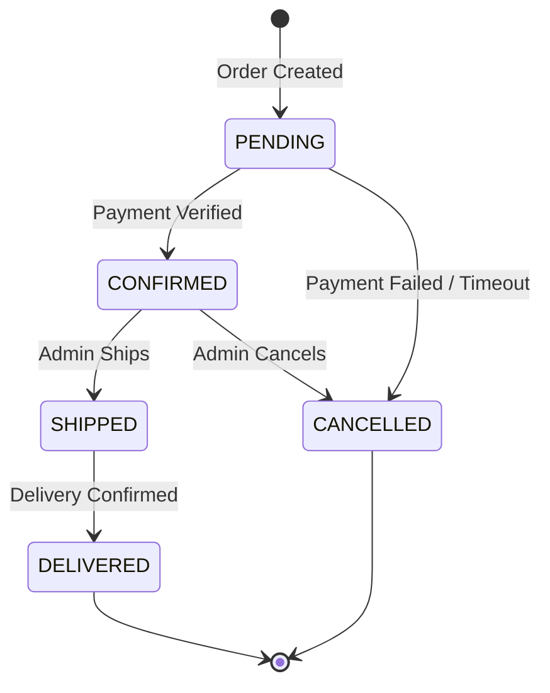

# Business Rules Document (BRD)

## BuildNest E-Commerce Platform

**Document ID:** BRD-BUILDNEST-001
**Version:** 2.0
**Date:** 2026-02-11
**Standard:** ISO/IEC/IEEE 29148:2018

---

## 1. Introduction

### 1.1 Purpose

This document catalogs all business rules governing the BuildNest E-Commerce Platform. Each rule is traceable to its implementing component and related functional requirements.

### 1.2 Rule Classification

| Category                     | Description                             |
| :--------------------------- | :-------------------------------------- |
| **Access Control (AC)**      | Who can do what, RBAC authorization     |
| **Operational (OP)**         | Business workflow and process rules     |
| **Data Validation (DV)**     | Input constraints and data integrity    |
| **Financial (FN)**           | Pricing, tax, payment, and refund rules |
| **Inventory (INV)**          | Stock management and threshold rules    |
| **Review & Engagement (RE)** | Customer review and wishlist rules      |
| **Notification (NT)**        | Alert and communication rules           |

---

## 2. Access Control Rules (AC)

| Rule ID   | Description                                                  | Enforcement | Implementing Component                            | SRS Req    |
| :-------- | :----------------------------------------------------------- | :---------- | :------------------------------------------------ | :--------- |
| **AC-01** | Only authenticated users may access `/api/user/**` endpoints | Strict      | `SecurityConfig` — `.hasAnyRole("USER", "ADMIN")` | FR-AUTH-04 |
| **AC-02** | Only ADMIN role may access `/api/admin/**` endpoints         | Strict      | `SecurityConfig` — `.hasRole("ADMIN")`            | FR-AUTH-09 |
| **AC-03** | Only ADMIN role may access `/actuator/**` (except health)    | Strict      | `SecurityConfig` — `.hasRole("ADMIN")`            | FR-MON-01  |
| **AC-04** | Users may only view/modify their own orders                  | Strict      | `OrderService` — ownership validation             | FR-CHK-06  |
| **AC-05** | Users may only modify their own reviews                      | Strict      | `ProductReviewService` — ownership check          | FR-REV-05  |
| **AC-06** | Users may only manage their own wishlist                     | Strict      | `WishlistService` — user ID check                 | FR-WISH-01 |
| **AC-07** | Users may only manage their own cart                         | Strict      | `CartService` — user ID validation                | FR-CART-01 |
| **AC-08** | Password reset links are single-use                          | Strict      | `PasswordResetToken.used` flag                    | FR-AUTH-11 |
| **AC-09** | JWT tokens expire after configured time                      | Strict      | `JwtProvider` — token TTL                         | FR-AUTH-03 |
| **AC-10** | Refresh tokens rotate on use (old invalidated)               | Strict      | `RefreshTokenService` — delete + create           | FR-AUTH-07 |

---

## 3. Operational Rules (OP)

| Rule ID   | Description                                                      | Enforcement | Implementing Component                                 | SRS Req    |
| :-------- | :--------------------------------------------------------------- | :---------- | :----------------------------------------------------- | :--------- |
| **OP-01** | Order status transitions follow the state machine (see §3.1)     | Strict      | `OrderService` — status validation                     | FR-CHK-01  |
| **OP-02** | Cart must not be empty to initiate checkout                      | Strict      | `CheckoutService` — throws `CartEmptyException`        | FR-CHK-02  |
| **OP-03** | Inventory must be reserved before order creation                 | Strict      | `CheckoutService` → `InventoryService.reserve()`       | FR-INV-03  |
| **OP-04** | Inventory reservation must be released on payment failure        | Strict      | `CheckoutService` — rollback logic                     | FR-CHK-05  |
| **OP-05** | Stock deduction occurs only after payment confirmation           | Strict      | `CheckoutService` → `InventoryService.deductStock()`   | FR-INV-04  |
| **OP-06** | Soft delete for users (set `is_deleted=true`, never hard delete) | Strict      | `AdminUserController` / `UserService`                  | FR-ADM-08  |
| **OP-07** | Soft delete for orders (set `is_deleted=true`)                   | Strict      | `AdminOrderController`                                 | FR-ADM-03  |
| **OP-08** | Concurrent inventory updates use optimistic locking              | Strict      | `Inventory.@Version` — `OptimisticLockException` retry | FR-INV-07  |
| **OP-09** | API V1 sunset: deprecated endpoints add `Sunset` header          | Warning     | `@ApiSunset` annotation, `ApiSunsetConfig`             | FR-PROD-05 |
| **OP-10** | Rate limiting on admin endpoints                                 | Strict      | `AdminRateLimitFilter`, `RateLimiterService`           | FR-AUTH-08 |

### 3.1 Order Status State Machine

---

## 4. Data Validation Rules (DV)

| Rule ID   | Field                           | Constraint                                            | Enforcement | Implementing Component                       | SRS Req    |
| :-------- | :------------------------------ | :---------------------------------------------------- | :---------- | :------------------------------------------- | :--------- |
| **DV-01** | `username`                      | Required, unique, 3-50 chars                          | Strict      | `User` entity + DB unique constraint         | FR-AUTH-05 |
| **DV-02** | `email`                         | Required, unique, valid format                        | Strict      | `User` entity + bean validation              | FR-AUTH-05 |
| **DV-03** | `password`                      | Min 8 chars, at least 1 uppercase, 1 digit, 1 special | Strict      | Custom password validator                    | FR-AUTH-10 |
| **DV-04** | `product.price`                 | Positive value (`> 0.00`)                             | Strict      | Product entity validation                    | FR-PROD-01 |
| **DV-05** | `product.sku`                   | Required, unique                                      | Strict      | `Product.sku` + DB unique constraint         | FR-PROD-01 |
| **DV-06** | `review.rating`                 | Integer 1-5 inclusive                                 | Strict      | `@Min(1) @Max(5)` on `ProductReview.rating`  | FR-REV-01  |
| **DV-07** | `review.comment`                | Max 2000 characters                                   | Strict      | `@Size(max=2000)` on `ProductReview.comment` | FR-REV-01  |
| **DV-08** | `cart.quantity`                 | Positive integer (≥ 1)                                | Strict      | `CartService` validation                     | FR-CART-01 |
| **DV-09** | `order.orderNumber`             | Auto-generated, unique                                | Strict      | `OrderService` + DB constraint               | FR-CHK-04  |
| **DV-10** | `inventory.quantityInStock`     | Non-negative integer (≥ 0)                            | Strict      | `Inventory` entity validation                | FR-INV-01  |
| **DV-11** | `inventory.minimumStockLevel`   | Required, non-negative                                | Strict      | `Inventory` entity                           | FR-INV-06  |
| **DV-12** | `webhookSubscription.targetUrl` | Valid URL, max 500 chars                              | Strict      | `WebhookSubscription` entity                 | FR-NOT-03  |
| **DV-13** | `address.*`                     | Required street, city, state, zip                     | Strict      | `Address` entity validation                  | FR-CHK-01  |

---

## 5. Financial Rules (FN)

| Rule ID   | Description                                                            | Enforcement | Implementing Component              | SRS Req    |
| :-------- | :--------------------------------------------------------------------- | :---------- | :---------------------------------- | :--------- |
| **FN-01** | Order total = Σ(item.unitPrice × quantity) + tax + shipping - discount | Strict      | `CheckoutService` calculation       | FR-CHK-01  |
| **FN-02** | Payment amount must match order total                                  | Strict      | `PaymentSignatureValidationService` | FR-PAY-02  |
| **FN-03** | Razorpay signature must be verified via HMAC-SHA256                    | Strict      | `PaymentSignatureValidationService` | FR-PAY-02  |
| **FN-04** | All monetary values stored as `DECIMAL` (2 decimal places)             | Strict      | Entity definitions                  | —          |
| **FN-05** | Cart total calculated dynamically (not cached)                         | Strict      | `CartService.getCartTotal()`        | FR-CART-05 |

---

## 6. Inventory Rules (INV)

| Rule ID    | Description                                                 | Enforcement | Implementing Component                                  | SRS Req   |
| :--------- | :---------------------------------------------------------- | :---------- | :------------------------------------------------------ | :-------- |
| **INV-01** | Available quantity = `quantityInStock - quantityReserved`   | Strict      | `Inventory.getAvailableQuantity()`                      | FR-INV-01 |
| **INV-02** | Cannot reserve more than available quantity                 | Strict      | `InventoryService.reserve()` throws exception           | FR-INV-03 |
| **INV-03** | Status transitions: `IN_STOCK → LOW_STOCK → OUT_OF_STOCK`   | Strict      | `InventoryService` / `InventoryMonitoringService`       | FR-INV-06 |
| **INV-04** | Low stock alert when `quantityInStock <= minimumStockLevel` | Strict      | `InventoryMonitoringScheduler` → `LowStockWarningEvent` | FR-INV-06 |
| **INV-05** | Threshold breach events recorded                            | Strict      | `InventoryThresholdBreachEvent` entity                  | FR-INV-06 |
| **INV-06** | Category-level threshold override supported                 | Warning     | `Inventory.useCategoryThreshold` flag                   | FR-INV-06 |
| **INV-07** | Restocking updates `lastRestocked` timestamp                | Strict      | `AdminInventoryController.addStock()`                   | FR-ADM-11 |

---

## 7. Review & Engagement Rules (RE)

| Rule ID   | Description                                                         | Enforcement | Implementing Component                                         | SRS Req    |
| :-------- | :------------------------------------------------------------------ | :---------- | :------------------------------------------------------------- | :--------- |
| **RE-01** | Rating must be between 1 and 5                                      | Strict      | `@Min(1) @Max(5)` validation                                   | FR-REV-01  |
| **RE-02** | Comment must not exceed 2000 characters                             | Strict      | `@Size(max=2000)` validation                                   | FR-REV-01  |
| **RE-03** | `verifiedPurchase` auto-set if user has completed order for product | Strict      | `ProductReviewService` — order history check                   | FR-REV-01  |
| **RE-04** | Helpful count increments atomically                                 | Strict      | `ProductReview.incrementHelpfulCount()`                        | FR-REV-04  |
| **RE-05** | Review visibility controlled by `isVisible` flag                    | Strict      | Admin can hide inappropriate reviews                           | FR-REV-05  |
| **RE-06** | One wishlist per user                                               | Strict      | `@UniqueConstraint(columnNames = "user_id")` on wishlist table | FR-WISH-01 |
| **RE-07** | Duplicate products in wishlist silently ignored (Set semantics)     | Warning     | `Set<Product>` in `Wishlist.products`                          | FR-WISH-01 |

---

## 8. Notification Rules (NT)

| Rule ID   | Description                                             | Enforcement | Implementing Component                        | SRS Req    |
| :-------- | :------------------------------------------------------ | :---------- | :-------------------------------------------- | :--------- |
| **NT-01** | Order confirmation email sent on `OrderPlacedEvent`     | Strict      | `DomainEventListener` → `NotificationService` | FR-NOT-01  |
| **NT-02** | Low stock alert sent to admin on `LowStockWarningEvent` | Strict      | `DomainEventListener` → `NotificationService` | FR-NOT-02  |
| **NT-03** | Password reset email contains time-limited token        | Strict      | `PasswordResetService` — 24h expiry           | FR-AUTH-11 |
| **NT-04** | Webhook subscriptions can be activated/deactivated      | Strict      | `WebhookAdminController` — `isActive` toggle  | FR-NOT-03  |
| **NT-05** | Failed webhook deliveries increment `failureCount`      | Strict      | `WebhookSubscription.failureCount`            | FR-NOT-04  |
| **NT-06** | Webhook auto-disabled after failure threshold breach    | Warning     | `WebhookService` — configurable threshold     | FR-NOT-05  |

---

## 9. Rule Summary and Compliance

| Category                | Total Rules | Strict | Warning |
| :---------------------- | :---------: | :----: | :-----: |
| **Access Control**      |     10      |   10   |    0    |
| **Operational**         |     10      |   9    |    1    |
| **Data Validation**     |     13      |   13   |    0    |
| **Financial**           |      5      |   5    |    0    |
| **Inventory**           |      7      |   6    |    1    |
| **Review & Engagement** |      7      |   6    |    1    |
| **Notification**        |      6      |   5    |    1    |
| **Total**               |   **58**    | **54** |  **4**  |

---

## 10. Revision History

| Version | Date       | Author       | Changes                                                                                                       |
| :------ | :--------- | :----------- | :------------------------------------------------------------------------------------------------------------ |
| 1.0     | 2026-02-10 | BuildNest BA | Initial — Auth, Order, basic inventory rules                                                                  |
| 2.0     | 2026-02-11 | BuildNest BA | Added Wishlist, Review, Webhook, Inventory threshold rules; order state machine; expanded from 25 to 58 rules |

---

**— End of Document —**
