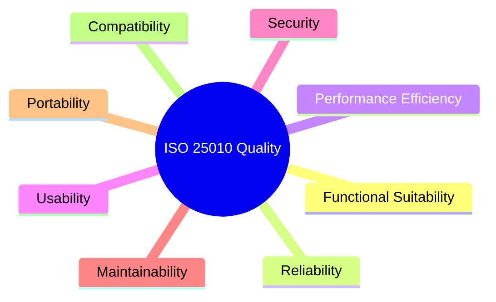

# Coding Standards Document

## BuildNest E-Commerce Platform

**Document ID:** CSD-BUILDNEST-001
**Version:** 1.0
**Date:** 2026-02-10
**Standard:** ISO/IEC 25010:2011 — Systems and Software Quality Requirements and Evaluation (SQuaRE)

---

## 1. Introduction

### 1.1 Purpose

This document defines the coding standards, conventions, and best practices for the **BuildNest E-Commerce Platform**. Each standard is mapped to the **ISO/IEC 25010:2011** quality characteristics to ensure that every coding practice directly contributes to measurable software quality.

### 1.2 ISO/IEC 25010 Quality Model



---

## 2. General Conventions

### 2.1 Naming Conventions

| Element              | Convention               | Example                 | Quality Attribute |
| :------------------- | :----------------------- | :---------------------- | :---------------- |
| **Java Classes**     | PascalCase               | `ProductService`        | Maintainability   |
| **Java Methods**     | camelCase, verb-first    | `findByEmail()`         | Maintainability   |
| **Java Constants**   | UPPER_SNAKE_CASE         | `MAX_RETRY_COUNT`       | Maintainability   |
| **Java Packages**    | lowercase, dot-separated | `com.buildnest.service` | Maintainability   |
| **React Components** | PascalCase               | `ProductCard.jsx`       | Maintainability   |
| **React Hooks**      | camelCase, `use` prefix  | `useCart()`             | Maintainability   |
| **CSS Classes**      | kebab-case               | `product-card-title`    | Usability         |
| **DB Tables**        | snake_case, plural       | `order_items`           | Maintainability   |
| **DB Columns**       | snake_case               | `created_at`            | Maintainability   |
| **REST Endpoints**   | kebab-case, plural nouns | `/api/products`         | Compatibility     |
| **Environment Vars** | UPPER_SNAKE_CASE         | `DB_PASSWORD`           | Portability       |

### 2.2 Formatting Rules

| Rule                    | Standard                                     | Quality Attribute |
| :---------------------- | :------------------------------------------- | :---------------- |
| **Indentation**         | 4 spaces (Java), 2 spaces (JS/JSX)           | Maintainability   |
| **Max Line Length**     | 120 characters                               | Maintainability   |
| **Braces**              | Same-line opening brace (K&R style)          | Maintainability   |
| **Imports**             | No wildcard imports (`*`); grouped by domain | Maintainability   |
| **Trailing Whitespace** | Prohibited                                   | Maintainability   |
| **File Encoding**       | UTF-8                                        | Portability       |
| **Line Endings**        | LF (`\n`) via `.gitattributes`               | Portability       |

### 2.3 Documentation Standards

| Rule                 | Standard                                                     | Quality Attribute |
| :------------------- | :----------------------------------------------------------- | :---------------- |
| **Public APIs**      | Must have Javadoc (`@param`, `@return`, `@throws`)           | Maintainability   |
| **Complex Logic**    | Inline `//` comments explaining _why_, not _what_            | Maintainability   |
| **React Components** | JSDoc on Props interface                                     | Maintainability   |
| **TODO/FIXME**       | Must include author and ticket ID: `// TODO(pradip): BN-123` | Maintainability   |

---

## 3. Java / Spring Boot Standards

### 3.1 Project Structure

```text
src/main/java/com/buildnest/
├── config/           # @Configuration classes only
├── controller/       # @RestController — thin, delegates to Service
├── service/          # Business logic interfaces + implementations
│   └── impl/         # @Service implementations
├── repository/       # @Repository — Spring Data JPA interfaces
├── model/
│   ├── entity/       # @Entity — JPA entities, no business logic
│   └── dto/          # Request/Response DTOs, immutable where possible
├── exception/        # @ControllerAdvice, custom exceptions
├── security/         # Filters, JWT provider, Security config
└── util/             # Stateless helper/utility classes
```

### 3.2 Class Design Rules

| Rule                      | Standard                                                                                         | Quality Attribute |
| :------------------------ | :----------------------------------------------------------------------------------------------- | :---------------- |
| **Single Responsibility** | Each class has one reason to change                                                              | Maintainability   |
| **Controller Thickness**  | Controllers only validate + delegate. No business logic.                                         | Maintainability   |
| **Service Interface**     | All services defined via interfaces (`ProductService` → `ProductServiceImpl`)                    | Maintainability   |
| **Entity Purity**         | `@Entity` classes contain only fields, JPA annotations, and `equals/hashCode`. No service calls. | Maintainability   |
| **DTO Separation**        | Never expose `@Entity` directly in API responses. Always map to DTO.                             | Security          |
| **Constructor Injection** | Use constructor injection (`@RequiredArgsConstructor`). Avoid `@Autowired` on fields.            | Maintainability   |

### 3.3 Exception Handling

| Rule                  | Standard                                                                              | Quality Attribute      |
| :-------------------- | :------------------------------------------------------------------------------------ | :--------------------- |
| **Global Handler**    | Use `@ControllerAdvice` for all exception mapping                                     | Reliability            |
| **Custom Exceptions** | Extend `RuntimeException` with meaningful names (`ProductNotFoundException`)          | Reliability            |
| **No Swallowing**     | Never use empty `catch {}` blocks                                                     | Reliability            |
| **HTTP Mapping**      | `404` for NotFound, `400` for Validation, `409` for Conflict, `500` for Server errors | Functional Suitability |
| **Logging**           | Log at `ERROR` for 5xx, `WARN` for 4xx business errors, `DEBUG` for trace-level       | Reliability            |

### 3.4 Logging Standards

| Rule                   | Standard                                                                      | Quality Attribute      |
| :--------------------- | :---------------------------------------------------------------------------- | :--------------------- |
| **Framework**          | SLF4J + Logback                                                               | Portability            |
| **Logger Declaration** | `@Slf4j` (Lombok) or `LoggerFactory.getLogger(ClassName.class)`               | Maintainability        |
| **Sensitive Data**     | Never log passwords, tokens, or PII                                           | Security               |
| **Structured Format**  | Use placeholders: `log.info("Order {} created for user {}", orderId, userId)` | Performance Efficiency |

---

## 4. React / Frontend Standards

### 4.1 Component Rules

| Rule                      | Standard                                                                     | Quality Attribute |
| :------------------------ | :--------------------------------------------------------------------------- | :---------------- |
| **Functional Components** | Always use functional components with hooks. No class components.            | Maintainability   |
| **File Naming**           | One component per file. Filename matches component name (`ProductCard.jsx`). | Maintainability   |
| **Props Destructuring**   | Destructure props in function signature: `function Card({ title, price })`   | Maintainability   |
| **Key Prop**              | Always use stable, unique `key` in lists. Never use array index.             | Reliability       |
| **Conditional Rendering** | Use ternary or `&&` short-circuit. No nested ternaries.                      | Maintainability   |

### 4.2 State Management

| Rule             | Standard                                                                    | Quality Attribute      |
| :--------------- | :-------------------------------------------------------------------------- | :--------------------- |
| **Local State**  | `useState` for component-scoped data                                        | Maintainability        |
| **Global State** | Context API for Auth/Cart. Redux Toolkit for complex state.                 | Maintainability        |
| **Side Effects** | All API calls inside `useEffect` with proper cleanup                        | Reliability            |
| **Memoization**  | Use `useMemo`/`useCallback` for expensive computations or stable references | Performance Efficiency |

### 4.3 API Integration

| Rule               | Standard                                                   | Quality Attribute |
| :----------------- | :--------------------------------------------------------- | :---------------- |
| **HTTP Client**    | Axios with centralized instance (`apiClient.js`)           | Maintainability   |
| **Interceptors**   | Auto-attach JWT token; auto-redirect on 401                | Security          |
| **Error Handling** | Global error interceptor with user-friendly toast messages | Reliability       |
| **Loading States** | Every API call must set `isLoading` state for UX feedback  | Usability         |

---

## 5. Database & SQL Standards

### 5.1 Schema Conventions

| Rule             | Standard                                                       | Quality Attribute      |
| :--------------- | :------------------------------------------------------------- | :--------------------- |
| **Table Names**  | Plural, snake_case (`users`, `order_items`)                    | Maintainability        |
| **Primary Keys** | `id BIGINT AUTO_INCREMENT`                                     | Maintainability        |
| **Foreign Keys** | Named `{referenced_table_singular}_id` (e.g., `user_id`)       | Maintainability        |
| **Timestamps**   | Every table includes `created_at` and `updated_at`             | Reliability            |
| **Soft Deletes** | Use `is_deleted BOOLEAN DEFAULT FALSE` instead of `DELETE`     | Reliability            |
| **Indexes**      | Add indexes on all foreign keys and frequently queried columns | Performance Efficiency |

### 5.2 Query Practices

| Rule               | Standard                                                             | Quality Attribute      |
| :----------------- | :------------------------------------------------------------------- | :--------------------- |
| **N+1 Prevention** | Use `@EntityGraph` or `JOIN FETCH` for related entities              | Performance Efficiency |
| **Pagination**     | All list endpoints must use `Pageable` (default page size: 20)       | Performance Efficiency |
| **Raw SQL**        | Avoid raw SQL. Use Spring Data JPA derived queries or `@Query` JPQL. | Security               |
| **Parameterized**  | Never concatenate user input into queries                            | Security               |

---

## 6. Quality Attribute Traceability Matrix

Mapping coding standards to ISO/IEC 25010:2011 quality characteristics.

| Quality Characteristic     | Coding Standards Applied                                                |
| :------------------------- | :---------------------------------------------------------------------- |
| **Functional Suitability** | HTTP status code mapping, validation annotations                        |
| **Reliability**            | Global exception handling, no swallowed exceptions, `key` prop          |
| **Performance Efficiency** | N+1 prevention, pagination, memoization, structured logging             |
| **Usability**              | Loading states, error toasts, self-documenting APIs                     |
| **Security**               | DTO separation, parameterized queries, no PII in logs, JWT interceptors |
| **Maintainability**        | Naming conventions, SRP, constructor injection, single file components  |
| **Portability**            | UTF-8 encoding, externalized config, SLF4J abstraction, LF line endings |
| **Compatibility**          | REST URI conventions, plural nouns, versioned APIs                      |

---

## 7. Code Review Checklist

Pre-merge verification criteria for Pull Requests.

- [ ] **Naming:** Do all new classes, methods, and variables follow naming conventions?
- [ ] **No Business Logic in Controllers:** Does the controller only validate and delegate?
- [ ] **DTO Used:** Are entities never directly exposed in API responses?
- [ ] **Exception Handling:** Are custom exceptions thrown (not generic `RuntimeException`)?
- [ ] **Logging:** Are log statements present for key operations? No PII logged?
- [ ] **Tests:** Are unit tests added for new service methods?
- [ ] **SQL:** No N+1 queries? Pagination used for list endpoints?
- [ ] **Security:** Input validated? No SQL injection vectors?
- [ ] **Formatting:** Code passes linter/formatter checks?
- [ ] **Documentation:** Public methods have Javadoc/JSDoc?

---

**— End of Document —**
