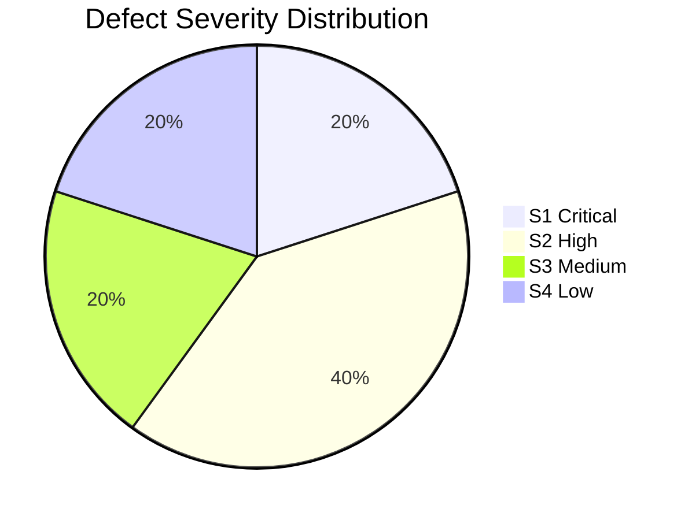
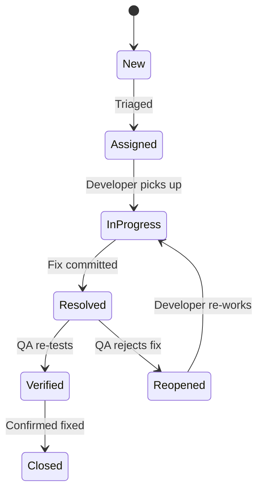

# Defect / Bug Report

## BuildNest E-Commerce Platform

**Document ID:** DBR-BUILDNEST-001
**Version:** 1.0
**Date:** 2026-02-10
**Standard:** ISO/IEC/IEEE 29119:2021 — Software Testing
**Reference:** [Test Execution Report (TER-BUILDNEST-001)](Test_Execution_Report_IEEE_29119.md)

---

## 1. Introduction

### 1.1 Purpose

This document provides the **formal defect register** for all defects discovered during Test Cycle 1 of the BuildNest E-Commerce Platform. Each defect is documented per ISO/IEC/IEEE 29119:2021 incident report format with full reproduction steps, root cause analysis, and resolution tracking.

### 1.2 Defect Summary Dashboard

| Metric            | Count |
| :---------------- | :---- |
| **Total Defects** | 5     |
| **Open**          | 3     |
| **Resolved**      | 1     |
| **Closed**        | 1     |
| **Critical (S1)** | 1     |
| **High (S2)**     | 2     |
| **Medium (S3)**   | 1     |
| **Low (S4)**      | 1     |



### 1.3 Defect Lifecycle



---

## 2. Defect Register

### DEF-001: Out-of-Stock Order Returns 500 Instead of 409

| Field           | Value                                                |
| :-------------- | :--------------------------------------------------- |
| **Defect ID**   | DEF-001                                              |
| **Title**       | Out-of-stock order returns 500 Internal Server Error |
| **Severity**    | S2 — High                                            |
| **Priority**    | P2 — High                                            |
| **Status**      | 🔴 Open                                              |
| **Reported By** | QA Engineer                                          |
| **Date Found**  | 2026-02-08                                           |
| **Test Case**   | [TC-ORD-002](Test_Case_Specification_IEEE_29119.md)  |
| **SRS Trace**   | FR-CHK-03                                            |
| **Environment** | Staging (K8s, Java 17, MySQL 8.0)                    |
| **Build**       | `v1.2.0-rc1`                                         |

**Steps to Reproduce:**

1. Seed product `USB-C Hub` (TD-PRD-03) with `stock_quantity = 0`.
2. Authenticate as `john.doe` (TD-USR-01).
3. Add product `USB-C Hub` to cart: `POST /api/cart/items {"productId":3,"quantity":1}`.
4. Place order: `POST /api/orders` with valid shipping address.

**Expected Result:**

- HTTP `409 Conflict`
- Response: `{"success":false,"message":"Insufficient stock for product: USB-C Hub"}`

**Actual Result:**

- HTTP `500 Internal Server Error`
- Response: Stack trace with `com.buildnest.exception.OutOfStockException`

**Root Cause:**
`OutOfStockException` is thrown by `InventoryService.deductStock()` but is not mapped in `GlobalExceptionHandler`. The exception propagates as an unhandled `RuntimeException`, resulting in a generic 500 response.

**Recommended Fix:**

```java
// Add to GlobalExceptionHandler.java
@ExceptionHandler(OutOfStockException.class)
@ResponseStatus(HttpStatus.CONFLICT)
public ApiResponse handleOutOfStock(OutOfStockException ex) {
    return ApiResponse.error(ex.getMessage());
}
```

---

### DEF-002: Payment Verification Failure Returns 500 Instead of 400

| Field           | Value                                                 |
| :-------------- | :---------------------------------------------------- |
| **Defect ID**   | DEF-002                                               |
| **Title**       | Invalid Razorpay signature returns 500 instead of 400 |
| **Severity**    | S2 — High                                             |
| **Priority**    | P2 — High                                             |
| **Status**      | 🔴 Open                                               |
| **Reported By** | QA Engineer                                           |
| **Date Found**  | 2026-02-09                                            |
| **Test Case**   | [TC-PAY-002](Test_Case_Specification_IEEE_29119.md)   |
| **SRS Trace**   | FR-PAY-02                                             |
| **Environment** | Staging                                               |
| **Build**       | `v1.2.0-rc1`                                          |

**Steps to Reproduce:**

1. Place an order with `john.doe` to get a valid `order_id`.
2. Send `POST /api/payments/verify` with tampered signature:
   ```json
   {
     "razorpay_payment_id": "pay_test_002",
     "razorpay_order_id": "order_test_002",
     "razorpay_signature": "tampered_signature_value"
   }
   ```

**Expected Result:**

- HTTP `400 Bad Request`
- Response: `{"success":false,"message":"Payment verification failed"}`

**Actual Result:**

- HTTP `500 Internal Server Error`
- `SignatureVerificationException` unhandled

**Root Cause:**
`PaymentService.verifyPayment()` throws `SignatureVerificationException` from the Razorpay SDK, but no handler exists in `GlobalExceptionHandler`.

**Recommended Fix:**

```java
@ExceptionHandler(SignatureVerificationException.class)
@ResponseStatus(HttpStatus.BAD_REQUEST)
public ApiResponse handlePaymentVerification(SignatureVerificationException ex) {
    log.warn("Payment verification failed: {}", ex.getMessage());
    return ApiResponse.error("Payment verification failed");
}
```

---

### DEF-003: Stored XSS in Product Review Comments (CRITICAL)

| Field           | Value                                               |
| :-------------- | :-------------------------------------------------- |
| **Defect ID**   | DEF-003                                             |
| **Title**       | Stored XSS vulnerability in product review comments |
| **Severity**    | **S1 — Critical**                                   |
| **Priority**    | **P1 — Immediate**                                  |
| **Status**      | 🔴 Open                                             |
| **Reported By** | Security Tester                                     |
| **Date Found**  | 2026-02-09                                          |
| **Test Case**   | [TC-SEC-002](Test_Case_Specification_IEEE_29119.md) |
| **SRS Trace**   | NFR-SEC-02                                          |
| **Environment** | Staging                                             |
| **Build**       | `v1.2.0-rc1`                                        |

**Steps to Reproduce:**

1. Authenticate as `john.doe`.
2. Submit a product review:
   ```
   POST /api/products/1/reviews
   {"rating": 5, "comment": "<script>alert(document.cookie)</script>"}
   ```
3. Navigate to the product page and view reviews.

**Expected Result:**

- Script tags stripped or HTML-escaped on storage.
- Review displays as plain text: `&lt;script&gt;alert(document.cookie)&lt;/script&gt;`

**Actual Result:**

- Script stored verbatim in `product_reviews.comment` column.
- Script executes when the review is rendered in the browser.

**Impact:**

- Attacker can steal session cookies of all users viewing the product.
- Potential for session hijacking and data theft.

**Root Cause:**
No input sanitization or output encoding applied to user-generated content in `ProductReviewService.createReview()`.

**Recommended Fix:**

1. **Input Sanitization:** Apply OWASP Java HTML Sanitizer on `comment` field before persistence.
2. **Output Encoding:** Ensure React rendering uses `{comment}` (auto-escaped) and never `dangerouslySetInnerHTML`.

```java
// Add dependency: com.googlecode.owasp-java-html-sanitizer
PolicyFactory policy = Sanitizers.FORMATTING.and(Sanitizers.LINKS);
String safeComment = policy.sanitize(rawComment);
```

---

### DEF-004: Incorrect Pagination Total Count

| Field             | Value                                                            |
| :---------------- | :--------------------------------------------------------------- |
| **Defect ID**     | DEF-004                                                          |
| **Title**         | Product listing returns incorrect `totalElements` after deletion |
| **Severity**      | S3 — Medium                                                      |
| **Priority**      | P3 — Normal                                                      |
| **Status**        | 🟢 Resolved                                                      |
| **Reported By**   | QA Engineer                                                      |
| **Date Found**    | 2026-02-07                                                       |
| **Date Resolved** | 2026-02-08                                                       |
| **Test Case**     | TC-PROD-001 (edge case)                                          |
| **SRS Trace**     | FR-PROD-01                                                       |

**Steps to Reproduce:**

1. Seed 100 products.
2. Soft-delete 5 products (`is_deleted = true`).
3. Send `GET /api/products?page=0&size=10`.

**Expected Result:**

- `totalElements = 95` (excludes soft-deleted).

**Actual Result:**

- `totalElements = 100` (includes soft-deleted).

**Root Cause:**
`ProductRepository.findAll()` did not include `WHERE is_deleted = false` filter.

**Resolution:**
Added `@Where(clause = "is_deleted = false")` annotation to `Product` entity. Verified in retest.

---

### DEF-005: Minor UI Alignment on Mobile Cart Page

| Field           | Value                                               |
| :-------------- | :-------------------------------------------------- |
| **Defect ID**   | DEF-005                                             |
| **Title**       | Cart quantity selector overflows on mobile viewport |
| **Severity**    | S4 — Low                                            |
| **Priority**    | P4 — Low                                            |
| **Status**      | 🟢 Closed                                           |
| **Reported By** | UAT Tester                                          |
| **Date Found**  | 2026-02-06                                          |
| **Date Closed** | 2026-02-07                                          |
| **Test Case**   | Exploratory testing                                 |

**Description:**
On viewports < 375px, the quantity increment/decrement buttons overflow outside the cart item card.

**Resolution:**
Applied CSS `flex-wrap: wrap` and `min-width: 0` to `.cart-item-controls`. Verified on iPhone SE viewport.

---

## 3. Defect Trend Analysis

| Date       | New | Resolved | Open (Cumulative) |
| :--------- | :-: | :------: | :---------------: |
| 2026-02-06 |  1  |    0     |         1         |
| 2026-02-07 |  1  |    1     |         1         |
| 2026-02-08 |  1  |    1     |         1         |
| 2026-02-09 |  2  |    0     |         3         |
| 2026-02-10 |  0  |    0     |         3         |

---

## 4. Release Recommendation

| Condition                     | Status                              |
| :---------------------------- | :---------------------------------- |
| 0 Critical defects open       | ❌ **DEF-003 is Critical and Open** |
| ≤ 2 High defects open         | ✅ 2 High (DEF-001, DEF-002)        |
| All resolved defects verified | ✅ DEF-004, DEF-005 verified        |

> **Recommendation:** **Do NOT release** until DEF-003 (Stored XSS) is resolved and verified. DEF-001 and DEF-002 should also be fixed as they expose stack traces to end users.

---

**— End of Document —**
