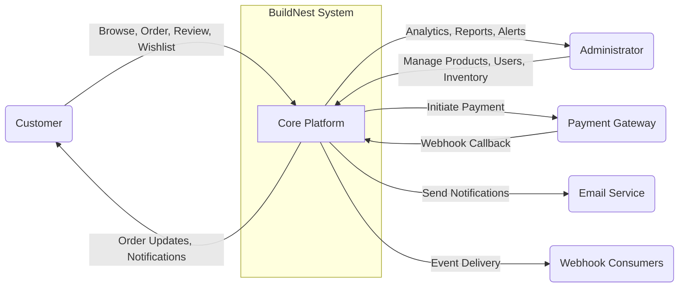
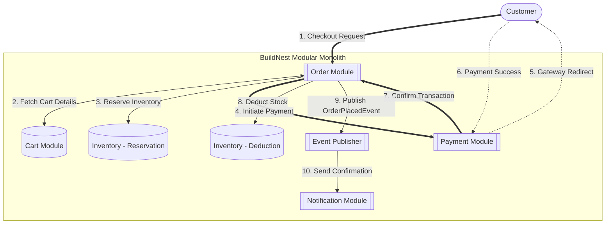
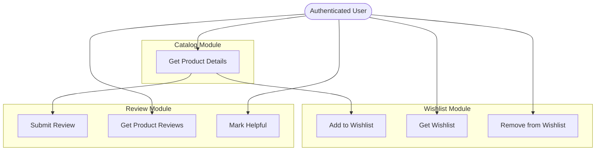
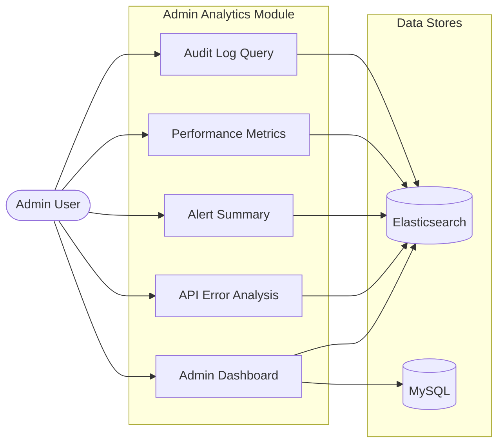

# High-Level Design (HLD) Document

## BuildNest E-Commerce Platform

**Document ID:** HLD-BUILDNEST-001
**Version:** 2.0
**Date:** 2026-02-11
**Standard:** Aligned with ISO/IEC/IEEE 42010:2022 principles

---

## 1. Introduction

### 1.1 Purpose

The purpose of this High-Level Design (HLD) document is to provide a functional and data-centric breakdown of the **BuildNest E-Commerce Platform**. It bridges the gap between the architectural decisions ([SAD](Software_Architecture_Document_IEEE_42010.md)) and the detailed class interactions ([SDD](SDD_IEEE_1016_2017.md)) by defining the **System Decomposition**, **Data Flow**, and **Data Architecture**.

### 1.2 Scope

This document covers:

1. **System Decomposition:** Breakdown of the system into 12 functional modules.
2. **Data Architecture:** High-level Entity-Relationship (ER) model covering all 17 entities and data retention policies.
3. **Functional Architecture:** Data Flow Diagrams (DFD) illustrating information movement across all major flows.
4. **Interface Strategy:** Standard API response envelopes, error handling, and versioning strategy.

---

## 2. System Decomposition

The system is decomposed into **12 core modules**, all hosted within the modular monolith structure.

| Module                          | Responsibility                                                                     | Key Components                                                                                                                            |
| :------------------------------ | :--------------------------------------------------------------------------------- | :---------------------------------------------------------------------------------------------------------------------------------------- |
| **Auth Module**                 | Identity management, RBAC, JWT token generation/validation, refresh token rotation | `AuthController`, `AuthService`, `JwtProvider`, `JwtAuthenticationFilter`                                                                 |
| **Password Module**             | Password reset via email token, change password with old password verification     | `PasswordResetController`, `PasswordResetService`, `PasswordResetToken`                                                                   |
| **Catalog Module**              | Product CRUD, category management, search, API versioning (V1→V2 with sunset)      | `ProductControllerV1/V2`, `ProductService`, `CategoryService`                                                                             |
| **Cart Module**                 | Shopping cart sessions, add/remove items, quantity update, total calculation       | `CartController`, `CartService`, `Cart`, `CartItem`                                                                                       |
| **Checkout & Order Module**     | Order creation from cart, status lifecycle, user order history                     | `CheckoutController`, `UserOrderController`, `CheckoutService`, `OrderService`                                                            |
| **Payment Module**              | Razorpay integration, payment signature validation, webhook processing             | `PaymentService`, `PaymentSignatureValidationService`                                                                                     |
| **Inventory Module**            | Stock tracking, reservation during checkout, threshold monitoring, reporting       | `AdminInventoryController`, `InventoryService`, `InventoryMonitoringService`, `InventoryAnalyticsService`, `InventoryReportService`       |
| **Wishlist Module**             | User product favorites — add, remove, check, clear, count                          | `WishlistController`, `WishlistService`, `Wishlist`                                                                                       |
| **Review Module**               | Product ratings (1-5), text reviews, helpful votes, verified purchase tracking     | `ProductReviewController`, `ProductReviewService`, `ProductReview`                                                                        |
| **Admin Module**                | Product/Order/User/Inventory/Analytics/Report management for admins                | `AdminProductController`, `AdminOrderController`, `AdminUserController`, `AdminAnalyticsController`, `AdminInventoryController`, + 5 more |
| **Monitoring Module**           | Performance metrics, connection pool monitoring, custom health indicators          | `PerformanceMetricsController`, `PoolMetricsController`, `DatabaseHealthIndicator`, `RedisHealthIndicator`                                |
| **Notification & Event Module** | Domain event publishing/listening, email notifications, webhook delivery           | `DomainEventPublisher`, `DomainEventListener`, `NotificationService`, `WebhookAdminController`                                            |

---

## 3. Data Architecture

### 3.1 High-Level ER Diagram (ERD)

The following Conceptual Data Model illustrates all **17 entities** and their relationships.

```mermaid
erDiagram
    Users ||--o{ Orders : "places"
    Users ||--|| Carts : "has"
    Users ||--o{ Addresses : "manages"
    Users }o--o{ Roles : "assigned via user_roles"
    Roles }o--o{ Permissions : "granted via role_permissions"
    Users ||--o| Wishlist : "has"
    Users ||--o{ ProductReviews : "writes"
    Users ||--o{ RefreshTokens : "has"
    Users ||--o{ PasswordResetTokens : "requests"
    Users ||--o{ AuditLogs : "generates"

    Carts ||--|{ CartItems : "contains"
    CartItems }|--|| Products : "references"

    Orders ||--|{ OrderItems : "contains"
    Orders ||--o| Payments : "initiates"
    Orders ||--o| Addresses : "ships to"
    OrderItems }|--|| Products : "references"

    Products }|--|| Categories : "belongs to"
    Products ||--|| Inventory : "has stock"
    Products ||--o{ ProductReviews : "receives"
    Wishlist }o--o{ Products : "contains via wishlist_products"

    Inventory ||--o{ InventoryThresholdBreachEvents : "triggers"

    WebhookSubscriptions ||--|| WebhookSubscriptions : "standalone"

    Users {
        BIGINT id PK
        VARCHAR username UK
        VARCHAR email UK
        VARCHAR password
        VARCHAR first_name
        VARCHAR last_name
        VARCHAR phone_number
        BOOLEAN is_active
        BOOLEAN is_deleted
        DATETIME last_login
        DATETIME created_at
        DATETIME updated_at
    }

    Products {
        BIGINT id PK
        VARCHAR name
        TEXT description
        DECIMAL price
        DECIMAL discount_price
        INT stock_quantity
        VARCHAR sku UK
        BIGINT category_id FK
        VARCHAR image_url
        DATE expiry_date
        BOOLEAN is_active
        DATETIME created_at
    }

    Orders {
        BIGINT id PK
        VARCHAR order_number UK
        DECIMAL total_amount
        DECIMAL discount_amount
        DECIMAL tax_amount
        DECIMAL shipping_amount
        VARCHAR status
        VARCHAR tracking_number
        BIGINT user_id FK
        BIGINT shipping_address_id FK
        BOOLEAN is_deleted
        DATETIME created_at
    }

    ProductReviews {
        BIGINT id PK
        BIGINT product_id FK
        BIGINT user_id FK
        INT rating
        VARCHAR comment
        INT helpful_count
        BOOLEAN verified_purchase
        BOOLEAN is_visible
        DATETIME created_at
    }

    Wishlist {
        BIGINT id PK
        BIGINT user_id FK UK
        DATETIME created_at
        DATETIME updated_at
    }

    Inventory {
        BIGINT id PK
        BIGINT product_id FK
        INT quantity_in_stock
        INT quantity_reserved
        INT minimum_stock_level
        BOOLEAN use_category_threshold
        VARCHAR status
        BIGINT version
        DATETIME last_restocked
    }

    WebhookSubscriptions {
        BIGINT id PK
        VARCHAR event_type
        VARCHAR target_url
        VARCHAR secret
        BOOLEAN is_active
        INT failure_count
        VARCHAR last_delivery_status
        DATETIME created_at
    }
```

### 3.2 Entity Summary Table

|  #  | Entity                          | Table Name                         | Relationships                                                 | Key Constraints                                  |
| :-: | :------------------------------ | :--------------------------------- | :------------------------------------------------------------ | :----------------------------------------------- |
|  1  | `User`                          | `users`                            | → Orders, Cart, Wishlist, Reviews, Addresses, Roles           | `username` UK, `email` UK                        |
|  2  | `Role`                          | `roles`                            | ↔ Users (M:N via `user_roles`), ↔ Permissions                 | —                                                |
|  3  | `Permission`                    | `permissions`                      | ↔ Roles (M:N via `role_permissions`)                          | —                                                |
|  4  | `Address`                       | `addresses`                        | → User                                                        | —                                                |
|  5  | `Product`                       | `products`                         | → Category, → Inventory, ← CartItems, ← OrderItems, ← Reviews | `sku` UK                                         |
|  6  | `Category`                      | `categories`                       | ← Products                                                    | —                                                |
|  7  | `Cart`                          | `carts`                            | → User, → CartItems                                           | —                                                |
|  8  | `CartItem`                      | `cart_items`                       | → Cart, → Product                                             | —                                                |
|  9  | `Order`                         | `orders`                           | → User, → Address, → OrderItems, → Payment                    | `order_number` UK                                |
| 10  | `OrderItem`                     | `order_items`                      | → Order, → Product                                            | —                                                |
| 11  | `Payment`                       | `payments`                         | → Order                                                       | —                                                |
| 12  | `Inventory`                     | `inventory`                        | → Product (1:1), → ThresholdBreachEvents                      | Optimistic locking (`@Version`)                  |
| 13  | `InventoryThresholdBreachEvent` | `inventory_threshold_breach_event` | → Inventory                                                   | —                                                |
| 14  | `Wishlist`                      | `wishlist`                         | → User (1:1), ↔ Products (M:N via `wishlist_products`)        | `user_id` UK                                     |
| 15  | `ProductReview`                 | `product_review`                   | → Product, → User                                             | Indexed: product_id, user_id, rating, created_at |
| 16  | `WebhookSubscription`           | `webhook_subscription`             | Standalone                                                    | —                                                |
| 17  | `AuditLog`                      | `audit_log`                        | → User (by user_id)                                           | —                                                |
|  —  | `RefreshToken`                  | `refresh_tokens`                   | → User                                                        | —                                                |
|  —  | `PasswordResetToken`            | `password_reset_tokens`            | → User                                                        | —                                                |
|  —  | `ElasticsearchAuditLog`         | ES index                           | N/A (document store)                                          | —                                                |
|  —  | `ElasticsearchMetrics`          | ES index                           | N/A (document store)                                          | —                                                |

### 3.3 Data Retention Policy

| Data Type                      | Retention Period | Action after Expiry                                |
| :----------------------------- | :--------------- | :------------------------------------------------- |
| **User Accounts**              | Indefinite       | Soft-deleted (`is_deleted=true`, `deleted_at` set) |
| **Order History**              | 7 Years          | Archived to cold storage for audit/tax             |
| **Audit Logs (MySQL)**         | 1 Year           | Deleted                                            |
| **Audit Logs (Elasticsearch)** | 90 Days          | Index lifecycle management                         |
| **Cart Sessions**              | 30 Days          | Purged via scheduled job                           |
| **Refresh Tokens**             | 30 Days          | Cleaned by `TokenCleanupScheduler`                 |
| **Password Reset Tokens**      | 24 Hours         | Expire automatically, cleaned by scheduler         |
| **Performance Metrics (ES)**   | 30 Days          | Index rotation                                     |

---

## 4. Functional Architecture (Data Flow)

### 4.1 DFD Level 0: Context Diagram



### 4.2 DFD Level 1: Order Processing Flow



### 4.3 DFD Level 1: Review & Wishlist Flow



### 4.4 DFD Level 1: Admin Analytics Flow



---

## 5. Interface Design Strategy

### 5.1 API Response Envelope

All REST APIs return a standardized JSON envelope for consistent client handling.

**Success Response:**

```json
{
  "success": true,
  "message": "Operation completed successfully.",
  "data": {}
}
```

**Error Response:**

```json
{
  "success": false,
  "message": "Invalid input data.",
  "error_code": "VAL-001",
  "errors": [{ "field": "email", "message": "Email format is invalid." }]
}
```

### 5.2 API Versioning Strategy

| Version | Path               | Status         | Sunset Date                   | Controller            |
| :------ | :----------------- | :------------- | :---------------------------- | :-------------------- |
| V1      | `/api/v1/products` | **Deprecated** | Configurable via `@ApiSunset` | `ProductControllerV1` |
| V2      | `/api/v2/products` | **Active**     | —                             | `ProductControllerV2` |

The `@ApiSunset` custom annotation adds `Sunset` and `Deprecation` HTTP headers to V1 responses.

### 5.3 Controller Endpoint Summary

| Area       | Controllers | Total Endpoints |
| :--------- | :---------: | :-------------: |
| Admin      |     14      |      ~40+       |
| Auth       |      2      |       ~8        |
| User       |      8      |      ~25+       |
| Monitoring |      2      |       ~5        |
| Public     |      1      |       ~2        |
| Inventory  |      1      |       ~3        |
| **Total**  |   **28**    |    **~83+**     |

### 5.4 External Interfaces (Related to [SRS §3.2.5](SRS_IEEE_29148_2018.md))

**Razorpay Integration Strategy:**

1. **Order Creation:** Backend generates Razorpay Order ID.
2. **Client Checkout:** Frontend opens Razorpay modal with `order_id`.
3. **Payment Capture:** Razorpay processes payment.
4. **Verification:** Backend verifies `payment_id` + `signature` via `PaymentSignatureValidationService`.

**Webhook System:**

1. Admins register webhook subscriptions via `WebhookAdminController`.
2. Domain events trigger delivery to target URLs.
3. Retry logic with failure counting and auto-disable on threshold breach.

---

## 6. Traceability

| Module                          | SRS Requirements         |
| :------------------------------ | :----------------------- |
| **Auth Module**                 | FR-AUTH-01 to FR-AUTH-11 |
| **Password Module**             | FR-AUTH-09 to FR-AUTH-11 |
| **Catalog Module**              | FR-PROD-01 to FR-PROD-07 |
| **Cart Module**                 | FR-CART-01 to FR-CART-06 |
| **Checkout & Order Module**     | FR-CHK-01 to FR-CHK-08   |
| **Payment Module**              | FR-PAY-01 to FR-PAY-05   |
| **Inventory Module**            | FR-INV-01 to FR-INV-07   |
| **Wishlist Module**             | FR-WISH-01 to FR-WISH-05 |
| **Review Module**               | FR-REV-01 to FR-REV-05   |
| **Admin Module**                | FR-ADM-01 to FR-ADM-12   |
| **Monitoring Module**           | FR-MON-01 to FR-MON-08   |
| **Notification & Event Module** | FR-NOT-01 to FR-NOT-05   |

---

## 7. Revision History

| Version | Date       | Author         | Changes                                                                                                                                 |
| :------ | :--------- | :------------- | :-------------------------------------------------------------------------------------------------------------------------------------- |
| 1.0     | 2026-02-10 | BuildNest Arch | Initial draft — 6 modules                                                                                                               |
| 2.0     | 2026-02-11 | BuildNest Arch | Exhaustive update — 12 modules, 17+ entities in ERD, DFDs for Review/Wishlist/Analytics, webhook system, API versioning, data retention |

---

**— End of Document —**
