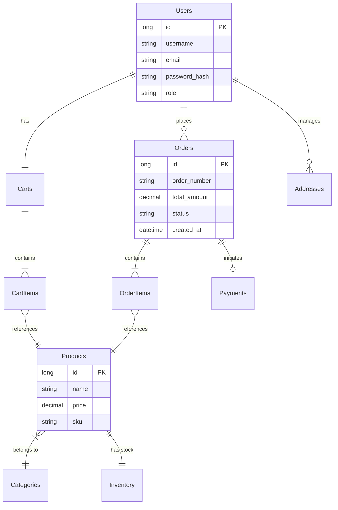
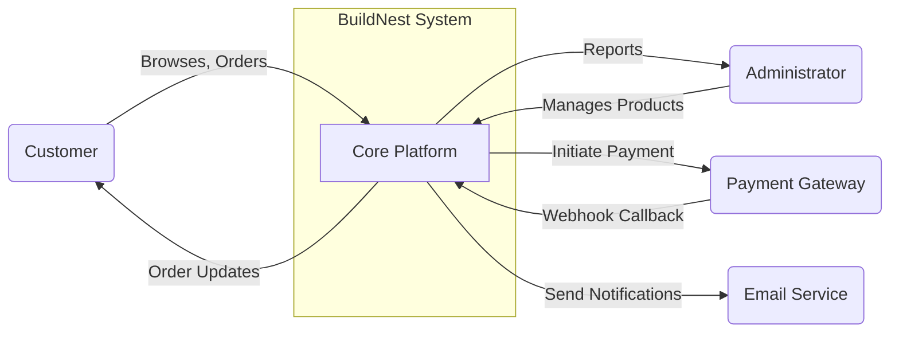
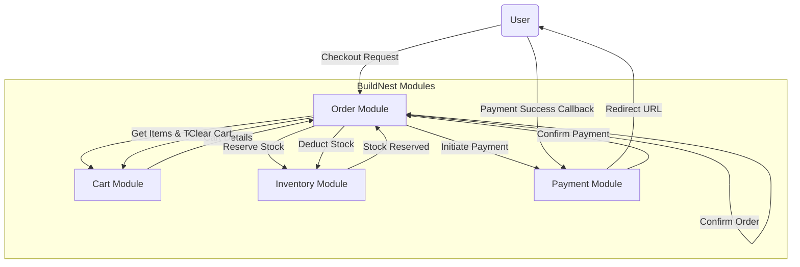

# High-Level Design (HLD) Document

## BuildNest E-Commerce Platform

**Document ID:** HLD-BUILDNEST-001
**Version:** 1.0
**Date:** 2026-02-10
**Standard:** Aligned with ISO/IEC/IEEE 42010:2022 principles

---

## 1. Introduction

### 1.1 Purpose

The purpose of this High-Level Design (HLD) document is to provide a functional and data-centric breakdown of the **BuildNest E-Commerce Platform**. It bridges the gap between the architectural decisions (SAD) and the detailed class interactions (SDD) by defining the **System Decomposition**, **Data Flow**, and **Data Architecture**.

### 1.2 Scope

This document covers:

1.  **System Decomposition:** Breakdown of the system into functional modules.
2.  **Data Architecture:** High-level Entity-Relationship (ER) model and data retention policies.
3.  **Functional Architecture:** Data Flow Diagrams (DFD) illustrating information movement.
4.  **Interface Strategy:** Standard API response envelopes and error handling.

---

## 2. System Decomposition

The system is decomposed into the following core functional modules, all hosted within the modular monolith structure.

| Module               | Responsibility                                                                      | Key Components                                              |
| :------------------- | :---------------------------------------------------------------------------------- | :---------------------------------------------------------- |
| **Auth Module**      | Identity management, Role-Based Access Control (RBAC), Token generation/validation. | `AuthController`, `JwtProvider`, `UserService`              |
| **Catalog Module**   | Product management, Categories, Price tracking, Inventory checking.                 | `ProductController`, `CategoryService`, `ProductRepository` |
| **Cart Module**      | Managing user shopping sessions, adding/removing items, price calculation.          | `CartController`, `CartService`                             |
| **Order Module**     | Order lifecycle management (Creation -> Payment -> Shipping -> Delivery).           | `OrderController`, `OrderService`, `OrderRepository`        |
| **Payment Module**   | Integration with Payment Gateway (Razorpay), transaction recording, refunds.        | `PaymentController`, `RazorpayAdapter`                      |
| **Inventory Module** | Stock tracking, reservation during checkout, deduction upon payment.                | `InventoryService`, `StockRepository`                       |

---

## 3. Data Architecture

### 3.1 High-Level ER Diagram (ERD)

The following Conceptual Data Model illustrates the core entities and their relationships.



### 3.2 Data Retention Policy

| Data Type         | Retention Period | Action after Expiry                                  |
| :---------------- | :--------------- | :--------------------------------------------------- |
| **User Accounts** | Indefinite       | Anonymized upon request (GDPR/DPDP compliance).      |
| **Order History** | 7 Years          | A rchived to cold storage for audit/tax purposes.    |
| **Audit Logs**    | 1 Year           | Deleted.                                             |
| **Cart Sessions** | 30 Days          | Identify inactive carts and purge via scheduled job. |

---

## 4. Functional Architecture (Data Flow)

### 4.1 DFD Level 0: Context Diagram

Illustrates the system boundary and interactions with external entities.



### 4.2 DFD Level 1: Order Processing Flow

Illustrates the internal data flow specifically for the Order Placement process.



---

## 5. Interface Design Strategy

### 5.1 API Response Envelope

All REST APIs shall return a standardized JSON envelope to ensure consistent CLIENT handling.

**Success Response:**

```json
{
  "success": true,
  "message": "Operation completed successfully.",
  "data": { ... } // Payload
}
```

**Error Response:**

```json
{
  "success": false,
  "message": "Invalid input data.",
  "error_code": "VAL-001",
  "errors": [{ "field": "email", "message": "Email format is invalid." }]
}
```

### 5.2 External Interfaces related to [SRS (§3.2.5)](SRS_IEEE_29148_2018.md#325-payment-processing-fg-05)

**Razorpay Integration Strategy:**

1.  **Order Creation:** Backend generates a Razorpay Order ID (`order_...`).
2.  **Client Checkout:** Frontend opens Razorpay modal with `order_id`.
3.  **Payment Capture:** Razorpay processes payment.
4.  **Verification:** Backend receives `payment_id` and `signature` to verify authenticity before updating Order Status.

---

## 6. Traceability

Mapping HLD Modules to SRS Requirements.

| Module               | SRS Requirements           |
| :------------------- | :------------------------- |
| **Auth Module**      | [FR-AUTH-01 to FR-AUTH-11] |
| **Catalog Module**   | [FR-PROD-01 to FR-PROD-07] |
| **Cart Module**      | [FR-CART-01 to FR-CART-06] |
| **Order Module**     | [FR-CHK-01 to FR-CHK-08]   |
| **Payment Module**   | [FR-PAY-01 to FR-PAY-05]   |
| **Inventory Module** | [FR-INV-01 to FR-INV-07]   |

---

**— End of Document —**
