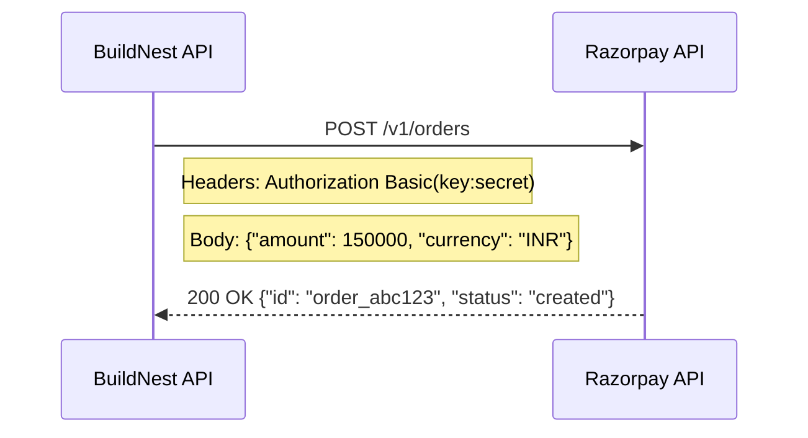

# Interface Control Document (ICD)

## BuildNest E-Commerce Platform

**Document ID:** ICD-BUILDNEST-001
**Version:** 1.0
**Date:** 2026-02-10
**Standard:** Aligned with ISO/IEC/IEEE 42010:2022 principles

---

## 1. Introduction

### 1.1 Purpose

The purpose of this Interface Control Document (ICD) is to formally define and catalog **every interface boundary** within the BuildNest platform. It specifies the protocol, data format, authentication mechanism, and error handling for each interface, serving as the definitive contract between communicating components.

### 1.2 Scope

This document covers three categories of interfaces:

1.  **Internal Interfaces:** Module-to-module communication within the monolith.
2.  **External Interfaces:** Integrations with third-party services (Razorpay, SMTP).
3.  **Infrastructure Interfaces:** Connections to data stores (MySQL, Redis, Elasticsearch).

---

## 2. Interface Catalog

Master registry of all system interfaces.

| ID            | Interface Name                | Type           | Protocol           | Source        | Destination       | Auth                    |
| :------------ | :---------------------------- | :------------- | :----------------- | :------------ | :---------------- | :---------------------- |
| **IF-INT-01** | Auth Token Validation         | Internal       | Method Call        | Any Module    | Auth Service      | N/A (Internal)          |
| **IF-INT-02** | Cart-to-Checkout Handoff      | Internal       | Method Call        | Cart Service  | Order Service     | N/A (Internal)          |
| **IF-INT-03** | Order-to-Inventory Deduction  | Internal       | Method Call        | Order Service | Inventory Service | N/A (Internal)          |
| **IF-INT-04** | Event Publishing              | Internal       | Spring Event Bus   | Order Service | Event Listeners   | N/A (Internal)          |
| **IF-EXT-01** | Razorpay Order Creation       | External       | HTTPS/REST         | Backend API   | Razorpay API      | API Key + Secret        |
| **IF-EXT-02** | Razorpay Payment Verification | External       | HTTPS/REST         | Backend API   | Razorpay API      | Signature (HMAC-SHA256) |
| **IF-EXT-03** | Razorpay Webhook              | External       | HTTPS/POST         | Razorpay      | Backend API       | Webhook Secret          |
| **IF-EXT-04** | Email Notification            | External       | SMTP/TLS           | Backend API   | SMTP Server       | Username + Password     |
| **IF-INF-01** | MySQL Database                | Infrastructure | JDBC/TCP           | Backend API   | MySQL Server      | Username + Password     |
| **IF-INF-02** | Redis Cache                   | Infrastructure | Redis Protocol/TCP | Backend API   | Redis Server      | Password (optional)     |
| **IF-INF-03** | Elasticsearch                 | Infrastructure | HTTPS/REST         | Backend API   | ES Cluster        | API Key / Basic Auth    |
| **IF-INF-04** | Frontend-to-Backend API       | Infrastructure | HTTPS/REST         | React SPA     | Backend API       | JWT Bearer Token        |

---

## 3. Internal Interfaces

### 3.1 IF-INT-01: Auth Token Validation

All secured endpoints depend on the Auth module for identity verification.

| Attribute          | Value                                                               |
| :----------------- | :------------------------------------------------------------------ |
| **Caller**         | `JwtAuthenticationFilter` (intercepts every request)                |
| **Provider**       | `JwtTokenProvider.validateToken(String token)`                      |
| **Input**          | JWT Access Token (from `Authorization: Bearer <token>` header)      |
| **Output**         | `UserDetails` object (username, roles) or `AuthenticationException` |
| **Error Handling** | Returns HTTP `401 Unauthorized` with JSON error body                |

### 3.2 IF-INT-02: Cart-to-Checkout Handoff

When a user initiates checkout, the Cart module provides the current cart state to the Order module.

| Attribute          | Value                                                                       |
| :----------------- | :-------------------------------------------------------------------------- |
| **Caller**         | `OrderService.placeOrder()`                                                 |
| **Provider**       | `CartService.getCartByUser(Long userId)`                                    |
| **Input**          | Authenticated User ID                                                       |
| **Output**         | `CartDTO` containing list of `CartItemDTO` (productId, quantity, unitPrice) |
| **Error Handling** | Throws `CartEmptyException` if cart has no items                            |

### 3.3 IF-INT-03: Order-to-Inventory Deduction

After successful payment, the Order module instructs Inventory to deduct stock.

| Attribute       | Value                                                        |
| :-------------- | :----------------------------------------------------------- |
| **Caller**      | `OrderService.confirmOrder()`                                |
| **Provider**    | `InventoryService.deductStock(Long productId, int quantity)` |
| **Input**       | Product ID, Quantity to deduct                               |
| **Output**      | `void` (success) or `OutOfStockException`                    |
| **Concurrency** | Uses `SELECT ... FOR UPDATE` row-level locking               |

### 3.4 IF-INT-04: Async Event Publishing

Decoupled notification of domain events.

| Attribute       | Value                                                                |
| :-------------- | :------------------------------------------------------------------- |
| **Publisher**   | `OrderService` (via `ApplicationEventPublisher`)                     |
| **Subscribers** | `InventoryEventListener`, `NotificationEventListener`                |
| **Event Types** | `OrderCreatedEvent`, `PaymentConfirmedEvent`, `LowStockWarningEvent` |
| **Delivery**    | In-process, Async (`@Async` thread pool)                             |

---

## 4. External Interfaces

### 4.1 IF-EXT-01: Razorpay Order Creation

| Attribute       | Value                                                                   |
| :-------------- | :---------------------------------------------------------------------- |
| **Endpoint**    | `https://api.razorpay.com/v1/orders`                                    |
| **Method**      | `POST`                                                                  |
| **Auth**        | HTTP Basic Auth (`key_id` : `key_secret`)                               |
| **Request**     | `{ "amount": <paise>, "currency": "INR", "receipt": "<order_number>" }` |
| **Response**    | `{ "id": "order_...", "amount": ..., "status": "created" }`             |
| **Error Codes** | `400` (Bad Request), `401` (Unauthorized)                               |

### 4.2 IF-EXT-02: Razorpay Payment Verification

| Attribute        | Value                                                                                      |
| :--------------- | :----------------------------------------------------------------------------------------- | ------------------------ |
| **Trigger**      | Frontend sends `razorpay_payment_id`, `razorpay_order_id`, `razorpay_signature` to backend |
| **Verification** | Backend computes `HMAC-SHA256(order_id + "                                                 | " + payment_id, secret)` |
| **Match**        | If computed signature == received signature → Payment is authentic                         |
| **Failure**      | Throws `PaymentVerificationException`, Order remains `PENDING`                             |

### 4.3 IF-EXT-04: Email Notification (SMTP)

| Attribute    | Value                                       |
| :----------- | :------------------------------------------ |
| **Protocol** | SMTP over TLS (Port 587)                    |
| **Provider** | Configurable (Gmail, SendGrid, AWS SES)     |
| **Trigger**  | `OrderConfirmedEvent`, `PasswordResetEvent` |
| **Library**  | Spring `JavaMailSender`                     |

---

## 5. Infrastructure Interfaces

### 5.1 IF-INF-01: MySQL Database

| Attribute           | Value                                         |
| :------------------ | :-------------------------------------------- |
| **Protocol**        | JDBC over TCP (Port 3306)                     |
| **Driver**          | `com.mysql.cj.jdbc.Driver`                    |
| **Connection Pool** | HikariCP (Max: 20, Min-Idle: 5, Timeout: 30s) |
| **ORM**             | Spring Data JPA / Hibernate                   |
| **Schema**          | `buildnest_db`                                |

### 5.2 IF-INF-02: Redis Cache

| Attribute         | Value                                           |
| :---------------- | :---------------------------------------------- |
| **Protocol**      | Redis Protocol over TCP (Port 6379)             |
| **Client**        | Lettuce (Spring Data Redis default)             |
| **Key Patterns**  | `product:view:{id}`, `auth:refresh:{username}`  |
| **Serialization** | JSON (`GenericJackson2JsonRedisSerializer`)     |
| **Default TTL**   | 1 Hour (Product Cache), 30 Days (Refresh Token) |

### 5.3 IF-INF-03: Elasticsearch

| Attribute      | Value                                               |
| :------------- | :-------------------------------------------------- |
| **Protocol**   | HTTPS/REST (Port 9200)                              |
| **Client**     | `RestHighLevelClient` (Elasticsearch Java API)      |
| **Index**      | `buildnest-products`                                |
| **Operations** | Full-text search, Product indexing on create/update |

### 5.4 IF-INF-04: Frontend-to-Backend API

| Attribute        | Value                                                             |
| :--------------- | :---------------------------------------------------------------- |
| **Protocol**     | HTTPS/REST (Port 443 / 8080 dev)                                  |
| **Client**       | Axios (React SPA)                                                 |
| **Auth**         | JWT Bearer Token in `Authorization` header                        |
| **CORS**         | Allowed Origins: `https://buildnest.com`, `http://localhost:3000` |
| **Content-Type** | `application/json`                                                |

---

## 6. Interface Interaction Matrix

Which modules communicate with each other.

| Source ↓ / Dest →    | Auth | Catalog | Cart | Order | Payment | Inventory | Razorpay | MySQL | Redis |
| :------------------- | :--: | :-----: | :--: | :---: | :-----: | :-------: | :------: | :---: | :---: |
| **Frontend (React)** |  ✅  |   ✅    |  ✅  |  ✅   |   ✅    |     —     |    —     |   —   |   —   |
| **Auth Module**      |  —   |    —    |  —   |   —   |    —    |     —     |    —     |  ✅   |  ✅   |
| **Catalog Module**   |  ✅  |    —    |  —   |   —   |    —    |    ✅     |    —     |  ✅   |  ✅   |
| **Cart Module**      |  ✅  |   ✅    |  —   |   —   |    —    |     —     |    —     |  ✅   |  ✅   |
| **Order Module**     |  ✅  |    —    |  ✅  |   —   |   ✅    |    ✅     |    —     |  ✅   |   —   |
| **Payment Module**   |  ✅  |    —    |  —   |  ✅   |    —    |     —     |    ✅    |  ✅   |   —   |
| **Inventory Module** |  ✅  |    —    |  —   |   —   |    —    |     —     |    —     |  ✅   |   —   |

---

## 7. Traceability

Mapping Interfaces to SRS Requirements.

| Interface                       | SRS Requirements                                   |
| :------------------------------ | :------------------------------------------------- |
| **IF-INT-01** (Auth Validation) | [FR-AUTH-03, FR-AUTH-04](SRS_IEEE_29148_2018.md)   |
| **IF-INT-02** (Cart Handoff)    | [FR-CART-01 to FR-CART-06](SRS_IEEE_29148_2018.md) |
| **IF-INT-03** (Stock Deduction) | [FR-INV-01 to FR-INV-07](SRS_IEEE_29148_2018.md)   |
| **IF-EXT-01** (Razorpay Order)  | [FR-PAY-01](SRS_IEEE_29148_2018.md)                |
| **IF-EXT-02** (Payment Verify)  | [FR-PAY-02](SRS_IEEE_29148_2018.md)                |
| **IF-INF-04** (Frontend API)    | [FR-FE-01 to FR-FE-10](SRS_IEEE_29148_2018.md)     |

---

**— End of Document —**
