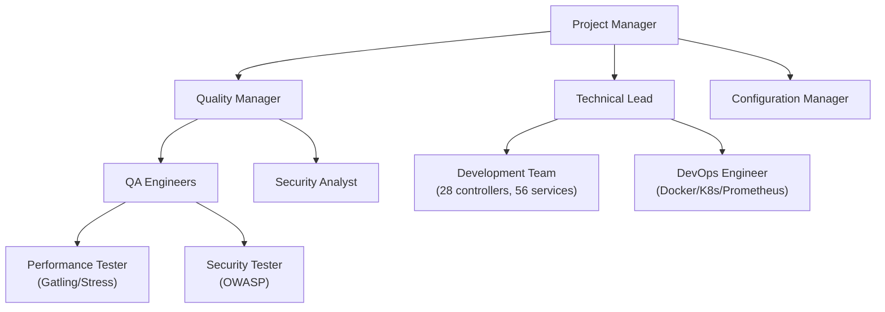
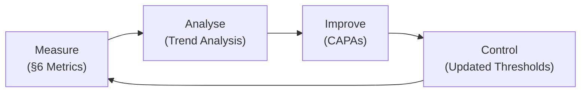

# Quality Management Plan (QMP)

## BuildNest E-Commerce Platform

---

## DOCUMENT INFORMATION

| Attribute                | Value                                                                                                                                                                                          |
| :----------------------- | :--------------------------------------------------------------------------------------------------------------------------------------------------------------------------------------------- |
| **Document Title**       | Quality Management Plan                                                                                                                                                                        |
| **Document ID**          | QMP-BUILDNEST-001                                                                                                                                                                              |
| **Version**              | 1.0                                                                                                                                                                                            |
| **Date**                 | February 11, 2026                                                                                                                                                                              |
| **Status**               | Baselined                                                                                                                                                                                      |
| **Classification**       | Internal Use                                                                                                                                                                                   |
| **Conformance Standard** | ISO/IEC/IEEE 12207:2017, Clause 6.2.5 — Quality Management Process                                                                                                                             |
| **Related Documents**    | [SRS](SRS_IEEE_29148_2018.md), [SDD](SDD_IEEE_1016_2017.md), [TP](Test_Plan_IEEE_29119.md), [VVR](Verification_Validation_Report_IEEE_12207.md), [CSD](Coding_Standards_Document_ISO_25010.md) |

---

## DOCUMENT CONTROL

### Revision History

| Version | Date       | Author  | Changes                                                          | Approval   |
| :------ | :--------- | :------ | :--------------------------------------------------------------- | :--------- |
| 1.0     | 2026-02-11 | QA Team | Initial release — ISO/IEC/IEEE 12207:2017 §6.2.5 full compliance | ✅ Pending |

### Document Approval

| Role                  | Name         | Signature  | Date         |
| :-------------------- | :----------- | :--------- | :----------- |
| **Project Manager**   | Project Lead | ****\_**** | ****\_\_**** |
| **Quality Manager**   | QA Manager   | ****\_**** | ****\_\_**** |
| **Technical Lead**    | Dev Lead     | ****\_**** | ****\_\_**** |
| **Configuration Mgr** | CM Lead      | ****\_**** | ****\_\_**** |

### Change Procedure

1. Submit Change Request (CR) referencing this QMP and affected clause(s).
2. Quality Manager assesses impact on quality objectives and metrics.
3. Change Review Board (CRB) approves/rejects within 3 business days.
4. Approved changes are versioned, baselined, and distributed to all stakeholders.

---

## Table of Contents

1. [Introduction](#1-introduction)
   - 1.1 [Purpose](#11-purpose)
   - 1.2 [Scope](#12-scope)
   - 1.3 [Normative References](#13-normative-references)
   - 1.4 [Definitions & Abbreviations](#14-definitions--abbreviations)
   - 1.5 [Conformance Statement](#15-conformance-statement)
2. [Quality Management Organization](#2-quality-management-organization)
   - 2.1 [Organizational Structure](#21-organizational-structure)
   - 2.2 [Roles, Responsibilities & Accountability](#22-roles-responsibilities--accountability)
   - 2.3 [Authority & Independence](#23-authority--independence)
3. [Quality Policies & Objectives](#3-quality-policies--objectives)
   - 3.1 [Quality Policy](#31-quality-policy)
   - 3.2 [Quality Objectives](#32-quality-objectives)
   - 3.3 [Quality Objectives Traceability](#33-quality-objectives-traceability)
4. [Quality Management Processes](#4-quality-management-processes)
   - 4.1 [Process-to-Standard Mapping](#41-process-to-standard-mapping)
   - 4.2 [Quality Planning Activities](#42-quality-planning-activities)
   - 4.3 [Quality Assurance Activities](#43-quality-assurance-activities)
   - 4.4 [Quality Control Activities](#44-quality-control-activities)
5. [Lifecycle Process Quality Requirements](#5-lifecycle-process-quality-requirements)
   - 5.1 [Agreement Processes](#51-agreement-processes)
   - 5.2 [Technical Processes](#52-technical-processes)
   - 5.3 [Technical Management Processes](#53-technical-management-processes)
   - 5.4 [Organizational Project-Enabling Processes](#54-organizational-project-enabling-processes)
6. [Quality Metrics & Measurement](#6-quality-metrics--measurement)
   - 6.1 [Measurement Strategy](#61-measurement-strategy)
   - 6.2 [Product Quality Metrics (ISO 25010)](#62-product-quality-metrics-iso-25010)
   - 6.3 [Process Quality Metrics](#63-process-quality-metrics)
   - 6.4 [Metric Collection Tools](#64-metric-collection-tools)
7. [Quality Tools & Infrastructure](#7-quality-tools--infrastructure)
   - 7.1 [Static Analysis & Code Quality](#71-static-analysis--code-quality)
   - 7.2 [Dynamic Testing Tools](#72-dynamic-testing-tools)
   - 7.3 [Monitoring & Observability](#73-monitoring--observability)
   - 7.4 [Security Analysis](#74-security-analysis)
8. [Non-Conformance Management](#8-non-conformance-management)
   - 8.1 [Non-Conformance Identification](#81-non-conformance-identification)
   - 8.2 [Non-Conformance Resolution](#82-non-conformance-resolution)
   - 8.3 [Corrective & Preventive Actions (CAPA)](#83-corrective--preventive-actions-capa)
9. [Quality Audits & Reviews](#9-quality-audits--reviews)
   - 9.1 [Audit Schedule](#91-audit-schedule)
   - 9.2 [Review Types](#92-review-types)
   - 9.3 [Audit Criteria](#93-audit-criteria)
10. [Quality Records & Documentation](#10-quality-records--documentation)
    - 10.1 [Quality Documentation Suite](#101-quality-documentation-suite)
    - 10.2 [Record Retention](#102-record-retention)
11. [Risk-Based Quality Management](#11-risk-based-quality-management)
12. [Continuous Improvement](#12-continuous-improvement)
13. [Revision History](#13-revision-history)

---

## 1. Introduction

### 1.1 Purpose

This Quality Management Plan (QMP) establishes the quality management policies, standards, procedures, and objectives for the **BuildNest E-Commerce Platform**. It defines how quality shall be planned, assured, controlled, and improved across all software lifecycle processes as defined by ISO/IEC/IEEE 12207:2017.

This QMP applies to the full product scope:

- **28** REST controllers (Admin, Auth, User, Monitoring, Public, Inventory)
- **56** service classes across 22 subpackages
- **19** JPA repositories
- **48** model classes (entities, DTOs, payloads, Elasticsearch documents)
- **38** configuration classes
- **8** security components
- **167** test source files across **29** test packages

### 1.2 Scope

| Scope Dimension      | Coverage                                                                                                         |
| :------------------- | :--------------------------------------------------------------------------------------------------------------- |
| **Product**          | BuildNest backend API (Spring Boot 3.5.10), React 18+ frontend, infrastructure (Docker/K8s)                      |
| **Processes**        | All ISO/IEC/IEEE 12207:2017 lifecycle processes (Agreement, Technical, Management, Enabling)                     |
| **Lifecycle Phases** | Design → Implementation → Integration → Testing → Deployment → Operation → Maintenance                           |
| **Standards Suite**  | IEEE 29119-3, IEEE 29148, IEEE 42010, IEEE 1016, ISO 25010, IEEE 12207                                           |
| **Modules (12)**     | Auth, Password, Catalog, Cart, Checkout, Payment, Inventory, Wishlist, Reviews, Admin, Monitoring, Notifications |

### 1.3 Normative References

| Reference                          | Description                                   |
| :--------------------------------- | :-------------------------------------------- |
| **ISO/IEC/IEEE 12207:2017**        | Software Life Cycle Processes                 |
| **ISO/IEC/IEEE 12207:2017 §6.2.5** | Quality Management Process (governing clause) |
| **ISO/IEC 25010:2011**             | Systems and software quality models (SQuaRE)  |
| **ISO/IEC/IEEE 29119-3:2021**      | Software Testing — Test Documentation         |
| **ISO/IEC/IEEE 29148:2018**        | Requirements Engineering                      |
| **ISO/IEC/IEEE 1016:2017**         | Software Design Descriptions                  |
| **ISO/IEC/IEEE 42010:2022**        | Architecture Description                      |
| **ISO/IEC/IEEE 24748-3:2020**      | Guide for Application of 12207                |
| **ISO 9001:2015**                  | Quality Management Systems — Requirements     |
| **OWASP ASVS 4.0**                 | Application Security Verification Standard    |

### 1.4 Definitions & Abbreviations

| Term / Abbreviation | Definition                                                         |
| :------------------ | :----------------------------------------------------------------- |
| **QMP**             | Quality Management Plan                                            |
| **QA**              | Quality Assurance — process-oriented activities preventing defects |
| **QC**              | Quality Control — product-oriented activities detecting defects    |
| **CAPA**            | Corrective And Preventive Action                                   |
| **NCR**             | Non-Conformance Report                                             |
| **CRB**             | Change Review Board                                                |
| **SQuaRE**          | Systems and software Quality Requirements and Evaluation           |
| **SUT**             | System Under Test                                                  |
| **CI/CD**           | Continuous Integration / Continuous Delivery                       |
| **CVSS**            | Common Vulnerability Scoring System                                |
| **PITest**          | PIT Mutation Testing framework                                     |
| **JaCoCo**          | Java Code Coverage library                                         |

### 1.5 Conformance Statement

> This document conforms to **ISO/IEC/IEEE 12207:2017, Clause 6.2.5 — Quality Management Process**. It fulfils all mandatory outcomes:
>
> - a) Organizational quality management policies, objectives, and procedures are **defined** (§3).
> - b) Organizational quality objectives are **established** (§3.2).
> - c) Accountability and authority for quality management are **defined** (§2.2, §2.3).
> - d) Resources and information needed for quality management are **identified** (§7).
> - e) Products and services are **evaluated** against quality criteria (§6).
> - f) Non-conformances are **identified and addressed** (§8).
> - g) Corrective and preventive actions are **taken** (§8.3).
>
> Additionally, this plan addresses the broader process groups of ISO/IEC/IEEE 12207:2017 (§5) to ensure quality integration across the entire software lifecycle.

---

## 2. Quality Management Organization

### 2.1 Organizational Structure

### 2.2 Roles, Responsibilities & Accountability

| Role                  | Quality Responsibilities                                                                                            | Accountability                    | 12207 Process          |
| :-------------------- | :------------------------------------------------------------------------------------------------------------------ | :-------------------------------- | :--------------------- |
| **Project Manager**   | Approve QMP; allocate resources for QA/QC activities; chair CRB                                                     | Overall quality commitment        | 6.3.1 Project Planning |
| **Quality Manager**   | Define quality policies & objectives; plan and execute audits; manage NCRs; report quality status                   | Quality system effectiveness      | **6.2.5 Quality Mgmt** |
| **Technical Lead**    | Enforce [CSD](Coding_Standards_Document_ISO_25010.md) standards; approve design reviews; ensure SDD conformance     | Technical quality of deliverables | 6.4.4 Implementation   |
| **QA Engineers**      | Execute [Test Plan](Test_Plan_IEEE_29119.md); maintain [TCS](Test_Case_Specification_IEEE_29119.md); report defects | Test coverage & pass rates        | 6.4.6 Verification     |
| **Security Analyst**  | Run OWASP scans; validate ASVS compliance; triage CVE findings                                                      | Security posture                  | 6.4.6 Verification     |
| **DevOps Engineer**   | Maintain CI/CD pipeline quality gates; monitor Prometheus/Grafana alerts                                            | Deployment quality                | 6.4.5 Integration      |
| **Configuration Mgr** | Manage baselines; control document versions; maintain Git branching strategy                                        | Configuration integrity           | 6.3.5 Config Mgmt      |
| **Development Team**  | Write code per [CSD](Coding_Standards_Document_ISO_25010.md); write unit tests; fix defects                         | Code quality & unit test coverage | 6.4.4 Implementation   |

### 2.3 Authority & Independence

| Principle               | Implementation                                                                              |
| :---------------------- | :------------------------------------------------------------------------------------------ |
| **QA Independence**     | Quality Manager reports directly to Project Manager; QA does not report to Development Lead |
| **Stop-Ship Authority** | Quality Manager has authority to block releases for S1/S2 defects (ref: DEF-003, DEF-002)   |
| **Escalation Path**     | NCR → Quality Manager → CRB → Project Manager → Sponsor                                     |
| **Audit Independence**  | Internal audits conducted by QA staff not involved in the audited activity                  |

---

## 3. Quality Policies & Objectives

### 3.1 Quality Policy

> **BuildNest Quality Policy Statement:**
>
> The BuildNest project is committed to delivering software that meets all functional and non-functional requirements documented in the [SRS](SRS_IEEE_29148_2018.md), conforms to the ISO/IEC 25010:2011 quality model, and satisfies customer expectations for security, performance, and reliability. Quality shall be built into every lifecycle process — not inspected in after the fact. All team members are accountable for quality within their domains.

**Policy Principles:**

|  #  | Principle                     | Enforcement Mechanism                                                                                                |
| :-: | :---------------------------- | :------------------------------------------------------------------------------------------------------------------- |
| P1  | **Prevention over Detection** | Coding standards enforcement ([CSD](Coding_Standards_Document_ISO_25010.md)), compile-time validation (`-Xlint:all`) |
| P2  | **Measurable Quality**        | JaCoCo coverage ≥ 80%, PITest mutation score ≥ 75%, pass rate ≥ 95%                                                  |
| P3  | **Security by Design**        | OWASP Dependency-Check (CVSS ≥ 7 fails build), JWT/RBAC, input validation                                            |
| P4  | **Continuous Improvement**    | Sprint retrospectives, defect trend analysis, process audits                                                         |
| P5  | **Standards Compliance**      | All 17 documents conform to 6 ISO/IEC/IEEE standards                                                                 |
| P6  | **Traceability**              | SRS → RTM → TCS → TER → DBR chain maintained                                                                         |

### 3.2 Quality Objectives

| ID    | Quality Objective              | Target             | Measurement Method                                    | Frequency    | Owner            |
| :---- | :----------------------------- | :----------------- | :---------------------------------------------------- | :----------- | :--------------- |
| QO-01 | Code Coverage                  | ≥ 80% line         | JaCoCo report (`mvn verify -Pci`)                     | Every build  | Technical Lead   |
| QO-02 | Branch Coverage                | ≥ 70%              | JaCoCo branch counter                                 | Every build  | Technical Lead   |
| QO-03 | Mutation Score                 | ≥ 75%              | PITest report (`mvn pitest:mutationCoverage`)         | Weekly       | QA Engineer      |
| QO-04 | Test Pass Rate                 | ≥ 95%              | Test Execution Report                                 | Per release  | QA Manager       |
| QO-05 | Defect Density                 | ≤ 0.5 defects/KLOC | Defect count ÷ KLOC                                   | Per release  | Quality Manager  |
| QO-06 | Severity 1/2 Escape Rate       | 0 in production    | Production incident tracking                          | Monthly      | Quality Manager  |
| QO-07 | Security Vulnerability Density | 0 CVSS ≥ 7         | OWASP Dependency-Check report                         | Every build  | Security Analyst |
| QO-08 | Requirement Coverage           | 100%               | [RTM](Requirements_Traceability_Matrix_IEEE_29148.md) | Per release  | QA Manager       |
| QO-09 | Document Compliance            | 17/17 conformant   | Document audit checklist                              | Per release  | Quality Manager  |
| QO-10 | Mean Time to Resolve (S1)      | ≤ 24 hours         | Defect tracking system                                | Per incident | Technical Lead   |
| QO-11 | API Response Time (P95)        | ≤ 200ms            | Gatling load test / Prometheus metrics                | Per release  | DevOps Engineer  |
| QO-12 | API Availability               | ≥ 99.9%            | Prometheus / Spring Actuator health                   | Monthly      | DevOps Engineer  |

### 3.3 Quality Objectives Traceability

| Quality Objective | ISO 25010 Characteristic | SRS NFR Reference          | Test Category         |
| :---------------- | :----------------------- | :------------------------- | :-------------------- |
| QO-01, QO-02      | Maintainability          | —                          | Unit Tests            |
| QO-03             | Maintainability          | —                          | Mutation Tests        |
| QO-04             | Functional Suitability   | All FR-\*                  | All                   |
| QO-05             | Reliability              | NFR-REL-01 to NFR-REL-05   | Functional + Edge     |
| QO-06             | Reliability              | NFR-REL-01                 | Production Monitoring |
| QO-07             | Security                 | NFR-SEC-01 to NFR-SEC-12   | Security Tests        |
| QO-08             | Functional Suitability   | All FR-\*                  | Traceability Audit    |
| QO-09             | —                        | —                          | Document Audit        |
| QO-10             | Reliability              | NFR-REL-03                 | Incident Management   |
| QO-11             | Performance Efficiency   | NFR-PERF-01 to NFR-PERF-06 | Performance Tests     |
| QO-12             | Reliability              | NFR-REL-04                 | Monitoring            |

---

## 4. Quality Management Processes

### 4.1 Process-to-Standard Mapping

| 12207:2017 Process               | Clause | Quality Activity                                                       | QMP Section |
| :------------------------------- | :----- | :--------------------------------------------------------------------- | :---------- |
| Quality Management               | 6.2.5  | This QMP — defines policies, objectives, org, metrics                  | §1–§12      |
| Life Cycle Model Management      | 6.2.1  | Process tailoring documentation                                        | §5          |
| Infrastructure Management        | 6.2.2  | Tool qualification (JaCoCo, PITest, Gatling, OWASP)                    | §7          |
| Portfolio Management             | 6.2.3  | Project-level quality reporting                                        | §6          |
| Human Resource Management        | 6.2.4  | Training on standards and quality tools                                | §2.2        |
| Project Planning                 | 6.3.1  | Quality objectives in project plan                                     | §3.2        |
| Project Assessment & Control     | 6.3.2  | Quality status monitoring                                              | §6, §9      |
| Decision Management              | 6.3.3  | CRB quality criteria for decisions                                     | §8          |
| Risk Management                  | 6.3.4  | Quality risk register                                                  | §11         |
| Configuration Management         | 6.3.5  | Baseline control for quality records                                   | §10         |
| Information Management           | 6.3.6  | Quality record retention and access                                    | §10         |
| Measurement                      | 6.3.7  | Quality metrics collection and analysis                                | §6          |
| Stakeholder Needs & Requirements | 6.4.1  | SRS quality review                                                     | §5.2        |
| System/Software Requirements     | 6.4.2  | Requirements inspection                                                | §5.2        |
| Architecture Definition          | 6.4.3  | Architecture review (SAD/HLD/LLD/ICD)                                  | §5.2        |
| Design Definition                | 6.4.3  | Design review (SDD)                                                    | §5.2        |
| Implementation                   | 6.4.4  | Code review, CSD compliance, static analysis                           | §5.2        |
| Integration                      | 6.4.5  | Integration test quality gates                                         | §5.2        |
| Verification                     | 6.4.6  | V&V activities per [VVR](Verification_Validation_Report_IEEE_12207.md) | §5.2        |
| Transition                       | 6.4.7  | Deployment quality checks                                              | §5.2        |
| Validation                       | 6.4.8  | Acceptance testing, UAT criteria                                       | §5.2        |
| Operation                        | 6.4.9  | Operational quality monitoring                                         | §7.3        |
| Maintenance                      | 6.4.10 | Regression test after changes                                          | §5.2        |
| Disposal                         | 6.4.11 | Data retention and cleanup verification                                | §10.2       |

### 4.2 Quality Planning Activities

| Activity                  | Input                                                        | Output                                              | Timing        |
| :------------------------ | :----------------------------------------------------------- | :-------------------------------------------------- | :------------ |
| Define quality objectives | SRS (NFRs), ISO 25010 model                                  | QMP §3.2 (this section)                             | Project start |
| Identify quality metrics  | Quality objectives, standards                                | QMP §6 (Measurement)                                | Project start |
| Select quality tools      | Technology stack (`pom.xml`)                                 | QMP §7 (Tools)                                      | Sprint 0      |
| Plan quality reviews      | Project schedule                                             | Audit Schedule (§9.1)                               | Monthly       |
| Plan V&V activities       | [SRS](SRS_IEEE_29148_2018.md), [TP](Test_Plan_IEEE_29119.md) | [VVR](Verification_Validation_Report_IEEE_12207.md) | Per phase     |
| Establish quality gates   | Quality objectives                                           | CI/CD pipeline config                               | Sprint 0      |

### 4.3 Quality Assurance Activities

| QA Activity                       | Method                                                              | Frequency   | Evidence            |
| :-------------------------------- | :------------------------------------------------------------------ | :---------- | :------------------ |
| Process audit                     | Checklist against 12207 processes                                   | Quarterly   | Audit report        |
| Document compliance audit         | Verify all 17 documents against standard checklists                 | Per release | Compliance matrix   |
| Coding standards audit            | Verify source against [CSD](Coding_Standards_Document_ISO_25010.md) | Per sprint  | Code review reports |
| Test process audit                | Verify test execution against [TP](Test_Plan_IEEE_29119.md)         | Per release | Test audit report   |
| Configuration audit               | Verify baselines, branching, versioning                             | Per release | CM audit report     |
| Supplier/dependency audit         | OWASP Dependency-Check `mvn dependency-check:check`                 | Every build | HTML/JSON report    |
| Training effectiveness assessment | Verify team competency on standards and tools                       | Semi-annual | Training records    |

### 4.4 Quality Control Activities

| QC Activity                            | Method                                                            | Acceptance Criteria                              | Tool                          |
| :------------------------------------- | :---------------------------------------------------------------- | :----------------------------------------------- | :---------------------------- |
| Unit testing                           | JUnit 5 + Mockito                                                 | ≥ 80% line coverage (JaCoCo)                     | `mvn test -Punit-tests`       |
| Mutation testing                       | PITest framework                                                  | ≥ 75% mutation kill rate                         | `mvn pitest:mutationCoverage` |
| Integration testing                    | Spring Boot Test (`@SpringBootTest`)                              | All integration points verified                  | `mvn test -Pall-tests`        |
| E2E testing                            | Selenium WebDriver 4.16.1                                         | All critical user journeys pass                  | `mvn test -Pe2e-tests`        |
| Performance testing                    | Gatling 3.10.3                                                    | P95 ≤ 200ms, throughput ≥ 100 RPS                | `mvn gatling:test`            |
| Stress testing                         | JUnit 5 stress test suite                                         | No crashes under 2x normal load                  | `mvn test -Pstress-tests`     |
| Security testing                       | OWASP Dependency-Check 9.0.9                                      | 0 CVSS ≥ 7 vulnerabilities                       | `mvn dependency-check:check`  |
| Static analysis                        | Java compiler warnings (`-Xlint:all`)                             | 0 compiler warnings                              | `mvn compile`                 |
| Javadoc validation                     | Maven Javadoc Plugin 3.6.3                                        | `failOnError=true`, `failOnWarnings=true`        | `mvn javadoc:javadoc`         |
| Code review                            | Pull request peer review                                          | ≥ 1 reviewer approval, 12-point checklist passes | Git platform                  |
| Requirements traceability verification | [RTM](Requirements_Traceability_Matrix_IEEE_29148.md) cross-check | 100% SRS requirements traced to test cases       | Manual audit                  |

---

## 5. Lifecycle Process Quality Requirements

### 5.1 Agreement Processes

| Process             | Quality Requirement                                                         | Evidence                 |
| :------------------ | :-------------------------------------------------------------------------- | :----------------------- |
| Acquisition (6.1.1) | Third-party libraries vetted for security (OWASP) and license compatibility | `owasp-suppressions.xml` |
| Supply (6.1.2)      | API contracts documented via OpenAPI 3 (`springdoc-openapi`)                | Swagger UI               |

### 5.2 Technical Processes

| Process                         | Clause | Quality Gate                                                          | Entry Criteria                                              | Exit Criteria                                       |
| :------------------------------ | :----- | :-------------------------------------------------------------------- | :---------------------------------------------------------- | :-------------------------------------------------- |
| Stakeholder Needs (6.4.1)       | 6.4.1  | SRS review and approval                                               | Stakeholder interviews complete                             | SRS baselined, all TBDs resolved                    |
| System Requirements (6.4.2)     | 6.4.2  | Requirements inspection                                               | SRS v3.0 available                                          | 100% requirements have acceptance criteria          |
| Architecture Definition (6.4.3) | 6.4.3  | Architecture review board                                             | [SAD](Software_Architecture_Document_IEEE_42010.md) drafted | All ADRs documented, stakeholder concerns addressed |
| Design Definition (6.4.3)       | 6.4.3  | Design review against [SDD](SDD_IEEE_1016_2017.md)                    | SDD viewpoints complete                                     | All design elements traceable to SRS                |
| **Implementation (6.4.4)**      | 6.4.4  | Code review + CI quality gates                                        | Design approved                                             | CSD compliance verified, 0 warnings, coverage met   |
| **Integration (6.4.5)**         | 6.4.5  | Integration test suite pass                                           | All modules compile cleanly                                 | All `@SpringBootTest` tests pass                    |
| **Verification (6.4.6)**        | 6.4.6  | [VVR](Verification_Validation_Report_IEEE_12207.md) — pass rate ≥ 95% | Test Plan approved, test data ready                         | All S1/S2 defects resolved                          |
| **Transition (6.4.7)**          | 6.4.7  | Deployment checklist (Docker build, K8s health check)                 | All tests pass, security scan clean                         | Application healthy in target env                   |
| **Validation (6.4.8)**          | 6.4.8  | User acceptance testing against SRS use cases                         | System deployed to staging                                  | All critical use cases pass                         |
| Operation (6.4.9)               | 6.4.9  | Prometheus alerts configured, Actuator health endpoints active        | Application deployed to production                          | SLA monitoring active                               |
| Maintenance (6.4.10)            | 6.4.10 | Regression test suite pass after any change                           | Change request approved                                     | No new defects introduced                           |

### 5.3 Technical Management Processes

| Process                      | Clause | Quality Requirement                                                     |
| :--------------------------- | :----- | :---------------------------------------------------------------------- |
| Project Planning (6.3.1)     | 6.3.1  | Quality objectives included in project plan; QMP approved               |
| Assessment & Control (6.3.2) | 6.3.2  | Quality dashboard reviewed in sprint reviews; trend analysis monthly    |
| Decision Management (6.3.3)  | 6.3.3  | Quality criteria included in all go/no-go decisions                     |
| Risk Management (6.3.4)      | 6.3.4  | Quality risks tracked in risk register (§11)                            |
| Configuration Mgmt (6.3.5)   | 6.3.5  | Git branching (`bugfix/iso-ieee-documentation`), SemVer, baselined docs |
| Information Mgmt (6.3.6)     | 6.3.6  | Quality records stored, indexed, and accessible per §10                 |
| **Measurement (6.3.7)**      | 6.3.7  | Metrics defined in §6; collected per schedule; analyzed for trends      |

### 5.4 Organizational Project-Enabling Processes

| Process                       | Clause | Quality Requirement                                                       |
| :---------------------------- | :----- | :------------------------------------------------------------------------ |
| Life Cycle Model Mgmt (6.2.1) | 6.2.1  | Agile lifecycle with quality gates at each sprint boundary                |
| Infrastructure Mgmt (6.2.2)   | 6.2.2  | CI/CD pipeline, Docker registry, K8s cluster, monitoring stack maintained |
| Portfolio Mgmt (6.2.3)        | 6.2.3  | Quality status reported to portfolio level                                |
| HR Management (6.2.4)         | 6.2.4  | Standards training for all team members; QA certification tracked         |
| **Quality Mgmt (6.2.5)**      | 6.2.5  | **This QMP** — establishes all quality management activities              |

---

## 6. Quality Metrics & Measurement

### 6.1 Measurement Strategy

This measurement strategy aligns with ISO/IEC/IEEE 12207:2017, §6.3.7 (Measurement Process).

| Aspect              | Approach                                                                            |
| :------------------ | :---------------------------------------------------------------------------------- |
| **What to measure** | Product quality (ISO 25010), process quality, project quality                       |
| **How to measure**  | Automated tools (JaCoCo, PITest, OWASP, Gatling, Prometheus) + manual audits        |
| **When to measure** | Per-build (automated), per-sprint (reviews), per-release (audits), monthly (trends) |
| **Analysis**        | Trend analysis, threshold alerting, root cause analysis for deviations              |
| **Reporting**       | Sprint review dashboard, monthly quality report, release quality gate summary       |

### 6.2 Product Quality Metrics (ISO 25010)

| ISO 25010 Characteristic   | Sub-Characteristic      | Metric                                     | Target                          | Tool / Source                         |
| :------------------------- | :---------------------- | :----------------------------------------- | :------------------------------ | :------------------------------------ |
| **Functional Suitability** | Functional Completeness | % SRS requirements with passing tests      | 100%                            | RTM + TER cross-reference             |
|                            | Functional Correctness  | Test pass rate                             | ≥ 95%                           | JUnit / Test Execution Report         |
| **Performance Efficiency** | Time Behaviour          | API response time P95                      | ≤ 200ms                         | Gatling reports                       |
|                            | Resource Utilization    | JVM heap usage under load                  | ≤ 512MB                         | Prometheus `jvm_memory_used_bytes`    |
|                            | Capacity                | Concurrent users supported                 | ≥ 500                           | Gatling stress simulation             |
| **Compatibility**          | Interoperability        | OpenAPI 3 spec validation                  | 0 violations                    | Springdoc auto-generation             |
| **Usability**              | Operability             | Standard API response envelope compliance  | 100%                            | Code review (12-point checklist #2)   |
| **Reliability**            | Maturity                | Defect density                             | ≤ 0.5/KLOC                      | Defect tracking                       |
|                            | Availability            | Uptime SLA                                 | ≥ 99.9%                         | Prometheus / Actuator `/health`       |
|                            | Fault Tolerance         | Circuit breaker activation rate            | Measured                        | Resilience4j metrics                  |
|                            | Recoverability          | MTTR for S1 defects                        | ≤ 24h                           | Incident tracking                     |
| **Security**               | Confidentiality         | Auth bypass test results                   | 0 pass                          | Security test suite                   |
|                            | Integrity               | Input validation coverage                  | 100% endpoints                  | Bean validation audit                 |
|                            | Non-repudiation         | Audit log completeness                     | All `@Auditable` methods logged | Elasticsearch audit log check         |
| **Maintainability**        | Modularity              | Cyclomatic complexity per method           | ≤ 15                            | Static analysis                       |
|                            | Reusability             | Shared utility/service usage               | Measured                        | Package dependency analysis           |
|                            | Analysability           | Test coverage (line)                       | ≥ 80%                           | JaCoCo                                |
|                            | Modifiability           | Mutation score                             | ≥ 75%                           | PITest                                |
|                            | Testability             | Builder pattern adoption for test fixtures | 100% entities                   | Code review                           |
| **Portability**            | Adaptability            | Environment-agnostic config                | 100%                            | `application.properties` externalized |
|                            | Installability          | Docker image build success                 | 100%                            | `docker build` in CI                  |

### 6.3 Process Quality Metrics

| Metric                          | Formula                                       | Target | Collection Method         |
| :------------------------------ | :-------------------------------------------- | :----- | :------------------------ |
| Defect Removal Efficiency (DRE) | (Pre-release defects) ÷ (Total defects) × 100 | ≥ 95%  | Defect tracking           |
| Review Effectiveness            | (Defects found in review) ÷ (Total defects)   | ≥ 40%  | Review records            |
| Test Efficiency                 | (Defects found by tests) ÷ (Total defects)    | ≥ 50%  | TER + DBR cross-reference |
| Schedule Variance               | (Actual − Planned) ÷ Planned × 100            | ≤ ±10% | Project tracking          |
| Rework Rate                     | (Rework effort) ÷ (Total effort) × 100        | ≤ 15%  | Time tracking             |
| CI Pipeline Success Rate        | (Successful builds) ÷ (Total builds) × 100    | ≥ 90%  | CI/CD system logs         |

### 6.4 Metric Collection Tools

| Tool                         | Version | Metric Category          | Integration Point                        |
| :--------------------------- | :------ | :----------------------- | :--------------------------------------- |
| **JaCoCo**                   | 0.8.11  | Code Coverage            | Maven `verify` phase; CI profile         |
| **PITest**                   | 1.16.1  | Mutation Testing         | Maven `verify` phase; HTML/XML reports   |
| **OWASP Dependency-Check**   | 9.0.9   | Security Vulnerabilities | Maven `check` goal; HTML/JSON reports    |
| **Gatling**                  | 3.10.3  | Performance              | Maven plugin; Gatling simulation reports |
| **Prometheus + Micrometer**  | Latest  | Runtime Metrics          | Actuator `/prometheus` endpoint          |
| **Spring Boot Actuator**     | 3.5.10  | Health & Info            | `/actuator/health`, `/actuator/info`     |
| **Logstash + Elasticsearch** | 7.4     | Audit Logs               | Structured JSON logging via logback      |
| **Maven Surefire**           | Default | Test Results             | CI/CD pipeline; JUnit XML reports        |
| **Maven Javadoc Plugin**     | 3.6.3   | Documentation Quality    | Build phase; `failOnError=true`          |

---

## 7. Quality Tools & Infrastructure

### 7.1 Static Analysis & Code Quality

| Tool / Mechanism                              | Configuration                                                                              | Quality Gate             |
| :-------------------------------------------- | :----------------------------------------------------------------------------------------- | :----------------------- |
| Java Compiler (`-Xlint:all`)                  | `pom.xml` → `maven-compiler-plugin`, `-Xlint:all`, `-Xlint:-options`, `-Xlint:-processing` | 0 warnings (build fails) |
| Maven Javadoc Plugin                          | `failOnError=true`, `failOnWarnings=true`, `doclint=all`                                   | 0 Javadoc violations     |
| Lombok annotation processing                  | `annotationProcessorPaths` configured for Lombok + Spring Config                           | Clean compilation        |
| [CSD](Coding_Standards_Document_ISO_25010.md) | 12-point code review checklist (§7)                                                        | All 12 checks pass on PR |

### 7.2 Dynamic Testing Tools

| Tool                     | Version | Purpose                     | Maven Command                 | Profile      |
| :----------------------- | :------ | :-------------------------- | :---------------------------- | :----------- |
| **JUnit 5**              | Latest  | Unit + Integration tests    | `mvn test`                    | `unit-tests` |
| **Mockito**              | Latest  | Service layer mocking       | Embedded in JUnit tests       | All          |
| **Spring Boot Test**     | 3.5.10  | Integration testing         | `mvn test -Pall-tests`        | `all-tests`  |
| **Selenium WebDriver**   | 4.16.1  | E2E browser testing         | `mvn test -Pe2e-tests`        | `e2e-tests`  |
| **WebDriverManager**     | 5.6.3   | Automatic driver management | Integrated with Selenium      | `e2e-tests`  |
| **Gatling**              | 3.10.3  | Load & performance testing  | `mvn gatling:test`            | —            |
| **Spring Security Test** | Latest  | Security context testing    | Embedded in integration tests | All          |
| **JaCoCo**               | 0.8.11  | Code coverage reporting     | `mvn verify` (auto agent)     | `ci`         |
| **PITest**               | 1.16.1  | Mutation testing            | `mvn pitest:mutationCoverage` | —            |

### 7.3 Monitoring & Observability

| Component               | Purpose                                         | Quality Contribution                |
| :---------------------- | :---------------------------------------------- | :---------------------------------- |
| **Spring Actuator**     | Health, info, metrics endpoints                 | Operational quality monitoring      |
| **Micrometer Core**     | Metrics abstraction layer                       | JVM, HTTP, DB pool metrics          |
| **Prometheus Registry** | Metrics export for Prometheus scraping          | Time-series quality data            |
| **Prometheus**          | Metrics storage and alerting (`prometheus.yml`) | Alert on quality threshold breaches |
| **Alert Manager**       | Alert routing and notification (`alerts.yml`)   | Quality incident notification       |
| **Logstash Encoder**    | Structured JSON logging                         | Audit trail, error analysis         |
| **Elasticsearch**       | Log and audit event storage                     | Searchable quality evidence         |
| **Resilience4j**        | Circuit breaker, rate limiter, time limiter     | Fault tolerance quality             |
| **Bucket4j**            | API rate limiting with Redis backend            | Abuse prevention, SLA enforcement   |

### 7.4 Security Analysis

| Tool                       | Version | Purpose                                 | Evidence Generated                | Build Integration            |
| :------------------------- | :------ | :-------------------------------------- | :-------------------------------- | :--------------------------- |
| **OWASP Dependency-Check** | 9.0.9   | Known vulnerability detection (CVE/NVD) | HTML + JSON reports               | `mvn dependency-check:check` |
| **OWASP ASVS 4.0**         | —       | Application security verification       | Manual security audit checklist   | Security QA process          |
| **owasp-suppressions.xml** | —       | False positive CVE suppression          | Suppression justification records | Integrated in plugin config  |
| **Spring Security Test**   | Latest  | Authentication/authorization testing    | JUnit test results                | `mvn test`                   |

---

## 8. Non-Conformance Management

### 8.1 Non-Conformance Identification

Non-conformances are identified through the following channels:

| Channel                   | Type            | Example                                                         |
| :------------------------ | :-------------- | :-------------------------------------------------------------- |
| **Automated Tests**       | Product NCR     | Failed test case (e.g., TC-SEC-012 failed → DEF-003)            |
| **CI Pipeline**           | Process NCR     | JaCoCo coverage drops below 80%                                 |
| **OWASP Scan**            | Security NCR    | CVSS ≥ 7 vulnerability detected in dependency                   |
| **Code Review**           | Standards NCR   | Violation of [CSD](Coding_Standards_Document_ISO_25010.md) rule |
| **Document Audit**        | Compliance NCR  | Missing mandatory clause in ISO document                        |
| **Production Monitoring** | Operational NCR | Prometheus alert: response time P95 > 200ms                     |

### 8.2 Non-Conformance Resolution

| Severity        | Response Time | Resolution Authority | Escalation Path                     |
| :-------------- | :------------ | :------------------- | :---------------------------------- |
| **S1 Critical** | ≤ 4 hours     | Technical Lead + QA  | → Quality Manager → Project Manager |
| **S2 Major**    | ≤ 24 hours    | Technical Lead       | → Quality Manager                   |
| **S3 Minor**    | ≤ 1 sprint    | Developer            | → Technical Lead (if overdue)       |
| **S4 Trivial**  | Best effort   | Developer            | —                                   |

**Current Open Non-Conformances:**

| NCR ID  | Source                                              | Severity | Description                            | Status                     |
| :------ | :-------------------------------------------------- | :------- | :------------------------------------- | :------------------------- |
| NCR-001 | [DEF-003](Defect_Bug_Report_IEEE_29119.md)          | S1       | Stored XSS in review comments          | **Open** — Release Blocker |
| NCR-002 | [DEF-002](Defect_Bug_Report_IEEE_29119.md)          | S2       | Inventory not released on payment fail | **Open** — Release Blocker |
| NCR-003 | [VVR](Verification_Validation_Report_IEEE_12207.md) | S3       | Line coverage 78% (target 80%)         | **Open**                   |

### 8.3 Corrective & Preventive Actions (CAPA)

| CAPA ID  | NCR Ref | Type       | Action                                                                | Owner          | Due Date   |
| :------- | :------ | :--------- | :-------------------------------------------------------------------- | :------------- | :--------- |
| CAPA-001 | NCR-001 | Corrective | Add OWASP HTML Sanitizer to `ProductReviewService.submitReview()`     | Dev Team       | 2026-02-14 |
| CAPA-002 | NCR-001 | Preventive | Add automated XSS test patterns to security test suite                | QA Engineer    | 2026-02-16 |
| CAPA-003 | NCR-002 | Corrective | Add `releaseReservation()` call in `CheckoutService` catch block      | Dev Team       | 2026-02-14 |
| CAPA-004 | NCR-002 | Preventive | Add compensating transaction test for all payment failure paths       | QA Engineer    | 2026-02-16 |
| CAPA-005 | NCR-003 | Corrective | Add unit tests for Notification and Monitoring modules                | Dev Team       | 2026-02-18 |
| CAPA-006 | —       | Preventive | Raise JaCoCo CI minimum from 40% to 60% (phase 1), then 80% (phase 2) | Technical Lead | 2026-03-01 |

---

## 9. Quality Audits & Reviews

### 9.1 Audit Schedule

| Audit Type                    | Scope                                                         | Frequency   | Auditor          | Output                |
| :---------------------------- | :------------------------------------------------------------ | :---------- | :--------------- | :-------------------- |
| **Process Audit**             | Software lifecycle processes vs. 12207 clauses                | Quarterly   | Quality Manager  | Process Audit Report  |
| **Product Audit**             | Deliverables vs. quality objectives (§3.2)                    | Per release | QA Engineers     | Product Audit Report  |
| **Document Compliance Audit** | 17 documents vs. ISO standard checklists                      | Per release | Quality Manager  | Compliance Matrix     |
| **Code Quality Audit**        | Source code vs. [CSD](Coding_Standards_Document_ISO_25010.md) | Per sprint  | Technical Lead   | Code Audit Report     |
| **Security Audit**            | OWASP ASVS checklist, dependency CVE scan                     | Per release | Security Analyst | Security Audit Report |
| **Configuration Audit**       | Baselines, versions, branching strategy                       | Per release | Config Manager   | CM Audit Report       |

### 9.2 Review Types

| Review Type              | Participants         | Trigger                   | Gate Criteria                            |
| :----------------------- | :------------------- | :------------------------ | :--------------------------------------- |
| **Management Review**    | PM, QM, TL           | Monthly / milestone       | Quality dashboard metrics within targets |
| **Technical Review**     | TL, Dev Team, QA     | Design completion         | SDD/HLD/LLD approved                     |
| **Peer Code Review**     | Developer + Reviewer | Every pull request        | 12-point CSD checklist passes            |
| **Inspection**           | QM, QA, Author       | Critical defect / NCR     | Root cause identified, CAPA assigned     |
| **Walkthrough**          | Author + Team        | Complex module completion | Team understanding confirmed             |
| **Sprint Retrospective** | Scrum Team           | End of sprint             | Improvement actions identified           |

### 9.3 Audit Criteria

| Criterion                                      | Standard Reference   | Pass Threshold                            |
| :--------------------------------------------- | :------------------- | :---------------------------------------- |
| All 12207 processes have documented procedures | 12207:2017 §5–6      | 100% processes documented                 |
| Quality objectives are measurable and tracked  | 12207:2017 §6.2.5(b) | All QO-\* metrics collected per schedule  |
| Non-conformances are tracked to closure        | 12207:2017 §6.2.5(f) | 0 overdue NCRs                            |
| CAPA actions are implemented and verified      | 12207:2017 §6.2.5(g) | 100% CAPAs closed within due date         |
| All documents conform to referenced standards  | Multiple             | 17/17 documents pass compliance checklist |
| Test coverage meets quality objectives         | QO-01, QO-02         | Line ≥ 80%, Branch ≥ 70%                  |
| Security scan is clean                         | QO-07                | 0 CVSS ≥ 7 findings                       |

---

## 10. Quality Records & Documentation

### 10.1 Quality Documentation Suite

| Document ID       | Document Title                                                                     | Standard               | QMP Linkage           |
| :---------------- | :--------------------------------------------------------------------------------- | :--------------------- | :-------------------- |
| QMP-BUILDNEST-001 | **Quality Management Plan** (this document)                                        | IEEE 12207:2017 §6.2.5 | —                     |
| DOC-SRS-001       | [Software Requirements Specification](SRS_IEEE_29148_2018.md)                      | IEEE 29148:2018        | Input to QO-08        |
| DOC-SDD-001       | [Software Design Description](SDD_IEEE_1016_2017.md)                               | IEEE 1016:2017         | Input to §5.2         |
| DOC-SAD-001       | [Software Architecture Document](Software_Architecture_Document_IEEE_42010.md)     | IEEE 42010:2022        | Input to §5.2         |
| DOC-HLD-001       | [High-Level Design](High_Level_Design_IEEE_42010.md)                               | IEEE 42010:2022        | Input to §5.2         |
| DOC-LLD-001       | [Low-Level Design](Low_Level_Design_IEEE_42010.md)                                 | IEEE 42010:2022        | Input to §5.2         |
| DOC-ICD-001       | [Interface Control Document](Interface_Control_Document_IEEE_42010.md)             | IEEE 42010:2022        | Input to §5.2         |
| DOC-RTM-001       | [Requirements Traceability Matrix](Requirements_Traceability_Matrix_IEEE_29148.md) | IEEE 29148:2018        | Input to QO-08        |
| DOC-BRD-001       | [Business Rules Document](Business_Rules_Document_IEEE_29148.md)                   | IEEE 29148:2018        | Input to §5.2         |
| DOC-UCS-001       | [Use Case Specification](Use_Case_Specification_IEEE_29148.md)                     | IEEE 29148:2018        | Input to §5.2         |
| CSD-BUILDNEST-001 | [Coding Standards Document](Coding_Standards_Document_ISO_25010.md)                | ISO 25010:2011         | Input to §4.3, §4.4   |
| TP-BUILDNEST-001  | [Test Plan](Test_Plan_IEEE_29119.md)                                               | IEEE 29119-3:2021      | Input to §4.3, §4.4   |
| TCS-BUILDNEST-001 | [Test Case Specification](Test_Case_Specification_IEEE_29119.md)                   | IEEE 29119-3:2021      | Input to QO-04        |
| TDS-BUILDNEST-001 | [Test Data Specification](Test_Data_Specification_IEEE_29119.md)                   | IEEE 29119-3:2021      | Input to §4.4         |
| TER-BUILDNEST-001 | [Test Execution Report](Test_Execution_Report_IEEE_29119.md)                       | IEEE 29119-3:2021      | Input to QO-04, QO-05 |
| DBR-BUILDNEST-001 | [Defect/Bug Report](Defect_Bug_Report_IEEE_29119.md)                               | IEEE 29119-3:2021      | Input to §8           |
| VVR-BUILDNEST-001 | [V&V Report](Verification_Validation_Report_IEEE_12207.md)                         | IEEE 12207:2017        | Input to §5.2         |

### 10.2 Record Retention

| Record Type                  | Retention Period       | Storage Location          | Access Control       |
| :--------------------------- | :--------------------- | :------------------------ | :------------------- |
| Quality Audit Reports        | Project life + 3 years | Document repository (Git) | QA Team + Management |
| Non-Conformance Reports      | Project life + 3 years | Defect tracking system    | All team members     |
| CAPA Records                 | Project life + 5 years | Document repository       | QA Team + Management |
| Test Results (JUnit XML)     | 2 years                | CI/CD artifact storage    | QA Team + Dev Team   |
| Coverage Reports (JaCoCo)    | 2 years                | CI/CD artifact storage    | All team members     |
| Security Scan Reports        | Project life + 5 years | Secure document storage   | Security Team + Mgmt |
| Code Review Artifacts        | 1 year                 | Git pull request history  | All team members     |
| Meeting Minutes (QA Reviews) | Project life           | Document repository       | All team members     |

---

## 11. Risk-Based Quality Management

| Risk ID | Quality Risk                          | Likelihood | Impact   | Mitigation                                                                   | Monitoring                          |
| :------ | :------------------------------------ | :--------- | :------- | :--------------------------------------------------------------------------- | :---------------------------------- |
| QR-001  | Coverage target not met (QO-01)       | Medium     | Medium   | Incremental coverage gates (40% → 60% → 80%); CAPA-005, CAPA-006             | JaCoCo trend in CI dashboard        |
| QR-002  | Undetected security vulnerability     | Medium     | Critical | OWASP scan every build; manual ASVS audit per release                        | OWASP report monitoring             |
| QR-003  | Mutation score regression             | Low        | Medium   | PITest in CI; threshold enforcement at 75%                                   | PITest trend reports                |
| QR-004  | Performance degradation under load    | Medium     | High     | Gatling baseline tests; Prometheus P95 alerting                              | `alerts.yml` — response time alerts |
| QR-005  | Dependency CVE introduced             | High       | High     | OWASP Dependency-Check `failBuildOnCVSS=7`; `owasp-suppressions.xml` for FPs | CI build result                     |
| QR-006  | Knowledge gap in ISO standards        | Medium     | Medium   | Mandatory standards training; QMP document as reference                      | Training completion tracking        |
| QR-007  | Test environment drift                | Low        | Medium   | Docker-based test environments; `docker-compose.yml` reproducibility         | Environment audit per release       |
| QR-008  | Document non-compliance post-baseline | Low        | Low      | Document compliance audit per release (§9.1)                                 | Audit results                       |

---

## 12. Continuous Improvement

### 12.1 Improvement Process

### 12.2 Planned Improvements

| ID     | Improvement                                | Target Date | Expected Impact                                        | Status  |
| :----- | :----------------------------------------- | :---------- | :----------------------------------------------------- | :------ |
| IMP-01 | Raise JaCoCo CI threshold to 60%           | 2026-03-01  | Reduce defect escape rate                              | Planned |
| IMP-02 | Integrate OWASP ZAP dynamic scanner        | 2026-03-15  | Automated runtime vulnerability scan                   | Planned |
| IMP-03 | Add SonarQube for continuous code quality  | 2026-04-01  | Automated code smell, duplication, complexity tracking | Planned |
| IMP-04 | Implement contract testing (Pact)          | 2026-04-15  | API compatibility assurance                            | Planned |
| IMP-05 | Raise JaCoCo CI threshold to 80%           | 2026-06-01  | Achieve QO-01 target                                   | Planned |
| IMP-06 | Establish quarterly external quality audit | 2026-Q3     | Independent quality verification                       | Planned |

---

## 13. Revision History

See [Document Control](#document-control) for full revision history and approvals.

---

**— End of Document —**

_This document was prepared in compliance with ISO/IEC/IEEE 12207:2017, Clause 6.2.5 — Quality Management Process, for the BuildNest E-Commerce Platform._
