# Software Design Description (SDD)

## BuildNest — E-Commerce Platform for Home Construction and Décor Products

---

## DOCUMENT INFORMATION

| Attribute                | Value                                |
| ------------------------ | ------------------------------------ |
| **Document Title**       | Software Design Description (SDD)    |
| **Document ID**          | DOC-SDD-001                          |
| **Version**              | 1.0                                  |
| **Date**                 | February 10, 2026                    |
| **Status**               | Baselined                            |
| **Classification**       | Internal Use                         |
| **Prepared For**         | CDAC Project                         |
| **Conformance Standard** | ISO/IEC/IEEE 1016:2017               |
| **Related SRS**          | DOC-SRS-001 (SRS_IEEE_29148_2018.md) |

---

## DOCUMENT CONTROL

### Revision History

| Version | Date       | Author             | Changes                                                                 | Approval   |
| ------- | ---------- | ------------------ | ----------------------------------------------------------------------- | ---------- |
| 1.0     | 2026-02-10 | Documentation Team | Initial controlled release per ISO/IEC/IEEE 1016:2017                   | ✅ Pending |
| 2.0     | 2026-02-11 | Documentation Team | Fixed duplicate pool rows, added Wishlist/Review/Admin SRS traceability | ✅ Pending |

### Document Approval

| Role               | Name                   | Signature              | Date             |
| ------------------ | ---------------------- | ---------------------- | ---------------- |
| Project Manager    | **\*\***\_\_\_**\*\*** | **\*\***\_\_\_**\*\*** | \***\*\_\_\*\*** |
| Technical Lead     | **\*\***\_\_\_**\*\*** | **\*\***\_\_\_**\*\*** | \***\*\_\_\*\*** |
| Software Architect | **\*\***\_\_\_**\*\*** | **\*\***\_\_\_**\*\*** | \***\*\_\_\*\*** |
| QA Manager         | **\*\***\_\_\_**\*\*** | **\*\***\_\_\_**\*\*** | \***\*\_\_\*\*** |

---

## Table of Contents

1. [Introduction](#1-introduction)
   - 1.1 [Purpose](#11-purpose)
   - 1.2 [Scope](#12-scope)
   - 1.3 [Audience](#13-audience)
   - 1.4 [Definitions and Acronyms](#14-definitions-and-acronyms)
   - 1.5 [References](#15-references)
2. [Design Stakeholders and Concerns](#2-design-stakeholders-and-concerns)
3. [Design Viewpoints](#3-design-viewpoints)
4. [Design Views](#4-design-views)
   - 4.1 [Context View](#41-context-view)
   - 4.2 [Composition View](#42-composition-view)
   - 4.3 [Logical View](#43-logical-view)
     - 4.3.4 [Frontend Logical Structure](#434-frontend-logical-structure)
   - 4.4 [Dependency View](#44-dependency-view)
   - 4.5 [Information View](#45-information-view)
     - 4.5.5 [Client-Side State Management](#455-client-side-state-management)
   - 4.6 [Patterns Use View](#46-patterns-use-view)
   - 4.7 [Interface View](#47-interface-view)
     - 4.7.3 [Frontend Routes](#473-frontend-routes)
   - 4.8 [Interaction View](#48-interaction-view)
     - 4.8.3 [Frontend Authorization Sequence](#483-frontend-login-sequence)
   - 4.9 [State Dynamics View](#49-state-dynamics-view)
   - 4.10 [Resource View](#410-resource-view)
     - 4.10.4 [Frontend Deployment](#4104-frontend-deployment)
5. [Design Overlays](#5-design-overlays)
   - 5.1 [Security Overlay](#51-security-overlay)
   - 5.2 [Error Handling Overlay](#52-error-handling-overlay)
   - 5.3 [Resilience Overlay](#53-resilience-overlay)
6. [Design Rationale](#6-design-rationale)
7. [Appendices](#7-appendices)

---

## 1. Introduction

### 1.1 Purpose

This Software Design Description (SDD) describes the architecture and detailed design of the **BuildNest E-Commerce Platform**. It is prepared in conformance with **ISO/IEC/IEEE 1016:2017** — _Systems and software engineering — Software design descriptions_.

This document:

- Describes the internal construction of the software through multiple design viewpoints.
- Establishes traceability between design elements and the SRS requirements (DOC-SRS-001).
- Defines design patterns, component interactions, data models, and deployment topology.
- Serves as a guide for developers, reviewers, and maintainers.

### 1.2 Scope

This SDD covers the design of the **BuildNest Spring Boot backend API** — a monolithic REST API for an e-commerce platform specializing in home construction materials and décor products.

**In Scope:**

- **Frontend Application:** React 18+ SPA with React Router, Context API/Redux, and Axios.
- **Backend API:** Layered architecture (Controller → Service → Repository → Model).
- **Security Chain:** JWT authentication, RBAC, rate limiting, and secure HTTP headers.
- **External Integrations:** MySQL, Redis, Elasticsearch, Razorpay.
- **Resilience Patterns:** Circuit breakers (Resilience4j), retries, fallbacks.
- **Deployment:** Docker containerization, Kubernetes orchestration, AWS infrastructure.

**Out of Scope:**

- Third-party service internals (Razorpay payment processing logic).
- Physical infrastructure management (AWS hardware).
- Native mobile applications (iOS/Android) — deferred to v2.0.

### 1.3 Audience

| Audience                    | Interest                                                  |
| --------------------------- | --------------------------------------------------------- |
| **Software Developers**     | Component design, API contracts, data flow                |
| **System Architects**       | Architectural decisions, patterns, trade-offs             |
| **QA Engineers**            | Component boundaries, interface contracts, state machines |
| **DevOps Engineers**        | Deployment topology, resource configuration, monitoring   |
| **Security Team**           | Security overlay, authentication flow, data protection    |
| **CDAC Project Evaluators** | Standards compliance, design quality                      |

### 1.4 Definitions and Acronyms

| Term                 | Definition                                                                |
| -------------------- | ------------------------------------------------------------------------- |
| **Design View**      | A representation of a system from a specific perspective                  |
| **Design Viewpoint** | A specification of conventions for constructing/using a view              |
| **Design Element**   | An item in a design (component, class, module)                            |
| **Design Overlay**   | A cross-cutting concern that spans multiple views                         |
| **AggregateRoot**    | A DDD marker interface identifying entities that are aggregate boundaries |
| **Circuit Breaker**  | A resilience pattern preventing cascading failures                        |

See also: [SRS §1.5 — Definitions, Acronyms, and Abbreviations](SRS_IEEE_29148_2018.md#15-definitions-acronyms-and-abbreviations).

### 1.5 References

| ID     | Document                                              | Version |
| ------ | ----------------------------------------------------- | ------- |
| REF-01 | ISO/IEC/IEEE 1016:2017 — Software Design Descriptions | 2017    |
| REF-02 | ISO/IEC/IEEE 42010:2011 — Architecture Description    | 2011    |
| REF-03 | DOC-SRS-001 — BuildNest SRS (ISO/IEC/IEEE 29148:2018) | 1.0     |
| REF-04 | Spring Boot Reference Documentation                   | 3.2.2   |
| REF-05 | Resilience4j Documentation                            | 2.1.0   |
| REF-06 | Razorpay API Documentation                            | Latest  |
| REF-07 | OWASP Application Security Verification Standard      | 4.0     |

---

## 2. Design Stakeholders and Concerns

| Stakeholder       | Design Concerns                                                                                        |
| ----------------- | ------------------------------------------------------------------------------------------------------ |
| **Developers**    | Code organization, package structure, naming conventions, dependency injection, testing strategy       |
| **Architects**    | Layered architecture integrity, design patterns, scalability, coupling/cohesion, technology choices    |
| **QA Engineers**  | Testability, component isolation, mock boundaries, state transitions, error paths                      |
| **DevOps**        | Containerization, scaling behavior, health endpoints, configuration externalization, graceful shutdown |
| **Security Team** | Authentication/authorization flow, data encryption, input validation, rate limiting, audit trail       |
| **Product Owner** | Feature completeness, extensibility for future requirements, API versioning strategy                   |

---

## 3. Design Viewpoints

This SDD uses the following viewpoints as defined by ISO/IEC/IEEE 1016:2017:

| Viewpoint          | Purpose                                                    | Design Languages              |
| ------------------ | ---------------------------------------------------------- | ----------------------------- |
| **Context**        | System boundary, external actors, and interfaces           | Mermaid Flowchart             |
| **Composition**    | Decomposition into packages and modules                    | Mermaid Flowchart, Tables     |
| **Logical**        | Classes, interfaces, and their relationships               | Mermaid Class Diagram, Tables |
| **Dependency**     | Component dependencies and third-party libraries           | Mermaid Flowchart, Tables     |
| **Information**    | Data models, entity relationships, and data flow           | Mermaid ER Diagram, Tables    |
| **Patterns Use**   | Design patterns applied in the system                      | Tables, Descriptions          |
| **Interface**      | API contracts, method signatures, endpoints                | Tables, Code Snippets         |
| **Interaction**    | Component interactions for key use cases                   | Mermaid Sequence Diagram      |
| **State Dynamics** | State machines for stateful entities                       | Mermaid State Diagram         |
| **Resource**       | Deployment resources, infrastructure, threads, connections | Mermaid Flowchart, Tables     |

---

## 4. Design Views

### 4.1 Context View

#### 4.1.1 System Context

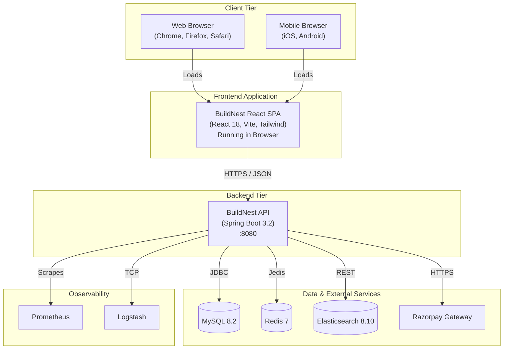

#### 4.1.2 External System Interfaces

| External System    | Protocol      | Data Format | Purpose                    | Failure Mode                                                      |
| ------------------ | ------------- | ----------- | -------------------------- | ----------------------------------------------------------------- |
| MySQL 8.2          | JDBC/TCP:3306 | SQL         | Primary data store         | **Critical** — Circuit breaker (60% threshold)                    |
| Redis 7            | RESP/TCP:6379 | Key-Value   | Cache, rate limiting       | **Degraded** — Circuit breaker (50% threshold), graceful fallback |
| Elasticsearch 8.10 | HTTP:9200     | JSON        | Search, analytics, logging | **Optional** — Feature disabled if unavailable                    |
| Razorpay           | HTTPS         | JSON        | Payment processing         | **Degraded** — Orders without payment still work                  |
| Prometheus         | HTTP:8080     | OpenMetrics | Metrics scraping           | **None** — Passive consumer                                       |
| Logstash           | TCP:5000      | JSON        | Log aggregation            | **None** — Logs fall back to file                                 |

---

### 4.2 Composition View

#### 4.2.1 Package Structure

The application follows a **layered monolithic architecture** organized by feature:

```
com.example.buildnest_ecommerce/  # Backend Source
├── actuator/
├── config/
├── controller/
├── model/
├── repository/
├── service/
└── ... (standard Spring Boot structure)

buildnest-frontend/               # Frontend Source
├── public/                       # Static assets (favicon, robots.txt)
├── src/
│   ├── assets/                   # Images, fonts, global styles
│   ├── components/               # Reusable UI components
│   │   ├── common/               # Buttons, Inputs, Modals
│   │   ├── layout/               # Navbar, Footer, Sidebar
│   │   └── product/              # ProductCard, ProductList
│   ├── config/                   # Axios setup, constants
│   ├── context/                  # Context API (AuthContext, CartContext)
│   ├── hooks/                    # Custom React hooks (useAuth, useCart)
│   ├── pages/                    # Page components (routed views)
│   │   ├── admin/                # AdminDashboard, UserManagement
│   │   ├── auth/                 # Login, Register
│   │   ├── checkout/             # Checkout, Payment
│   │   └── core/                 # Home, ProductDetail, Cart
│   ├── router/                   # React Router configuration
│   ├── services/                 # API service modules
│   ├── utils/                    # Helper functions
│   ├── App.jsx                   # Root component
│   └── main.jsx                  # Entry point
└── package.json                  # Dependencies
```

#### 4.2.2 Layer Architecture

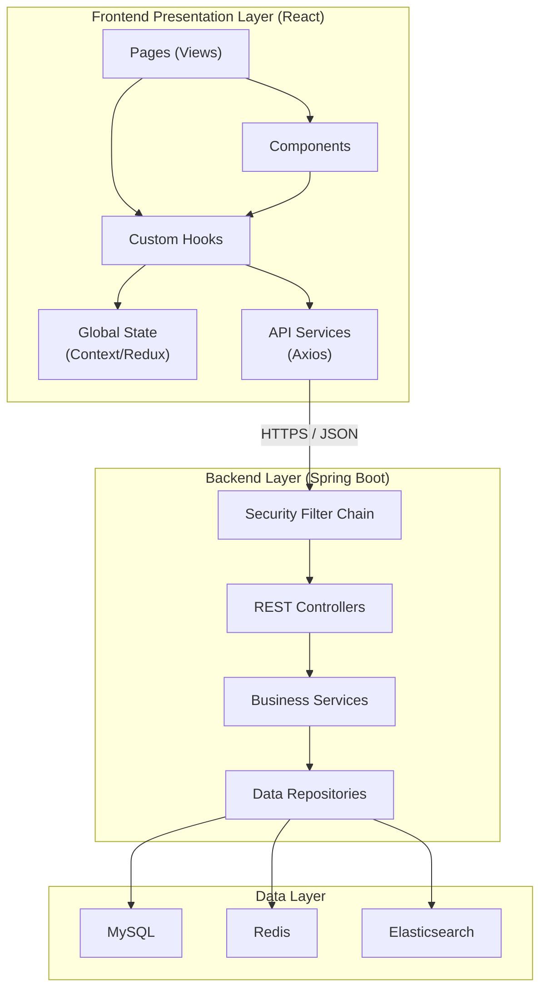

#### 4.2.3 Component Statistics

| Layer          | Component Count | Key Responsibilities                                        |
| -------------- | --------------- | ----------------------------------------------------------- |
| Presentation   | 28 controllers  | REST endpoints, request validation, response formatting     |
| Security       | 8 classes       | JWT auth, rate limiting, CORS, CSRF, HTTPS enforcement      |
| Business Logic | 56 services     | Business rules, orchestration, validation, event publishing |
| Data Access    | 19 repositories | CRUD operations, queries, data mapping                      |
| Model          | 48 classes      | Entities, DTOs, payloads, ES documents                      |
| Configuration  | 38 classes      | Spring beans, externalized properties, infrastructure setup |
| Cross-Cutting  | 30 classes      | Events, exceptions, aspects, annotations, interceptors      |

---

### 4.3 Logical View

#### 4.3.1 Service Interface Pattern

All business services follow the **Interface-Implementation** pattern for testability:

| Interface                       | Implementation                 | Package                |
| ------------------------------- | ------------------------------ | ---------------------- |
| `AuthService`                   | `AuthServiceImpl`              | `service.auth`         |
| `CartService`                   | `CartServiceImpl`              | `service.cart`         |
| `CheckoutService`               | `CheckoutServiceImpl`          | `service.checkout`     |
| `OrderService`                  | `OrderServiceImpl`             | `service.order`        |
| `PaymentService`                | `PaymentServiceImpl`           | `service.payment`      |
| `ProductService`                | `ProductServiceImpl`           | `service.product`      |
| `CategoryService`               | `CategoryServiceImpl`          | `service.category`     |
| `InventoryService`              | `InventoryServiceImpl`         | `service.inventory`    |
| `ProductReviewService`          | `ProductReviewServiceImpl`     | `service.review`       |
| `PasswordResetService`          | `PasswordResetServiceImpl`     | `service.password`     |
| `SalesAnalyticsService`         | `SalesAnalyticsServiceImpl`    | `service.analytics`    |
| `IAdminAnalyticsService`        | `AdminAnalyticsService`        | `service.admin`        |
| `IAdminService`                 | `AdminServiceImpl`             | `service.admin`        |
| `IAuditLogService`              | `AuditLogService`              | `service.audit`        |
| `IRateLimiterService`           | `RateLimiterService`           | `service.ratelimit`    |
| `IRefreshTokenService`          | `RefreshTokenService`          | `service.token`        |
| `INotificationService`          | `NotificationService`          | `service.notification` |
| `IPerformanceMonitoringService` | `PerformanceMonitoringService` | `service.monitoring`   |

#### 4.3.2 Entity Hierarchy

All JPA entities reside in `model.entity`. Key marker interface:

- **`AggregateRoot`** — Marker interface identifying DDD aggregate boundaries. Implemented by `Order`.

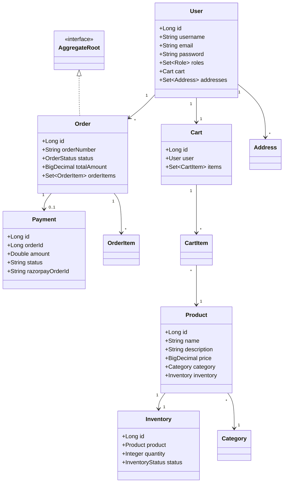

#### 4.3.3 Exception Hierarchy

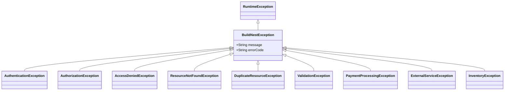

All exceptions are caught by `GlobalExceptionHandler` which maps them to appropriate HTTP status codes and standardized `ErrorResponse` payloads.

---

#### 4.3.4 Frontend Logical Structure

The frontend is structured as a tree of React components managed by a router and global state providers.

| Component Category | Key Components                                      | Purpose                                                          |
| ------------------ | --------------------------------------------------- | ---------------------------------------------------------------- |
| **Providers**      | `AuthProvider`, `CartProvider`                      | Manage global state (user session, cart items) via React Context |
| **Routes**         | `AppRouter`, `ProtectedRoute`                       | specialized routes for navigation and access control             |
| **Pages**          | `Home`, `ProductList`, `Checkout`, `AdminDashboard` | Top-level views corresponding to URL routes                      |
| **Layouts**        | `MainLayout`, `AdminLayout`, `AuthLayout`           | Wrappers defining common UI structure (Sidebar, Navbar)          |
| **Common**         | `Button`, `Input`, `Modal`, `Table`                 | Reusable atomic UI elements                                      |
| **Features**       | `ProductCard`, `CartDrawer`, `ReviewForm`           | Domain-specific composite components                             |
| **Services**       | `authService`, `apiClient`, `paymentService`        | API integration modules wrapping Axios                           |

### 4.4 Dependency View

#### 4.4.1 Technology Stack

| Category               | Technology                  | Version     | Purpose                         |
| ---------------------- | --------------------------- | ----------- | ------------------------------- |
| **Frontend Framework** | React 18                    | 18.2.x      | UI library                      |
| **Frontend Build**     | Vite                        | 5.x         | Build tool and dev server       |
| **Frontend State**     | Context API + Redux Toolkit | Latest      | Global state management         |
| **Frontend HTTP**      | Axios                       | 1.6.x       | HTTP client                     |
| **Frontend Routing**   | React Router DOM            | 6.20.x      | Client-side routing             |
| **Frontend Styling**   | Tailwind CSS                | 3.4.x       | Utility-first data-driven style |
| **Frontend Forms**     | Formik + Yup                | Latest      | Form validation                 |
| **Language**           | Java                        | 21 (LTS)    | Core language                   |
| **Framework**          | Spring Boot                 | 3.2.2       | Application framework           |
| **Security**           | Spring Security             | 6.x         | Authentication, authorization   |
| **Persistence**        | Spring Data JPA             | 3.2.x       | ORM / Repository pattern        |
| **Database**           | MySQL                       | 8.2         | Primary relational store        |
| **Cache**              | Spring Data Redis (Jedis)   | 3.2.x       | Distributed caching             |
| **Search**             | Spring Data Elasticsearch   | 5.2.x       | Full-text search and analytics  |
| **API Docs**           | SpringDoc OpenAPI           | 2.0.4       | Swagger UI / OpenAPI 3.0        |
| **JWT**                | JJWT                        | 0.12.3      | Token creation and validation   |
| **Resilience**         | Resilience4j                | 2.1.0       | Circuit breaker, time limiter   |
| **Rate Limiting**      | Bucket4j                    | 8.1.0       | Token bucket rate limiting      |
| **Migration**          | Liquibase                   | 4.x         | Database schema versioning      |
| **Metrics**            | Micrometer + Prometheus     | 1.12.x      | Metrics export                  |
| **Logging**            | Logback + SLF4J             | 1.4.x       | Structured JSON logging         |
| **Code Generation**    | Lombok                      | 1.18.x      | Boilerplate reduction           |
| **OAuth2**             | Spring Security OAuth2      | 6.x         | OAuth2 resource server & client |
| **Cloud**              | Spring Cloud                | 2024.0.2    | Cloud stream (Kafka)            |
| **Payment**            | Razorpay Java SDK           | Latest      | Payment gateway integration     |
| **Build**              | Apache Maven                | 3.9.x       | Build and dependency management |
| **Container**          | Docker                      | Multi-stage | Containerization                |
| **Orchestration**      | Kubernetes                  | 1.28+       | Container orchestration         |
| **IaC**                | Terraform                   | 1.x         | AWS infrastructure provisioning |

#### 4.4.2 Internal Dependency Graph

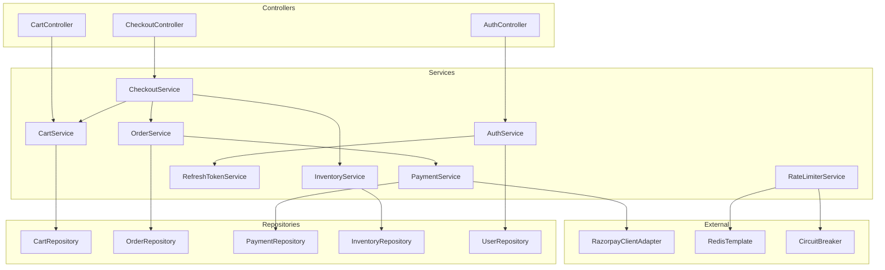

---

### 4.5 Information View

#### 4.5.1 Entity-Relationship Model

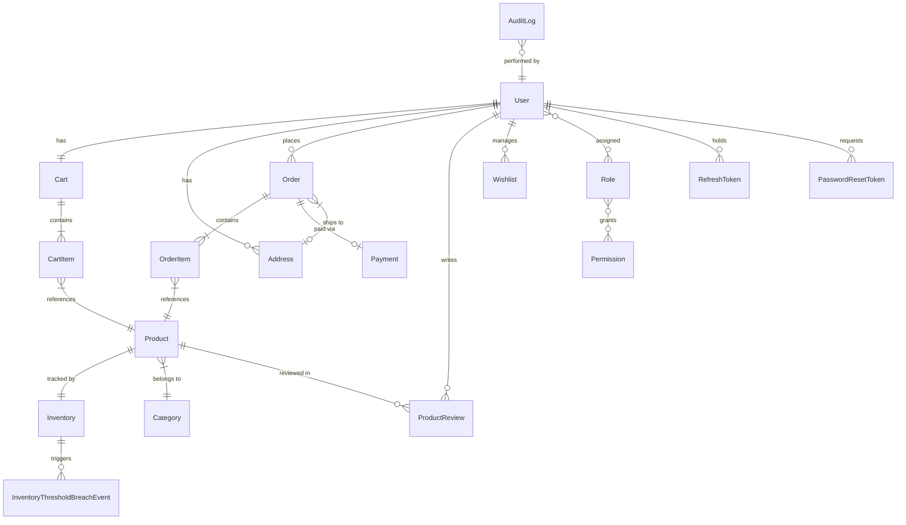

#### 4.5.2 Core Entity Details

| Entity                | Table                   | Primary Key                  | Key Constraints                       |
| --------------------- | ----------------------- | ---------------------------- | ------------------------------------- |
| `User`                | `users`                 | `id (BIGINT AUTO_INCREMENT)` | `username` UNIQUE, `email` UNIQUE     |
| `Role`                | `roles`                 | `id (BIGINT AUTO_INCREMENT)` | `name` UNIQUE (USER, ADMIN)           |
| `Permission`          | `permissions`           | `id (BIGINT AUTO_INCREMENT)` | `name` UNIQUE                         |
| `Product`             | `products`              | `id (BIGINT AUTO_INCREMENT)` | FK → `category_id`                    |
| `Category`            | `categories`            | `id (BIGINT AUTO_INCREMENT)` | `name` UNIQUE                         |
| `Cart`                | `carts`                 | `id (BIGINT AUTO_INCREMENT)` | FK → `user_id` (ONE-TO-ONE)           |
| `CartItem`            | `cart_items`            | `id (BIGINT AUTO_INCREMENT)` | FK → `cart_id`, FK → `product_id`     |
| `Order`               | `orders`                | `id (BIGINT AUTO_INCREMENT)` | `order_number` UNIQUE, FK → `user_id` |
| `OrderItem`           | `order_items`           | `id (BIGINT AUTO_INCREMENT)` | FK → `order_id`, FK → `product_id`    |
| `Payment`             | `payments`              | `id (BIGINT AUTO_INCREMENT)` | FK → `order_id`                       |
| `Inventory`           | `inventory`             | `id (BIGINT AUTO_INCREMENT)` | FK → `product_id` (ONE-TO-ONE)        |
| `ProductReview`       | `product_reviews`       | `id (BIGINT AUTO_INCREMENT)` | FK → `user_id`, FK → `product_id`     |
| `Wishlist`            | `wishlists`             | `id (BIGINT AUTO_INCREMENT)` | FK → `user_id`                        |
| `RefreshToken`        | `refresh_tokens`        | `id (BIGINT AUTO_INCREMENT)` | `token` UNIQUE, FK → `user_id`        |
| `PasswordResetToken`  | `password_reset_tokens` | `id (BIGINT AUTO_INCREMENT)` | `token` UNIQUE, FK → `user_id`        |
| `AuditLog`            | `audit_logs`            | `id (BIGINT AUTO_INCREMENT)` | FK → `user_id`                        |
| `Address`             | `addresses`             | `id (BIGINT AUTO_INCREMENT)` | FK → `user_id`                        |
| `WebhookSubscription` | `webhook_subscriptions` | `id (BIGINT AUTO_INCREMENT)` | `url`, `event_type`                   |

#### 4.5.3 Data Flow — Order Placement

| Step | From                  | To                    | Data                                                                      |
| ---- | --------------------- | --------------------- | ------------------------------------------------------------------------- |
| 1    | Client                | CheckoutController    | `POST /api/checkout/process-with-payment/{cartId}` + `CheckoutRequestDTO` |
| 2    | CheckoutController    | CheckoutServiceImpl   | `cartId`, `userId`, `CheckoutRequestDTO`                                  |
| 3    | CheckoutServiceImpl   | CartService           | Cart contents retrieval                                                   |
| 4    | CheckoutServiceImpl   | InventoryService      | Stock availability validation                                             |
| 5    | CheckoutServiceImpl   | Internal              | `createOrderFromCart()` — Order + OrderItems created                      |
| 6    | CheckoutServiceImpl   | InventoryService      | `deductInventoryFromCart()` — Stock deducted                              |
| 7    | CheckoutServiceImpl   | PaymentService        | `initiatePayment(orderId, amount)`                                        |
| 8    | PaymentService        | RazorpayClientAdapter | `createOrder(amount, orderId)`                                            |
| 9    | RazorpayClientAdapter | Razorpay API          | HTTP POST to create Razorpay order                                        |
| 10   | PaymentService        | PaymentRepository     | Save Payment entity                                                       |
| 11   | CheckoutServiceImpl   | CartRepository        | Clear cart after order                                                    |

#### 4.5.4 Cache Strategy

| Cache Region       | Key Pattern             | TTL                   | Backend |
| ------------------ | ----------------------- | --------------------- | ------- |
| `products`         | `product:{id}`          | 5 min (300,000 ms)    | Redis   |
| `categories`       | `category:{id}`         | 1 hour (3,600,000 ms) | Redis   |
| `users`            | `user:{id}`             | 30 min (1,800,000 ms) | Redis   |
| `orders`           | `order:{id}`            | 10 min (600,000 ms)   | Redis   |
| `rate-limit-stats` | `rate_limit:{key}`      | 1 min (60,000 ms)     | Redis   |
| `audit-logs`       | `audit:{id}`            | 15 min (900,000 ms)   | Redis   |
| `user-permissions` | `permissions:{userId}`  | 1 hour (3,600,000 ms) | Redis   |
| `inventory-items`  | `inventory:{productId}` | 5 min (300,000 ms)    | Redis   |

#### 4.5.5 Client-Side State Management

| State Type       | Storage Mechanism      | Content                                   | TTL / Persistence                                 |
| ---------------- | ---------------------- | ----------------------------------------- | ------------------------------------------------- |
| **Session**      | `localStorage`         | JWT Refresh Token, User Preferences       | Persistent until logout/clear                     |
| **Auth**         | React Context (Memory) | JWT Access Token, User Profile            | Clear on page reload (silent refresh restores it) |
| **Cart**         | Redux / Context        | Cart items, total amount                  | Synced with backend on change                     |
| **UI**           | Local Component State  | Form inputs, modal visibility, active tab | Transient (component lifecycle)                   |
| **Server Cache** | React Query / SWR      | Product lists, search results             | Configurable stale-time (e.g., 5 min)             |

---

### 4.6 Patterns Use View

#### 4.6.1 Design Patterns Applied

| Pattern                     | Category      | Usage                                                                     | Location                                 |
| --------------------------- | ------------- | ------------------------------------------------------------------------- | ---------------------------------------- |
| **Repository**              | Data Access   | All data access through Spring Data JPA repositories                      | `repository/` (19 classes)               |
| **Strategy**                | Behavioral    | Service interface + implementation allow swappable business logic         | All service packages                     |
| **Observer**                | Behavioral    | Domain events published and listened to asynchronously                    | `event/` (8 classes)                     |
| **Adapter**                 | Structural    | `RazorpayClientAdapter` wraps Razorpay SDK with domain-specific interface | `integration/`                           |
| **Circuit Breaker**         | Resilience    | Resilience4j circuit breakers protect Redis and database calls            | `config/ResilienceConfig`                |
| **Chain of Responsibility** | Behavioral    | Spring Security filter chain (JWT → Rate Limit → Authorization)           | `security/`                              |
| **Template Method**         | Behavioral    | Spring's `@Transactional` wraps service methods in transaction template   | Service implementations                  |
| **Builder**                 | Creational    | Lombok `@Builder` on DTOs and payloads                                    | `model/dto/`, `model/payload/`           |
| **DTO**                     | Transfer      | Separate DTOs/payloads from JPA entities for API responses                | `model/dto/` (13), `model/payload/` (11) |
| **Singleton**               | Creational    | Spring `@Configuration` beans (default scope)                             | All config classes                       |
| **Proxy**                   | Structural    | Spring AOP proxy for `@Cacheable`, `@Transactional`, `@Aspect`            | Aspect-oriented features                 |
| **Event-Driven**            | Architectural | Spring `ApplicationEvent` + `@EventListener` for domain events            | `event/DomainEventPublisher`             |
| **Interceptor**             | Behavioral    | HTTP interceptors for cross-cutting request processing                    | `interceptor/`                           |
| **Scheduler**               | Behavioral    | `@Scheduled` tasks for token cleanup and inventory monitoring             | `service/scheduler/`                     |

#### 4.6.2 Domain Events

| Event                     | Publisher              | Trigger                     | Consumers                          |
| ------------------------- | ---------------------- | --------------------------- | ---------------------------------- |
| `UserRegisteredEvent`     | `AuthServiceImpl`      | New user registration       | Notification service, audit log    |
| `OrderPlacedEvent`        | `CheckoutServiceImpl`  | Successful order placement  | Inventory, notifications, webhooks |
| `OrderStatusChangedEvent` | `OrderServiceImpl`     | Order status transition     | Notifications, audit log           |
| `PaymentSuccessfulEvent`  | `PaymentServiceImpl`   | Razorpay payment verified   | Order service, notifications       |
| `PaymentFailedEvent`      | `PaymentServiceImpl`   | Payment verification failed | Order service, notifications       |
| `LowStockWarningEvent`    | `InventoryServiceImpl` | Stock below threshold       | Admin notifications, webhooks      |

All events flow through `DomainEventPublisher` → `DomainEventListener` using Spring's `ApplicationEventPublisher`.

---

### 4.7 Interface View

#### 4.7.1 REST API Endpoint Summary

##### Authentication Endpoints (`/api/auth/`)

| Method | Endpoint                    | Auth   | Rate Limit     | Description              |
| ------ | --------------------------- | ------ | -------------- | ------------------------ |
| POST   | `/api/auth/register`        | Public | —              | User registration        |
| POST   | `/api/auth/login`           | Public | 3 req / 5 min  | JWT login                |
| POST   | `/api/auth/refresh-token`   | Public | 10 req / 1 min | Refresh access token     |
| POST   | `/api/auth/logout`          | USER   | —              | Invalidate refresh token |
| POST   | `/api/auth/forgot-password` | Public | 3 req / 1 hour | Request password reset   |
| POST   | `/api/auth/reset-password`  | Public | 3 req / 1 hour | Reset with token         |

##### User Endpoints (`/api/user/`)

| Method          | Endpoint                        | Auth | Rate Limit    | Description              |
| --------------- | ------------------------------- | ---- | ------------- | ------------------------ |
| GET             | `/api/user/profile`             | USER | 500 req / min | Get profile              |
| PUT             | `/api/user/profile`             | USER | 500 req / min | Update profile           |
| POST            | `/api/user/cart/add`            | USER | 500 req / min | Add cart item            |
| GET             | `/api/user/cart/{userId}`       | USER | 500 req / min | Get cart                 |
| DELETE          | `/api/user/cart/item/{id}`      | USER | 500 req / min | Remove cart item         |
| DELETE          | `/api/user/cart/clear/{userId}` | USER | 500 req / min | Clear cart               |
| GET             | `/api/user/cart/total/{userId}` | USER | 500 req / min | Cart total               |
| GET/POST        | `/api/user/products/**`         | USER | 60 req / min  | Product browsing (v1/v2) |
| POST            | `/api/user/reviews`             | USER | 500 req / min | Submit review            |
| POST/GET/DELETE | `/api/user/wishlist/**`         | USER | 500 req / min | Wishlist management      |

##### Checkout & Payment (`/api/checkout/`)

| Method | Endpoint                                      | Auth | Description                    |
| ------ | --------------------------------------------- | ---- | ------------------------------ |
| GET    | `/api/checkout/validate/{cartId}`             | USER | Validate cart for checkout     |
| GET    | `/api/checkout/calculate-total/{cartId}`      | USER | Calculate checkout total       |
| POST   | `/api/checkout/process/{cartId}`              | USER | Checkout without payment       |
| POST   | `/api/checkout/process-with-payment/{cartId}` | USER | Checkout with Razorpay payment |

##### Admin Endpoints (`/api/admin/`)

| Method   | Endpoint                   | Auth  | Rate Limit   | Description                 |
| -------- | -------------------------- | ----- | ------------ | --------------------------- |
| GET      | `/api/admin/analytics/**`  | ADMIN | 50 req / min | Sales & inventory analytics |
| POST/PUT | `/api/admin/products/**`   | ADMIN | 50 req / min | Product management          |
| GET/PUT  | `/api/admin/users/**`      | ADMIN | 50 req / min | User management             |
| GET      | `/api/admin/orders/**`     | ADMIN | 50 req / min | Order management            |
| GET      | `/api/admin/audit-logs/**` | ADMIN | 50 req / min | Audit log access            |
| POST/PUT | `/api/admin/inventory/**`  | ADMIN | 50 req / min | Inventory administration    |

##### Monitoring Endpoints

| Method | Endpoint                                 | Auth   | Description            |
| ------ | ---------------------------------------- | ------ | ---------------------- |
| GET    | `/actuator/health`                       | Public | Composite health check |
| GET    | `/actuator/prometheus`                   | Public | Prometheus metrics     |
| GET    | `/actuator/info`                         | Public | Application info       |
| GET    | `/api/inventory/product/{id}`            | Public | Product stock check    |
| GET    | `/api/inventory/check-availability/{id}` | Public | Availability check     |

#### 4.7.3 Frontend Routes

| Path              | Component           | Auth Required | Description                |
| ----------------- | ------------------- | ------------- | -------------------------- |
| `/`               | `Home`              | No            | Landing page               |
| `/login`          | `Login`             | No            | User login form            |
| `/register`       | `Register`          | No            | User registration form     |
| `/products`       | `ProductList`       | No            | Browse all products        |
| `/product/:id`    | `ProductDetail`     | No            | View product details       |
| `/cart`           | `Cart`              | Yes           | View and manage cart       |
| `/checkout`       | `Checkout`          | Yes           | Shipping and payment steps |
| `/profile`        | `Profile`           | Yes           | User profile and orders    |
| `/admin`          | `AdminDashboard`    | Yes (Admin)   | Admin overview             |
| `/admin/users`    | `UserManagement`    | Yes (Admin)   | Manage users               |
| `/admin/products` | `ProductManagement` | Yes (Admin)   | Manage catalog             |

#### 4.7.2 Standard Response Format

**Success Response:**

```json
{
  "success": true,
  "message": "Operation completed successfully",
  "data": { ... }
}
```

**Error Response:**

```json
{
  "timestamp": "2026-02-10T12:00:00",
  "status": 400,
  "error": "Bad Request",
  "message": "Validation failed: ...",
  "path": "/api/user/cart/add"
}
```

---

### 4.8 Interaction View

#### 4.8.1 User Authentication Sequence

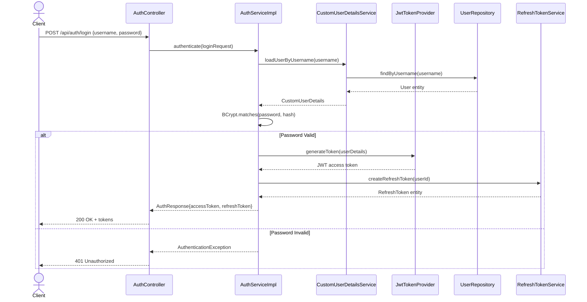

#### 4.8.2 Checkout with Payment Sequence

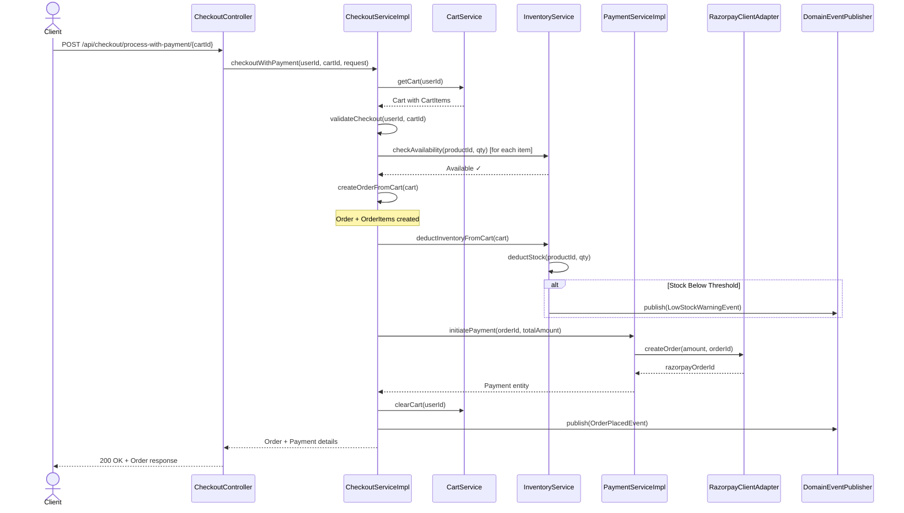

#### 4.8.3 Frontend Login Sequence

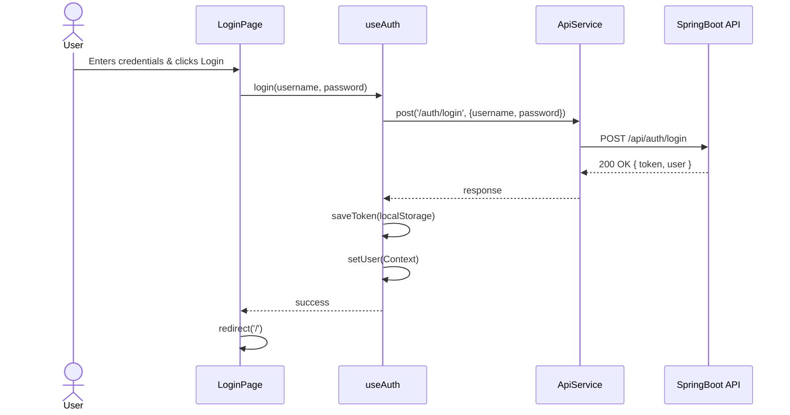

---

### 4.9 State Dynamics View

#### 4.9.1 Order State Machine

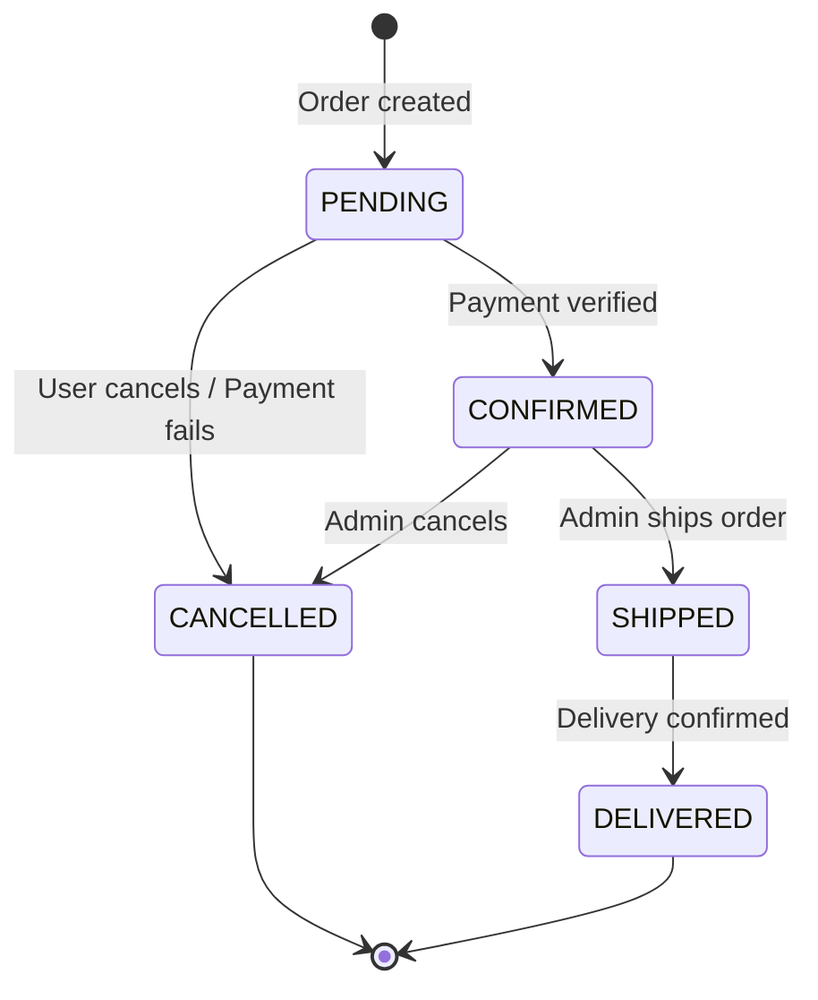

| State       | Description                     | Transitions                                                  |
| ----------- | ------------------------------- | ------------------------------------------------------------ |
| `PENDING`   | Order created, awaiting payment | → CONFIRMED (payment success), → CANCELLED (timeout/failure) |
| `CONFIRMED` | Payment verified, ready to ship | → SHIPPED (admin action), → CANCELLED (admin action)         |
| `SHIPPED`   | Order dispatched with tracking  | → DELIVERED (delivery confirmation)                          |
| `DELIVERED` | Order received by customer      | Terminal state                                               |
| `CANCELLED` | Order cancelled                 | Terminal state                                               |

#### 4.9.2 Payment State Machine

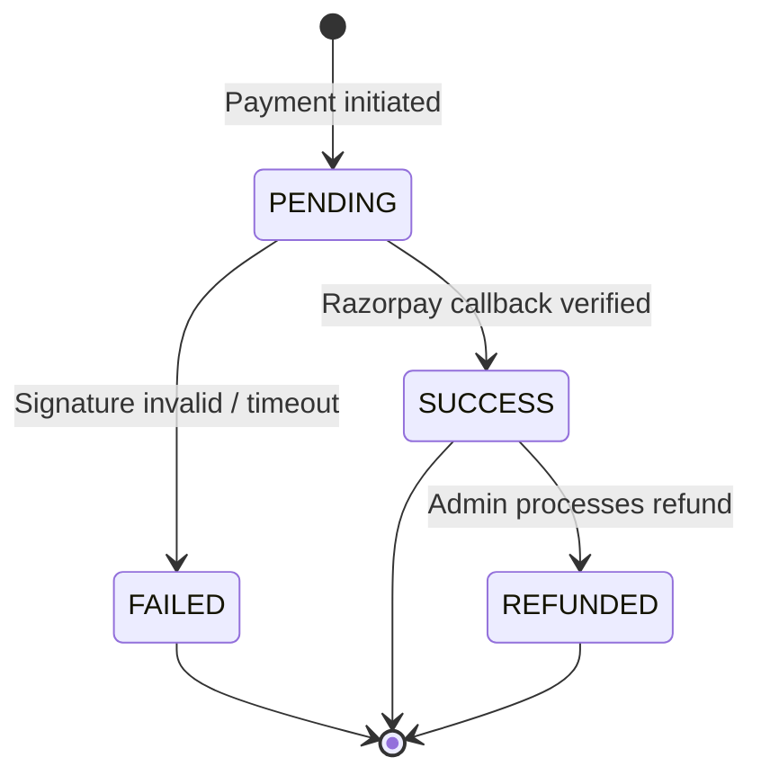

#### 4.9.3 Inventory Status

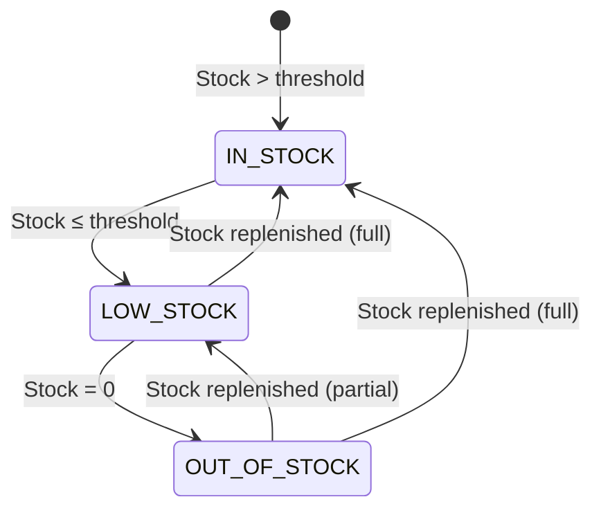

#### 4.9.4 Circuit Breaker States

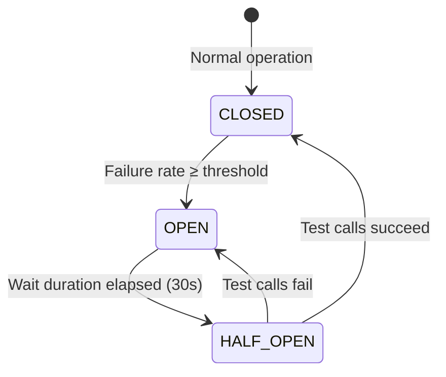

| Circuit Breaker | Failure Threshold | Wait Duration | Min Calls |
| --------------- | ----------------- | ------------- | --------- |
| Redis           | 50%               | 30 seconds    | 3         |
| Database        | 60%               | 60 seconds    | 5         |

---

### 4.10 Resource View

#### 4.10.1 Deployment Topology

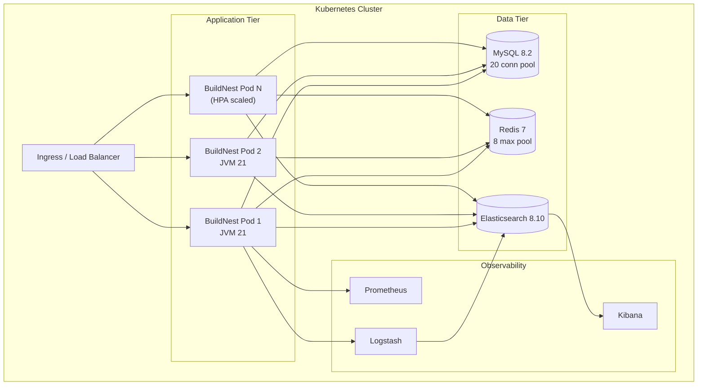

#### 4.10.2 Resource Configuration

| Resource           | Parameter          | Default      | Production           |
| ------------------ | ------------------ | ------------ | -------------------- |
| **JVM**            | Heap               | Auto         | `-Xms512m -Xmx1024m` |
| **Server**         | Port               | 8080         | 8080                 |
| **Server**         | Shutdown           | Graceful     | 30s timeout          |
| **HikariCP**       | Max Pool           | 20           | 20                   |
| **HikariCP**       | Min Idle           | 10           | 10                   |
| **HikariCP**       | Connection Timeout | 30,000 ms    | 30,000 ms            |
| **HikariCP**       | Idle Timeout       | 600,000 ms   | 600,000 ms           |
| **HikariCP**       | Max Lifetime       | 1,800,000 ms | 1,800,000 ms         |
| **HikariCP**       | Leak Detection     | 60,000 ms    | 60,000 ms            |
| **Redis Pool**     | Max Active         | 8            | 8                    |
| **Redis Pool**     | Max Idle           | 8            | 8                    |
| **Redis Pool**     | Max Wait           | 5,000 ms     | 5,000 ms             |
| **Redis**          | Timeout            | 3,000 ms     | 3,000 ms             |
| **Kubernetes HPA** | Min Replicas       | 2            | 2                    |
| **Kubernetes HPA** | Max Replicas       | N            | Based on load        |
| **Kubernetes HPA** | CPU Target         | —            | 75%                  |

#### 4.10.3 Thread & Connection Model

| Pool               | Size               | Purpose                             |
| ------------------ | ------------------ | ----------------------------------- |
| Tomcat Thread Pool | 200 (default)      | HTTP request handling               |
| HikariCP           | 20 max connections | Database JDBC connections           |
| Redis Jedis Pool   | 8 max connections  | Cache and rate limit operations     |
| Scheduler Pool     | 2 threads          | Token cleanup, inventory monitoring |

#### 4.10.4 Frontend Deployment

The React Frontend is built into static assets and served via an Nginx container.

| Component          | Configuration                             | Purpose                                         |
| ------------------ | ----------------------------------------- | ----------------------------------------------- |
| **Build Artifact** | `dist/` (HTML/CSS/JS)                     | Optimized static files                          |
| **Web Server**     | Nginx Alpine                              | Serves static files, handles logic routing      |
| **Docker Image**   | `buildnest-frontend:latest`               | Multi-stage build (Node build -> Nginx runtime) |
| **Ingress Path**   | `/`                                       | All non-API traffic routed here                 |
| **Caching**        | `Cache-Control: public, max-age=31536000` | Applied to hashed assets (JS/CSS)               |
| **Fallback**       | `try_files $uri /index.html`              | Supports client-side routing (SPAs)             |

---

## 5. Design Overlays

### 5.1 Security Overlay

#### 5.1.1 Security Filter Chain

Requests pass through the following security chain in order:

| Order | Filter/Component              | Purpose                                                        |
| ----- | ----------------------------- | -------------------------------------------------------------- |
| 1     | `HttpsEnforcementFilter`      | Redirects HTTP to HTTPS in production profile                  |
| 2     | CORS Configuration            | Validates allowed origins (default: `buildnest.com`)           |
| 3     | CSRF Protection               | Enabled for browser-based clients                              |
| 4     | `JwtAuthenticationFilter`     | Extracts and validates JWT from `Authorization: Bearer` header |
| 5     | `AdminRateLimitFilter`        | Enforces rate limits on admin endpoints                        |
| 6     | Spring Security Authorization | Role-based path matching (USER/ADMIN)                          |

#### 5.1.2 Authentication Design

| Component            | Technology        | Configuration                            |
| -------------------- | ----------------- | ---------------------------------------- |
| Password Hashing     | BCrypt            | 10 rounds                                |
| Access Token         | JWT (JJWT 0.12.3) | 15 min expiry, HS512 algorithm           |
| Refresh Token        | Opaque UUID       | 30 days expiry, stored in DB             |
| JWT Secret           | HMAC-SHA512       | Min 512-bit, env var `JWT_SECRET`        |
| Password Reset Token | Opaque token      | 15 min expiry (OWASP)                    |
| Key Validation       | `JwtKeyValidator` | Fail-fast on startup if secret too short |

#### 5.1.3 Authorization Matrix

| Endpoint Pattern       | USER | ADMIN | Public         |
| ---------------------- | ---- | ----- | -------------- |
| `/api/auth/**`         | —    | —     | ✅             |
| `/api/user/**`         | ✅   | ✅    | ❌             |
| `/api/admin/**`        | ❌   | ✅    | ❌             |
| `/api/checkout/**`     | ✅   | ✅    | ❌             |
| `/api/inventory/**`    | ✅   | ✅    | ✅ (read-only) |
| `/actuator/health`     | —    | —     | ✅             |
| `/actuator/prometheus` | —    | —     | ✅             |
| `/swagger-ui.html`     | —    | —     | ✅             |
| `/` (home)             | —    | —     | ✅             |

#### 5.1.4 Rate Limiting Design

| Endpoint Category         | Limit        | Window    | Strategy               |
| ------------------------- | ------------ | --------- | ---------------------- |
| Login (`/api/auth/login`) | 3 requests   | 5 minutes | Redis counter + TTL    |
| Password Reset            | 3 requests   | 1 hour    | Redis counter + TTL    |
| Token Refresh             | 10 requests  | 1 minute  | Redis counter + TTL    |
| Product Search            | 60 requests  | 1 minute  | Redis counter + TTL    |
| Admin Endpoints           | 50 requests  | 1 minute  | `AdminRateLimitFilter` |
| User Endpoints            | 500 requests | 1 minute  | Redis counter + TTL    |
| General API               | 200 requests | 1 minute  | Catch-all              |

**Graceful Degradation:** If Redis is unavailable, the circuit breaker opens and all requests are **allowed** (fail-open) to prevent service outage.

---

### 5.2 Error Handling Overlay

#### 5.2.1 Global Exception Handler

`GlobalExceptionHandler` (`@ControllerAdvice`) catches all exceptions and maps them:

| Exception Class              | HTTP Status               | Error Code               |
| ---------------------------- | ------------------------- | ------------------------ |
| `ResourceNotFoundException`  | 404 Not Found             | `RESOURCE_NOT_FOUND`     |
| `DuplicateResourceException` | 409 Conflict              | `DUPLICATE_RESOURCE`     |
| `ValidationException`        | 400 Bad Request           | `VALIDATION_ERROR`       |
| `AuthenticationException`    | 401 Unauthorized          | `AUTHENTICATION_FAILED`  |
| `AuthorizationException`     | 403 Forbidden             | `AUTHORIZATION_FAILED`   |
| `AccessDeniedException`      | 403 Forbidden             | `ACCESS_DENIED`          |
| `PaymentProcessingException` | 502 Bad Gateway           | `PAYMENT_ERROR`          |
| `ExternalServiceException`   | 503 Service Unavailable   | `EXTERNAL_SERVICE_ERROR` |
| `InventoryException`         | 409 Conflict              | `INVENTORY_ERROR`        |
| `Exception` (catch-all)      | 500 Internal Server Error | `INTERNAL_ERROR`         |

---

### 5.3 Resilience Overlay

#### 5.3.1 Circuit Breaker Configuration

| Circuit Breaker            | Target              | Failure Threshold | Slow Call Threshold | Wait Duration |
| -------------------------- | ------------------- | ----------------- | ------------------- | ------------- |
| `redis-circuit-breaker`    | Redis operations    | 50%               | —                   | 30 seconds    |
| `database-circuit-breaker` | Database operations | 60%               | 50% (>3s)           | 60 seconds    |

#### 5.3.2 Time Limiter Configuration

| Time Limiter            | Target              | Timeout   |
| ----------------------- | ------------------- | --------- |
| `redis-time-limiter`    | Redis operations    | 3 seconds |
| `database-time-limiter` | Database operations | 8 seconds |

#### 5.3.3 Graceful Degradation Matrix

| Failure Scenario   | Behavior                                                        | User Impact                                 |
| ------------------ | --------------------------------------------------------------- | ------------------------------------------- |
| Redis down         | Circuit breaker opens; rate limiting disabled; caching bypassed | Slightly higher latency; no rate protection |
| Database slow      | Circuit breaker opens after 60% failures; fast-fail responses   | 503 errors until recovery                   |
| Elasticsearch down | Feature disabled; search/analytics unavailable                  | Core e-commerce unaffected                  |
| Razorpay down      | Payment initiation fails; non-payment checkout still works      | Cannot process payments                     |
| Logstash down      | Logs fall back to file-based logging                            | No log aggregation                          |

---

## 6. Design Rationale

### 6.1 Architecture Decisions

| Decision                       | Rationale                                                               | Alternatives Considered                                    |
| ------------------------------ | ----------------------------------------------------------------------- | ---------------------------------------------------------- |
| **Monolithic architecture**    | Academic project scope; simpler development/deployment; single codebase | Microservices (rejected: premature complexity)             |
| **Layered package structure**  | Clear separation of concerns; enforced dependency direction             | Hexagonal architecture (deferred to future)                |
| **JWT stateless auth**         | Horizontal scalability without shared session store                     | Server-side sessions (rejected: scaling limitations)       |
| **Redis for rate limiting**    | Distributed, high-performance counter storage shared across pods        | In-memory rate limiting (rejected: not distributed)        |
| **Circuit breaker pattern**    | Prevent cascading failures; graceful degradation                        | Retry-only (rejected: doesn't prevent resource exhaustion) |
| **Service interface pattern**  | Testability via mocking; swappable implementations                      | Direct class dependencies (rejected: tight coupling)       |
| **Domain events**              | Loose coupling between bounded contexts; extensibility                  | Direct service calls (rejected: tight coupling)            |
| **Liquibase migrations**       | Version-controlled, repeatable schema management                        | Hibernate DDL auto (rejected: unsafe for production)       |
| **Spring Data JPA**            | Reduced boilerplate, type-safe queries, pagination support              | Raw JDBC/MyBatis (rejected: more boilerplate)              |
| **Externalized configuration** | 12-factor app compliance; environment-specific overrides                | Hard-coded values (rejected: security risk, inflexibility) |
| **Multi-stage Docker build**   | Smaller image size; build cache optimization; layer reuse               | Single-stage build (rejected: larger images)               |
| **Kubernetes deployment**      | Auto-scaling, self-healing, rolling updates, service discovery          | VM-based deployment (rejected: manual scaling)             |
| **API versioning (v1/v2)**     | Backward compatibility for evolving API contracts                       | URL versioning (chosen) over header versioning             |

### 6.2 Technology Selection Rationale

| Technology             | Why Selected                                                      | Trade-offs                                          |
| ---------------------- | ----------------------------------------------------------------- | --------------------------------------------------- |
| **Java 21**            | LTS release, virtual thread support, modern language features     | Higher memory usage vs Go/Rust                      |
| **Spring Boot 3.2**    | Mature ecosystem, extensive documentation, security features      | Opinionated, potentially heavy for simple APIs      |
| **MySQL 8.2**          | Proven RDBMS, strong ACID compliance, wide hosting support        | Less flexible than NoSQL for unstructured data      |
| **Redis 7**            | Sub-millisecond latency, pub/sub support, distributed operations  | Additional infrastructure component                 |
| **Elasticsearch 8.10** | Full-text search, analytics, log aggregation in one solution      | Resource-intensive; optional for core functionality |
| **Razorpay**           | India-focused payment gateway, comprehensive SDK, webhook support | Vendor lock-in; limited to Indian market            |

---

## 7. Appendices

### Appendix A: Configuration Properties Reference

| Property                                      | Default                                           | Env Variable Override    | Purpose                  |
| --------------------------------------------- | ------------------------------------------------- | ------------------------ | ------------------------ |
| `server.port`                                 | 8080                                              | —                        | HTTP port                |
| `server.shutdown`                             | graceful                                          | —                        | Shutdown strategy        |
| `spring.lifecycle.timeout-per-shutdown-phase` | 30s                                               | —                        | Drain timeout            |
| `jwt.secret`                                  | (none — required)                                 | `JWT_SECRET`             | JWT signing key          |
| `jwt.expiration`                              | 900,000 ms                                        | `JWT_EXPIRATION`         | Access token TTL         |
| `jwt.refresh-expiration`                      | 2,592,000,000 ms                                  | `JWT_REFRESH_EXPIRATION` | Refresh token TTL        |
| `spring.datasource.url`                       | `jdbc:mysql://localhost:3306/buildnest_ecommerce` | `SPRING_DATASOURCE_URL`  | Database URL             |
| `spring.data.redis.host`                      | localhost                                         | `REDIS_HOST`             | Redis host               |
| `razorpay.key.id`                             | test_key_id                                       | `RAZORPAY_KEY_ID`        | Razorpay API key         |
| `razorpay.key.secret`                         | test_key_secret                                   | `RAZORPAY_KEY_SECRET`    | Razorpay secret          |
| `elasticsearch.enabled`                       | false                                             | `ELASTICSEARCH_ENABLED`  | ES feature toggle        |
| `chaos.enabled`                               | false                                             | `CHAOS_ENABLED`          | Chaos engineering toggle |

### Appendix B: Kubernetes Manifest Inventory

| Manifest                | Path              | Purpose                               |
| ----------------------- | ----------------- | ------------------------------------- |
| `deployment.yaml`       | `k8s/base/`       | Application deployment spec           |
| `service.yaml`          | `k8s/base/`       | ClusterIP service                     |
| `ingress.yaml`          | `k8s/base/`       | External ingress rules                |
| `configmap.yaml`        | `k8s/base/`       | Non-sensitive configuration           |
| `secret.yaml`           | `k8s/base/`       | Sensitive credentials                 |
| `hpa.yaml`              | `k8s/base/`       | Horizontal Pod Autoscaler             |
| `kustomization.yaml`    | `k8s/base/`       | Kustomize configuration               |
| `blue-deployment.yaml`  | `k8s/blue-green/` | Blue deployment                       |
| `green-deployment.yaml` | `k8s/blue-green/` | Green deployment                      |
| `prometheus-rules.yaml` | `kubernetes/`     | 13 alerting rules across 6 categories |

### Appendix C: SRS Traceability

| SRS Requirement          | Design Element                                                       | Section                                                   |
| ------------------------ | -------------------------------------------------------------------- | --------------------------------------------------------- |
| FR-AUTH-01 to FR-AUTH-11 | `AuthServiceImpl`, `JwtTokenProvider`, `SecurityConfig`              | [§4.3](#43-logical-view), [§5.1](#51-security-overlay)    |
| FR-PROD-01 to FR-PROD-07 | `ProductServiceImpl`, `CategoryServiceImpl`, `CacheConfig`           | [§4.3](#43-logical-view), [§4.5](#45-information-view)    |
| FR-CART-01 to FR-CART-06 | `CartServiceImpl`, `CartController`                                  | [§4.3](#43-logical-view), [§4.7](#47-interface-view)      |
| FR-CHK-01 to FR-CHK-08   | `CheckoutServiceImpl`, `CheckoutController`                          | [§4.3](#43-logical-view), [§4.8](#48-interaction-view)    |
| FR-PAY-01 to FR-PAY-05   | `PaymentServiceImpl`, `RazorpayClientAdapter`                        | [§4.3](#43-logical-view), [§4.8](#48-interaction-view)    |
| FR-INV-01 to FR-INV-07   | `InventoryServiceImpl`, `InventoryMonitoringScheduler`               | [§4.3](#43-logical-view), [§4.9](#49-state-dynamics-view) |
| FR-REV-01 to FR-REV-03   | `ProductReviewServiceImpl`, `ReviewController`                       | [§4.3](#43-logical-view), [§4.7](#47-interface-view)      |
| FR-WISH-01 to FR-WISH-02 | `WishlistServiceImpl`, `WishlistController`                          | [§4.3](#43-logical-view), [§4.7](#47-interface-view)      |
| FR-ADM-01 to FR-ADM-08   | `AdminServiceImpl`, `AdminAnalyticsService`, `AuditLogService`       | [§4.3](#43-logical-view), [§4.7](#47-interface-view)      |
| FR-MON-01 to FR-MON-08   | Health indicators, `PerformanceMonitoringService`, Prometheus config | [§4.10](#410-resource-view)                               |
| FR-FE-01 to FR-FE-30     | `ReactApp`, `AppRouter`, `ApiService`, frontend components           | [§4.2](#42-composition-view), [§4.7](#47-interface-view)  |
| SEC-01 to SEC-13         | `SecurityConfig`, `JwtTokenProvider`, `RateLimiterService`           | [§5.1](#51-security-overlay)                              |
| REL-01 to REL-05         | `ResilienceConfig`, circuit breakers, time limiters                  | [§5.3](#53-resilience-overlay)                            |
| PR-01 to PR-08           | HikariCP config, Redis config, response time targets                 | [§4.10](#410-resource-view)                               |
| DC-01 to DC-06           | Package structure, Docker, K8s manifests, graceful shutdown          | [§4.2](#42-composition-view), [§4.10](#410-resource-view) |

---

**— End of Document —**

_This document was prepared in compliance with ISO/IEC/IEEE 1016:2017 for the BuildNest E-Commerce Platform._
