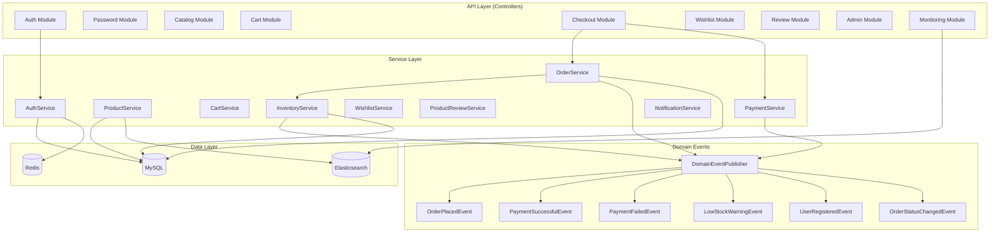
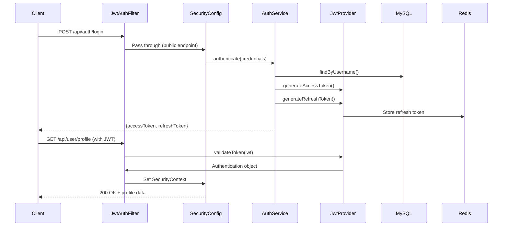
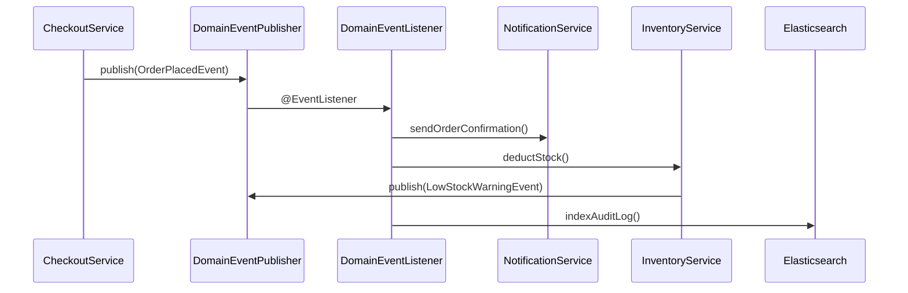
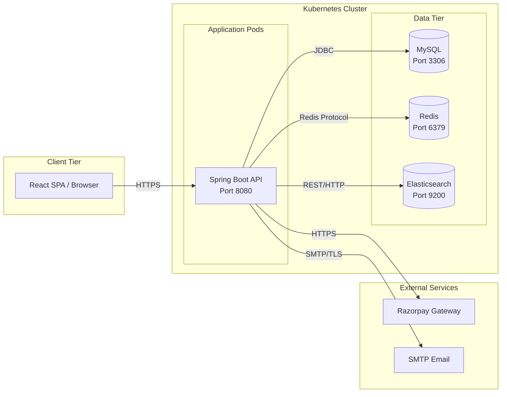

# Software Architecture Document (SAD)

## BuildNest E-Commerce Platform

**Document ID:** SAD-BUILDNEST-001
**Version:** 2.0
**Date:** 2026-02-11
**Standard:** ISO/IEC/IEEE 42010:2022

---

## 1. Introduction

### 1.1 Purpose

The purpose of this Software Architecture Document (SAD) is to provide a comprehensive architectural description of the **BuildNest E-Commerce Platform**. It identifies the system's stakeholders and their concerns, defines the architecture viewpoints used to frame those concerns, and presents the architecture views that satisfy them.

### 1.2 Scope

This architecture description covers the full-stack **BuildNest** system, including:

- **Frontend:** React-based Single Page Application (SPA).
- **Backend:** Spring Boot 3.x REST API (Modular Monolith).
- **Data Stores:** MySQL (primary), Redis (cache/sessions), Elasticsearch (analytics/audit).
- **Infrastructure:** Kubernetes-based container orchestration with Liquibase migrations.

### 1.3 Relationship to Other Documents

| Document                                        | Standard   | Relationship                                     |
| :---------------------------------------------- | :--------- | :----------------------------------------------- |
| [SRS](SRS_IEEE_29148_2018.md)                   | IEEE 29148 | Defines _what_ the system must do                |
| [SDD](SDD_IEEE_1016_2017.md)                    | IEEE 1016  | Details _how_ components are implemented         |
| [HLD](High_Level_Design_IEEE_42010.md)          | IEEE 42010 | Functional decomposition and data architecture   |
| [LLD](Low_Level_Design_IEEE_42010.md)           | IEEE 42010 | Physical schema, API contracts, algorithms       |
| [ICD](Interface_Control_Document_IEEE_42010.md) | IEEE 42010 | Interface specifications between modules         |
| **SAD** (this)                                  | IEEE 42010 | Explains _why_ the system is structured this way |

### 1.4 Glossary

| Term                 | Definition                                                          |
| :------------------- | :------------------------------------------------------------------ |
| **Modular Monolith** | Single deployable unit with well-defined internal module boundaries |
| **AOP**              | Aspect-Oriented Programming — cross-cutting concerns via `@Aspect`  |
| **DDD**              | Domain-Driven Design — entities implement `AggregateRoot` interface |
| **RBAC**             | Role-Based Access Control — `ROLE_USER`, `ROLE_ADMIN`               |
| **JWT**              | JSON Web Token — stateless authentication mechanism                 |
| **DFD**              | Data Flow Diagram                                                   |

---

## 2. Stakeholders and Concerns

| Stakeholder           | Key Concerns                                                                        |
| :-------------------- | :---------------------------------------------------------------------------------- |
| **Business Owners**   | Cost, Time-to-Market, Feasibility. System meets business goals within budget.       |
| **End Users**         | Usability, Performance, Availability. Responsive and reliable shopping experience.  |
| **Developers**        | Maintainability, Modularity, Standards. Clear code structure and patterns.          |
| **Maintainers / Ops** | Scalability, Monitorability, Evolvability. Operate, debug, and scale in production. |
| **Security Auditors** | Security, Compliance. AuthZ/AuthN implementation and data protection.               |
| **QA Engineers**      | Testability. Clear boundaries enable isolated unit and integration testing.         |

---

## 3. Architecture Viewpoints

To address these concerns, we utilize a **4+1 View Model** approach.

1. **Logical Viewpoint:** Functional requirements and module structure. Addresses _End Users_ and _Developers_.
2. **Process Viewpoint:** Runtime behavior, concurrency, event-driven flows. Addresses _Developers_ and _Ops_.
3. **Physical Viewpoint:** Deployment topology and infrastructure. Addresses _Maintainers/Ops_.
4. **Development Viewpoint:** Code organization, package structure, build. Addresses _Developers_.
5. **Scenarios (+1):** Use cases that validate the architecture. (Refer to [Use Case Specification](Use_Case_Specification_IEEE_29148.md)).

---

## 4. Logical View — System Decomposition

### 4.1 Module Inventory

The system is decomposed into **12 core modules** within a modular monolith.

|  #  | Module                    | Responsibility                                                    | Key Components (from codebase)                                                                                                           |
| :-: | :------------------------ | :---------------------------------------------------------------- | :--------------------------------------------------------------------------------------------------------------------------------------- |
|  1  | **Auth**                  | Identity, RBAC, JWT token lifecycle, rate limiting                | `AuthController`, `AuthService`, `JwtAuthenticationFilter`, `JwtProvider`, `RefreshTokenService`                                         |
|  2  | **Password**              | Password reset flows, change password, token mgmt                 | `PasswordResetController`, `PasswordResetService`, `PasswordResetToken`                                                                  |
|  3  | **Catalog**               | Product CRUD, categories, search, API versioning (V1/V2)          | `ProductControllerV1`, `ProductControllerV2`, `ProductService`, `CategoryService`                                                        |
|  4  | **Cart**                  | Shopping cart sessions, add/remove/clear, total calc              | `CartController`, `CartService`, `Cart`, `CartItem`                                                                                      |
|  5  | **Checkout & Orders**     | Order lifecycle (Pending → Confirmed → Shipped → Delivered)       | `CheckoutController`, `CheckoutService`, `OrderService`, `UserOrderController`                                                           |
|  6  | **Payment**               | Razorpay integration, signature validation, webhooks              | `PaymentService`, `PaymentSignatureValidationService`                                                                                    |
|  7  | **Inventory**             | Stock tracking, reservation, threshold monitoring, analytics      | `InventoryService`, `InventoryMonitoringService`, `InventoryAnalyticsService`, `InventoryReportService`                                  |
|  8  | **Wishlist**              | User product favorites, add/remove/check/clear                    | `WishlistController`, `WishlistService`, `Wishlist`                                                                                      |
|  9  | **Reviews**               | Product ratings (1-5), comments, helpful votes, verified purchase | `ProductReviewController`, `ProductReviewService`, `ProductReview`                                                                       |
| 10  | **Admin**                 | Product/Order/User/Inventory/Analytics management                 | `AdminProductController`, `AdminOrderController`, `AdminUserController`, `AdminInventoryController`, `AdminAnalyticsController` + 5 more |
| 11  | **Monitoring**            | Performance metrics, uptime, pool metrics, health checks          | `PerformanceMetricsController`, `PoolMetricsController`, `DatabaseHealthIndicator`, `RedisHealthIndicator`                               |
| 12  | **Notification & Events** | Domain event publishing, email notifications, webhooks            | `DomainEventPublisher`, `DomainEventListener`, `NotificationService`, `WebhookAdminController`                                           |

### 4.2 Module Dependency Diagram



### 4.3 Cross-Cutting Concerns

These concerns span multiple modules and are implemented via Spring AOP, filters, and interceptors.

| Concern                    | Implementation                             | Key Classes                                                           |
| :------------------------- | :----------------------------------------- | :-------------------------------------------------------------------- |
| **Audit Logging**          | `@Aspect` AOP with `@Auditable` annotation | `AuditAspect`, `Auditable`, `AuditLogService`                         |
| **Rate Limiting**          | Servlet filter + service                   | `AdminRateLimitFilter`, `RateLimiterService`, `RateLimitConfig`       |
| **Authentication**         | JWT filter chain                           | `JwtAuthenticationFilter`, `JwtAuthenticationEntryPoint`              |
| **API Versioning**         | URI versioning with sunset annotation      | `@ApiSunset`, `ApiSunsetConfig`, `ProductControllerV1/V2`             |
| **Resilience**             | Circuit breaker, retry patterns            | `ResilienceConfig`                                                    |
| **Chaos Engineering**      | Fault injection for testing                | `ChaosEngineeringFilter`                                              |
| **Input Validation**       | Bean validation + custom validators        | `InputValidationEnhancementConfig`, 9 validators                      |
| **Performance Monitoring** | Metrics collection + alerting              | `PerformanceMonitoringConfig`, `ElasticsearchMetricsCollectorService` |
| **Graceful Shutdown**      | Clean resource disposal                    | `GracefulShutdownConfig`                                              |
| **DTO Mapping**            | Consistent DTO transformation              | `DTOMappingConsistencyConfig`                                         |
| **CORS**                   | Cross-origin request handling              | `SecurityConfig`, `WebMvcConfig`                                      |

---

## 5. Process View — Runtime Behavior

### 5.1 Authentication Flow



### 5.2 Domain Event Flow



### 5.3 Scheduled Background Tasks

| Scheduler            | Class                          | Frequency    | Purpose                             |
| :------------------- | :----------------------------- | :----------- | :---------------------------------- |
| Token Cleanup        | `TokenCleanupScheduler`        | Configurable | Remove expired refresh/reset tokens |
| Inventory Monitoring | `InventoryMonitoringScheduler` | Configurable | Check stock levels, trigger alerts  |

---

## 6. Physical View — Deployment

### 6.1 Deployment Topology



### 6.2 Infrastructure Components

| Component            | Technology      | Purpose                              | Configuration                                               |
| :------------------- | :-------------- | :----------------------------------- | :---------------------------------------------------------- |
| **Database**         | MySQL           | Primary data store (17 entities)     | `application.properties` JDBC                               |
| **Cache**            | Redis           | Token store, product cache, sessions | `CacheConfig`, Lettuce client                               |
| **Search/Analytics** | Elasticsearch   | Audit logs, metrics, search          | `ElasticsearchConfig`                                       |
| **Migrations**       | Liquibase       | Schema versioning                    | `db.changelog-master.yaml`                                  |
| **Containerization** | Docker + K8s    | Deployment orchestration             | `KubernetesDeploymentConfig`, `ContainerOptimizationConfig` |
| **CI/CD**            | Pipeline config | Automated build/test/deploy          | `CICDPipelineConfig`                                        |

### 6.3 Health & Observability

| Endpoint                      | Provider                       | Purpose                |
| :---------------------------- | :----------------------------- | :--------------------- |
| `/actuator/health`            | Spring Actuator                | Overall health check   |
| `/actuator/health/db`         | `DatabaseHealthIndicator`      | MySQL connectivity     |
| `/actuator/health/redis`      | `RedisHealthIndicator`         | Redis connectivity     |
| `/api/monitoring/performance` | `PerformanceMetricsController` | Application metrics    |
| `/api/monitoring/pool`        | `PoolMetricsController`        | Connection pool status |

---

## 7. Development View — Code Organization

### 7.1 Package Structure

```
com.example.buildnest_ecommerce/
├── CivilEcommerceApplication.java       # Entry point
├── actuator/                            # Custom health indicators (2 files)
│   ├── DatabaseHealthIndicator.java
│   └── RedisHealthIndicator.java
├── annotation/                          # Custom annotations (2 files)
│   ├── ApiSunset.java
│   └── ServiceLayerOnly.java
├── aspect/                              # AOP aspects (2 files)
│   ├── AuditAspect.java
│   └── Auditable.java
├── config/                              # Configuration classes (38 files)
│   ├── SecurityConfig.java
│   ├── CacheConfig.java
│   ├── ElasticsearchConfig.java
│   ├── RateLimitConfig.java
│   ├── ResilienceConfig.java
│   ├── ChaosEngineeringFilter.java
│   ├── GracefulShutdownConfig.java
│   └── ... (31 more)
├── controller/                          # REST controllers (28 files)
│   ├── admin/ (14 controllers)
│   ├── auth/ (2 controllers)
│   ├── inventory/ (1 controller)
│   ├── monitoring/ (2 controllers)
│   ├── public_/ (1 controller)
│   └── user/ (8 controllers)
├── event/                               # Domain events (8 files)
├── exception/                           # Custom exceptions (11 files)
├── interceptor/                         # HTTP interceptors (3 files)
├── model/                               # Entities, DTOs, Payloads (48 files)
│   ├── dto/ (13 DTOs)
│   ├── entity/ (17 entities)
│   ├── elasticsearch/ (2 docs)
│   └── payload/ (10 request/response)
├── repository/                          # JPA repositories (19 files)
├── security/                            # Security components (8 files)
├── service/                             # Business logic (56 files)
│   ├── admin/, analytics/, audit/
│   ├── auth/, cart/, category/
│   ├── checkout/, elasticsearch/
│   ├── inventory/, monitoring/
│   ├── notification/, order/
│   ├── password/, payment/
│   ├── product/, ratelimit/
│   ├── review/, scheduler/
│   ├── token/, user/, webhook/
│   └── wishlist/
├── util/                                # Utilities (13 files)
├── validation/                          # Custom validators (4 files)
└── validator/                           # Bean validators (9 files)
```

### 7.2 Technology Stack

| Layer          | Technology                                   | Version                          |
| :------------- | :------------------------------------------- | :------------------------------- |
| **Language**   | Java                                         | 17+                              |
| **Framework**  | Spring Boot                                  | 3.x                              |
| **ORM**        | Spring Data JPA (Hibernate)                  | —                                |
| **Security**   | Spring Security + JWT                        | —                                |
| **Build**      | Maven                                        | —                                |
| **Database**   | MySQL                                        | 8.x                              |
| **Cache**      | Redis (Lettuce)                              | —                                |
| **Search**     | Elasticsearch (Spring Data)                  | —                                |
| **Migrations** | Liquibase                                    | —                                |
| **Testing**    | JUnit 5, Mockito, Spring Boot Test, Selenium | —                                |
| **API Docs**   | OpenAPI 3 / Swagger                          | `OpenAPIConfig`, `SwaggerConfig` |

---

## 8. Architecture Decisions

### 8.1 Key Decisions (ADR Summary)

|   #   | Decision                                    | Rationale                                                               | Alternatives Rejected                                         |
| :---: | :------------------------------------------ | :---------------------------------------------------------------------- | :------------------------------------------------------------ |
| AD-01 | **Modular Monolith** over Microservices     | Simpler deployment for MVP; internal boundaries allow future extraction | Microservices (operational complexity too high for team size) |
| AD-02 | **JWT** for stateless auth                  | Horizontal scaling without session stickiness                           | Session-based auth (sticky sessions limit scaling)            |
| AD-03 | **Spring Events** for domain events         | Loose coupling without external broker dependency                       | RabbitMQ/Kafka (infrastructure overhead for MVP)              |
| AD-04 | **AOP** for audit logging                   | Non-invasive cross-cutting; `@Auditable` annotation                     | Manual logging (code duplication)                             |
| AD-05 | **API Versioning via URI** (`/v1/`, `/v2/`) | Explicit, easy to sunset with `@ApiSunset`                              | Header versioning (less discoverable)                         |
| AD-06 | **DDD Aggregate Roots**                     | Entities implement `AggregateRoot` for consistency boundaries           | Anemic domain model                                           |
| AD-07 | **Elasticsearch** for analytics             | Separate read-heavy analytics from transactional MySQL                  | MySQL views (performance impact on OLTP)                      |
| AD-08 | **Redis** for token storage                 | Fast token lookup + TTL-based expiry                                    | Database tokens (slower, manual cleanup)                      |

---

## 9. Quality Attribute Mapping

| Quality Attribute (ISO 25010) | Architectural Tactic               | Implementation                                                             |
| :---------------------------- | :--------------------------------- | :------------------------------------------------------------------------- |
| **Performance**               | Caching, async events, DB indexes  | `CacheConfig`, `DatabaseQueryOptimizationConfig`, performance indexes      |
| **Security**                  | Defense in depth, JWT, RBAC        | `SecurityConfig`, `JwtAuthenticationFilter`, `AdminRateLimitFilter`        |
| **Reliability**               | Resilience patterns, health checks | `ResilienceConfig`, `GracefulShutdownConfig`, actuator health              |
| **Maintainability**           | Modular packages, DDD, AOP         | Package-per-feature, `AggregateRoot`, `AuditAspect`                        |
| **Testability**               | Interface segregation, DI, mocking | Service interfaces (`IAdminAnalyticsService`, `IRateLimiterService`, etc.) |
| **Scalability**               | Stateless JWT, cache tier, K8s     | Redis token store, container orchestration                                 |
| **Interoperability**          | OpenAPI, webhook system            | `OpenAPIConfig`, `WebhookAdminController`                                  |
| **Portability**               | Container-first, external config   | `ContainerOptimizationConfig`, `KubernetesDeploymentConfig`                |

---

## 10. Traceability

| Module                  | SRS Requirements         | SDD Sections |
| :---------------------- | :----------------------- | :----------- |
| **Auth**                | FR-AUTH-01 to FR-AUTH-11 | §4.1         |
| **Password**            | FR-AUTH-09 to FR-AUTH-11 | §4.2         |
| **Catalog**             | FR-PROD-01 to FR-PROD-07 | §4.3         |
| **Cart**                | FR-CART-01 to FR-CART-06 | §4.4         |
| **Checkout & Orders**   | FR-CHK-01 to FR-CHK-08   | §4.5         |
| **Payment**             | FR-PAY-01 to FR-PAY-05   | §4.6         |
| **Inventory**           | FR-INV-01 to FR-INV-07   | §4.7         |
| **Wishlist**            | FR-WISH-01 to FR-WISH-05 | §4.8         |
| **Reviews**             | FR-REV-01 to FR-REV-05   | §4.9         |
| **Admin**               | FR-ADM-01 to FR-ADM-12   | §4.10        |
| **Monitoring**          | FR-MON-01 to FR-MON-08   | §4.11        |
| **Notification/Events** | FR-NOT-01 to FR-NOT-05   | §4.12        |

---

## 11. Revision History

| Version | Date       | Author         | Changes                                                                          |
| :------ | :--------- | :------------- | :------------------------------------------------------------------------------- |
| 1.0     | 2026-02-10 | BuildNest Arch | Initial draft — 6 modules                                                        |
| 2.0     | 2026-02-11 | BuildNest Arch | Exhaustive update — 12 modules, cross-cutting concerns, events, deployment, ADRs |

---

**— End of Document —**
