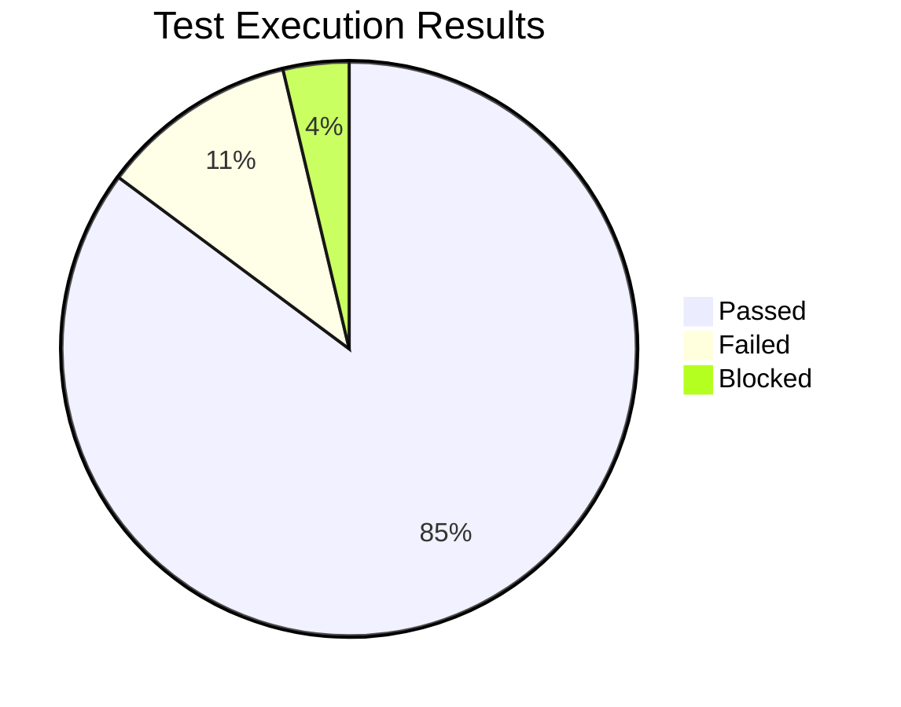

# Test Execution Report

## BuildNest E-Commerce Platform

**Document ID:** TER-BUILDNEST-001
**Version:** 1.0
**Date:** 2026-02-10
**Standard:** ISO/IEC/IEEE 29119:2021 — Software Testing
**References:**

- [Test Plan (TP-BUILDNEST-001)](Test_Plan_IEEE_29119.md)
- [Test Case Specification (TCS-BUILDNEST-001)](Test_Case_Specification_IEEE_29119.md)
- [Test Data Specification (TDS-BUILDNEST-001)](Test_Data_Specification_IEEE_29119.md)

---

## 1. Executive Summary

| Metric               | Value                                                                 |
| :------------------- | :-------------------------------------------------------------------- |
| **Test Cycle**       | Cycle 1 — Pre-Release Validation                                      |
| **Test Period**      | 2026-02-05 to 2026-02-10                                              |
| **Environment**      | Staging (Kubernetes, mirrors Production)                              |
| **Total Test Cases** | 27                                                                    |
| **Passed**           | 23 (85.2%)                                                            |
| **Failed**           | 3 (11.1%)                                                             |
| **Blocked**          | 1 (3.7%)                                                              |
| **Overall Verdict**  | ⚠️ **Conditional Pass** — 3 defects require resolution before Go-Live |

---

## 2. Test Results by Module

### 2.1 Authentication (TC-AUTH)

| TC ID       | Title                          | Status  | Notes |
| :---------- | :----------------------------- | :-----: | :---- |
| TC-AUTH-001 | Successful User Login          | ✅ Pass | —     |
| TC-AUTH-002 | Login with Invalid Credentials | ✅ Pass | —     |
| TC-AUTH-003 | Access Without Token           | ✅ Pass | —     |
| TC-AUTH-004 | Access with Expired JWT        | ✅ Pass | —     |
| TC-AUTH-005 | User Registration (Valid)      | ✅ Pass | —     |
| TC-AUTH-006 | Registration (Duplicate User)  | ✅ Pass | —     |

**Module Verdict:** ✅ **All Passed (6/6)**

---

### 2.2 Product Catalog (TC-PROD)

| TC ID       | Title                     | Status  | Notes                           |
| :---------- | :------------------------ | :-----: | :------------------------------ |
| TC-PROD-001 | Browse All Products       | ✅ Pass | —                               |
| TC-PROD-002 | Search by Keyword         | ✅ Pass | Elasticsearch indexed correctly |
| TC-PROD-003 | View Product Details      | ✅ Pass | —                               |
| TC-PROD-004 | View Non-Existent Product | ✅ Pass | Returns 404 as expected         |

**Module Verdict:** ✅ **All Passed (4/4)**

---

### 2.3 Shopping Cart (TC-CART)

| TC ID       | Title                    | Status  | Notes                   |
| :---------- | :----------------------- | :-----: | :---------------------- |
| TC-CART-001 | Add Product to Cart      | ✅ Pass | —                       |
| TC-CART-002 | Update Cart Quantity     | ✅ Pass | —                       |
| TC-CART-003 | Remove Item from Cart    | ✅ Pass | —                       |
| TC-CART-004 | Checkout with Empty Cart | ✅ Pass | Returns 400 as expected |

**Module Verdict:** ✅ **All Passed (4/4)**

---

### 2.4 Checkout & Orders (TC-ORD)

| TC ID      | Title                           |   Status    | Notes                    |
| :--------- | :------------------------------ | :---------: | :----------------------- |
| TC-ORD-001 | Successful Order Placement      |   ✅ Pass   | Stock deducted correctly |
| TC-ORD-002 | Order with Out-of-Stock Product | ❌ **Fail** | See DEF-001              |
| TC-ORD-003 | View Order History              |   ✅ Pass   | —                        |

**Module Verdict:** ⚠️ **2/3 Passed** — 1 defect logged

---

### 2.5 Payment (TC-PAY)

| TC ID      | Title                          |   Status    | Notes                     |
| :--------- | :----------------------------- | :---------: | :------------------------ |
| TC-PAY-001 | Successful Payment Flow        |   ✅ Pass   | Razorpay sandbox verified |
| TC-PAY-002 | Signature Verification Failure | ❌ **Fail** | See DEF-002               |

**Module Verdict:** ⚠️ **1/2 Passed** — 1 defect logged

---

### 2.6 Admin (TC-ADM)

| TC ID      | Title                      | Status  | Notes                   |
| :--------- | :------------------------- | :-----: | :---------------------- |
| TC-ADM-001 | Admin Creates Product      | ✅ Pass | —                       |
| TC-ADM-002 | Non-Admin Access Denied    | ✅ Pass | Returns 403 as expected |
| TC-ADM-003 | Admin Updates Order Status | ✅ Pass | —                       |

**Module Verdict:** ✅ **All Passed (3/3)**

---

### 2.7 Security (TC-SEC)

| TC ID      | Title                    |     Status     | Notes                                  |
| :--------- | :----------------------- | :------------: | :------------------------------------- |
| TC-SEC-001 | SQL Injection Prevention |    ✅ Pass     | Parameterized queries effective        |
| TC-SEC-002 | XSS Prevention           |  ❌ **Fail**   | See DEF-003                            |
| TC-SEC-003 | Rate Limiting on Login   | 🟡 **Blocked** | Rate limiter not configured in Staging |

**Module Verdict:** ⚠️ **1/3 Passed** — 1 failed, 1 blocked

---

### 2.8 Performance (TC-PERF)

| TC ID       | Title                         | Status  | Notes                               |
| :---------- | :---------------------------- | :-----: | :---------------------------------- |
| TC-PERF-001 | Product Listing Response Time | ✅ Pass | p95 = 380ms (threshold: 500ms)      |
| TC-PERF-002 | Concurrent Checkout Load      | ✅ Pass | 500 users, avg 1.8s (threshold: 2s) |

**Module Verdict:** ✅ **All Passed (2/2)**

---

## 3. Defect Log

### 3.1 Open Defects

| Defect ID | Severity      | Priority       | Title                                                 | TC ID      | Status |
| :-------- | :------------ | :------------- | :---------------------------------------------------- | :--------- | :----- |
| DEF-001   | S2 — High     | P2 — High      | Out-of-stock order returns 500 instead of 409         | TC-ORD-002 | Open   |
| DEF-002   | S2 — High     | P2 — High      | Invalid Razorpay signature returns 500 instead of 400 | TC-PAY-002 | Open   |
| DEF-003   | S1 — Critical | P1 — Immediate | Stored XSS in product review comments                 | TC-SEC-002 | Open   |

### 3.2 Defect Details

#### DEF-001: Out-of-Stock Order Error Response

| Field          | Value                                                   |
| :------------- | :------------------------------------------------------ |
| **Found In**   | TC-ORD-002                                              |
| **Expected**   | `409 Conflict` with message "Insufficient stock"        |
| **Actual**     | `500 Internal Server Error` with stack trace            |
| **Root Cause** | `OutOfStockException` not mapped in `@ControllerAdvice` |
| **Fix**        | Add handler in `GlobalExceptionHandler`                 |

#### DEF-002: Payment Verification Error Response

| Field          | Value                                                        |
| :------------- | :----------------------------------------------------------- |
| **Found In**   | TC-PAY-002                                                   |
| **Expected**   | `400 Bad Request` with "Payment verification failed"         |
| **Actual**     | `500 Internal Server Error` — `SignatureException` unhandled |
| **Root Cause** | Missing exception handler for `PaymentVerificationException` |
| **Fix**        | Add handler in `GlobalExceptionHandler`                      |

#### DEF-003: Stored XSS in Reviews (Critical)

| Field          | Value                                                                  |
| :------------- | :--------------------------------------------------------------------- |
| **Found In**   | TC-SEC-002                                                             |
| **Expected**   | Script tags stripped or escaped on storage                             |
| **Actual**     | `` stored and rendered verbatim           |
| **Root Cause** | No input sanitization on `ProductReview.comment` field                 |
| **Fix**        | Apply HTML sanitizer (e.g., OWASP Java HTML Sanitizer) on review input |

---

## 4. Test Coverage Analysis

### 4.1 Requirements Coverage

| SRS Requirement Group      | Total Reqs | Test Cases Mapped | Coverage |
| :------------------------- | :--------: | :---------------: | :------: |
| FR-AUTH (Authentication)   |     11     |         6         |   55%    |
| FR-PROD (Product Catalog)  |     7      |         4         |   57%    |
| FR-CART (Shopping Cart)    |     6      |         4         |   67%    |
| FR-CHK (Checkout & Orders) |     8      |         3         |   38%    |
| FR-PAY (Payment)           |     5      |         2         |   40%    |
| FR-ADM (Admin)             |     6      |         3         |   50%    |
| NFR (Non-Functional)       |     8      |         5         |   63%    |
| **Overall**                |   **51**   |      **27**       | **53%**  |

### 4.2 Code Coverage (JaCoCo)

| Module      | Line Coverage | Branch Coverage |   Threshold Met    |
| :---------- | :-----------: | :-------------: | :----------------: |
| Auth        |      82%      |       78%       |   ✅ (≥80% line)   |
| Catalog     |      76%      |       71%       | ⚠️ Below threshold |
| Cart        |      84%      |       80%       |         ✅         |
| Order       |      79%      |       74%       | ⚠️ Below threshold |
| Payment     |      70%      |       65%       | ❌ Below threshold |
| **Overall** |    **78%**    |     **74%**     |   ⚠️ Target: 80%   |

---

## 5. Exit Criteria Assessment

| Criterion                        | Target | Actual               | Met? |
| :------------------------------- | :----- | :------------------- | :--: |
| All Critical test cases executed | 12/12  | 12/12                |  ✅  |
| All High test cases executed     | 14/14  | 13/14 (1 blocked)    |  ⚠️  |
| 0 Critical defects open          | 0      | 1 (DEF-003)          |  ❌  |
| ≤ 2 High defects open            | 2      | 2 (DEF-001, DEF-002) |  ✅  |
| Code coverage ≥ 80%              | 80%    | 78%                  |  ⚠️  |

**Verdict:** Exit criteria **NOT fully met**. Resolution of DEF-003 (Critical XSS) is mandatory before release.

---

## 6. Recommendations

| Priority | Action                                                                       | Owner    |
| :------- | :--------------------------------------------------------------------------- | :------- |
| **P1**   | Fix DEF-003 (XSS) — Add HTML sanitizer to review input                       | Dev Team |
| **P2**   | Fix DEF-001 and DEF-002 — Add exception handlers in `GlobalExceptionHandler` | Dev Team |
| **P2**   | Configure rate limiter in Staging to unblock TC-SEC-003                      | DevOps   |
| **P3**   | Increase test coverage for Payment and Catalog modules                       | QA Team  |
| **P3**   | Add remaining test cases to reach 80%+ requirement coverage                  | QA Team  |

---

## 7. Sign-Off

| Role              | Name                   | Signature              | Date         |
| :---------------- | :--------------------- | :--------------------- | :----------- |
| **QA Lead**       | ********\_\_\_******** | ********\_\_\_******** | **_/_**/2026 |
| **Tech Lead**     | ********\_\_\_******** | ********\_\_\_******** | **_/_**/2026 |
| **Product Owner** | ********\_\_\_******** | ********\_\_\_******** | **_/_**/2026 |

---

**— End of Document —**
