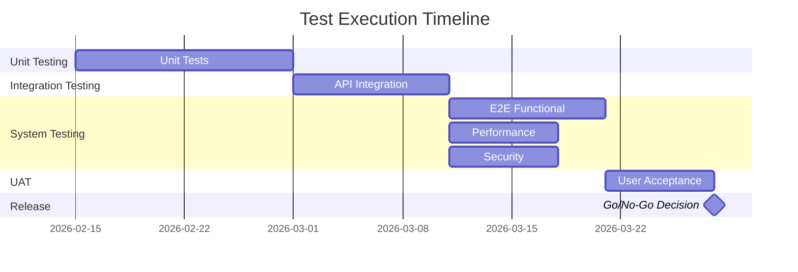
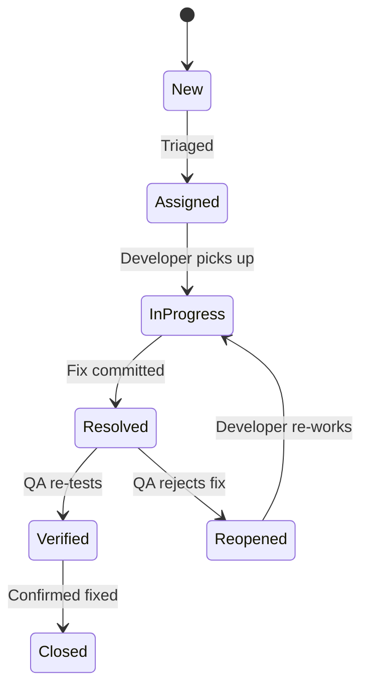

# Test Plan

## BuildNest E-Commerce Platform

**Document ID:** TP-BUILDNEST-001
**Version:** 1.0
**Date:** 2026-02-10
**Standard:** ISO/IEC/IEEE 29119-3:2021 — Software and Systems Engineering — Software Testing — Part 3: Test Documentation

---

## 1. Introduction

### 1.1 Purpose

This Test Plan defines the **strategy, scope, schedule, risks, and criteria** for testing the BuildNest E-Commerce Platform. It ensures systematic verification that all [SRS](SRS_IEEE_29148_2018.md) requirements are met before production release.

### 1.2 Normative References

| Standard                  | Title                                 |
| :------------------------ | :------------------------------------ |
| ISO/IEC/IEEE 29119-3:2021 | Software Testing — Test Documentation |
| ISO/IEC/IEEE 29148:2018   | Requirements Engineering              |
| ISO/IEC 25010:2011        | Software Product Quality              |

---

## 2. Test Strategy

### 2.1 Test Levels

| Level                             | Scope                              | Responsibility               | Tools                                 |
| :-------------------------------- | :--------------------------------- | :--------------------------- | :------------------------------------ |
| **Unit Testing**                  | Individual methods and classes     | Developers                   | JUnit 5, Mockito                      |
| **Integration Testing**           | Module interactions, API endpoints | Developers + QA              | Spring Boot Test, RestAssured, TestNG |
| **System Testing**                | End-to-end business flows          | QA Team                      | Selenium, Postman                     |
| **User Acceptance Testing (UAT)** | Business requirement validation    | Product Owner / Stakeholders | Manual scripts                        |

### 2.2 Test Types

| Type                    | Purpose                                           | Applied At          |
| :---------------------- | :------------------------------------------------ | :------------------ |
| **Functional Testing**  | Verify features work per SRS requirements         | All levels          |
| **Performance Testing** | Validate response times and throughput under load | System              |
| **Security Testing**    | Identify vulnerabilities (OWASP Top 10)           | Integration, System |
| **Regression Testing**  | Ensure new changes do not break existing features | Integration, System |
| **Usability Testing**   | Validate user experience and accessibility        | UAT                 |

### 2.3 Test Techniques

| Technique                    | Description                              | Applied To                    |
| :--------------------------- | :--------------------------------------- | :---------------------------- |
| **Equivalence Partitioning** | Divide inputs into valid/invalid classes | Login, Registration, Search   |
| **Boundary Value Analysis**  | Test at edges of input ranges            | Price fields, Quantity fields |
| **State Transition Testing** | Verify state machine correctness         | Order Status, Payment Status  |
| **Exploratory Testing**      | Unscripted testing to find edge cases    | UI flows, Error scenarios     |

---

## 3. Test Scope

### 3.1 Features In Scope

| Feature Group            | SRS Reference            | Priority |
| :----------------------- | :----------------------- | :------- |
| **User Authentication**  | FR-AUTH-01 to FR-AUTH-11 | Critical |
| **Product Catalog**      | FR-PROD-01 to FR-PROD-07 | High     |
| **Shopping Cart**        | FR-CART-01 to FR-CART-06 | High     |
| **Checkout & Orders**    | FR-CHK-01 to FR-CHK-08   | Critical |
| **Payment Processing**   | FR-PAY-01 to FR-PAY-05   | Critical |
| **Inventory Management** | FR-INV-01 to FR-INV-07   | High     |
| **Admin Dashboard**      | FR-ADM-01 to FR-ADM-06   | Medium   |
| **Frontend UI**          | FR-FE-01 to FR-FE-10     | High     |

### 3.2 Features Out of Scope

| Feature                        | Reason                             |
| :----------------------------- | :--------------------------------- |
| Third-party Razorpay internals | External system — tested via mocks |
| Mobile native apps             | Not in current release scope       |
| Internationalization (i18n)    | Deferred to v2.0                   |

---

## 4. Test Schedule & Resources

### 4.1 Phase Timeline

### 4.2 Test Environments

| Environment  | Purpose                      | Configuration               |
| :----------- | :--------------------------- | :-------------------------- |
| **Dev**      | Unit + Integration testing   | Local Docker Compose        |
| **Staging**  | System + Performance testing | Kubernetes (mirrors Prod)   |
| **Pre-Prod** | UAT and final validation     | Production-identical config |

### 4.3 Roles & Responsibilities

| Role              | Responsibility                                          |
| :---------------- | :------------------------------------------------------ |
| **Developer**     | Write and maintain unit/integration tests               |
| **QA Engineer**   | Design test cases, execute system tests, report defects |
| **Tech Lead**     | Review test coverage, approve Go/No-Go                  |
| **Product Owner** | Execute UAT, sign off on release                        |

---

## 5. Risk Analysis

### 5.1 Product Risks

| ID    | Risk                        | Likelihood |  Impact  | Mitigation                                         |
| :---- | :-------------------------- | :--------: | :------: | :------------------------------------------------- |
| PR-01 | Payment gateway failures    |   Medium   | Critical | Mock tests + Razorpay sandbox environment          |
| PR-02 | Data loss during checkout   |    Low     | Critical | Transaction rollback + DB backup verification      |
| PR-03 | Incorrect inventory counts  |   Medium   |   High   | Concurrent stock deduction tests with `FOR UPDATE` |
| PR-04 | XSS/SQL injection           |    Low     | Critical | OWASP ZAP scans + parameterized query enforcement  |
| PR-05 | Poor performance under load |   Medium   |   High   | JMeter load tests (500 concurrent users target)    |

### 5.2 Project Risks

| ID    | Risk                       | Likelihood | Impact | Mitigation                                     |
| :---- | :------------------------- | :--------: | :----: | :--------------------------------------------- |
| PJ-01 | Schedule slippage          |   Medium   | Medium | Prioritize Critical tests; automate regression |
| PJ-02 | Insufficient test data     |    Low     | Medium | Seed scripts for test databases                |
| PJ-03 | Environment unavailability |    Low     |  High  | Docker Compose fallback for local testing      |

---

## 6. Entry / Exit Criteria

### 6.1 Entry Criteria (Per Level)

| Test Level      | Entry Criteria                                           |
| :-------------- | :------------------------------------------------------- |
| **Unit**        | Code compiles; developer marks feature as "dev complete" |
| **Integration** | All unit tests pass; API endpoints deployed to Dev       |
| **System**      | Integration tests pass; Staging environment available    |
| **UAT**         | System tests pass; 0 Critical defects open               |

### 6.2 Exit Criteria (Per Level)

| Test Level      | Exit Criteria                                             |
| :-------------- | :-------------------------------------------------------- |
| **Unit**        | ≥ 80% branch coverage; 0 test failures                    |
| **Integration** | All API contracts verified; 0 Critical/High defects       |
| **System**      | All in-scope test cases executed; ≤ 2 Medium defects open |
| **UAT**         | Product Owner sign-off; 0 Critical/High defects           |

---

## 7. Test Deliverables

| Deliverable               | Description                                 | Produced At       |
| :------------------------ | :------------------------------------------ | :---------------- |
| **Test Cases**            | Detailed step-by-step cases per feature     | Before each level |
| **Test Execution Report** | Pass/Fail summary per test run              | After each level  |
| **Defect Log**            | All defects with severity, priority, status | Continuous        |
| **Coverage Report**       | JaCoCo code coverage output                 | Unit, Integration |
| **Performance Report**    | JMeter results (response times, throughput) | System            |
| **Security Scan Report**  | OWASP ZAP / Dependency-Check output         | System            |
| **UAT Sign-Off**          | Formal approval document                    | UAT               |

---

## 8. Defect Management

### 8.1 Severity Classification

| Severity          | Definition                               | Example                        |
| :---------------- | :--------------------------------------- | :----------------------------- |
| **S1 — Critical** | System crash, data loss, security breach | Payment double-charge          |
| **S2 — High**     | Major feature broken, no workaround      | Cannot complete checkout       |
| **S3 — Medium**   | Feature issue with workaround            | Sorting not working on catalog |
| **S4 — Low**      | Cosmetic or minor UI issue               | Misaligned button on mobile    |

### 8.2 Priority Classification

| Priority           | Response Time        | Resolution Target |
| :----------------- | :------------------- | :---------------- |
| **P1 — Immediate** | < 1 hour             | < 4 hours         |
| **P2 — High**      | < 4 hours            | < 24 hours        |
| **P3 — Normal**    | < 24 hours           | Next sprint       |
| **P4 — Low**       | Next sprint planning | Backlog           |

### 8.3 Defect Lifecycle

---

## 9. Traceability

| SRS Requirement Group    | Test Level                | Test Type               |
| :----------------------- | :------------------------ | :---------------------- |
| FR-AUTH (Authentication) | Unit, Integration         | Functional, Security    |
| FR-PROD (Products)       | Unit, Integration         | Functional              |
| FR-CART (Cart)           | Unit, Integration         | Functional              |
| FR-CHK (Checkout)        | Unit, Integration, System | Functional, Performance |
| FR-PAY (Payment)         | Integration, System       | Functional, Security    |
| FR-INV (Inventory)       | Unit, Integration         | Functional              |
| NFR (Performance)        | System                    | Performance             |
| NFR (Security)           | Integration, System       | Security                |

---

**— End of Document —**
