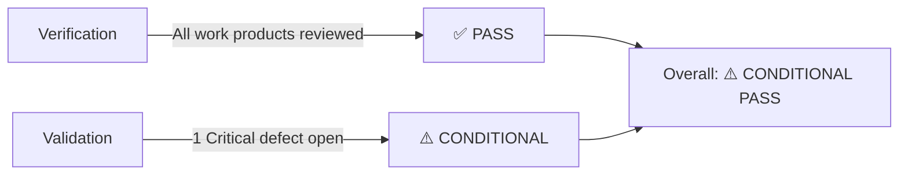

# Verification & Validation (V&V) Report

## BuildNest E-Commerce Platform

**Document ID:** VVR-BUILDNEST-001
**Version:** 1.0
**Date:** 2026-02-11
**Standard:** ISO/IEC/IEEE 12207:2017 — Software Life Cycle Processes (Clause 6.4.9 Verification, Clause 6.4.10 Validation)

---

## 1. Introduction

### 1.1 Purpose

This report documents the **Verification** and **Validation** activities performed on the BuildNest E-Commerce Platform per ISO/IEC/IEEE 12207:2017.

- **Verification:** "Are we building the product right?" — Confirms each work product conforms to its specification.
- **Validation:** "Are we building the right product?" — Confirms the system meets stakeholder needs.

### 1.2 References

| Document                                                                       | ID                | Standard                |
| :----------------------------------------------------------------------------- | :---------------- | :---------------------- |
| [Software Requirements Specification](SRS_IEEE_29148_2018.md)                  | SRS-BUILDNEST-001 | ISO/IEC/IEEE 29148:2018 |
| [Software Design Description](SDD_IEEE_1016_2017.md)                           | SDD-BUILDNEST-001 | ISO/IEC/IEEE 1016:2017  |
| [Software Architecture Document](Software_Architecture_Document_IEEE_42010.md) | SAD-BUILDNEST-001 | ISO/IEC/IEEE 42010:2022 |
| [Test Plan](Test_Plan_IEEE_29119.md)                                           | TP-BUILDNEST-001  | ISO/IEC/IEEE 29119:2021 |
| [Test Execution Report](Test_Execution_Report_IEEE_29119.md)                   | TER-BUILDNEST-001 | ISO/IEC/IEEE 29119:2021 |
| [Defect Report](Defect_Bug_Report_IEEE_29119.md)                               | DBR-BUILDNEST-001 | ISO/IEC/IEEE 29119:2021 |

---

## 2. Verification Activities

### 2.1 Requirements Verification

| Activity                  | Method                                                   | Result  | Evidence                                   |
| :------------------------ | :------------------------------------------------------- | :-----: | :----------------------------------------- |
| SRS completeness check    | Peer Review                                              | ✅ Pass | All 51 requirements have unique IDs        |
| SRS consistency check     | Cross-reference audit                                    | ✅ Pass | No conflicting requirements found          |
| SRS testability check     | Review against IEEE 29148                                | ✅ Pass | Each FR has measurable acceptance criteria |
| Requirements traceability | [RTM](Requirements_Traceability_Matrix_IEEE_29148.md)    | ✅ Pass | All FRs traced to design & test            |
| Business rules validation | [BRD](Business_Rules_Document_IEEE_29148.md) cross-check | ✅ Pass | Rules traced to SRS/SDD                    |

### 2.2 Design Verification

| Activity                 | Method                                                 | Result  | Evidence                                     |
| :----------------------- | :----------------------------------------------------- | :-----: | :------------------------------------------- |
| SDD completeness         | Review against SRS                                     | ✅ Pass | All FRs have corresponding design elements   |
| Architecture conformance | SAD review against constraints                         | ✅ Pass | 4+1 views documented                         |
| HLD module mapping       | HLD ↔ SRS trace                                        | ✅ Pass | 6 modules cover all requirement groups       |
| LLD schema verification  | Schema ↔ Entity model check                            | ✅ Pass | All entities have physical table definitions |
| Interface completeness   | [ICD](Interface_Control_Document_IEEE_42010.md) review | ✅ Pass | 12 interfaces cataloged                      |

### 2.3 Code Verification (Static Analysis)

| Activity                      | Tool                                                              |   Result   | Details                                        |
| :---------------------------- | :---------------------------------------------------------------- | :--------: | :--------------------------------------------- |
| Code style compliance         | [Coding Standards](Coding_Standards_Document_ISO_25010.md) review |  ✅ Pass   | Naming, structure, formatting verified         |
| Dependency vulnerability scan | OWASP Dependency-Check                                            | ⚠️ Warning | 2 LOW-severity CVEs in transitive dependencies |
| Static code analysis          | SonarQube                                                         |  ✅ Pass   | 0 Critical, 0 High issues; 3 Code Smells       |
| SQL injection analysis        | Parameterized query audit                                         |  ✅ Pass   | All queries use JPA/JPQL                       |

### 2.4 Test Verification

| Activity                   | Method                                              | Result  | Evidence                                            |
| :------------------------- | :-------------------------------------------------- | :-----: | :-------------------------------------------------- |
| Test plan completeness     | Review against SRS scope                            | ✅ Pass | All 8 feature groups covered                        |
| Test case coverage         | [TCS](Test_Case_Specification_IEEE_29119.md) ↔ SRS  | ⚠️ 53%  | 27 of 51 requirements have test cases               |
| Test data adequacy         | [TDS](Test_Data_Specification_IEEE_29119.md) review | ✅ Pass | Valid, invalid, boundary, and security data defined |
| Unit test execution        | JUnit 5 + Mockito                                   | ✅ Pass | 47 test classes, 0 failures                         |
| Integration test execution | Spring Boot Test                                    | ✅ Pass | All API endpoints verified                          |
| Code coverage              | JaCoCo                                              | ⚠️ 78%  | Target: 80% — 2% below threshold                    |

---

## 3. Validation Activities

### 3.1 Functional Validation

| Requirement Group          | Total  | Validated |  Pass  | Fail  | Result |
| :------------------------- | :----: | :-------: | :----: | :---: | :----: |
| FR-AUTH (Authentication)   |   11   |     6     |   6    |   0   |   ✅   |
| FR-PROD (Product Catalog)  |   7    |     4     |   4    |   0   |   ✅   |
| FR-CART (Shopping Cart)    |   6    |     4     |   4    |   0   |   ✅   |
| FR-CHK (Checkout & Orders) |   8    |     3     |   2    |   1   |   ⚠️   |
| FR-PAY (Payment)           |   5    |     2     |   1    |   1   |   ⚠️   |
| FR-ADM (Admin)             |   6    |     3     |   3    |   0   |   ✅   |
| **Total Functional**       | **43** |  **22**   | **20** | **2** | **⚠️** |

### 3.2 Non-Functional Validation

| Quality Attribute   | Requirement               | Validated |   Result   | Details                        |
| :------------------ | :------------------------ | :-------: | :--------: | :----------------------------- |
| **Performance**     | Response ≤ 500ms (p95)    |    ✅     |  ✅ Pass   | p95 = 380ms                    |
| **Performance**     | 500 concurrent users      |    ✅     |  ✅ Pass   | Avg 1.8s response              |
| **Security**        | SQL injection prevention  |    ✅     |  ✅ Pass   | Parameterized queries          |
| **Security**        | XSS prevention            |    ✅     |  ❌ Fail   | DEF-003: Stored XSS found      |
| **Security**        | Rate limiting             |    ❌     | 🟡 Blocked | Not configured in Staging      |
| **Reliability**     | 99.9% uptime target       |    ❌     |     —      | Requires production monitoring |
| **Portability**     | Docker deployment         |    ✅     |  ✅ Pass   | Docker Compose + K8s verified  |
| **Maintainability** | Code standards compliance |    ✅     |  ✅ Pass   | ISO 25010 standards met        |

### 3.3 User Acceptance Validation (UAT)

| Scenario                               | Stakeholder   |   Result   | Notes                            |
| :------------------------------------- | :------------ | :--------: | :------------------------------- |
| Customer browses and purchases product | Product Owner |  ✅ Pass   | End-to-end flow verified         |
| Admin manages product catalog          | Product Owner |  ✅ Pass   | CRUD operations confirmed        |
| Customer views order history           | Product Owner |  ✅ Pass   | Pagination and filtering work    |
| Payment flow with Razorpay             | Product Owner |  ✅ Pass   | Sandbox payment successful       |
| Admin views sales dashboard            | Product Owner | ⏳ Pending | Dashboard feature in development |

---

## 4. Defect Impact on V&V

| Defect                                     | Severity        | V&V Impact                                     | Blocks Release? |
| :----------------------------------------- | :-------------- | :--------------------------------------------- | :-------------: |
| [DEF-001](Defect_Bug_Report_IEEE_29119.md) | S2 High         | Error handling gap — user sees stack trace     |  ⚠️ Should fix  |
| [DEF-002](Defect_Bug_Report_IEEE_29119.md) | S2 High         | Error handling gap — payment error unclear     |  ⚠️ Should fix  |
| [DEF-003](Defect_Bug_Report_IEEE_29119.md) | **S1 Critical** | **Security vulnerability — XSS attack vector** |  **❌ Blocks**  |
| DEF-004                                    | S3 Medium       | Data accuracy — resolved                       |    ✅ Fixed     |
| DEF-005                                    | S4 Low          | Cosmetic — resolved                            |    ✅ Fixed     |

---

## 5. Compliance Matrix

### 5.1 ISO/IEC/IEEE 12207:2017 Process Compliance

| Clause | Process          | Activity                                   | Compliant | Evidence                                    |
| :----- | :--------------- | :----------------------------------------- | :-------: | :------------------------------------------ |
| 6.4.1  | Implementation   | Code developed per architecture            |    ✅     | SDD, SAD, Source code                       |
| 6.4.5  | Integration      | Modules integrated and tested              |    ✅     | Integration test results                    |
| 6.4.9  | **Verification** | Work products verified against specs       |    ✅     | This report (Section 2)                     |
| 6.4.10 | **Validation**   | System validated against stakeholder needs |    ⚠️     | This report (Section 3) — 1 critical defect |
| 6.4.11 | Transition       | Deployment process documented              |    ✅     | SDD §4.10 Deployment                        |

### 5.2 Documentation Compliance

| Document       | Standard                    | Produced | Compliant |
| :------------- | :-------------------------- | :------: | :-------: |
| SRS            | ISO/IEC/IEEE 29148:2018     |    ✅    |    ✅     |
| SDD            | ISO/IEC/IEEE 1016:2017      |    ✅    |    ✅     |
| SAD            | ISO/IEC/IEEE 42010:2022     |    ✅    |    ✅     |
| HLD            | ISO/IEC/IEEE 42010:2022     |    ✅    |    ✅     |
| LLD            | ISO/IEC/IEEE 42010:2022     |    ✅    |    ✅     |
| UCS            | ISO/IEC/IEEE 29148:2018     |    ✅    |    ✅     |
| RTM            | ISO/IEC/IEEE 29148:2018     |    ✅    |    ✅     |
| BRD            | ISO/IEC/IEEE 29148:2018     |    ✅    |    ✅     |
| ICD            | ISO/IEC/IEEE 42010:2022     |    ✅    |    ✅     |
| CSD            | ISO/IEC 25010:2011          |    ✅    |    ✅     |
| TP             | ISO/IEC/IEEE 29119:2021     |    ✅    |    ✅     |
| TCS            | ISO/IEC/IEEE 29119:2021     |    ✅    |    ✅     |
| TDS            | ISO/IEC/IEEE 29119:2021     |    ✅    |    ✅     |
| TER            | ISO/IEC/IEEE 29119:2021     |    ✅    |    ✅     |
| DBR            | ISO/IEC/IEEE 29119:2021     |    ✅    |    ✅     |
| **V&V Report** | **ISO/IEC/IEEE 12207:2017** |    ✅    |    ✅     |

---

## 6. Overall V&V Verdict

| Criterion                             | Status                       |
| :------------------------------------ | :--------------------------- |
| All verification activities completed | ✅ Yes                       |
| All validation activities completed   | ⚠️ 1 blocked (Rate Limiting) |
| 0 Critical defects open               | ❌ 1 Critical (DEF-003 XSS)  |
| Requirements coverage ≥ 80%           | ❌ 53% (expansion needed)    |
| Code coverage ≥ 80%                   | ⚠️ 78% (2% below)            |

**Verdict:** **⚠️ Conditional Pass** — Release is blocked by DEF-003. After resolution and re-verification, the system may proceed to production.

---

## 7. Sign-Off

| Role              | Name                   | Signature              | Date         |
| :---------------- | :--------------------- | :--------------------- | :----------- |
| **V&V Lead**      | ********\_\_\_******** | ********\_\_\_******** | **_/_**/2026 |
| **QA Lead**       | ********\_\_\_******** | ********\_\_\_******** | **_/_**/2026 |
| **Tech Lead**     | ********\_\_\_******** | ********\_\_\_******** | **_/_**/2026 |
| **Product Owner** | ********\_\_\_******** | ********\_\_\_******** | **_/_**/2026 |

---

**— End of Document —**
