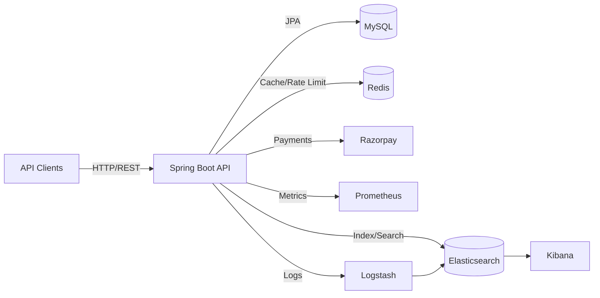
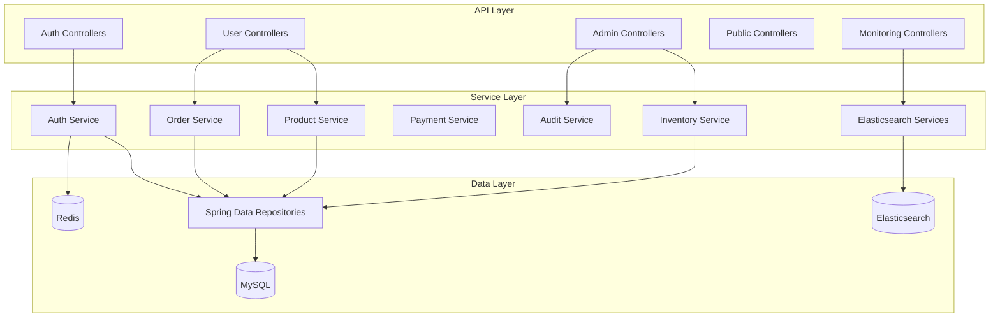

# BuildNest E‑Commerce Platform — Project Synopsis (Evidence‑Based)

**Scope note:** This synopsis is derived strictly from files present in the repository. Where evidence is missing or ambiguous, uncertainties are explicitly stated.

## 1. Purpose and System Boundary (Observed)
- **Purpose (documented):** BuildNest is an e‑commerce platform for home construction and décor products. Evidence: project description in [pom.xml](../pom.xml) and README content.
- **System boundary (code):** This repository contains a **Spring Boot backend API** with domain services, REST controllers, data access, and operational tooling. Evidence: Java packages under `src/main/java`, Spring Boot application entrypoint, and REST controllers.
- **UI/Frontend:** **No frontend code** or client SPA found in the repository. Evidence: repository contents and absence of frontend build tool manifests.

## 2. Technology Stack (Verified)
- **Language/Runtime:** Java 21 (`<java.version>21</java.version>` in [pom.xml](../pom.xml)).
- **Framework:** Spring Boot 3.2.2 (parent version in [pom.xml](../pom.xml)).
- **Build Tool:** Maven Wrapper (`mvnw`, `.mvn/`, and `pom.xml`).
- **Persistence:** MySQL (runtime dependency in [pom.xml](../pom.xml), datasource in [application.properties](../src/main/resources/application.properties)).
- **Caching / Rate Limiting:** Redis + Bucket4j (dependencies in [pom.xml](../pom.xml), Redis config in [application.properties](../src/main/resources/application.properties)).
- **Search/Analytics:** Elasticsearch with Spring Data Elasticsearch (dependency in [pom.xml](../pom.xml) and config in [ElasticsearchConfig.java](../src/main/java/com/example/buildnest_ecommerce/config/ElasticsearchConfig.java)).
- **Messaging/Streaming:** Spring Cloud Stream Kafka dependency exists, but **no Kafka usage in code was found**. Evidence: dependency present in [pom.xml](../pom.xml); no Java references identified.
- **Security:** Spring Security + JWT (dependencies in [pom.xml](../pom.xml); security configuration in [SecurityConfig.java](../src/main/java/com/example/buildnest_ecommerce/config/SecurityConfig.java)).
- **OAuth2:** OAuth2 client/resource server dependencies in [pom.xml](../pom.xml) and related properties in [application.properties](../src/main/resources/application.properties).
- **Observability:** Spring Boot Actuator + Micrometer + Prometheus registry (dependencies and [prometheus.yml](../prometheus.yml)).
- **Logging Pipeline:** Logstash configuration in [logstash.conf](../logstash.conf); Docker Compose includes Elasticsearch, Kibana, Logstash.
- **Payments:** Razorpay SDK via [RazorpayClientAdapter.java](../src/main/java/com/example/buildnest_ecommerce/integration/RazorpayClientAdapter.java).
- **Database Migrations:** Liquibase dependency in [pom.xml](../pom.xml) and changelog files in `src/main/resources/db/changelog/`.

## 3. High‑Level Architecture (Observed)
- **Architecture style:** Monolithic backend application exposing REST APIs, with layered packages (controller → service → repository → model). Evidence: package structure under `com/example/buildnest_ecommerce`.
- **External dependencies/services:** MySQL, Redis, Elasticsearch, Prometheus, Logstash, Kibana, Razorpay. Evidence: [docker-compose.yml](../docker-compose.yml), [application.properties](../src/main/resources/application.properties), and integration classes.

## 4. Modules and Responsibilities (Evidence‑Based)
**Based on package structure and controller/service naming:**
- **Auth & Identity:** `controller/auth`, `service/auth`, JWT filters, refresh tokens. Evidence: [AuthController.java](../src/main/java/com/example/buildnest_ecommerce/controller/auth/AuthController.java) and `security/Jwt/*` package.
- **Users:** `controller/user`, `service/user`, `repository/UserRepository`.
- **Products & Categories:** `service/product`, `service/category`, `repository/ProductRepository`, `CategoryRepository`.
- **Cart & Checkout:** `controller/user/CartController`, `CheckoutController`, `service/cart`, `service/checkout`.
- **Orders & Payments:** `service/order`, `service/payment`, `repository/OrderRepository`, `PaymentRepository`.
- **Inventory:** `controller/inventory`, `service/inventory`, `repository/InventoryRepository`.
- **Reviews & Wishlist:** `controller/user/ProductReviewController`, `WishlistController`, `service/review`, `service/wishlist`.
- **Admin Operations:** `controller/admin/*` for analytics, reports, inventory administration, audit logs.
- **Monitoring/Operations:** `controller/monitoring/*`, Actuator endpoints, and monitoring services.
- **Audit & Events:** `aspect/`, `service/audit`, `event/*` (domain events such as order/payment events).
- **Elasticsearch Services:** ingestion, alerting, metrics collection. Evidence: `service/elasticsearch/*`.
- **Webhooks:** `service/webhook/*` and `controller/admin/WebhookAdminController`.

## 5. Data Model and Storage (Observed)
- **Primary relational store:** MySQL; JPA repositories for users, orders, payments, inventory, reviews, etc. Evidence: repository interfaces in `src/main/java/.../repository` and DB configuration in [application.properties](../src/main/resources/application.properties).
- **Search/analytics:** Elasticsearch repositories and services. Evidence: `repository/elasticsearch` and `service/elasticsearch` packages.
- **Caching/rate limiting:** Redis via Spring Data Redis and Bucket4j. Evidence: dependencies and [RateLimitConfig.java](../src/main/java/com/example/buildnest_ecommerce/config/RateLimitConfig.java).
- **Schema management:** Liquibase changelogs in `src/main/resources/db/changelog/` and migration SQL in `db-migrations/`.

## 6. Key Workflows (Evidence‑Based)
- **Authentication & Token Management:** Login/register/refresh/logout endpoints in [AuthController.java](../src/main/java/com/example/buildnest_ecommerce/controller/auth/AuthController.java), JWT and refresh tokens.
- **Catalog & Browsing:** Product and category services/controllers under `controller/user` and `service/product`.
- **Cart → Checkout → Order:** `CartController`, `CheckoutController`, order service/repository.
- **Payment Processing:** Razorpay integration in [RazorpayClientAdapter.java](../src/main/java/com/example/buildnest_ecommerce/integration/RazorpayClientAdapter.java).
- **Inventory Management:** Inventory controllers/services, plus admin analytics controllers.
- **Auditing:** `@Auditable` aspect usage (seen in `AuthController`) and audit services.
- **Monitoring:** Actuator endpoints and custom monitoring controllers.

## 7. Security and Compliance Characteristics (Observed)
- **Authentication/Authorization:** Spring Security with role‑based access (ADMIN/USER), JWT filters. Evidence: [SecurityConfig.java](../src/main/java/com/example/buildnest_ecommerce/config/SecurityConfig.java).
- **HTTPS enforcement:** Production profile requires SSL configuration and fails fast without keystore. Evidence: `validateHttpsInProduction()` in [SecurityConfig.java](../src/main/java/com/example/buildnest_ecommerce/config/SecurityConfig.java).
- **CORS policy:** Hard‑coded allowed origins for production (buildnest.com). Evidence: CORS configuration in [SecurityConfig.java](../src/main/java/com/example/buildnest_ecommerce/config/SecurityConfig.java).
- **Rate limiting:** Configured in [application.properties](../src/main/resources/application.properties) and Redis/Bucket4j dependencies.

## 8. Operational and Deployment Artifacts (Observed)
- **Docker:** Multi‑stage build in [Dockerfile](../Dockerfile).
- **Docker Compose:** Full local stack (MySQL, Redis, Elasticsearch, Kibana, Logstash, Prometheus, app) in [docker-compose.yml](../docker-compose.yml).
- **Kubernetes:** Manifests in `kubernetes/` and `k8s/` directories (deployment, rollout, secrets, prometheus rules). Evidence: files under `kubernetes/` and `k8s/`.
- **Infrastructure as Code (AWS):** Terraform definitions for VPC, subnets, security groups, ALB, RDS, ElastiCache. Evidence: [terraform/main.tf](../terraform/main.tf) and related TF files.

## 9. CI/CD and Testing (Observed)
- **GitHub Actions:** Multiple workflows for CI, deployment, performance, and security. Evidence: `.github/workflows/*.yml`.
- **Testing stack:** JUnit 5, Mockito, Spring Boot Test, Selenium, Gatling. Evidence: dependencies in [pom.xml](../pom.xml) and profiles in the same file.
- **Coverage:** JaCoCo configuration with thresholds and CI reporting. Evidence: [pom.xml](../pom.xml) and [ci.yml](../.github/workflows/ci.yml).

## 10. Observability (Observed)
- **Metrics:** Actuator + Micrometer + Prometheus registry. Evidence: dependencies and [prometheus.yml](../prometheus.yml).
- **Logging:** Structured JSON log pattern in [application.properties](../src/main/resources/application.properties) and Logstash pipeline in [logstash.conf](../logstash.conf).
- **Alerting:** Prometheus rule files referenced by `alerts.yml` and Kubernetes alert rules in `kubernetes/prometheus-rules.yaml`.

## 11. Known Uncertainties (Explicit)
- **Kafka usage:** Spring Cloud Stream Kafka dependency exists, but no code references or configuration were found. Actual message broker usage is **not confirmed**.
- **Frontend/UI:** No frontend application present; any UI component is **not included** in this repository.
- **Runtime environment targets:** Both Kubernetes manifests and AWS Terraform exist; the intended primary deployment target is **not explicitly stated** in code or configuration.
- **Business workflows beyond naming:** Only controller/service names and a subset of endpoint definitions were inspected; additional flows may exist but are not detailed here without deeper endpoint-by-endpoint inspection.

---

## Appendix: Evidence Map (Key Files)
- Backend entrypoint: `src/main/java/com/example/buildnest_ecommerce/CivilEcommerceApplication.java`
- Configuration: `src/main/resources/application.properties`
- Build + dependencies: `pom.xml`
- Deployment: `Dockerfile`, `docker-compose.yml`, `kubernetes/*`, `k8s/*`
- Infrastructure: `terraform/*`
- CI/CD: `.github/workflows/*.yml`
- Logging: `logstash.conf`
- Monitoring: `prometheus.yml`
