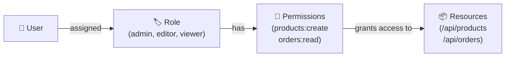
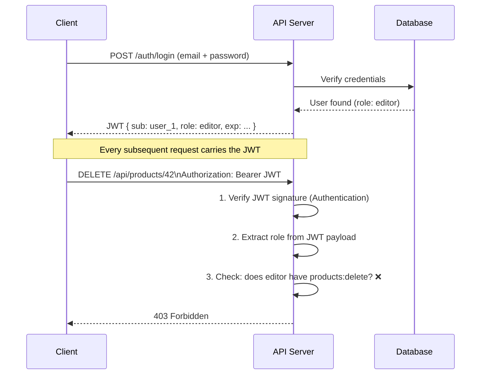

# API Authentication & RBAC Authorization

**Category:** Backend > Security > API  
**Tags:** `authentication`, `authorization`, `rbac`, `jwt`, `api-security`, `oauth2`  
**Last Updated:** 2026-06-24

---

## The Core Distinction

> **Authentication** = *Who are you?* → Verify identity  
> **Authorization** = *What can you do?* → Enforce permissions

They are sequential — you must authenticate first, then authorize.

| | Authentication | Authorization |
|---|---|---|
| **Asks** | Who are you? | What are you allowed to do? |
| **Verifies** | Identity | Permissions |
| **Failure HTTP code** | `401 Unauthorized` | `403 Forbidden` |
| **Example** | Login with JWT | Admin can delete users |

---

## Part 1 — API Authentication

Authentication confirms the caller's identity before any action is taken.

### The 4 Practical Methods (80/20)

#### 1. JWT (JSON Web Token) — Industry Standard for APIs

A signed, self-contained token issued after login. The server **never stores it** — the token carries its own claims.

**Token structure:**
```
eyJhbGciOiJIUzI1NiJ9   ← Header (algorithm)
.eyJzdWIiOiJ1c2VyXzEifQ ← Payload (claims: user ID, role, expiry)
.SflKxwRJSMeKKF2QT4fw   ← Signature (tamper-proof)
```

**Usage:**
```http
GET /api/orders
Authorization: Bearer <token>
```

✅ Stateless, scalable, widely adopted  
⚠️ Cannot be revoked before expiry (mitigate with short TTL + refresh tokens)

---

#### 2. API Keys — Simple Machine-to-Machine Auth

```http
GET /api/products
X-API-Key: sk_live_abc123xyz
```

✅ Simple for server-to-server or public APIs  
❌ No identity granularity, risky if leaked (no expiry)

---

#### 3. OAuth 2.0 — Delegated Access (e.g., "Login with Google")

Used when a third party needs access on a user's behalf.  
Issues **Access Token** (short-lived) + **Refresh Token** (long-lived).

✅ Industry standard for third-party integrations  
❌ More complex to implement

---

#### 4. Basic Auth — Avoid in Production

```http
Authorization: Basic base64(username:password)
```

❌ Credentials sent every request. Only acceptable over HTTPS for internal tooling.

---

## Part 2 — RBAC Authorization

Once identity is confirmed, RBAC decides **what that identity is allowed to do** — based on their **role**, not their individual identity.

### Mental Model



### Example Permission Matrix

| Permission | Admin | Editor | Viewer |
|---|:---:|:---:|:---:|
| `products:read` | ✅ | ✅ | ✅ |
| `products:create` | ✅ | ✅ | ❌ |
| `products:delete` | ✅ | ❌ | ❌ |
| `users:manage` | ✅ | ❌ | ❌ |
| `orders:read` | ✅ | ✅ | ✅ |

### Why RBAC?

Instead of assigning permissions to every individual user (which becomes unmanageable), you:

1. Define **roles** once with a set of permissions
2. Assign **roles** to users
3. Manage access by updating **roles**, not individual users

---

## Part 3 — How They Work Together

A complete API request lifecycle combining JWT Authentication + RBAC Authorization:



---

## Part 4 — RBAC vs Other Authorization Models

| Model | Grants access based on | Best for |
|---|---|---|
| **RBAC** | User's role | Most web apps, admin dashboards |
| **ABAC** | Attributes (dept, location, time) | Complex enterprise rules |
| **ACL** | Per-resource user lists | File systems, simple apps |
| **PBAC** | Written policy rules | AWS IAM, fine-grained cloud access |

> **Use RBAC by default.** It covers 80% of real-world authorization needs with the least complexity.

---

## Key Takeaways

1. **Authenticate first, authorize second** — they are always sequential
2. **JWT** is the go-to for stateless REST APIs — embed the role in the payload
3. **RBAC** maps roles to permissions — not users to permissions
4. `401` = identity problem → re-login; `403` = permission problem → insufficient role
5. **Never rely on the client to enforce permissions** — always validate server-side

---

## Related Articles

- How to implement JWT authentication in Node.js / Express
- How to structure roles and permissions in a database
- OAuth 2.0 flow explained with examples
- API security best practices checklist
