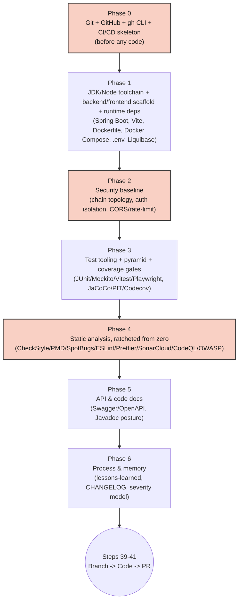

# Ideal Initial Setup for BuildNest From Scratch — Walkthrough

**Category:** DevOps > Project Bootstrap
**Tags:** `bootstrap`, `git`, `github`, `github-cli`, `ci-cd`, `static-analysis`, `testing`, `security`, `walkthrough`, `first-principle-explanation`
**Audience:** Beginner software developer — every command is spelled out in full (including
install/verify steps for tools like git, gh, and Docker that a more experienced reader might
already have configured); no step assumes prior exposure to CI/CD, static analysis tooling, or
Spring Security beyond what's explained inline
**Last Updated:** 2026-07-15

---

## Overview

A command-level walkthrough for bootstrapping a project shaped like BuildNest (Spring Boot 3.5 /
Java 21 backend, React 19 / Vite frontend, MySQL / Redis / Elasticsearch), starting with git,
GitHub, the GitHub CLI, and a CI/CD pipeline skeleton **before a single line of application code
exists**. Every step below is ordered by how expensive the corresponding debt becomes if deferred
— every "why" cites a real incident from BuildNest's own history (a 8,305-violation CheckStyle
backlog, a SonarCloud integration that silently never ran for a month, a Prometheus scrape job
shipped with no credentials, zero branch protection still configured today). The underlying rule:
**wire enforcement in before there's anything to enforce against**, not after a debt has already
formed.

---

## Terms Used in This Walkthrough

A quick-reference glossary — each term is also expanded or explained at its first use in the
walkthrough itself, but if you land partway through a step, check here first:

| Term | Meaning |
|---|---|
| **CSRF** (Cross-Site Request Forgery) | An attack where a malicious site tricks a victim's browser into sending a request the victim didn't intend, riding on a session cookie the browser sends automatically. Protections against it matter for cookie-based auth; they're irrelevant for stateless, header-only auth (no cookie exists to ride on). |
| **CSP** (Content Security Policy) | An HTTP response header telling the browser which sources (scripts, styles, etc.) are allowed to load — a defense against injected/malicious content. |
| **SARIF** (Static Analysis Results Interchange Format) | A standard JSON format for reporting static-analysis findings, so tools like CodeQL and OWASP Dependency-Check can upload results GitHub understands and displays consistently. |
| **CVSS** (Common Vulnerability Scoring System) | A 0-10 severity score for a known vulnerability; a "CVSS threshold" is the cutoff above which a scan fails the build. |
| **Quality gate** | A named set of pass/fail conditions (e.g. "no new bugs, ≥80% coverage on new code") a static-analysis report is checked against — passing the scan and passing the *gate* are two different things. |
| **`SecurityFilterChain`** | Spring Security's mechanism for deciding, per incoming request, which authentication/authorization rules apply. A project can have more than one — e.g. one relaxed chain for public docs, one strict chain for the real API. |
| **Monorepo vs. polyrepo** | Monorepo: multiple related projects (e.g. a backend and a frontend) live in one git repository. Polyrepo: each lives in its own repository. Neither is universally "correct" — the tradeoff is single-repo simplicity vs. independent deploy/release cadences per project. |
| **Squash-merge** | A merge strategy that combines every commit on a branch into one single commit on the target branch, instead of preserving each individual commit's history. |
| **Maven plugin-prefix group** | The mechanism Maven uses to resolve a short goal name (e.g. `checkstyle:check`) to the actual plugin that implements it — some plugins are in Maven's default searched list and resolve with no extra config; others (like SpotBugs) aren't, and need an explicit declaration first. |
| **Mutation testing (PIT)** | A stronger check than line coverage: PIT deliberately introduces small bugs ("mutants" — e.g. flipping a `>` to `>=`, changing a returned value) into compiled code, then re-runs the test suite against each mutant. A mutant that survives (no test fails) means the covered line was never actually *asserted on* meaningfully — 100% line coverage can still hide tests that call code but check nothing real about its result. |

---

## Workflow



Phases 0, 2, and 4 (highlighted) are the highest-leverage — get these right immediately even if
other phases are deliberately deferred for a small or short-lived project. Everything downstream
of Phase 0 assumes it's already done: you can't gate CI on required status checks (Phase 0, step
7) before a CI workflow exists (Phase 0, step 9); you can't ratchet static analysis at zero (Phase
4) if the repo already has months of unguarded commits behind it. The diagram's terminal node is
Steps 39-41 (create the feature branch, write the code, open the first real PR) — the point where
everything upstream stops being separately-verified bootstrap and starts working *for* that PR.

### Contents

- [Phase 0 — Git, GitHub, GitHub CLI, and CI/CD Wiring, Before Any Code](#phase-0--git-github-github-cli-and-cicd-wiring-before-any-code) (Steps 1-11)
- [Phase 1 — Runtime and Dependency Skeleton](#phase-1--runtime-and-dependency-skeleton) (Steps 12-19)
- [Phase 2 — Security Baseline](#phase-2--security-baseline) (Steps 20-22)
- [Phase 3 — Testing and Coverage Gates, Blocking From Day One](#phase-3--testing-and-coverage-gates-blocking-from-day-one) (Steps 23-26)
- [Phase 4 — Static Analysis, Ratcheted From an Empty Baseline](#phase-4--static-analysis-ratcheted-from-an-empty-baseline) (Steps 27-33)
- [Phase 5 — API and Code Documentation, Chosen Deliberately](#phase-5--api-and-code-documentation-chosen-deliberately) (Steps 34-35)
- [Phase 6 — Process and Institutional Memory](#phase-6--process-and-institutional-memory) (Steps 36-41)

---

## Walkthrough

### Phase 0 — Git, GitHub, GitHub CLI, and CI/CD Wiring, Before Any Code

Everything here happens before a single application source file exists — the cheapest possible
point to get it right, since there's nothing yet for a misconfiguration to damage.

**Git and GitHub are two separate systems, not one thing with two names.** Git is the version
control tool itself — it runs entirely on your machine and knows nothing about GitHub or any other
hosting service; `git init`/`git commit`/`git log` all work with zero network access, forever, in
a folder that never touches the internet. GitHub is a *hosting service* for git repositories,
reachable over HTTPS — it stores a copy of your repo's history on its servers and adds features on
top that git itself has no concept of (issues, PRs, branch protection, Actions). The bridge between
the two is a **remote**: just a named URL alias git stores in `.git/config`, telling your local
git where to push to or pull from. `origin` is nothing more than the conventional name for "the
main remote" — git would work identically if you called it `banana`. Keeping this distinction
straight matters for the rest of this phase: Steps 2-4 are pure git, entirely local, no GitHub
involved yet; Step 6 is the first point GitHub enters the picture at all.

**Step 1 — Create the project folder(s) before anything else.** For a monorepo shaped like
BuildNest (backend + frontend in one repo), create the root folder and the two subdirectories the
rest of this walkthrough assumes exist:
```bash
mkdir <project-name>
cd <project-name>
mkdir backend frontend
```
Decide monorepo-vs-polyrepo here, not later — moving from one to the other after CI workflows,
`.gitignore` paths, and Docker Compose build contexts already assume one layout is a real,
error-prone migration, not a quick rename. If a polyrepo is the right call instead (independent
deploy cadences, separate teams), repeat this entire walkthrough once per repo rather than trying
to retrofit a monorepo's assumptions onto split repos later.

**Step 2 — Local git init and config.**

Check first — git is not guaranteed to be preinstalled, especially on a fresh Windows machine or a
minimal container/VM image:
```bash
git --version || echo "git not installed"
```
If missing, install it per platform:
```bash
# Debian/Ubuntu/WSL2
sudo apt update && sudo apt install git -y

# macOS (either works; Xcode CLT is the lighter option if Homebrew isn't already in use)
xcode-select --install
# or: brew install git

# Windows
winget install --id Git.Git -e --source winget
# or download the installer directly: https://git-scm.com/download/win

# Fedora/RHEL/CentOS
sudo dnf install git
```
Then initialize and configure:
```bash
git init
git config user.name  "Your Name"
git config user.email "you@example.com"
git branch -m main
```
Get `user.name`/`user.email` right before the first commit — every commit signs with whatever was
configured at the time it was made, and rewriting that history later (`git commit --amend`,
interactive rebase) on anything already pushed and shared is exactly the kind of destructive
history-rewrite this walkthrough elsewhere warns against doing casually.

**Step 3 — Write a real `.gitignore` before the first file is added.** A `.gitignore` written
after a secret or a build artifact has already been committed once doesn't undo that history —
`git rm --cached` plus a new commit removes the file going forward, but it stays recoverable from
prior commits in the repo's history forever (a real secret leaked this way needs rotating, not
just un-tracking). Cover both stacks and the local dev environment from the start:
```gitignore
# Java / Maven
target/
*.class
*.jar
!.mvn/wrapper/maven-wrapper.jar

# Node / Vite
node_modules/
dist/
.vite/

# Environment / secrets — never commit real values
.env
.env.local
*.env.*.local

# IDE
.idea/
.vscode/
*.iml

# OS / logs
.DS_Store
*.log
logs/
```
Commit this file as part of the very first commit, before `git add .` is ever run against a
populated working tree — the ordering matters exactly as much as the content.

**Step 4 — Write a real root `README.md` before the first push.** It's the first thing GitHub
renders on the repo's homepage and the first thing any contributor (including future-you) reads —
an empty or placeholder README at push time means the repo's homepage is blank for however long it
takes someone to circle back and fill it in, which in practice is often "never" until a new
contributor is confused enough to ask. Cover, at minimum:
```markdown
# Project Name

One-paragraph description of what this is and who it's for.

## Prerequisites
- Java 21, Node 20+, Docker (see docs/knowledge-base/... for install steps if missing)

## Quick Start
\`\`\`bash
cp backend/.env.example backend/.env   # fill in required values
docker compose -f backend/docker-compose.yml up -d
cd backend && ./mvnw spring-boot:run
cd frontend && npm install && npm run dev
\`\`\`

## Project Structure
- `backend/` — Spring Boot API
- `frontend/` — React/Vite SPA

## Documentation
- [CHANGELOG](CHANGELOG.md)
- [Contributing](CONTRIBUTING.md)

## License
```
Keep it current as the project grows — a Quick Start section that no longer actually starts the
project (a renamed script, a new required env var) is worse than no Quick Start at all, since it
actively wastes a new contributor's time before they learn to distrust it.

**Step 5 — Install and authenticate the GitHub CLI immediately.** `gh` is not a git feature or a
GitHub-side feature — it's a separate command-line program that sends authenticated HTTP requests
to GitHub's REST/GraphQL API on your behalf, so every `gh issue create`/`gh pr create`/`gh project`
command you'll run in this walkthrough is really just an API call with an auth token attached
automatically. That's *why* authentication has to happen first: an unauthenticated HTTP request to
a private repo's API is simply rejected, the same as visiting a private repo's URL in a logged-out
browser. Every subsequent step in this phase uses `gh` — install and log in before any of them,
not after.

Check first — `gh` is not bundled with git or the OS by default:
```bash
gh --version || echo "gh not installed"
```
If missing, install it per platform (all four are the officially documented methods):
```bash
# Debian/Ubuntu/WSL2 — official apt repo (not the distro's own outdated gh package)
(type -p wget >/dev/null || (sudo apt update && sudo apt install wget -y)) \
  && sudo mkdir -p -m 755 /etc/apt/keyrings \
  && wget -nv -O/etc/apt/keyrings/githubcli-archive-keyring.gpg https://cli.github.com/packages/githubcli-archive-keyring.gpg \
  && sudo chmod go+r /etc/apt/keyrings/githubcli-archive-keyring.gpg \
  && echo "deb [arch=$(dpkg --print-architecture) signed-by=/etc/apt/keyrings/githubcli-archive-keyring.gpg] https://cli.github.com/packages stable main" \
     | sudo tee /etc/apt/sources.list.d/github-cli.list > /dev/null \
  && sudo apt update && sudo apt install gh -y

# macOS
brew install gh

# Windows (PowerShell)
winget install --id GitHub.cli
# or: choco install gh

# Fedora/RHEL/CentOS
sudo dnf install gh
```
Then authenticate:
```bash
gh auth login
gh auth status
unset GITHUB_TOKEN      # see why below — a leftover value here silently overrides gh's own auth
```
`gh auth login` stores its own token in a local config file — but `gh` (like most CLI tools that
talk to an API) checks the `GITHUB_TOKEN` environment variable *first*, before that stored config,
specifically so CI environments can inject a token without an interactive login step. If an old
`GITHUB_TOKEN` is sitting in your shell from an earlier project or tutorial, every `gh` command
silently uses *that* token instead of the one you just logged in with — often one missing scopes
(like `project`) the stored login has, which surfaces as a confusing permissions error instead of
an obviously-wrong-credential error.
Do this before the first issue or PR is ever created by hand through the web UI, so every later
scripted operation (repo creation, issue/PR creation, project-board item management,
label/milestone assignment, branch-protection queries) works consistently from day one. If `gh` is
genuinely unavailable (a locked-down machine with no package-manager access), every operation in
this walkthrough that uses `gh` has a GitHub REST/GraphQL API or web-UI equivalent — slower and
more error-prone (no `git remote -v`-verified slug convenience, no scriptability), but not a hard
blocker to any step.

**Step 6 — Create the GitHub repo, wire the remote, then verify the slug — don't assume it.**
```bash
gh repo create <owner>/<repo-name> --private --source=. --remote=origin
git remote -v          # confirm the actual owner/name
gh repo view --json nameWithOwner -q .nameWithOwner
gh repo set-default <owner>/<repo-name>
```
A repo's real slug can silently diverge from the local folder name (BuildNest's own folder is
`BuildNest`; its real slug is `pradip9096/buildnest-ecommerce-platform`). Confirm the slug before
the first `gh --repo` call elsewhere — a wrong slug fails every later `gh issue`/`gh pr`/`gh project`
call in a way that's easy to misdiagnose as a permissions problem.

**Step 7 — Configure branch protection on the default branch before the first PR.** This is purely
a GitHub-side rule enforced by GitHub's servers when a push or merge is attempted — local git has
no concept of a "protected branch" at all; you could `git push` directly to `main` from your own
machine with total success as far as git itself is concerned, and GitHub would be the one to
reject it. This is also the actual enforcement mechanism behind Step 10's "PR-only merges"
decision below — without a rule like this one, "PR-only" is just a social convention a contributor
could bypass by pushing directly; with it, GitHub's servers refuse the push outright.
```bash
gh api repos/<owner>/<repo>/branches/main/protection -X PUT \
  -f required_status_checks='{"strict":true,"contexts":[]}' \
  -f enforce_admins=true \
  -f required_pull_request_reviews='{"required_approving_review_count":0}' \
  -f restrictions=null
```
**`required_approving_review_count` must be `0` for a solo maintainer** — GitHub refuses
self-approval, so setting it to `1` with no second reviewer locks you out of merging your own PRs
permanently. Raise it only once a genuine second reviewer exists; see
`.claude/rules/common/git-workflow.md` for this repo's own solo self-merge model, which this
example must stay consistent with. (Fill in `contexts` with real CI job names once Step 9 exists.)
Decide this now — retrofitting it
later means auditing every merge in the ungated window to know what could have gotten through
unguarded. Verify anytime with:
```bash
gh api repos/<owner>/<repo>/branches/main/protection    # 404 means still unprotected
```

**Step 8 — Configure GitHub Actions' repo settings, before writing any workflow file.** GitHub
Actions isn't something you install — it's a built-in feature of every GitHub repo, already
present the moment the repo exists. What still needs checking is whether it's *enabled* (an org
admin can turn it off repo-wide as policy) and what its *default permission scope* is — a workflow
file committed to `.github/workflows/` does nothing if Actions is disabled for the repo or org.
Verify it's actually enabled first, then set the repo-wide defaults every subsequent workflow
inherits, so the very first workflow file is already covered by a safe default rather than starting broad and
being narrowed later:
```bash
# Confirm Actions is enabled (an org policy can disable it repo-wide with no error at commit time)
gh api repos/<owner>/<repo>/actions/permissions

# Default GITHUB_TOKEN permissions to read-only — each job/workflow then opts into exactly the
# write scope it needs via its own `permissions:` block, rather than every workflow getting
# broad write access by default
gh api repos/<owner>/<repo>/actions/permissions/workflow -X PUT \
  -f default_workflow_permissions=read \
  -F can_approve_pull_request_reviews=false
```
Decide this now, before the first workflow file exists — retrofitting least-privilege permissions
onto workflows that have already run for months with broad default access means auditing what each
one *actually* uses before narrowing it, rather than starting narrow and only widening a specific
job when a real need appears.

**Step 9 — Write and commit the first GitHub Actions workflow file.** This is the actual
`.github/workflows/build.yml` file the previous step's settings apply to — commit it as one of the
first commits in the repo, before real feature code, so CI is exercised (green or intentionally
red) from the start rather than bolted on after several unguarded commits already exist. Include
its own scoped `permissions:` block (e.g.
`contents: read` for a pure build/test job — only a job that actually comments on PRs needs
`pull-requests: write`) and a `concurrency:` group so a rapid sequence of pushes to the same
branch/PR cancels the stale in-flight run instead of queuing redundant ones:
```yaml
name: Build & Test
on: [push, pull_request]

permissions:
  contents: read

concurrency:
  group: ${{ github.workflow }}-${{ github.ref }}
  cancel-in-progress: true

jobs:
  build:
    runs-on: ubuntu-latest
    steps:
      - uses: actions/checkout@v4
      - uses: actions/setup-java@v4
        with: { java-version: '21', distribution: 'temurin', cache: 'maven' }
      - run: ./mvnw -B clean verify
```
`runs-on: ubuntu-latest` requests a **runner** — a brand-new, disposable virtual machine GitHub
provisions from scratch just for this one job, with nothing pre-installed except a base OS image.
That's why `actions/checkout@v4` has to be the first step at all: the runner doesn't have your
repo's code on it yet, since it's a fresh machine that's never seen this repository before. Once
the job finishes (pass or fail), the entire VM is discarded — the next run gets an equally fresh
one, which is exactly why nothing a workflow does persists between runs unless explicitly cached
(`cache: 'maven'` above) or uploaded as an artifact.
Split concerns into separate workflow files (build/test, security/quality scan, deploy) rather
than one monolith. Register any secrets the pipeline will eventually need
(`SONAR_TOKEN`, a registry credential) in repo Settings → Secrets **before** the workflow step that
reads them is written — a missing secret should fail loudly immediately, not silently no-op for a
month the way this repo's own SonarCloud step once did.

**Step 10 — Decide the branch/PR/merge model.** These settings configure the repo's own
merge-button behavior (what options appear, what happens on click); Step 7's branch protection is
what actually *forces* people to use a PR in the first place — the two work together, not
independently. One dedicated branch per unit of work, PR-only merges to `main`, squash-merge
(combining every commit on the branch into one single commit on `main`, rather than preserving
each individual commit) as the default merge strategy, delete branch on merge:
```bash
gh repo edit <owner>/<repo> --delete-branch-on-merge --enable-squash-merge \
  --enable-merge-commit=false --enable-rebase-merge=false
```

**Step 11 — Create repo-level GitHub configuration.** These are three genuinely separate GitHub
features, each worth doing before the first issue exists rather than backfilled onto issues
already filed:
- **Issue/PR templates** (`.github/ISSUE_TEMPLATE/`, `.github/pull_request_template.md`) are just
  markdown files GitHub auto-populates into the text box when someone clicks "New issue"/"New
  PR" — they don't enforce anything, they just save everyone from re-typing the same structure.
- **Labels** are metadata tags attached to an issue/PR, used purely for filtering and searching
  (`gh label create` just registers the tag's name/color so it's available to apply) — they have
  no effect on behavior by themselves:
  ```bash
  gh label create "priority: high" --color d93f0b
  gh label create "phase: M1" --color 0e8a16
  gh label create "domain: auth" --color c5def5
  ```
- A **Project** is a separate, repo-independent GitHub feature (a Kanban board / table view) that
  issues and PRs get *linked into* — creating one doesn't touch the repo at all, it just gives you
  somewhere to add issues to once they exist. **Creating a project does not associate it with any
  repository by itself** — that's a distinct, explicit step, easy to skip and only notice later
  when the project never shows up where you'd expect it to:
  ```bash
  gh project create --owner <owner> --title "Project Name"   # note the returned project number
  gh project link <number> --owner <owner> --repo <owner>/<repo-name>
  ```
  Without the `link` step, the project still works (you can add issues to it manually one at a
  time via `gh project item-add`), but it won't appear in the repo's own "Projects" tab and won't
  show up as a quick-add option when filing an issue from that repo directly.
Doing all three now means every issue from the first one onward already has a template to fill in
consistently and lands with the right label/board membership at creation time, instead of a
retroactive pass to backfill labels or board entries onto issues filed before this step existed.

### Phase 1 — Runtime and Dependency Skeleton

**Step 12 — Install the language runtimes themselves: JDK 21 and Node 20+.** Every other tool in
this walkthrough (git, `gh`, Docker) got an explicit install-check step; the two runtimes
everything else in this phase actually depends on — the JDK Maven/Spring Boot run on, and the
Node.js runtime `npm`/Vite run on — are easy to silently assume are "just there" and skip. Check
first:
```bash
java -version   # need 21+
node -v         # need 20+
```
Install via a **version manager**, not your OS's system package manager, if there's any chance
this machine will ever need a second project pinned to a different JDK/Node version — a system
package manager installs one global version system-wide, and switching it for one project breaks
every other project relying on the old one. SDKMAN (JDK) and nvm (Node) instead let each project
pin its own version file, so `cd`-ing between projects can select the right version automatically:
```bash
# JDK — via SDKMAN (https://sdkman.io)
curl -s "https://get.sdkman.io" | bash
source "$HOME/.sdkman/bin/sdkman-init.sh"
sdk install java 21.0.5-tem      # Eclipse Temurin build, matches this stack

# Node — via nvm (https://github.com/nvm-sh/nvm)
curl -o- https://raw.githubusercontent.com/nvm-sh/nvm/v0.40.1/install.sh | bash
source "$HOME/.nvm/nvm.sh"
nvm install 20
nvm use 20
```
A plain system package (`apt install openjdk-21-jdk`, `apt install nodejs`) works fine too if this
machine will only ever run this one project — just know it's a global, system-wide install with no
easy per-project override later. Verify both again after installing, in a fresh shell (not just
the one that ran the installer) — some installers only wire up shell config for new sessions:
```bash
java -version && node -v
```

**Step 13 — Scaffold the backend project.** Spring Initializr is a code-generation *web service*,
not a local tool — the `curl` command below is a real HTTP request to `start.spring.io`, which
assembles a working Maven project (correct `pom.xml`, folder layout, a Maven wrapper) matching
whatever options you pass, and streams it back as a ZIP file; `unzip` then just extracts what the
server sent. Generate it directly into the `backend/` folder created in Step 1, rather than
hand-assembling a `pom.xml` — pin the real versions this stack uses (Spring Boot 3.5, Java 21) and
pull in every starter the rest of this walkthrough assumes exists:
```bash
curl https://start.spring.io/starter.zip \
  -d type=maven-project -d language=java \
  -d bootVersion=3.5.0 -d javaVersion=21 \
  -d groupId=com.example -d artifactId=myapp -d name=myapp \
  -d packageName=com.example.myapp \
  -d dependencies=web,security,data-jpa,validation,liquibase,actuator,data-redis,data-elasticsearch,devtools \
  -o backend.zip
unzip backend.zip -d backend && rm backend.zip
cd backend && ./mvnw -v   # verify the wrapper resolves before anything else
```
Add `springdoc-openapi-starter-webmvc-ui` (Step 34) and any resilience/rate-limiting libraries
manually to `pom.xml` afterward — they aren't Spring Initializr starters. Commit the generated
skeleton as its own commit, before any business logic, so the baseline is reviewable in isolation.

**Step 14 — Scaffold the frontend project.** `npm create <tool>@latest` is npm's
temporary-package-runner pattern: it downloads the named scaffolding tool (here, Vite's own
project generator) and runs it once, without permanently installing it anywhere — the same
mechanism as `npx`, just spelled as a `create` command by convention. Generate it into the
`frontend/` folder from Step 1 using Vite's own scaffolding tool, not a manually-assembled
`package.json`:
```bash
cd frontend
npm create vite@latest . -- --template react-ts
npm install
npm run dev    # verify the dev server actually starts before committing
```
Commit this skeleton separately from the backend's, and separately from any later feature code —
same reviewability reasoning as Step 13.

**Step 15 — Install Docker before anything in this walkthrough tries to use it.** A **container**
packages an application together with its exact runtime environment (OS libraries, language
runtime, dependencies) into one isolated, reproducible unit — unlike a full virtual machine, it
doesn't run a separate OS kernel; it shares the host machine's kernel while staying isolated in its
own filesystem and process namespace, which is why containers start in seconds and a VM takes
minutes. Docker itself is a **client-server tool**: the `docker` command you type is just a client
that sends requests to a background process (the **daemon**, `dockerd`) over a local socket, which
is the actual thing that creates and runs containers. That split matters practically — "Docker
isn't installed" and "Docker is installed but the daemon isn't running" are two different failure
modes with two different fixes, which is exactly the distinction the verification step below
checks for. Both the Dockerfile (next step) and the `docker-compose.yml` after it need a working
Docker install and a running daemon — check and install this first, not after writing files that
assume it.

Check first — Docker is not preinstalled on any OS by default:
```bash
docker --version && docker compose version || echo "Docker (or Compose) not installed"
```
If missing, install it per platform:
```bash
# Debian/Ubuntu — official Docker repo (the distro's own docker.io package is often outdated)
curl -fsSL https://get.docker.com | sudo sh
sudo usermod -aG docker $USER    # re-login/new shell needed for this to take effect

# WSL2 specifically — Docker Desktop (Windows) with WSL2 integration is the common path
# instead of a native Linux install (install on the Windows side, per the two blocks below,
# then enable Settings > Resources > WSL Integration for your distro; verify with
# `docker info` inside the WSL2 shell afterward — a native `apt`-installed Docker Engine
# inside WSL2 is also a valid alternative that skips Desktop entirely)

# macOS — Docker Desktop
brew install --cask docker
# then launch it once from Applications (or `open -a Docker`) before `docker info` will work

# Windows (PowerShell) — Docker Desktop
winget install --id Docker.DockerDesktop -e --source winget
# then launch it once from the Start menu before `docker info` will work
# manual installer alternative: https://www.docker.com/products/docker-desktop/

# Fedora/RHEL/CentOS
sudo dnf install docker-ce docker-ce-cli containerd.io docker-compose-plugin
```
Then verify the daemon is actually running before assuming any `docker`/`docker compose` command
will work — a fresh install often needs the daemon service started or Docker Desktop launched at
least once:
```bash
docker info    # errors here mean the daemon isn't running, not that Docker isn't installed
```
If Docker is genuinely unavailable (locked-down machine, no admin rights), MySQL/Redis/Elasticsearch
can be installed natively instead — see [Native MySQL vs Docker MySQL](native-mysql-vs-docker-mysql.md)
for the concrete tradeoffs — but expect version drift across machines and a harder time reproducing
the exact same setup a teammate has, which is precisely what Docker Compose is meant to remove.

**Step 16 — Write the application's own `Dockerfile`.** See
[Dockerfile vs. docker-compose.yml, and Pre-Built vs. Custom-Built Images](../project/dockerfile-vs-docker-compose-and-prebuilt-images.md)
for why this is distinct from the `docker-compose.yml` in the next step. Use a multi-stage build so
the final image ships a JRE and a built JAR, not the entire JDK/Maven toolchain:
```dockerfile
# backend/Dockerfile
FROM maven:3.9-eclipse-temurin-21 AS build
WORKDIR /app
COPY pom.xml .
RUN mvn dependency:go-offline
COPY src ./src
RUN mvn clean package -DskipTests

FROM eclipse-temurin:21-jre
WORKDIR /app
COPY --from=build /app/target/myapp-*.jar app.jar
ENTRYPOINT ["java", "-jar", "app.jar"]
```
**Verify the `COPY --from=build` line's glob actually matches the JAR your build produces, every
time the project's `artifactId` changes** — a renamed `artifactId` in `pom.xml` with a stale
`Dockerfile` `COPY` pattern still referencing the old name fails silently at image-build time or
(worse) copies nothing matching and the image starts with no application at all. This is a real,
recurring class of bug, not a hypothetical: BuildNest's own `Dockerfile` still copies a
`civil-ecommerce-*.jar` pattern left over from before a project rename, while `pom.xml`'s actual
`artifactId` is `buildnest-ecommerce` — the application container has never been able to start
from that image, tracked as issue #364 (still open as of this writing). Verify with a real build, not a read of
the file:
```bash
docker build -t myapp:test ./backend && docker run --rm myapp:test --help
```
Do the same for the frontend if it will be served from its own container (a multi-stage build
compiling with `npm run build` in one stage, then serving the static output via `nginx` in a
lightweight final stage) rather than only ever run via `npm run dev`.

**Step 17 — Write the project's own `docker-compose.yml`.** See the same
[Dockerfile vs. docker-compose.yml article](../project/dockerfile-vs-docker-compose-and-prebuilt-images.md)
linked in Step 16 for Compose's core mechanism (automatic per-service-name networking, `image:` vs.
`build:`). One service block per stateful dependency, each with a named volume, a healthcheck, and
every credential sourced from an env var with a local-dev-only default — never hardcoded:
```yaml
services:
  mysql:
    image: mysql:8.2
    environment:
      MYSQL_ROOT_PASSWORD: ${MYSQL_ROOT_PASSWORD}
      MYSQL_DATABASE: ${MYSQL_DATABASE:-app_db}
    ports: ["3306:3306"]
    volumes: ["mysql_data:/var/lib/mysql"]
    healthcheck:
      test: ["CMD", "mysqladmin", "ping", "-h", "localhost"]
      interval: 10s
      timeout: 5s
      retries: 5

  redis:
    image: redis:7
    ports: ["6379:6379"]
    volumes: ["redis_data:/data"]
    healthcheck:
      test: ["CMD", "redis-cli", "ping"]
      interval: 10s
      timeout: 5s
      retries: 5

  elasticsearch:
    image: elasticsearch:8.10.0
    environment:
      - discovery.type=single-node
      - xpack.security.enabled=true
      - ELASTIC_PASSWORD=${ELASTIC_PASSWORD}
    ports: ["9200:9200"]
    volumes: ["es_data:/usr/share/elasticsearch/data"]
    healthcheck:
      test: ["CMD-SHELL", "curl -s http://localhost:9200 -u elastic:${ELASTIC_PASSWORD} || exit 1"]
      interval: 10s
      timeout: 5s
      retries: 5

volumes:
  mysql_data:
  redis_data:
  es_data:
```
Verify it actually starts cleanly before writing any application code that depends on it:
```bash
docker compose config          # validate syntax and variable substitution first
docker compose up -d
docker compose ps               # confirm all three show "healthy", not just "running"
```
Any container config file needing a real secret substituted in (not just an env var Docker itself
resolves, but a config *file* a container reads, like a Prometheus scrape target's `basic_auth`
block) goes through a one-shot render-sidecar instead (template file → `sed`/`envsubst` → shared
volume → dependent service waits on `service_completed_successfully`) — decide this pattern now,
before the first config file that needs it exists, rather than hardcoding a value and fixing it
later.

**Step 18 — Write `.env.example` (committed) and `.env` (local-only, already excluded by Step 3's
`.gitignore`) together.** `.env.example` is the single source of truth for every environment
variable the project needs — real developers copy it, never invent their own from scratch:
```bash
# backend/.env.example — committed, documents every variable, no real secret values
MYSQL_ROOT_PASSWORD=          # SECRET — required, no default
MYSQL_DATABASE=app_db         # non-secret — optional, defaults shown
ELASTIC_PASSWORD=             # SECRET — required, no default
JWT_SECRET=                   # SECRET — required, no default, generate: openssl rand -base64 64
```
```bash
# Local setup — never commit the result of this
cp backend/.env.example backend/.env
# then edit backend/.env, filling in every SECRET-marked value with a real one
```
Update `.env.example` in the same commit that introduces a new variable in code — a variable that
exists in application config but not in `.env.example` is itself a bug to catch in review, since
the next person to set up the project has no way to discover it exists short of reading source.
See [.env.example Template vs. .env Local Secrets](../project/env-example-template-vs-env-local-secrets.md)
for the fuller template-vs-local-secrets convention (type/default/secret-or-not/required-or-optional
columns) this walkthrough's own `.env.example` example above follows.

**Step 19 — Liquibase from the very first table**, `ddl-auto=validate` from day one.
`hibernate.ddl-auto` controls whether Hibernate (the ORM under Spring Data JPA) is allowed to
generate and run schema DDL itself, inferred from your `@Entity` classes — `update` lets it add
tables/columns automatically on startup, `create-drop` lets it drop and recreate the entire schema
every restart. The risk isn't hypothetical: this inference is one-directional and lossy (Hibernate
can't know if a column disappeared from an entity because you renamed it or genuinely deleted it,
so it just drops the data), it has no rollback, and it produces no reviewable record of what
changed — the opposite of Liquibase's explicit, versioned, human-reviewed changesets. `validate`
is the safe middle ground: Hibernate checks the schema matches your entities and fails loudly on
mismatch, but never writes DDL itself:
```properties
spring.jpa.hibernate.ddl-auto=validate
spring.liquibase.change-log=classpath:db/changelog/db.changelog-master.xml
```
Every changeset gets a `<rollback>` block and a `tableExists`/`columnExists` precondition guard
from the start — never `ddl-auto=update`/`create-drop` against a shared database, even briefly.

### Phase 2 — Security Baseline

Every incoming HTTP request has to pass through some decision logic before it reaches your
controller code: is this request authenticated? Is it allowed to hit this specific endpoint?
Spring Security calls that decision logic a `SecurityFilterChain` — think of it as a checkpoint
every request walks through first. A project can define more than one checkpoint, each matched to
a different set of paths (e.g. one relaxed checkpoint for public API docs, one strict checkpoint
for everything else) — which is exactly the "topology" Step 20 below is designing.

**Step 20 — Design the full `SecurityFilterChain` topology up front**, before the first protected
endpoint exists: how many chains (public/docs with a relaxed CSP — Content Security Policy, the
header that restricts which sources a browser may load scripts/styles from; main with a strict
one; room for a future machine-to-machine chain, e.g. a metrics scraper); token strategy (stateless
JWT via `Authorization` header vs. cookies — cookies mean CSRF, Cross-Site Request Forgery,
protection is mandatory, since a cookie is exactly the ambient credential that attack rides on);
actuator exposure
model (`/actuator/health/**` public, everything else `ROLE_ADMIN`, with any future machine
credential planned as its own isolated chain from the start).

**Step 21 — Decide the `AuthenticationManager` isolation strategy the moment a second
`SecurityFilterChain` bean is needed.** Never `.userDetailsService()` on that chain's
`HttpSecurity` — it silently falls back to the shared, global `AuthenticationManagerBuilder`.
Build an explicit, isolated one instead:
```java
DaoAuthenticationProvider provider = new DaoAuthenticationProvider(isolatedUserDetails);
provider.setPasswordEncoder(passwordEncoder());
AuthenticationManager isolatedManager = new ProviderManager(provider);
http.authenticationManager(isolatedManager);   // not .userDetailsService(...)
```
See [A Second SecurityFilterChain's `.userDetailsService()` Leaks Into the Shared `AuthenticationManagerBuilder`](../../wiki/learned-lessons/multi-chain-httpsecurity-userdetailsservice-leaks-into-shared-authenticationmanagerbuilder.md)
for the full failure mode.

**Step 22 — One canonical CORS source, one rate-limit boundary, decided once.** CORS is enforced
by the **browser**, not the server — a server's CORS config is nothing more than a set of response
headers telling browsers "requests from this origin are allowed to read my response." A
non-browser client (`curl`, another backend service, Postman) ignores CORS entirely and always
gets the response; the restriction only ever applies to JavaScript running in a browser tab making
a cross-origin request. That's why CORS config exists at all in a backend that's mostly consumed
by its own frontend — it's specifically unblocking the browser's own default-deny behavior for
that one frontend origin, not adding a security boundary against non-browser clients. Never both a
Spring Security `corsConfigurationSource` and a `WebMvcConfigurer.addCorsMappings` — the former
fully shadows the latter, leaving dead code. Rate limiting behind a single service boundary, never
called directly from business logic, with an explicit default-allow-on-backing-store-failure
posture written down before the first limit is added.

### Phase 3 — Testing and Coverage Gates, Blocking From Day One

**Step 23 — Set up the actual testing tools before writing the first test.** Spring Initializr
(Step 13) already pulls in `spring-boot-starter-test` automatically — it bundles JUnit 5, Mockito,
and AssertJ, so no extra `pom.xml` edit is needed for backend unit tests. Verify it's really there
rather than assuming:
```bash
cd backend && ./mvnw dependency:tree | grep -i "spring-boot-starter-test\|junit\|mockito"
```
Add mutation testing (PIT) and, if integration tests need a real database instead of H2, Testcontainers:
```xml
<!-- pom.xml -->
<plugin>
  <groupId>org.pitest</groupId>
  <artifactId>pitest-maven</artifactId>
</plugin>
<dependency>
  <groupId>org.testcontainers</groupId>
  <artifactId>junit-jupiter</artifactId>
  <scope>test</scope>
</dependency>
```
For the frontend, Vite's own scaffolding (Step 14) does **not** include a test runner by default —
install it explicitly:
```bash
cd frontend
npm install -D vitest @testing-library/react @testing-library/jest-dom jsdom
npm install -D @playwright/test && npx playwright install   # for E2E
```
Verify each toolchain actually runs before writing a real test against it — an empty/placeholder
test that never executes proves nothing:
```bash
cd backend && ./mvnw test          # should report 0 tests run, not an error
cd frontend && npx vitest run      # same — 0 tests found is fine, a config error is not
```

**Step 24 — Stand up the testing pyramid before the first feature PR.** The "pyramid" shape is a
cost/speed tradeoff, not an arbitrary name: unit tests are the base because they're fast (no
network, no real dependencies) and cheap to write, so you want *many* of them; integration tests
are slower (a real or H2-backed application context has to actually start) so there are fewer;
E2E/smoke tests are slowest and most brittle (a real running system, real network calls) so they're
fewest of all, reserved for the handful of flows worth the cost. One working example of each —
one unit test (JUnit 5 + Mockito), one integration test (real or H2-backed Spring context), one
E2E/smoke test — each with a CI job that runs it.

**Step 25 — Wire JaCoCo, PIT, and a patch-coverage tool (Codecov) in, blocking, from the first
PR.** JaCoCo and Codecov measure genuinely different things, not the same metric twice: JaCoCo
reports coverage of the **entire codebase** as it stands right now; Codecov's "patch coverage"
reports coverage of only the **lines actually changed in this specific PR's diff**. That
distinction is exactly why a project can carry mediocre overall coverage from years of legacy code
while still cleanly enforcing "every new PR must cover 80%+ of its own new lines" — the two gates
are answering different questions ("how well-tested is the whole system" vs. "did *this change*
bring its own tests"), which is also why both are worth having rather than picking one. Reconcile
their exclusion lists with each other immediately:
```xml
<!-- pom.xml jacoco-maven-plugin -->
<exclude>**/config/**</exclude>
```
```yaml
# codecov.yml
ignore:
  - "**/config/**"
```
PIT needs its own blocking wiring too — line/patch coverage alone doesn't prove a test actually
asserts anything meaningful (see the Mutation testing glossary entry above), so don't stop at
JaCoCo/Codecov and call PIT "done" just because the dependency was added in Step 23:
```xml
<!-- pom.xml — bind PIT to the build so a low mutation score fails it, not just reports it -->
<plugin>
  <groupId>org.pitest</groupId>
  <artifactId>pitest-maven</artifactId>
  <configuration>
    <mutationThreshold>60</mutationThreshold>  <!-- start low, ratchet up like the coverage gates -->
  </configuration>
  <executions>
    <execution>
      <goals><goal>mutationCoverage</goal></goals>
      <phase>verify</phase>
    </execution>
  </executions>
</plugin>
```
BuildNest shipped these disagreeing for months (JaCoCo excluded `**/config/**`, SonarCloud/Codecov
didn't know), producing an unmeasurable coverage target that needed a dedicated follow-up issue to
fix.

**Step 26 — Decide the test-type-selection rule before the first test is written**: a checkable
code *pattern* → static analysis, not a test; logic depending only on the unit's own code → a
mocked unit test; behavior only observable through real framework machinery (`@Transactional`,
`@Cacheable`, security-proxying, real query translation) → a real-context/integration test, since a
mocked test passes identically whether the wiring is correct or silently broken.

### Phase 4 — Static Analysis, Ratcheted From an Empty Baseline

The highest-leverage phase: every one of these tools is **cheap to keep at zero, expensive to
bring down from a large number**. Four backend tools appear below (CheckStyle, PMD, SpotBugs,
CodeQL) — they aren't four overlapping ways to do the same job, each analyzes the code by a
genuinely different technique and catches a different class of problem: CheckStyle checks
formatting/naming/documentation *convention* against the raw source syntax; PMD looks for actual
logic-quality problems (unused code, excessive complexity) via similar source-level analysis with
a different rule focus; SpotBugs analyzes **compiled bytecode**, not source, so it catches bug
patterns that only manifest after compilation (e.g. concurrency issues, resource leaks invisible
at the source level); CodeQL treats the entire codebase as a **queryable database** and traces
actual data flow through it (e.g. "does user input reach a SQL query unsanitized"), a categorically
different and more powerful technique than any of the other three's per-line/per-method pattern
matching. Skipping one isn't "redundant tooling avoided," it's a real gap in what gets caught.

**Step 27 — CheckStyle and PMD, blocking, at zero from commit one:**
```bash
./mvnw checkstyle:check -Dcheckstyle.maxAllowedViolations=0
./mvnw pmd:check -Dpmd.maxAllowedViolations=0
```
Both resolve via Maven's default plugin-prefix group (the built-in lookup that maps a short goal
name like `checkstyle:check` to the actual plugin that runs it) — no `pom.xml` declaration needed.

**Step 28 — Wire the frontend's own static analysis, blocking, at zero from the start.**
CheckStyle/PMD/SpotBugs only cover the backend — a project with a real frontend needs the
equivalent tooling there too, or half the codebase ships with zero static-analysis coverage.
ESLint and Prettier are not two versions of the same tool: ESLint parses the code and checks for
actual *problems* (unused variables, hooks-rules violations, unreachable code) with configurable
severity; Prettier does no logic checking at all, it purely reformats whitespace/quotes/line-breaks
to one consistent style. Vite's scaffold (Step 14) does **not** set up either by default:
```bash
cd frontend
npm install -D eslint @eslint/js typescript-eslint eslint-plugin-react-hooks \
  eslint-plugin-react-refresh prettier eslint-config-prettier
```
Add scripts to `package.json` so CI can run them as real, blocking commands (not just an IDE
plugin nobody enforces):
```json
"scripts": {
  "lint": "eslint . --max-warnings=0",
  "format:check": "prettier --check .",
  "typecheck": "tsc --noEmit"
}
```
Add all three to the CI workflow from Step 9 — but as their own job, not as a stray `run:` step
bolted onto the backend job. Step 9's `build` job only sets up Java; it has no Node runtime and no
`frontend/` working directory, so `npm` commands would fail there with "command not found" rather
than a real lint/type error:
```yaml
  frontend-checks:
    runs-on: ubuntu-latest
    defaults:
      run:
        working-directory: frontend
    steps:
      - uses: actions/checkout@v4
      - uses: actions/setup-node@v4
        with: { node-version: '20', cache: 'npm', cache-dependency-path: frontend/package-lock.json }
      - run: npm ci && npm run lint && npm run format:check && npm run typecheck
```
`--max-warnings=0` and a `tsc --noEmit` type-check are the frontend's equivalent of the backend's
`maxAllowedViolations=0` ratchet (Step 27) — same principle, same reason: cheap to keep at zero
from the first commit, expensive to bring down from a real backlog later.

**Step 29 — SpotBugs needs an explicit `pom.xml` declaration** (unlike CheckStyle/PMD above, it
does *not* resolve via that same default plugin-prefix group):
```xml
<plugin>
  <groupId>com.github.spotbugs</groupId>
  <artifactId>spotbugs-maven-plugin</artifactId>
  <configuration>
    <threshold>High</threshold>
    <failOnError>true</failOnError>
  </configuration>
</plugin>
```

**Step 30 — SonarCloud/SonarQube: verify the quality gate actually blocks, on the first PR.** A
quality gate is a named set of pass/fail conditions (e.g. "no new bugs, ≥80% coverage on new
code") the scan report is checked against — passing the *scan* and passing the *gate* are two
different things:
```bash
./mvnw sonar:sonar -Dsonar.qualitygate.wait=true -Dsonar.token=$SONAR_TOKEN
```
Without `sonar.qualitygate.wait=true`, the goal's exit code only reflects "the report uploaded,"
never the gate result — this repo's own Sonar step looked completely healthy for a month while
never actually gating anything.

**Step 31 — CodeQL: enable real `init`/`analyze` scanning**, not just a step that uploads a SARIF
file (Static Analysis Results Interchange Format — the standard JSON report format tools like
CodeQL and OWASP Dependency-Check use so GitHub can display their findings consistently) whose
action name happens to mention "codeql" without ever invoking the actual scanning engine. Verify a
PR-time clean scan is still clean on the target branch's own post-merge, push-triggered run —
`build-mode: autobuild` extraction isn't guaranteed deterministic across separate build
invocations.

**Step 32 — OWASP Dependency-Check, with a real CVSS threshold from the start.** This is a
categorically different technique from every tool in this phase so far — it doesn't analyze *your*
code at all. It walks your full dependency tree (every library, and every library those libraries
themselves pull in) and cross-references each name/version against the National Vulnerability
Database (NVD), a public registry of already-known, already-published vulnerabilities. It can't
find a bug in code you wrote; it can only tell you "library X version Y has a publicly documented
problem." CVSS (Common Vulnerability Scoring System) rates each known vulnerability 0-10; the
threshold is the cutoff above which a finding fails the build. Expect at least
one constituent analyzer (NPM Audit, Sonatype OSS Index) to be flaky or need separate credentials —
budget for triaging that noise rather than being surprised by it.

**Step 33 — Triage every false positive inline, in writing.** Every static analysis tool in this
phase works by pattern-matching and heuristic approximation, not by fully understanding what your
program actually does at runtime — proving a program's real behavior in the general case is
undecidable, so every one of these tools necessarily trades completeness for tractability, which
means each will sometimes flag code that matches a "looks dangerous" shape even when the
surrounding context makes it genuinely safe. A false positive isn't a bug in the tool; it's a
structural consequence of how this whole category of tool works. Document the specific reasoning
inline with a code comment ("stateless, Basic-Auth-only — CSRF's cookie-replay threat model
doesn't apply here"), never a silent suppression and never a permanently-red, unexplained check.

### Phase 5 — API and Code Documentation, Chosen Deliberately

**Step 34 — OpenAPI/Swagger (SpringDoc) from the first controller.** Nobody hand-writes the API
spec this produces — springdoc-openapi inspects your already-compiled controller classes at
runtime via reflection, scanning `@RestController`/`@RequestMapping` annotations, method
signatures, and the DTOs they return, and builds the JSON specification (`/v3/api-docs`) from what
it finds. The Swagger UI page is then just a static HTML/JS app that fetches that JSON and renders
it as a clickable, testable API explorer — it's not a separate documentation system you maintain,
it's a live reflection of whatever controllers currently exist:
```xml
<dependency>
  <groupId>org.springdoc</groupId>
  <artifactId>springdoc-openapi-starter-webmvc-ui</artifactId>
</dependency>
```
```properties
springdoc.api-docs.path=/v3/api-docs
springdoc.swagger-ui.path=/swagger-ui.html
```
On its own relaxed-CSP security chain, isolated from the strict main-chain policy.

**Step 35 — Decide the Javadoc enforcement posture explicitly and match it to reality.** If
CheckStyle's `JavadocMethod`/`JavadocVariable`/`MissingJavadocMethod` are enabled, either write
Javadoc as code is written (ratchet stays near zero, same principle as Phase 4) or consciously
disable those specific checks — don't let "the linter checks for it" and "it actually exists" drift
apart silently, which is exactly BuildNest's current state (~8,000+ mostly-Javadoc violations,
frozen as accepted debt rather than a deliberate choice).

### Phase 6 — Process and Institutional Memory

**Step 36 — A durable lessons-learned mechanism from the start.** Every new session — whether it's
a new team member joining, or a stateless AI assistant starting a fresh conversation — begins with
zero memory of anything learned in a previous one. The only thing that survives that gap is
whatever was actually written down somewhere durable; a lesson that only ever existed in someone's
head or in a closed chat transcript is, functionally, forgotten the moment that session ends and
will get relearned the hard way. That's the entire reason this step exists, not just "good
documentation hygiene": a `docs/wiki/learned-lessons/` directory with a manifest `README.md`
index, full frontmatter per entry, and a promotion path into cross-session memory for anything
generalizable. Sync the manifest in the same edit as the lesson file — an unsynced manifest defeats
the entire reason it exists.

**Step 37 — `CHANGELOG.md` under `[Unreleased]`, updated in the same PR as the change.** Git
already records every change, so it's fair to ask why a separate file needs to exist at all — the
answer is that `git log` and a changelog serve different readers. `git log` is organized by commit
and developer intent, and understanding what actually changed usually means reading diffs; a
changelog is a curated, human-readable record organized by *user-facing impact* ("added coupon
codes at checkout," not "refactored `CheckoutServiceImpl`"), consumable by someone who will never
open a diff. Enforce it with a pre-commit hook that blocks a source commit without a matching
entry, so the two never drift apart.

**Step 38 — A written severity/tier model** (a `priority:` label plus risk modifiers — auth,
payment, security, schema migration, CI/CD config, PII — scaling a fixed step sequence up or down)
before the first "is this too much process for a one-line fix" argument happens.

**Step 39 — Create the first feature branch.** Every step before this one committed straight to
the default branch (`main`) because it was genuinely repo-wide bootstrap — a `.gitignore`, a CI
workflow skeleton, a Dockerfile — not a unit of product work with its own PR. The first *feature*
is different: it must land on its own branch per Step 10's model (`feat/<issue-number>-<slug>` or
similar), so that Step 7's branch protection and Step 10's PR-only-merge rule apply to it, the same
way they will to every feature from here on:

```bash
git checkout main && git pull
git checkout -b feat/1-first-feature
```

Confirm the gate is real before branching off it, not assumed:
- A CI run has gone green (or intentionally, explainedly red) on the skeleton commits from Steps
  9, 13, and 14 — not just "the files exist," but a real workflow run has actually executed.
- `docker compose up -d` (Step 17) brings up all three dependencies healthy, and the app itself
  can reach them.
- Branch protection (Step 7) is confirmed active, not just configured and forgotten.

**Step 40 — Start writing code.** This is half of the Mermaid diagram's terminal node
("Steps 39-41: Branch -> Code -> PR") made explicit: everything in Steps 1-38 was bootstrap, not
product — no feature exists yet, and none of it was supposed to. Write the first real application
logic — and its tests, per Step 26's type-selection rule — as commits on the branch created in
Step 39.

**Step 41 — Open the first real PR.** Push the branch (`git push -u origin feat/1-first-feature`)
and open a PR against `main` per Step 10's model. This is the moment everything from Steps 1-38
stops being separately-verified bootstrap and starts actively working *for* this PR: branch
protection (Step 7) blocks a direct merge, the CI workflow (Step 9) runs the real test/quality
gates (Steps 25, 27-32) against this exact diff, and squash-merge-with-branch-deletion (Step 10)
governs how it lands on `main` once green — which is the entire point of doing all of it first
rather than bolting it on after the fact.

---

## Why It Matters

Every item above traces to a real BuildNest incident: the still-missing branch protection (Step
7), the CheckStyle 8,305-violation baseline (Steps 27, 35), SonarCloud's silent month-long
non-invocation (Step 30), CodeQL's PR-vs-push scan divergence (Step 31), the Prometheus scrape
credential gap and its `ProviderManager`-isolation fix (Steps 20-21), the dual CORS-config
dead-code landmine (Step 22), the unreconciled JaCoCo/SonarCloud/Codecov exclusion lists (Step 25),
and the GitHub repo slug mismatch that breaks `gh --repo` calls if assumed rather than verified
(Step 6). None of these practices are exotic — each is well-known hygiene on its own. What
BuildNest's history demonstrates is that *timing* determines whether a practice costs one command
or a multi-issue cleanup initiative: a branch-protection rule is one API call before the first PR
and an uncomfortable retroactive audit after fifty unguarded merges; a ratchet gate is free at zero
violations and expensive to bring down from thousands.

## References

- `.claude/rules/common/development-workflow.md` — this repo's own severity-tier and sequence-step
  model (Step 38), evolved reactively; a new project can adopt its final shape directly.
- `.claude/rules/common/testing.md` — the test-type-selection decision procedure (Step 26).
- `.claude/rules/spring/liquibase.md`, `.claude/rules/spring/spring-security.md` — the concrete
  BuildNest conventions Steps 19-22 describe in the abstract.

## Related Articles

- [Dockerfile vs. docker-compose.yml, and Pre-Built vs. Custom-Built Images](../project/dockerfile-vs-docker-compose-and-prebuilt-images.md)
- [DevOps Toolchain Inventory and Verified Status](../project/devops-toolchain-inventory-and-verified-status.md)
- [False Positives in Static Analysis and Security Tooling](../project/false-positives-in-static-analysis-and-security-tooling.md)
- [.env.example Template vs. .env Local Secrets](../project/env-example-template-vs-env-local-secrets.md)
- [Native MySQL vs Docker MySQL](native-mysql-vs-docker-mysql.md)
