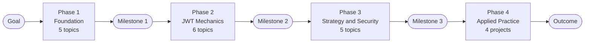
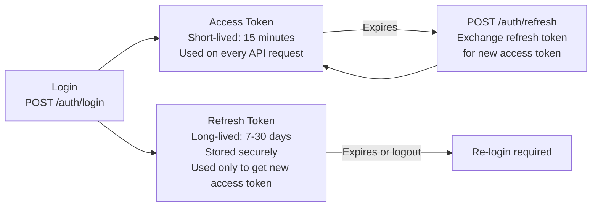

# JWT Authentication — Topic Learning Roadmap

**Category:** Learning > Roadmaps > Authentication  
**Tags:** `jwt`, `authentication`, `learning-roadmap`, `security`, `node.js`, `api`  
**Scope:** Topic-level roadmap — single subject, focused goal  
**Last Updated:** 2026-06-24

---

## Learning Objective

By the end of this roadmap, you will be able to:

- Explain how JWT works and why it is used (Remember, Understand)
- Implement JWT-based signup, login, and protected routes (Apply)
- Choose the right signing algorithm, token lifetime, and storage strategy (Analyze, Evaluate)
- Build a complete, production-ready JWT authentication system with refresh token support (Create)

---

## Goal Statement

> **Implement a production-ready JWT authentication system** that includes user signup and login, protected route middleware, access token and refresh token strategy, secure token storage, and logout with token invalidation — in a Node.js/Express REST API.

---

## Prerequisites — What You Must Know Before Starting

These are not part of this roadmap. If any are unfamiliar, learn them first.

| Prerequisite | Why it matters | Minimum depth |
|---|---|---|
| HTTP request and response cycle | JWT is transmitted in HTTP headers and cookies | Working knowledge |
| REST API fundamentals | You are building a REST API auth system | Working knowledge |
| Node.js and Express basics | Implementation language for this roadmap | Working knowledge |
| SQL basics | User credentials are stored in a database | Working knowledge |
| What authentication and authorization mean | JWT is an authentication mechanism | Awareness |

---

## Roadmap Overview



---

## Dependency Chain — Full Sequence

```mermaid
flowchart TD
    Goal(["Goal: JWT Authentication System"])

    Goal --> F1["HTTP statelessness\nwhy tokens exist"]
    F1 --> F2["Authentication vs authorization"]
    F2 --> F3["Session-based auth\nwhat JWT replaces"]
    F3 --> F4["Cryptographic signing\nawareness only"]
    F4 --> F5["Base64 encoding\nnot encryption"]

    F5 --> C1["JWT structure\nHeader, Payload, Signature"]
    C1 --> C2["JWT claims\nregistered, public, private"]
    C2 --> C3["Signing algorithms\nHS256 vs RS256"]
    C3 --> C4["Token generation\njwt.sign()"]
    C4 --> C5["Token verification\njwt.verify()"]
    C5 --> C6["Token expiry\nexp claim and effects"]

    C6 --> A1["Access token vs refresh token\npurpose and lifetime"]
    A1 --> A2["Refresh token rotation\nwhy and how"]
    A2 --> A3["Secure token storage\nhttpOnly cookie vs memory"]
    A3 --> A4["Token revocation strategies\nshort TTL vs blacklist"]
    A4 --> A5["Common JWT vulnerabilities\nnone algorithm, weak secrets"]

    A5 --> PR1["Build: Signup and login endpoints"]
    PR1 --> PR2["Build: Protected route middleware"]
    PR2 --> PR3["Build: Refresh token endpoint"]
    PR3 --> PR4["Build: Logout with invalidation"]

    PR4 --> Out(["Outcome: Production-ready JWT auth system"])
```



---

## Phase 1 — Foundation

**Purpose:** Establish the conceptual context that makes JWT necessary and meaningful. Without this foundation, JWT mechanics are memorised without being understood.

| # | Topic | Core Question | Depth |
|---|---|---|---|
| 1.1 | HTTP statelessness | Why does the server not remember you between requests? | Awareness |
| 1.2 | Authentication vs authorization | What is the difference between identity and permission? | Awareness |
| 1.3 | Session-based authentication | How did stateful auth work, and why does it not scale? | Awareness |
| 1.4 | Cryptographic signing | What does it mean to sign data, and why does it prove origin? | Awareness |
| 1.5 | Base64 encoding | Why is Base64 not encryption, and what is it actually for? | Awareness |

> **Claim:** Phase 1 topics require only awareness — you do not need to implement any of them.
> **Caveat:** Skipping Phase 1 is the most common cause of shallow JWT understanding. JWT mechanics only make sense in the context of the problems they solve.

### Milestone 1 — Verification

You have completed Phase 1 when you can answer all of the following without reference material:

- [ ] Why does an HTTP server not know who you are between requests?
- [ ] What is the difference between authentication and authorization?
- [ ] How does session-based auth maintain state, and why does it not scale horizontally?
- [ ] What does "signing" data prove, and what does it not prove?
- [ ] Why is Base64-encoded data not secure?

---

## Phase 2 — JWT Mechanics

**Purpose:** Build working knowledge of how JWT is structured, generated, and verified. This is the core of the roadmap — all subsequent phases depend on it.

| # | Topic | Core Question | Depth |
|---|---|---|---|
| 2.1 | JWT structure | What are the three parts of a JWT, and what does each contain? | Working knowledge |
| 2.2 | JWT claims | Which registered claims must be used, and what do they mean? | Working knowledge |
| 2.3 | Signing algorithms | When to use HS256 vs RS256, and what are the trade-offs? | Working knowledge |
| 2.4 | Token generation | How do you create a signed JWT with the correct claims? | Mastery |
| 2.5 | Token verification | How do you verify a JWT and extract its payload securely? | Mastery |
| 2.6 | Token expiry | What happens when a token expires, and how is expiry enforced? | Mastery |

### Key Concepts

**JWT Structure:**

```
eyJhbGciOiJIUzI1NiJ9        ← Header  (algorithm + type)
.eyJzdWIiOiJ1c2VyXzEifQ     ← Payload (claims: sub, role, iat, exp)
.SflKxwRJSMeKKF2QT4fwpMeJf  ← Signature (tamper-proof seal)
```

**Registered claims to always include:**

| Claim | Meaning | Example |
|---|---|---|
| `sub` | Subject — who the token represents | User ID |
| `iat` | Issued at — when the token was created | Unix timestamp |
| `exp` | Expiry — when the token becomes invalid | `iat + 900` (15 minutes) |
| `role` | Custom claim — for RBAC authorization | `admin`, `viewer` |

**HS256 vs RS256:**

| | HS256 | RS256 |
|---|---|---|
| **Type** | Symmetric | Asymmetric |
| **Key** | One shared secret | Public/private key pair |
| **Use when** | Single service signs and verifies | Multiple services verify, one signs |
| **Risk** | Secret exposure compromises all tokens | Private key exposure only |

### Milestone 2 — Verification

You have completed Phase 2 when you can do all of the following without reference material:

- [ ] Decode a JWT manually and identify its three parts
- [ ] List the registered claims and explain each one
- [ ] Generate a signed JWT with `sub`, `role`, `iat`, and `exp` claims
- [ ] Verify a JWT and handle the `TokenExpiredError` correctly
- [ ] Explain why you would choose RS256 over HS256

---

## Phase 3 — Strategy and Security

**Purpose:** Move from correct mechanics to secure and resilient design — understanding why JWT systems fail in production and how to prevent it.

| # | Topic | Core Question | Depth |
|---|---|---|---|
| 3.1 | Access token vs refresh token | Why are two tokens used, and what is each responsible for? | Mastery |
| 3.2 | Refresh token rotation | Why must refresh tokens be rotated on use, and what does that prevent? | Working knowledge |
| 3.3 | Secure token storage | Where should JWTs be stored, and what are the trade-offs of each location? | Working knowledge |
| 3.4 | Token revocation strategies | Why is JWT revocation hard, and what are the available strategies? | Working knowledge |
| 3.5 | Common JWT vulnerabilities | What are the most common JWT attacks, and how are they prevented? | Working knowledge |

### Key Concepts

**Access Token vs Refresh Token:**



**Secure Storage Trade-offs:**

| Storage | XSS Safe | CSRF Safe | Persists on Refresh | Recommendation |
|---|:---:|:---:|:---:|---|
| `localStorage` | No | Yes | Yes | Never — XSS steals token |
| `sessionStorage` | No | Yes | No | Never — XSS steals token |
| `httpOnly Cookie` | Yes | Needs CSRF token | Yes | Recommended for access token |
| In-memory JS variable | Yes | Yes | No | Good for SPAs |

**Common Vulnerabilities:**

| Vulnerability | Cause | Prevention |
|---|---|---|
| Algorithm confusion — `none` attack | Library accepts `alg: none` in header | Always specify allowed algorithms explicitly |
| Weak secret | HS256 secret is short or guessable | Use cryptographically random secret — 256 bits minimum |
| Missing expiry | `exp` claim absent | Always set `exp` — never issue tokens without expiry |
| Token not verified | Payload trusted without signature check | Always call `jwt.verify()` — never `jwt.decode()` for auth |
| Refresh token not rotated | Same refresh token reused indefinitely | Issue a new refresh token on every use and invalidate the old one |

### Milestone 3 — Verification

You have completed Phase 3 when you can do all of the following:

- [ ] Explain why access tokens are short-lived and refresh tokens are long-lived
- [ ] Explain what refresh token rotation prevents and how it works
- [ ] Choose a storage strategy and justify it given specific security constraints
- [ ] Name three JWT vulnerabilities and state how to prevent each
- [ ] Explain why `jwt.decode()` must never be used for authentication

---

## Phase 4 — Applied Practice

**Purpose:** Convert working knowledge into transferable skill by building a complete, production-ready JWT authentication system. Each project builds on the previous one.

| # | Project | Validates | Acceptance Criteria |
|---|---|---|---|
| 4.1 | Signup and login endpoints | Phases 1 and 2 | User can register; login returns signed JWT with correct claims |
| 4.2 | Protected route middleware | Phase 2 | Routes reject requests with missing, invalid, or expired tokens |
| 4.3 | Refresh token endpoint | Phase 3 | Expired access token can be exchanged for a new one using a valid refresh token |
| 4.4 | Logout with token invalidation | Phase 3 | Logout invalidates the refresh token — it cannot be reused |

### Project 4.1 — Signup and Login

```
POST /auth/signup    → validate, hash password, save user → 201 Created
POST /auth/login     → verify credentials, issue JWT + refresh token → 200 OK
```

**Acceptance criteria:**
- Passwords are hashed with bcrypt before storage
- JWT contains `sub`, `role`, `iat`, `exp`
- Access token TTL: 15 minutes
- Refresh token is stored server-side (DB or Redis), not in the JWT payload

---

### Project 4.2 — Protected Route Middleware

```
GET /api/orders
Authorization: Bearer <access_token>
```

**Acceptance criteria:**
- Missing token returns `401 Unauthorized`
- Invalid signature returns `401 Unauthorized`
- Expired token returns `401 Unauthorized` with `code: TOKEN_EXPIRED`
- Valid token extracts `sub` and `role` into `req.user`

---

### Project 4.3 — Refresh Token Endpoint

```
POST /auth/refresh
Cookie: refreshToken=<token>   ← sent via httpOnly cookie
```

**Acceptance criteria:**
- Valid refresh token issues new access token and rotates refresh token
- Used or invalid refresh token returns `401 Unauthorized`
- Old refresh token is invalidated immediately on use

---

### Project 4.4 — Logout

```
POST /auth/logout
Cookie: refreshToken=<token>
```

**Acceptance criteria:**
- Refresh token is deleted from server-side store
- httpOnly cookie is cleared
- Subsequent use of the deleted refresh token returns `401 Unauthorized`

### Milestone 4 — Outcome Verification

You have completed the roadmap when you can do all of the following from memory:

- [ ] Build a working signup and login endpoint that issues correctly structured JWTs
- [ ] Write a JWT middleware that correctly handles missing, invalid, and expired tokens
- [ ] Implement a refresh token endpoint with rotation
- [ ] Implement logout that fully invalidates the session
- [ ] Explain every security decision made in your implementation

---

## Depth Assignment Summary

| Topic | Depth | Rationale |
|---|---|---|
| HTTP statelessness | Awareness | Context only — not implemented |
| Authentication vs authorization | Awareness | Definitional — not implemented |
| Session-based auth | Awareness | Historical context — replaced by JWT |
| Cryptographic signing | Awareness | Conceptual only — library handles implementation |
| Base64 encoding | Awareness | Avoid a dangerous misconception — not implemented |
| JWT structure | Working knowledge | Must read and write JWT payloads correctly |
| JWT claims | Working knowledge | Must choose and validate claims correctly |
| Signing algorithms | Working knowledge | Must make an informed algorithm choice |
| Token generation | **Mastery** | Core skill — used on every auth flow |
| Token verification | **Mastery** | Core skill — security depends on correctness |
| Token expiry | **Mastery** | Core skill — mishandling causes security failures |
| Access vs refresh token | **Mastery** | Architectural decision with security consequences |
| Refresh token rotation | Working knowledge | Must implement correctly — wrong implementation is unsafe |
| Secure storage | Working knowledge | Must make an informed, context-appropriate choice |
| Token revocation | Working knowledge | Must understand trade-offs to choose strategy |
| Common vulnerabilities | Working knowledge | Must recognise and prevent the most critical ones |

---

## Recommended Resources

| Phase | Resource | Type |
|---|---|---|
| Phase 1 | MDN Web Docs — HTTP overview | Reference documentation |
| Phase 1 | This knowledge base — API Authentication and RBAC article | Internal article |
| Phase 2 | jwt.io — JWT introduction and debugger | Official resource |
| Phase 2 | `jsonwebtoken` npm package documentation | Library documentation |
| Phase 3 | OWASP JWT Security Cheat Sheet | Security standard |
| Phase 3 | This knowledge base — User Signup and Login article | Internal article |
| Phase 4 | Build the actual BuildNest auth module | Applied project |

---

## Metacognitive Checklist — Self-Monitoring

Use at each milestone and during review to verify genuine understanding:

**Before starting:**
- [ ] I have confirmed I meet all prerequisites listed above
- [ ] I can state the specific goal in my own words

**During Phase 1:**
- [ ] If a concept feels obvious, I can still explain it precisely — not just say "I know this"

**During Phase 2:**
- [ ] I am implementing, not just reading — I can generate and verify a JWT in code

**During Phase 3:**
- [ ] I can explain every security rule and its underlying reason — not just follow it blindly
- [ ] I can identify which vulnerabilities my implementation is exposed to and why

**During Phase 4:**
- [ ] My projects meet all acceptance criteria — not just "seem to work"
- [ ] I can explain every decision in my implementation if asked

**After completing:**
- [ ] I can teach the core mechanics to someone else without notes
- [ ] I can identify and explain a JWT vulnerability given a code review scenario
- [ ] I can extend the system — e.g., add multi-device logout, token fingerprinting, or sliding sessions

---

## Related Articles

- [Learning Roadmap — Concepts and Structure](./learning-roadmap.md)
- [API Authentication and RBAC Authorization](./api-authentication-and-rbac-authorization.md)
- [User Sign Up and Login Authentication Flow](./user-signup-and-login-authentication-flow.md)
- [HTTP Basic Authentication](./http-basic-authentication.md)
