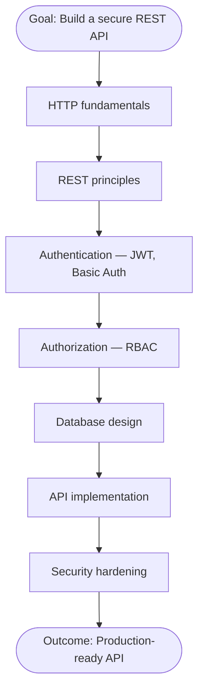
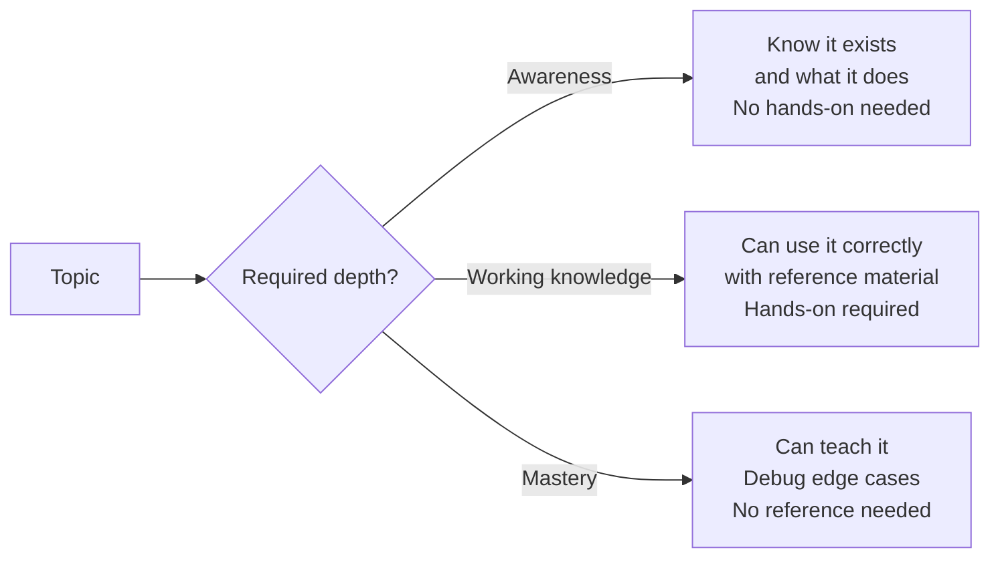
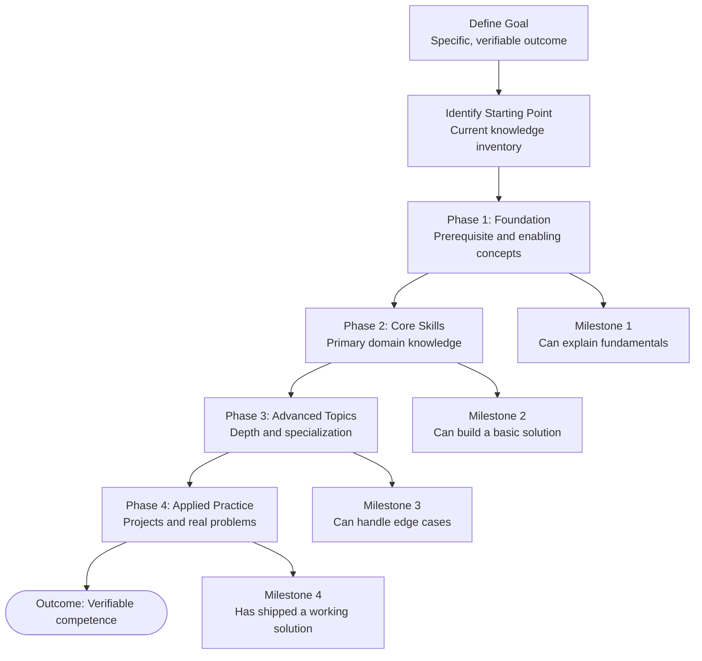

# Learning Roadmap

**Category:** Learning > Strategy > Planning  
**Tags:** `learning`, `roadmap`, `skill-development`, `knowledge-map`, `pedagogy`, `self-directed-learning`  
**Last Updated:** 2026-06-24

---

## Learning Objective

By the end of this article, you will be able to:
- Define what a learning roadmap is and why it is essential (Remember, Understand)
- Explain why learning order and depth matter (Understand, Analyze)
- Build a well-structured learning roadmap for any domain (Apply, Create)
- Evaluate whether an existing roadmap is well-formed (Evaluate)
- Self-monitor your own learning progress using a roadmap (Metacognitive)

---

## What Is a Learning Roadmap?

A **learning roadmap** is a structured, sequential plan that defines **what to learn, in what order, and to what depth** — to achieve a specific, verifiable knowledge or skill goal.

> **Analogy:** A GPS route for learning. It shows where you are, where you need to go, and the most efficient sequence of steps between the two — accounting for dependencies, detours, and checkpoints along the way.

> **Claim:** A learning roadmap is the single highest-leverage tool for self-directed learning.
> **Caveat:** A roadmap is only as good as its goal definition. A vague goal produces a vague roadmap that fails to guide learning effectively.

---

## Foundational Concept: Why Order Matters

Learning is **dependency-driven**. Advanced concepts depend on foundational ones. Attempting dependent topics before their prerequisites leads to confusion, surface-level understanding, and rapid knowledge decay.

Each node is a **prerequisite** for the next. Skipping HTTP fundamentals and starting with JWT is like studying advanced calculus before learning algebra — technically possible, but practically unproductive.

---

## Core Components of a Learning Roadmap

| Component | Definition | Example |
|---|---|---|
| **Goal** | The specific, verifiable outcome to be achieved | "Build and deploy a full-stack e-commerce API" |
| **Starting point** | Current knowledge and skill level | "Knows basic JavaScript, no API experience" |
| **Prerequisites** | What must be known before the goal can be pursued | HTTP, SQL, basic programming |
| **Phases** | Logical groupings of related topics | Foundation, Core, Advanced, Applied |
| **Topics** | Individual learning units within each phase | JWT, bcrypt, RBAC, Docker, indexing |
| **Depth markers** | How deeply each topic must be learned | Awareness / Working knowledge / Mastery |
| **Milestones** | Verifiable checkpoints that confirm progress | "Can implement JWT login from memory" |
| **Resources** | Where each topic is learned | Docs, courses, articles, books |
| **Projects** | Applied practice that consolidates learning | Build a working auth system end-to-end |

---

## Learning Depth Levels

Not every topic on a roadmap needs to be mastered. Assigning the wrong depth wastes time or leaves critical gaps. There are three levels:

| Level | When to use | Time investment |
|---|---|---|
| **Awareness** | Topic affects adjacent areas you work in, but you won't implement it | Low |
| **Working knowledge** | Topic is required for your goal — you must use it | Medium |
| **Mastery** | Topic is central to your goal — you must understand it deeply | High |

> **Claim:** Most topics on any roadmap require only working knowledge, not mastery.
> **Caveat:** Misjudging required depth is the most common roadmap design error — both under-investing (gaps) and over-investing (wasted time) are costly.

---

## Structure of a Well-Formed Learning Roadmap

---

## How to Build a Learning Roadmap

### Step 1 — Define the Goal

State the goal as a **specific, verifiable outcome** — not a topic area.

| Vague goal | Specific goal |
|---|---|
| "Learn authentication" | "Implement JWT-based authentication with refresh tokens in a Node.js API" |
| "Get better at databases" | "Design, query, and index a relational schema for an e-commerce platform" |
| "Understand Docker" | "Containerise a Node.js API and run it with Docker Compose alongside MySQL" |

### Step 2 — Inventory Your Starting Point

List what you already know. This eliminates unnecessary topics and correctly identifies where Phase 1 begins.

### Step 3 — Identify and Sequence Topics

1. List all topics required to achieve the goal
2. Identify dependencies between topics (what must come before what)
3. Group into phases: Foundation → Core → Advanced → Applied

### Step 4 — Assign Depth to Each Topic

For each topic, assign: Awareness / Working knowledge / Mastery — based on how central it is to the goal.

### Step 5 — Define Milestones

Each milestone must be **verifiable** — phrased as something you can do, not something you have read.

| Weak milestone | Strong milestone |
|---|---|
| "Understand JWT" | "Can implement JWT login and protected routes from memory" |
| "Learn RBAC" | "Can implement role-based middleware that restricts endpoints by role" |
| "Study Docker" | "Can write a Dockerfile and docker-compose.yml that runs an API with a database" |

### Step 6 — Select Resources

For each topic, identify one primary resource. Avoid collecting resources — one high-quality source per topic is sufficient.

### Step 7 — Plan Practice Projects

Each phase should end with a project that applies all topics in that phase. Projects are non-negotiable — they convert passive knowledge into active skill.

---

## Good vs Poor Learning Roadmap

| Dimension | Poor | Good |
|---|---|---|
| **Goal** | Vague topic area ("learn APIs") | Specific, verifiable outcome |
| **Order** | Topics listed randomly | Prerequisites before dependents |
| **Depth** | Same depth for all topics | Calibrated per topic based on need |
| **Milestones** | None — no way to verify progress | Clear, verifiable checkpoints |
| **Practice** | All theory, no projects | Project at end of each phase |
| **Scope** | Tries to cover everything | Scoped to what the goal actually requires |
| **Starting point** | Ignores current knowledge | Starts from actual current level |

---

## Metacognitive Checklist — Self-Monitoring Your Roadmap

Use this before starting and at each milestone to verify your roadmap is well-formed:

**Goal Definition**
- [ ] My goal is specific — it describes a concrete, verifiable outcome
- [ ] I can state what I will be able to DO when I have achieved the goal
- [ ] I have identified my current knowledge starting point

**Topic Design**
- [ ] Every topic has a clear dependency rationale — I know why it appears where it does
- [ ] No topic appears before its prerequisites
- [ ] Every topic has an assigned depth level (Awareness / Working knowledge / Mastery)
- [ ] The roadmap is scoped to what my goal actually requires — not everything I find interesting

**Progress Verification**
- [ ] Each milestone is phrased as something I can DO, not something I have read
- [ ] Each phase ends with an applied project
- [ ] I can objectively assess whether I have met each milestone

**Ongoing Review**
- [ ] If I am stuck on a topic, I check for a missing prerequisite — not a lack of ability
- [ ] If a topic feels too easy, I verify I have not underestimated the required depth
- [ ] I review and update the roadmap when the goal changes

---

## Key Takeaways

| # | Takeaway |
|---|---|
| 1 | A learning roadmap defines **what to learn, in what order, and to what depth** to reach a specific goal |
| 2 | **Order is determined by dependencies** — prerequisites must always come before the concepts that depend on them |
| 3 | **Depth is intentional** — most topics require working knowledge, not mastery |
| 4 | **Milestones must be verifiable** — "can do", not "have read" |
| 5 | **Projects are non-negotiable** — they convert passive knowledge into transferable skill |
| 6 | **A vague goal produces a vague roadmap** — specific goals are the foundation of effective learning plans |

---

## Related Articles

- API Authentication and RBAC Authorization
- User Sign Up and Login Authentication Flow
- HTTP Basic Authentication
- Mermaid Diagram Quality Attributes
