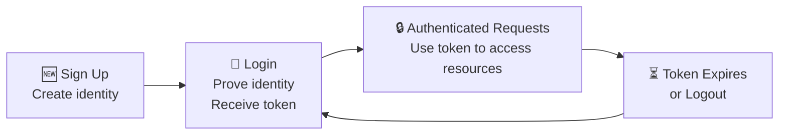
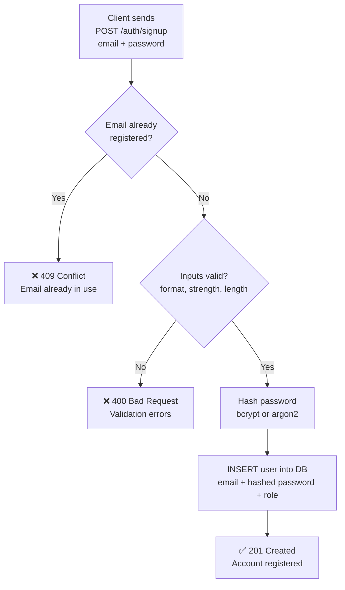
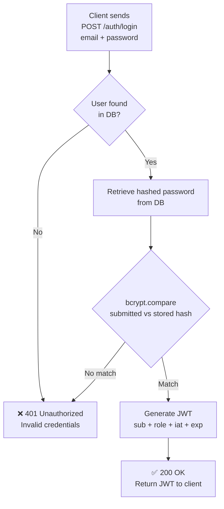
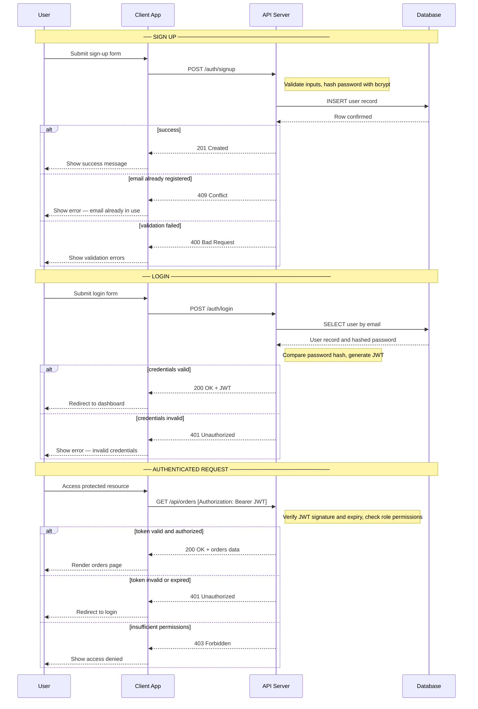
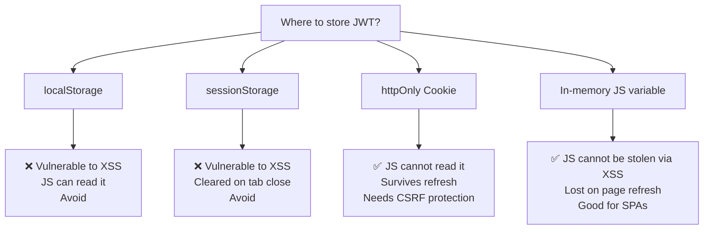

# User Sign Up & Login — Authentication Flow

**Category:** Backend > Security > Authentication  
**Tags:** `authentication`, `signup`, `login`, `jwt`, `bcrypt`, `session`, `api-security`  
**Last Updated:** 2026-06-24

---

## Learning Objective

By the end of this article, you will be able to:
- Explain what Sign Up and Login are and why they are distinct operations
- Describe the server-side mechanics of each, including password hashing
- Implement a secure signup/login flow in a REST API
- Evaluate trade-offs in token storage and identify common vulnerabilities
- Recognize and avoid the most critical security mistakes

---

## Mental Model

> **Sign Up** = Register a new identity in the system *(done once)*
> **Login** = Prove an existing identity to gain access *(done every session)*

**Analogy:**
- Sign Up is like enrolling at a gym — you hand over your details, get a membership created
- Login is like scanning your membership card at the door — you prove you're already a member, and you get a day pass

The day pass (JWT) expires. Your membership (account) persists. These are separate concerns.

---

## Conceptual Foundation: The Identity Lifecycle

Before the mechanics, understand the three phases every user moves through:



Sign Up happens **once**. Everything else — login, token expiry, re-authentication — is a cycle.

---

## Part 1 — Sign Up (Registration)

### What it does
Creates a new user record in the database with a **securely hashed password**.

### Why hash the password?

A hash is a **one-way mathematical transformation**:

```
"secret123"  →  bcrypt()  →  "$2b$10$K9L1Aa...xyz"
                                       ↑
                              Cannot be reversed
```

> **Claim:** You should always hash passwords before storing them.
> **Caveat:** Not all hash functions are equal. MD5 and SHA-1 are fast — dangerously fast for passwords. Use **bcrypt** or **argon2**, which are intentionally slow, making brute-force attacks computationally expensive.

### Sign Up Flow



### API Contract

```http
POST /auth/signup
Content-Type: application/json

{
  "email": "pradip@example.com",
  "password": "StrongPass@123"
}
```

```http
HTTP/1.1 201 Created

{
  "message": "Account created successfully"
}
```

> **Note:** Do not return the JWT on signup. Force an explicit login step — it keeps the flow clean and auditable.

---

## Part 2 — Login (Authentication)

### What it does
Verifies the submitted credentials against stored data, then **issues a signed token** (JWT) granting access.

### Login Flow



### API Contract

```http
POST /auth/login
Content-Type: application/json

{
  "email": "pradip@example.com",
  "password": "StrongPass@123"
}
```

```http
HTTP/1.1 200 OK

{
  "token": "eyJhbGciOiJIUzI1NiJ9.eyJzdWIiOiJ1c2VyXzEifQ.signature"
}
```

### Critical Security Rule: Never Leak Which Field Failed

```
❌ Wrong:  "User not found"        → attacker knows email doesn't exist
❌ Wrong:  "Incorrect password"    → attacker knows email exists
✅ Correct: "Invalid credentials"  → attacker learns nothing
```

This prevents **user enumeration attacks** — where an attacker probes the API to discover valid email addresses.

---

## Part 3 — The Complete Flow



---

## Part 4 — Where to Store the JWT

After login, the client must store the JWT to attach it to future requests. This is a **security-critical decision**.



| Storage | XSS Safe | CSRF Safe | Persists on Refresh | Recommendation |
|---|:---:|:---:|:---:|---|
| `localStorage` | ❌ | ✅ | ✅ | ❌ Avoid |
| `sessionStorage` | ❌ | ✅ | ❌ | ❌ Avoid |
| `httpOnly Cookie` | ✅ | ⚠️ | ✅ | ✅ Recommended |
| In-memory variable | ✅ | ✅ | ❌ | ✅ Good for SPAs |

> **Claim:** httpOnly Cookies are the safest default.
> **Caveat:** They require CSRF token protection. For SPAs with separate API domains (CORS), in-memory storage + short-lived tokens is a practical alternative.

---

## Part 5 — Critical Security Principles

These are the 20% of rules that prevent 80% of authentication vulnerabilities:

| Principle | Rule | Why |
|---|---|---|
| **Password storage** | Hash with bcrypt or argon2 | DB breach does not expose raw passwords |
| **Error messages** | Always say "Invalid credentials" | Prevents user enumeration |
| **Rate limiting** | Max ~5 login attempts per minute | Prevents brute-force attacks |
| **Token expiry** | Short-lived JWTs (15min–1hr) | Limits damage if token is stolen |
| **Refresh tokens** | Issue alongside access token | Seamless re-auth without re-login |
| **HTTPS only** | Enforce TLS everywhere | Prevents credentials being intercepted |
| **Input validation** | Validate all fields before processing | Prevents injection and malformed data |

---

## Part 6 — Practical Implementation (Node.js / Express)

### Sign Up Endpoint

```js
const bcrypt = require('bcrypt');

app.post('/auth/signup', async (req, res) => {
  const { email, password } = req.body;

  // 1. Validate
  if (!email || !password || password.length < 8) {
    return res.status(400).json({ error: 'Invalid input' });
  }

  // 2. Check uniqueness
  const existing = await User.findOne({ email });
  if (existing) return res.status(409).json({ error: 'Email already in use' });

  // 3. Hash password
  const hash = await bcrypt.hash(password, 10); // 10 = cost factor

  // 4. Save user
  await User.create({ email, password: hash, role: 'viewer' });

  res.status(201).json({ message: 'Account created successfully' });
});
```

### Login Endpoint

```js
const jwt = require('jsonwebtoken');

app.post('/auth/login', async (req, res) => {
  const { email, password } = req.body;

  // 1. Find user (generic error prevents enumeration)
  const user = await User.findOne({ email });
  if (!user) return res.status(401).json({ error: 'Invalid credentials' });

  // 2. Verify password
  const valid = await bcrypt.compare(password, user.password);
  if (!valid) return res.status(401).json({ error: 'Invalid credentials' });

  // 3. Issue JWT
  const token = jwt.sign(
    { sub: user.id, role: user.role },
    process.env.JWT_SECRET,
    { expiresIn: '1h' }
  );

  // 4. Return token (via httpOnly cookie or JSON body)
  res.status(200).json({ token });
});
```

---

## Common Mistakes (Metacognitive Checklist)

Use this before shipping any auth implementation:

- [ ] Passwords hashed with bcrypt or argon2 (never plain or MD5/SHA1)
- [ ] Login errors always say "Invalid credentials" — never field-specific
- [ ] Rate limiting applied to `/auth/login`
- [ ] JWT has a short expiry (`exp` claim set)
- [ ] JWT secret is stored in environment variables, not hardcoded
- [ ] JWT stored in httpOnly cookie or in-memory — not localStorage
- [ ] HTTPS enforced in production
- [ ] Inputs validated and sanitized before processing

---

## Key Takeaways

| # | Takeaway |
|---|---|
| 1 | **Sign Up** creates identity; **Login** proves identity — they are distinct operations |
| 2 | **Always hash passwords** with bcrypt/argon2 before storing — never reverse-engineerable |
| 3 | **Generic error messages** on login — "Invalid credentials" always, never field-specific |
| 4 | **JWT** = signed token issued on login, used to authenticate all future requests |
| 5 | **httpOnly cookie** is the safest JWT storage — JavaScript cannot access it |
| 6 | **Rate-limit login** to prevent brute-force; **short-lived JWTs** to limit stolen-token damage |

---

## Related Articles

- API Authentication & RBAC Authorization
- HTTP Basic Authentication
- JWT explained — structure, signing, and verification
- Refresh token strategy for seamless re-authentication
- API security best practices checklist
