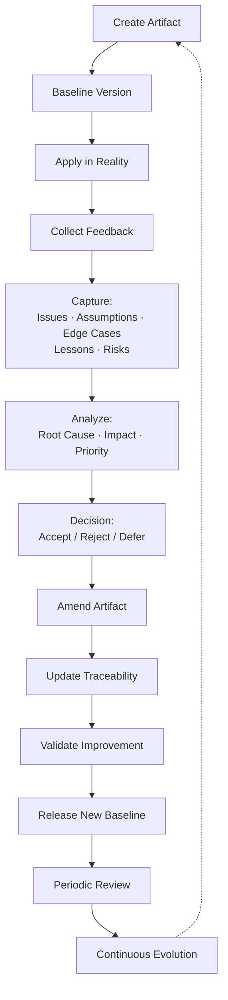

# Advanced Amendment Concepts: Toward an Adaptive Knowledge Governance Framework

This article extends [[closed-loop-feedback-and-amendment-mechanisms-for-process-documents]]'s
core amendment mechanism (trigger + correction + log) with 15 additional concepts, split into its
own article because the base article had grown past a comfortable single-read length. Read the
base article first — it covers the control-theory and continuous-improvement foundation this one
assumes.

Each concept below is independently adoptable; none requires the others.

## 1. Decision Log / Rationale Preservation

Many systems document **what changed** but lose **why it changed**. After months or years:

```text
Decision Exists
      ↓
Original Context Lost
      ↓
Future Team Reverses Decision
      ↓
Same Problem Reappears
```

Every amendment should preserve decision rationale:

```markdown
## Decision Context

Previous State:
What existed before?

Decision:
What changed?

Rationale:
Why was this decision made?

Rejected Alternatives:
What other options were considered?

Trade-offs:
What benefits and costs were accepted?
```

Related concept: Architecture Decision Records (ADR), Design History File, Decision Intelligence.

## 2. Assumption Tracking

Every artifact contains hidden assumptions. Example requirement:

```text
The system shall support 10,000 users.
```

Hidden assumptions:

```text
10,000 registered users?
10,000 monthly active users?
10,000 concurrent users?
```

Add an assumption register:

```markdown
## Assumption Record

ID: ASM-001

Assumption:
Users means concurrent active users.

Validation Method:
Load testing.

Status:
Unverified / Validated / Invalidated

Result:
Update requirement if assumption fails.
```

Lifecycle:

```text
Assumption
     ↓
Reality Test
     ↓
Validated?
   ↙        ↘
Keep      Create Amendment
```

## 3. Exception and Edge Case Registry

Not every discovered case immediately changes the main document. Maintain a separate register:

```text
Main Document
      |
      +-- Exception Register
      |
      +-- Edge Case Register
```

```markdown
## Edge Case Record

ID: EDGE-001

Scenario:
User payment succeeds but confirmation callback fails.

Expected Handling:
Retry verification before marking payment failed.

Affected Areas:
Payment Service
Order Service
Notification Service
```

Benefits: prevents forgotten scenarios, improves testing, improves reliability.

## 4. Knowledge Maturity Levels

Not all information has the same confidence. Classify it:

```text
Level 0: Idea
   ↓
Level 1: Hypothesis
   ↓
Level 2: Tested
   ↓
Level 3: Standardized
   ↓
Level 4: Best Practice
```

Before validation:

```text
"We should cache product data."
```

After validation *(generic illustrative example, not a real BuildNest metric)*:

```text
"Product catalog queries are cached because performance testing showed
a 40% latency reduction."
```

## 5. Sunset / Deprecation Process

Feedback loops should not only add information — they should remove outdated knowledge. Without
cleanup:

```text
Old Rules
+
New Rules
+
Exceptions
=
Complexity
```

```markdown
## Deprecation Review

Is this still valid?

Options:

Keep
Update
Merge
Remove
Archive
```

## 6. Periodic Review Cycle

Do not wait only for failures — introduce scheduled reviews:

```text
Monthly Review
Quarterly Review
Release Review
Annual Review
```

Review questions:

```text
Is this still accurate?

Did reality change?

Are assumptions still valid?

Did technology change?

Can this be simplified?
```

## 7. Lessons Learned Repository

Convert experience into reusable knowledge:

```text
Incident
    ↓
Root Cause Analysis
    ↓
Lesson Learned
    ↓
Knowledge Base Update
    ↓
Future Prevention
```

```markdown
## Lesson Learned

Situation:
What happened?

Cause:
Why did it happen?

Learning:
What should change?

Prevention:
How do we avoid recurrence?
```

This is the same flow this repo's own `docs/wiki/learned-lessons/` directory implements — one
atomic lesson file per incident, each following exactly this Situation/Cause/Learning/Prevention
shape even where not labeled that way explicitly.

## 8. Traceability Matrix Integration

Every amendment should link affected artifacts. Generic illustrative IDs below — not real
BuildNest issue/PR numbers (the base article cites real ones, e.g. #68, #279, #308; don't confuse
this example's numbering with those):

```text
AMD-001
   |
   +-- Requirement REQ-045
   |
   +-- Design Component AUTH-002
   |
   +-- Code PR #105
   |
   +-- Test Case TC-078
```

This answers: *"If I change this, what else is affected?"*

## 9. Feedback Source Classification

Not all feedback has equal reliability. Classify the source:

```text
Feedback
    |
    +-- User Feedback
    |
    +-- Production Evidence
    |
    +-- Audit Finding
    |
    +-- Experiment Result
    |
    +-- Expert Review
    |
    +-- Assumption Discovery
```

Evidence-based changes reduce unnecessary modifications.

## 10. Change Impact Scoring

Before accepting an amendment, score it:

| Factor | Score |
|---|---:|
| User Impact | 5 |
| Security Impact | 4 |
| Cost | 3 |
| Complexity | 2 |
| Risk Reduction | 5 |

```text
High value + Low risk
        ↓
Implement Amendment
```

## 11. Preventive Improvement Loop

A mature system should not only fix problems.

Basic maturity:

```text
Problem → Fix
```

Advanced maturity:

```text
Problem
   ↓
Root Cause
   ↓
System Weakness
   ↓
Prevent Future Problems
```

Bad:

```text
Bug found → Fix bug
```

Better:

```text
Bug found
   ↓
Fix bug
   ↓
Add test
   ↓
Update coding guideline
   ↓
Improve review checklist
```

## 12. Amendment Lifecycle States

Borrow from issue tracking:

```text
Proposed
    ↓
Under Review
    ↓
Accepted
    ↓
Implemented
    ↓
Verified
    ↓
Closed
```

Or, for the paths that don't reach Closed via Implemented: `Rejected`, `Deferred`, `Superseded`,
`Deprecated`.

## 13. Knowledge Ownership

Every artifact should define responsibility:

```markdown
## Ownership

Owner:
Architecture Team

Responsibilities:
- Review amendments
- Maintain accuracy
- Approve changes
- Retire outdated knowledge
```

Without ownership: "Everyone owns it" equals "Nobody owns it."

## 14. Continuous Improvement Metrics

Measure the process itself:

```text
Number of recurring issues

Average time to update documentation

Number of outdated documents

Rejected amendment ratio

Knowledge reuse rate
```

## 15. Complete Enhanced Lifecycle



This is the same 8-step loop from
[[closed-loop-feedback-and-amendment-mechanisms-for-process-documents]]'s "The General Amendment
Lifecycle," expanded to show what each of "Identify Gaps" and "Analyze Impact" actually decomposes
into in practice. Treat this as the detailed variant and that article's version as the canonical
simple one — not as two independently-designed lifecycles.

## Synthesis

A more complete name for this concept could be the **Adaptive Knowledge Governance Framework**,
combining:

- Feedback Loop
- Amendment Management
- Change Control
- Knowledge Management
- Lessons Learned
- Configuration Management
- Continuous Improvement
- Traceability
- Decision Management

This transforms documentation from **"a place where information is stored"** into **"a system
that learns and improves over time."**

## References

- Kruchten, P. (2004). "An Ontology of Architectural Design Decisions" — foundational Architecture
  Decision Record (ADR) concept referenced in §1.
- [[closed-loop-feedback-and-amendment-mechanisms-for-process-documents]] — the base
  amendment-mechanism pattern this article extends.
