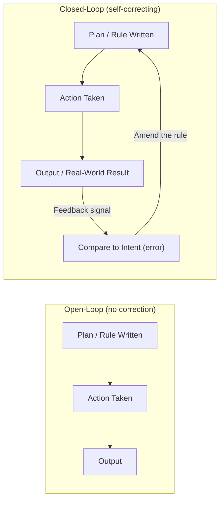
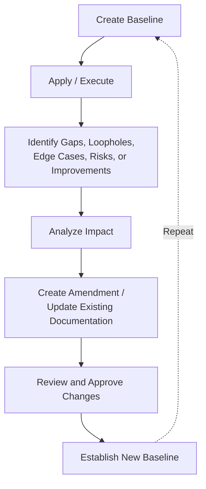

# Closed-Loop Feedback and Amendment Mechanisms for Process Documents

## Table of Contents

- [The Problem This Solves](#the-problem-this-solves)
- [Open-Loop vs. Closed-Loop Control](#open-loop-vs-closed-loop-control)
- [The Ratchet Mechanism — A Special Case](#the-ratchet-mechanism--a-special-case)
- [Amendment Mechanism — The Applied Pattern](#amendment-mechanism--the-applied-pattern)
- [The General Amendment Lifecycle](#the-general-amendment-lifecycle)
- [Related Concepts and Processes](#related-concepts-and-processes) — includes "Also Known As" naming equivalents (PDCA, Kaizen, ISO 9001, Agile, DevOps, ITIL, CMMI, etc.)
- [Reusable Knowledge: Feedback Loop Through Amendments and Continuous Improvement](#reusable-knowledge-feedback-loop-through-amendments-and-continuous-improvement)
- [Advanced Governance Concepts](#advanced-governance-concepts) — split into [Advanced Amendment Concepts: Toward an Adaptive Knowledge Governance Framework](adaptive-knowledge-governance-advanced-amendment-concepts.md)
- [The Same Loop at Compliance-Program and Software-Quality-Attribute Scale](#the-same-loop-at-compliance-program-and-software-quality-attribute-scale) — split into [Closed-Loop Patterns in Compliance and Production-Readiness Programs](compliance-and-production-readiness-closed-loop-patterns.md)
- [Quick Reference](#quick-reference)
- [References](#references)

## The Problem This Solves

A rule file, checklist, or runbook is written once, based on what its author knew at the time.
Reality keeps changing after that point — new edge cases surface, old assumptions stop holding,
the environment drifts. If nothing routes that new information back into the document, it slowly
diverges from the reality it's supposed to govern. This is the same failure mode documented
elsewhere in this knowledge base for `README.md` (numeric facts drift silently) and
`project_state.md` (a memory file narrating an earlier session as if it were current) — the
general version of that problem is the subject of this article.

## Open-Loop vs. Closed-Loop Control

This is a control-theory distinction, and it's the cleanest way to name the difference between a
document that self-corrects and one that doesn't.

- **Open-loop control**: output is produced from a fixed input/plan with no mechanism to observe
  the actual result and adjust. A microwave timer set for 90 seconds runs for 90 seconds regardless
  of whether the food is actually hot yet.
- **Closed-loop control**: output is observed (a *feedback signal*), compared against the desired
  state, and the difference (the *error*) is fed back to adjust future behavior. A thermostat
  measures room temperature and turns the heater on or off based on the gap to the target — it
  doesn't just run a fixed schedule.



A written process document is, structurally, a **plan**. Without a feedback path back from its
real-world results to its own text, it's running open-loop — correct on day one, silently wrong
by day one-hundred, with nothing to notice the gap.

### Negative vs. Positive Feedback

Control theory distinguishes two feedback directions:

- **Negative feedback** — the signal opposes the deviation, pulling the system back toward the
  target. This is the corrective, stabilizing kind (a thermostat, an amendment log correcting a
  stale rule).
- **Positive feedback** — the signal reinforces the deviation, amplifying it further (a microphone
  shrieking near its own speaker; a rule violation going unaddressed and becoming precedent for
  the next violation, per the [Quality Gate Ratchet Pattern](quality-gate-ratchet-pattern.md) article's discussion of broken-windows
  theory).

An amendment mechanism is deliberately engineered **negative feedback**: a real gap (the error
signal) is fed back into the document (the correction), pulling it back toward matching reality.

## The Ratchet Mechanism — A Special Case

The [Quality Gate Ratchet Pattern](quality-gate-ratchet-pattern.md) article covers this in depth for BuildNest's PIT mutation
score gate. In this framework, a ratchet is a closed-loop feedback mechanism with an added
constraint: the correction is allowed to move the target in only one direction. Ordinary negative
feedback pulls a system back toward a fixed target from either side; a ratchet's target itself
moves forward every time reality proves capable of meeting a higher bar, and is mechanically
prevented from moving backward. It's the same loop, with an asymmetric correction rule layered on
top.

An amendment log (below) does not have that one-way constraint — a rule can be tightened *or*
loosened based on what reality shows. A ratchet is the special case where only tightening is
permitted.

## Amendment Mechanism — The Applied Pattern

An **amendment mechanism** is the concrete implementation of closed-loop control for a process
document: a standing instruction for *when* to feed real-world findings back into the document,
*how* to make the correction, and a durable *log* recording that the loop actually closed each time.

### The Three Parts

1. **Trigger** — the condition that counts as a feedback signal worth acting on (e.g. "a lessons-learned
   pass surfaces a gap," "the same override happens three times").
2. **Correction procedure** — edit the actual rule, not just note that it's wrong somewhere else.
3. **Log** — a durable, append-only record of what changed and what triggered it, so the document's
   own history is inspectable rather than reconstructed from memory.

Without the log, part 1 and 2 can still happen, but nobody downstream can tell *whether* the loop
has been closing over time, or *how often* — the log is what makes the feedback loop auditable
rather than anecdotal.

**When the same trigger fires twice for the same underlying gap** (a fix regresses, not just a new
gap appearing), the response needs to escalate beyond another prose correction — see [Recurrence
Escalation](recurrence-escalation-for-process-and-amendment-mechanisms.md) for the cross-field
terminology (repeat finding, configuration drift, latent condition, and others) and an occurrence-
count-driven ladder for strengthening the enforcement mechanism itself, not just the wording.

### Worked Example — This Repo's Own Config Files (2026-07-07)

Four files in this repo went from open-loop to closed-loop in the same session, each scoped to
match what it governs:

| File | Scope of its log | Trigger wording |
|---|---|---|
| `.claude/rules/common/development-workflow.md` | This repo's GitHub-issue workflow | A severity-tier mismatch recurring, or a loophole found anywhere in the file |
| `.claude/rules/common/git-workflow.md` | This repo's git conventions | A workflow decision (e.g. adopting branch+PR) that changes this file |
| `~/.claude/rules/definition-of-done.md` | Cross-project checklist | Any project's session surfacing a gap this checklist should have caught |
| `~/.claude/CLAUDE.md` | The file's own substantive edit history | A rewrite significant enough to matter across every project |

Each log was **backfilled** with real prior edits at creation time, rather than starting empty —
an amendment log that begins empty looks identical to one that was just invented and never used;
backfilling proves the mechanism describes real history, the same way the workflow file's worked
examples prove its severity table matches observed behavior rather than being aspirational.

## The General Amendment Lifecycle

The three-part pattern above (trigger, correction, log) is a compressed view of a longer lifecycle
that recurs across policies, standards, requirements, architecture decisions, and processes — not
just rule files. Written out in full, a mature version of this lifecycle looks like:



Two steps in this longer version are worth calling out because the compressed three-part pattern
folds them in implicitly:

- **Analyze Impact** sits between finding a gap and fixing it — for a rule file this is usually
  quick (does the fix contradict another section? does it change behavior other steps depend on?),
  but it's a real step, not a formality to skip. The cross-check against `definition-of-done.md`
  and `git-workflow.md` performed before writing `development-workflow.md` was exactly this step.
- **Review and Approve** is what makes the correction deliberate rather than silent. In a
  single-maintainer context this can be a fast confirm-before-editing exchange rather than a formal
  sign-off — but skipping it entirely (editing a shared rule file without surfacing the change)
  removes the one point where a bad amendment gets caught before it becomes the new baseline.

### Recommended Documentation Section

Any living process document benefits from stating this lifecycle explicitly, so a future editor
(human or agent) knows amendment is expected, not a deviation from the document's authority. A
reusable template:

```markdown
## Continuous Improvement and Amendment Process

This document shall be treated as a living artifact. If new gaps,
loopholes, edge cases, risks, constraints, or improvement opportunities
are identified during implementation, operation, review, or audit activities,
they shall be captured, analyzed, and addressed through a controlled
amendment process.

All amendments shall maintain traceability by documenting:
- Reason for change
- Identified problem or opportunity
- Proposed modification
- Impact analysis
- Approval or review decision
- Revision history update

This process ensures continuous improvement, adaptability, and long-term
alignment with evolving requirements and operational needs.
```

The amendment logs added to this repo's rule files (worked example below) are a lighter-weight,
table-based implementation of the same six traceability elements — each log row compresses "reason
for change," "identified problem," and "proposed modification" into its `Trigger`/`Change` columns,
appropriate for a single-maintainer repo where a full six-field change record per amendment would
be more ceremony than the risk warrants (see the severity-based scaling discussion in
`development-workflow.md` for when *more* ceremony is warranted).

## Related Concepts and Processes

This pattern has a name in most mature engineering and quality disciplines — recognizing which
one applies helps pull in that discipline's existing tooling and vocabulary instead of reinventing
it:

| Concept | What It Adds | Where This Repo Touches It |
|---|---|---|
| **Change Management Process** | Formal control over *any* change to a defined baseline (not just documents) — typically includes a change request, impact assessment, and approval gate | The Review/Approve step above, informally |
| **Document Lifecycle Management** | Treats a document itself as having versioned states (draft → published → superseded), independent of its content | This KB's own frontmatter (`status: draft\|published`, `last_updated`) |
| **Configuration Management** | Tracks the state of controlled artifacts (not just docs — code, infra, environments) and how they change over time | Liquibase changesets are configuration management for schema; this repo's `.claude/rules/*.md` files are configuration management for process |
| **Lessons Learned Process** | The activity that *generates* the feedback signal — see [Post-Implementation Learning and Continuous Improvement Activities](post-implementation-learning-activities.md) for how it relates to retrospectives, PIR, and RCA | `definition-of-done.md` item 5, run after every issue |
| **Corrective and Preventive Action (CAPA)** | A structured lifecycle for turning one incident into a systemic fix, distinguishing correction (fix the instance) from corrective action (fix the cause) — see [CAPA – Corrective and Preventive Action](../learning/capa-corrective-and-preventive-action.md) | Each rule-file amendment is closer to CAPA's "preventive action" than its "correction" — it changes the system that would otherwise reproduce the same gap |
| **Knowledge Base Evolution Process** | The specific case of this lifecycle applied to a knowledge base itself — articles get superseded, merged, or corrected as understanding improves | This KB's own `README.md` "Contributing" section and frontmatter schema |
| **Governance Feedback Loop** | The organizational-level version: how an institution's rules get updated based on how they actually perform once enforced | The scope difference between this repo's per-file logs (local governance) and industry standards like ISO 9001's mandated "continual improvement" clause (formal governance) |

This same loop is why ISO-based quality management systems, software lifecycle management, and
enterprise architecture governance all converge on nearly identical language (baseline, gap,
impact analysis, controlled change, new baseline) despite having evolved independently — it's the
same closed-loop control structure from earlier in this article, applied at the institutional
scale rather than the single-document scale.

### Also Known As — Naming Equivalents Across Fields

The concepts above have real BuildNest touchpoints. The list below doesn't — these are pure
vocabulary equivalents, the same loop named differently in a different field, included so you can
recognize it when someone else calls it by one of these names instead:

| Framework | Same Loop, Named As |
|---|---|
| PDCA / Deming Cycle | Plan → Do → Check → Act — "Check"/"Act" are the feedback and correction steps |
| Kaizen / Lean | Continuous, incremental improvement driven by observing the work itself |
| Cybernetics | Norbert Wiener's 1948 formal origin of "feedback" as a control concept — the theoretical root this article's control-theory framing is drawn from |
| Retrospective (Agile/Scrum) | A scheduled checkpoint for feeding lessons back into how a team works, at a fixed cadence rather than per-document |
| ISO 9001 | "Continual Improvement" clause |
| Agile | "Inspect and Adapt" |
| DevOps | "Continuous Feedback" |
| ITIL | "Continual Improvement" |
| CMMI | "Process Improvement" |
| ISO/IEC/IEEE 12207 | "Software lifecycle improvement" |

## Reusable Knowledge: Feedback Loop Through Amendments and Continuous Improvement

The sections above apply the pattern to this repo specifically. This section is the general,
project-agnostic version — usable as a standalone reference for any document, process, policy,
standard, architecture, or requirement, not just a `.claude/rules/*.md` file.

### 1. Core Concept

A document, process, policy, standard, architecture, requirement, or system design should not be
considered permanently complete after its first release.

A well-engineered artifact is treated as a **living artifact** that evolves when new information
is discovered.

The purpose of a feedback loop is to ensure:

- discovered gaps are captured,
- assumptions are validated,
- edge cases are handled,
- lessons learned are preserved,
- improvements are systematically integrated,
- future mistakes are prevented.

The general principle:

```text
A system that cannot learn from experience will eventually become outdated.
```

### 2. Problem Without a Feedback Loop

A typical mistake is assuming the initial version is perfect.

Example:

```text
Create Document
       ↓
Approve Document
       ↓
Use Forever Without Updates
```

Problems:

| Problem | Impact |
|---|---|
| Hidden assumptions remain | Future failures |
| Edge cases ignored | Unexpected behavior |
| Lessons are forgotten | Repeated mistakes |
| Requirements change | Documentation becomes inaccurate |
| Defects are patched informally | No organizational learning |
| Decisions lose context | Future maintainers cannot understand why |

Over time, this creates **documentation drift**:

```text
Actual System
      ≠
Documented System
```

### 3. Improved Lifecycle With Amendment Feedback Loop

A mature lifecycle introduces controlled evolution. This is the same 8-step lifecycle already
diagrammed in "[The General Amendment Lifecycle](#the-general-amendment-lifecycle)" above — see
that diagram rather than a second copy here. One thing worth restating: that version's explicit
**Review and Approve Changes** step is easy to compress away when retelling the loop informally
(as an earlier draft of this section did) — don't drop it. It's the one point where a bad
amendment gets caught before it becomes the new baseline, per that section's own discussion of why
it matters.

This creates an **organizational learning cycle**.

### 4. What Is an Amendment?

An amendment is a controlled modification made after discovering that the current version requires
improvement.

It answers:

> "What did we learn, and how should our existing knowledge change?"

An amendment may:

- add missing information,
- clarify ambiguous statements,
- remove incorrect assumptions,
- introduce new rules,
- update decisions,
- add exceptions,
- document edge cases.

### 5. Sources That Trigger Amendments

Amendments should be created from evidence, not random preference.

Examples:

| Source | Example Amendment |
|---|---|
| Defect found | Add prevention guideline |
| Production incident | Update operational procedure |
| Security vulnerability | Add security requirement |
| New edge case | Add exception handling rule |
| Customer feedback | Update requirement |
| Code review finding | Improve coding standard |
| Architecture limitation | Update design decision |
| Audit finding | Add compliance control |
| Performance issue | Update NFR |
| New technology | Update implementation guidance |

### 6. Amendment Workflow

A professional amendment process:

```text
1. Capture Observation
        ↓
2. Register Change Request
        ↓
3. Analyze Root Cause
        ↓
4. Assess Impact
        ↓
5. Propose Amendment
        ↓
6. Review Amendment
        ↓
7. Approve / Reject
        ↓
8. Update Artifact
        ↓
9. Update Version History
        ↓
10. Communicate Change
```

### 7. Recommended Amendment Template

For a formal, multi-stakeholder context, a full per-amendment record captures more than a single
log row can:

```markdown
# Amendment Record

## Amendment ID
AMD-001

## Date
YYYY-MM-DD

## Current Version
v1.2

## Trigger
Why was this amendment required?

Example:
A new edge case was discovered during implementation.

## Problem / Gap Identified

Describe:
- Missing information
- Incorrect assumption
- Limitation
- Risk

## Root Cause

Why did the gap exist?

## Proposed Change

Describe the modification.

## Impact Analysis

Affected areas:

- Requirements
- Design
- Implementation
- Testing
- Documentation
- Operations

## Decision

Accepted / Rejected / Deferred

## Updated Version

v1.3

## Lessons Learned

What should be remembered in the future?
```

Use this full template when an amendment is significant enough to warrant its own review (a
architecture-level or requirement-level change); use the lighter table-row log (as in this repo's
rule files) when the artifact is a single-maintainer process document and the six fields would be
more ceremony than the change warrants.

### 8. Relationship With Version Control

Every amendment should create traceability.

Example:

```text
Requirement v1.0
      |
      ↓
Edge Case Found
      |
      ↓
AMD-001 Created
      |
      ↓
Requirement Updated
      |
      ↓
Requirement v1.1 Released
```

The history explains:

- what changed,
- why it changed,
- who approved it,
- when it changed.

### 9. Application in Software Engineering

**Requirements (SRS)**

Initial:

```text
Users can reset passwords.
```

Later discovery:

```text
What happens if reset links expire?
```

Amendment:

```text
Password reset links shall expire after 15 minutes.
Expired links shall redirect users to generate a new request.
```

**Architecture (SDD / ADR)**

Initial decision:

```text
Use relational database.
```

Later discovery:

```text
High-volume search queries are slow.
```

Amendment:

```text
Introduce search optimization strategy.
Record decision rationale in ADR-004.
```

**Testing**

Initial:

```text
Validate login functionality.
```

Later discovery:

```text
Multiple failed attempts not tested.
```

Amendment:

```text
Add security test cases for:
- Account lockout
- Rate limiting
- Brute force protection
```

### 10. Recommended Documentation Governance Rule

This is the same governance rule as the "[Recommended Documentation
Section](#recommended-documentation-section)" template earlier in this article — restated here as
a condensed, one-paragraph rule rather than a full section template, for the case where a document
has room for a short mandate but not a full `## Continuous Improvement and Amendment Process`
section:

```text
All controlled artifacts shall include a feedback mechanism to capture
new knowledge discovered during their lifecycle.

Identified gaps, defects, assumptions, edge cases, and improvement
opportunities shall be evaluated through a formal amendment process.

Approved amendments shall update the artifact baseline while preserving
traceability, rationale, and historical context.
```

### Synthesis

```text
First version = Best understanding today.

Amendment process = Mechanism to incorporate tomorrow's learning.
```

A feedback loop transforms documentation from a static record into a continuously improving
knowledge system.

## Advanced Governance Concepts

The lifecycle above is complete on its own — 15 additional concepts (decision logs, assumption
tracking, traceability matrices, change impact scoring, and more) extend it toward what could be
called an **Adaptive Knowledge Governance Framework**. That material is substantial enough to
warrant its own article rather than extending this one further:

**See [Advanced Amendment Concepts: Toward an Adaptive Knowledge Governance Framework](adaptive-knowledge-governance-advanced-amendment-concepts.md)** for all 15 concepts, the
detailed variant of the amendment lifecycle, and the framework synthesis.

## The Same Loop at Compliance-Program and Software-Quality-Attribute Scale

This closed-loop pattern isn't specific to rule files or requirements — it's also how mature
compliance/audit programs (SOC 2, ISO 27001, NIST CSF, and similar) and "production-grade
software" quality attributes are described, just at a much larger scale than a single document.
That material is substantial enough to warrant its own article rather than extending this one
further:

**See [Closed-Loop Patterns in Compliance and Production-Readiness Programs](compliance-and-production-readiness-closed-loop-patterns.md)** for the full/lean/agentic
compliance-lifecycle versions, the canonical production-grade quality-attribute list, and the
6-level requirement-specification structure.

## Quick Reference

| Question | Answer |
|---|---|
| What's the control-theory name for a rule that never gets checked against reality? | Open-loop control |
| What's the name for the correcting signal? | Negative feedback |
| What's the name for a rule violation that goes unaddressed and compounds? | Positive feedback / broken-windows spiral |
| What's the continuous-improvement name for this loop? | PDCA (Deming), Kaizen, or a retrospective, depending on cadence/formality |
| What's the special case where the target only ever tightens? | A ratchet mechanism — see [Quality Gate Ratchet Pattern](quality-gate-ratchet-pattern.md) |
| What closes the loop for a specific rule file? | An amendment mechanism: trigger + correction procedure + durable log |
| Why must the log be backfilled, not started empty? | An empty log is indistinguishable from an unused mechanism — backfilling proves it describes real history |
| Where does decision-log/rationale preservation, assumption tracking, traceability matrices, and change impact scoring live? | [Advanced Amendment Concepts: Toward an Adaptive Knowledge Governance Framework](adaptive-knowledge-governance-advanced-amendment-concepts.md) — split out as its own article |
| What's the umbrella name combining amendment management, change control, knowledge management, and traceability? | The Adaptive Knowledge Governance Framework — see [Advanced Amendment Concepts: Toward an Adaptive Knowledge Governance Framework](adaptive-knowledge-governance-advanced-amendment-concepts.md)'s Synthesis |
| Where does the compliance-program / production-grade-software version of this same loop live? | [Closed-Loop Patterns in Compliance and Production-Readiness Programs](compliance-and-production-readiness-closed-loop-patterns.md) — split out as its own article |

## References

- Wiener, N. (1948). *Cybernetics: Or Control and Communication in the Animal and the Machine*. MIT Press. — origin of "feedback" as a formal control concept.
- Deming, W.E. (1986). *Out of the Crisis*. MIT Press. — the Plan-Do-Check-Act cycle.
- Imai, M. (1986). *Kaizen: The Key to Japan's Competitive Success*. McGraw-Hill. — continuous incremental improvement.
- Ford, N. & Parsons, R. (2017). *Building Evolutionary Architectures*. O'Reilly. — fitness functions as engineered feedback in software systems.
- International Organization for Standardization. *ISO 9001:2015 — Quality management systems — Requirements*. — "continual improvement" clause referenced in "Related Concepts and Processes" / "Also Known As."
- [Quality Gate Ratchet Pattern](quality-gate-ratchet-pattern.md) — the one-way (ratchet) special case of this article's general closed-loop pattern, applied to BuildNest's PIT mutation gate.
- [Feedback Loop Taxonomy: Substrate, Instance, Stage, and Symmetry](feedback-loop-taxonomy-substrate-instance-stage-symmetry.md) — places this article's closed-loop control and PDCA content within a broader structural map alongside iteration, control flow, live monitoring, and the ratchet mechanism.
- [Feedback Loop Extension: Enforcement and Safety Vocabulary](feedback-loop-enforcement-and-safety-vocabulary.md) — guardrails, quality gates, and enforcement mechanisms built on this article's open-loop/closed-loop distinction.
- [Feedback Loop Enforcement Extensions: Funnels and Epistemic Awareness](feedback-loop-enforcement-extensions-funnels-and-epistemics.md) — applies this article's open-loop/closed-loop distinction to a funnel: a multi-stage filter/quality-gate pipeline that's open-loop by default unless wrapped in a feedback loop one level up.
- [Closed-Loop Patterns in Compliance and Production-Readiness Programs](compliance-and-production-readiness-closed-loop-patterns.md) — the same closed-loop pattern applied at compliance-program and software-quality-attribute scale, split into its own article to keep this one's scope to process documents specifically.
- [Advanced Amendment Concepts: Toward an Adaptive Knowledge Governance Framework](adaptive-knowledge-governance-advanced-amendment-concepts.md) — the 15-concept extension (decision logs, assumption tracking, traceability matrices, change impact scoring, and more), split into its own article for the same reason.
- `~/.claude/rules/definition-of-done.md`, `.claude/rules/common/development-workflow.md`, `.claude/rules/common/git-workflow.md`, `~/.claude/CLAUDE.md` — this repo's own live amendment mechanisms, each with a backfilled log.
