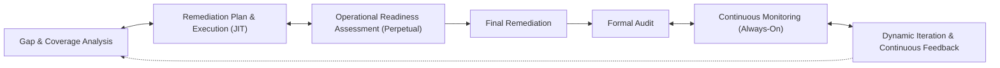
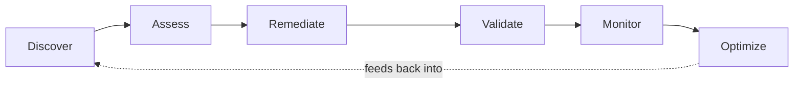

# Closed-Loop Patterns in Compliance and Production-Readiness Programs

This article applies the closed-loop control pattern from
[[closed-loop-feedback-and-amendment-mechanisms-for-process-documents]] at a different scale: a
compliance program (auditing a whole organization) and a software system's quality-attribute
posture (what makes it "production-grade"), rather than a single rule file. Read that article
first for the underlying control-theory and continuous-improvement framing — this one assumes it
and doesn't re-derive it.

## The Compliance-Program Loop, at Three Levels of Compression

**Full version** (compliance-program framing):



Note the one asymmetric edge: **Final Remediation → Formal Audit** is drawn one-way, unlike every
other bidirectional (`<-->`) edge in this diagram. This is deliberate, not a typo: a formal audit
is a gate you pass through at a point in time — you don't iterate *with* the audit itself the way
you iterate with remediation or monitoring. Everything before the audit is genuinely bidirectional
(you can cycle between gap analysis and remediation repeatedly); the audit is a snapshot
checkpoint, then the loop continues past it into monitoring and iteration.

This is the same shape referenced by compliance frameworks such as the Institute of Internal
Auditors (IIA), SOC 2, ISO 27001, PCI DSS, HIPAA, NIST CSF, and modern Continuous Controls
Monitoring (CCM) programs — each names the loop slightly differently, but all describe discovery,
remediation, a readiness state, periodic formal validation, continuous monitoring in between, and
iteration feeding back into the next discovery pass.

**Lean version** (same loop, compressed labels):

```text
Gap & Coverage (Continuous Discovery)
      ⟷
Remediation (JIT)
      ⟷
Readiness (Perpetual State — 24/7/365)
      ⟷
Audit (Snapshot Validation)
      ⟷
Monitoring (Continuous Assurance)
      ⟷
Iteration (The Loop — Non-Linearity & Continuous Improvement)
```

**Agentic version** (the same loop, phrased as an automatable pipeline):



The feedback edge from Optimize back to Discover matters as much as the forward edges — this loop
has no terminal state, the same non-linear return the main article's opening diagram calls a
closed loop rather than a pipeline.

## What Sustains "Production-Grade"

None of the loop versions above matter unless something upstream is feeding them good inputs:

```text
Engineering Principles
+ International & Industry Standards
+ Best Practices & Conventions
+ Proven Design Patterns + Anti-Patterns
+ Quality Assurance (Verification & Validation)
+ Operational Excellence
+ Continuous Improvement
        ↓
   Enable and sustain
        ↓
Production-Grade Software
```

### Canonical Quality-Attribute List

Stated as the quality attributes a system needs to earn the label "production-grade," this
article uses one canonical, merged list (the two source framings floating around — an
8-attribute and a 10-attribute version — are unified here rather than left as two competing
enumerations):

```text
Correctness · Reliability · Security · Maintainability · Scalability
· Observability · Testability · Compliance · Operability · Evolvability
```

**This is a different list, for a different purpose, than "Level 2: Quality Attribute
Requirements" below.** That list is the ISO/IEC 25010-style NFR categorization used when writing
an SRS's non-functional requirements section — it's broader in count (adds Performance,
Availability, Usability, Portability) and organized for requirement traceability rather than for
describing what makes a system "done." Don't expect the two lists to match one-for-one; they
answer different questions ("is this production-grade?" vs. "what NFR categories does our SRS
need?").

## Requirement-Specification View

If this loop is being written into a formal specification rather than just followed informally,
these become requirement *domains*, not just process steps:

```text
Production-Grade Software Requirements
│
├── Engineering Principle Requirements
├── Standards & Compliance Requirements
├── Best Practice Requirements
├── Architecture & Design Requirements
├── Verification & Validation Requirements
├── Operational Requirements
└── Continuous Improvement Requirements
```

A recommended six-level structure for organizing those domains inside a spec:

```text
Level 1: Principles & Standards Requirements
  Engineering Principles · International Standards · Industry Standards
  · Best Practices · Compliance Requirements

Level 2: Quality Attribute Requirements
  Maintainability · Reliability · Security · Performance · Scalability
  · Availability · Usability · Portability · Observability

Level 3: Architecture & Design Requirements
  Architectural Constraints · Technology Constraints
  · Design Pattern Constraints · Integration Constraints

Level 4: Verification Requirements
  Unit Test · Integration Test · System Test · E2E Test
  · Acceptance Criteria

Level 5: Operational Requirements
  Monitoring · Logging · Alerting · Backup · Recovery
  · Deployment · Incident Response

Level 6: Continuous Improvement Requirements
  Metrics Collection · Technical Debt Management · Postmortems
  · Security Updates · Dependency Updates
```

**Honesty check against BuildNest's own SRS:** `docs/SDLC-docs/requirement-engineering/software-requirements-specification.md`
already covers Level 2 (quality attributes as NFRs) and parts of Level 4 (verification). Levels 1,
3, 5, and 6 are **not** currently organized as their own explicit requirement sections there —
this six-level structure is offered as a reusable target shape, not a claim that BuildNest's SRS
already follows it. `evidence_strength: moderate` on this article's frontmatter reflects that gap:
the pattern is well-established in the industry frameworks it's drawn from, but not yet
demonstrated end-to-end inside this specific repo the way the main article's amendment-mechanism
pattern is.

## References

- Institute of Internal Auditors (IIA) — internal audit standards the "gap → remediation → audit
  → monitoring" loop is drawn from.
- AICPA, *SOC 2 Trust Services Criteria*.
- ISO/IEC 27001:2022, *Information security management systems — Requirements*.
- PCI Security Standards Council, *PCI DSS v4.0*.
- U.S. Department of Health and Human Services — HIPAA Security Rule.
- NIST, *Cybersecurity Framework (CSF) 2.0*.
- ISO 9001:2015, *Quality management systems — Requirements* — "continual improvement" clause.
- ISO/IEC/IEEE 12207:2017, *Software life cycle processes*.
- [[closed-loop-feedback-and-amendment-mechanisms-for-process-documents]] — the underlying
  closed-loop/feedback pattern this article applies at compliance-program and
  quality-attribute scale.
