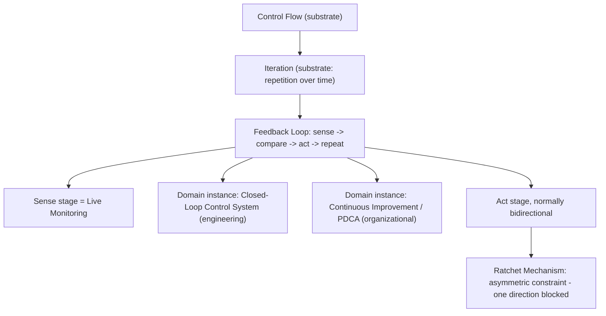
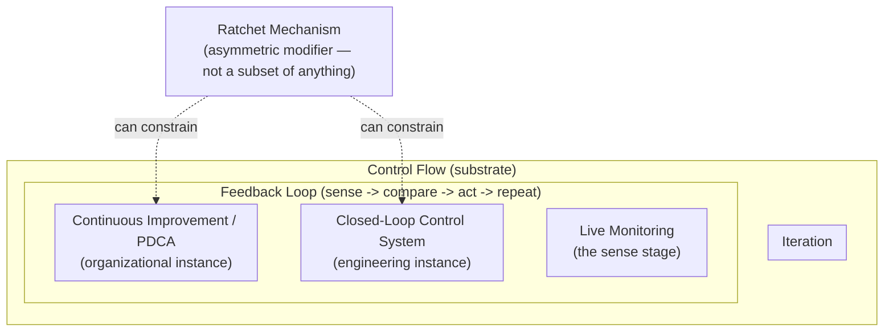

# Feedback Loop Taxonomy: Substrate, Instance, Stage, and Symmetry

## What Is It?

Seven commonly-used terms — **feedback loop, iteration, control flow, closed-loop control system,
continuous improvement, live monitoring, ratchet mechanism** — are often used as if they were
peers, or even loosely interchangeable. They aren't. All seven sit somewhere on the same
underlying structure, Norbert Wiener's cybernetic loop (*Cybernetics*, 1948): **sense → compare →
act → repeat**. What differs between them is *where* on that structure each one sits: whether it
names the whole loop, a single stage of it, the substrate the loop runs on, or a constraint applied
to one of its stages.

This article is the structural map. For the mechanics of closed-loop control itself (open- vs.
closed-loop, negative/positive feedback, PDCA) see
[Closed-Loop Feedback and Amendment Mechanisms for Process Documents](closed-loop-feedback-and-amendment-mechanisms-for-process-documents.md). For the ratchet mechanism
specifically (fitness functions, quality gates, the ratchet-effect literature across economics,
biology, and cultural evolution) see [Quality Gate Ratchet Pattern](quality-gate-ratchet-pattern.md). This article doesn't repeat
either — it's the map showing how all of it, plus iteration, control flow, and live monitoring, fit
together.

This is the **base article** for a growing family. As the same question ("where does X fit in this
map?") gets asked of new vocabulary, the answers are split into focused companion articles rather
than growing this one indefinitely — see **Related Articles** below for the current set: evaluative
dimensions and quality disciplines, enforcement and safety vocabulary, cycle/personal-development
vocabulary and change theory, and two further domain instances (machine-learning training, agentic
reflection loops).

## Why It Matters

Without this map, it's easy to conflate concepts that solve different problems and end up either
missing a piece (a "feedback loop" with no actual comparison-to-reference is just a log) or
over-claiming (calling something a "ratchet" when it's really just an ordinary bidirectional
feedback loop with no locking mechanism — the exact confusion resolved in
[Quality Gate Ratchet Pattern](quality-gate-ratchet-pattern.md)'s "Ratchet vs. Continuous Improvement vs. Selection" section).
Naming which layer a given mechanism actually operates at makes it possible to diagnose what's
*missing* from a system that isn't self-correcting the way it's assumed to: is there no sensing
(no live monitoring)? No comparison (measurement exists but nothing acts on it)? No repetition
(a one-shot check, not a loop)? Or is the loop complete but symmetric when an asymmetric ratchet
was actually needed?

## How It Works

### The structural layering

| Concept | What it actually is | Layer |
|---|---|---|
| **Feedback loop** | The abstract primitive: measure output, compare to a reference, adjust, repeat | Umbrella — everything else here is an instance or a piece of it |
| **Control flow** | The general computing concept of how execution is sequenced — sequence, branch, loop | Substrate — broader than feedback; a feedback loop is *built from* control flow, but not all control flow is feedback (an `if/else` with no comparison to prior output is control flow without feedback) |
| **Iteration** | Repetition of a block over time — a specific category of control flow, alongside sequence and branching | Substrate — the temporal mechanism that lets a feedback loop exist across cycles at all. Necessary but not sufficient: a `for` loop that ignores its own output is repetition, not feedback |
| **Live monitoring** | Continuous sensing/measurement of actual state | Single stage — the "sense" step, made continuous rather than periodically sampled |
| **Closed-loop control system** | The feedback loop instantiated in physical/engineering systems: sensor → error calculation → actuator | Full domain instance — see [Closed-Loop Feedback and Amendment Mechanisms for Process Documents](closed-loop-feedback-and-amendment-mechanisms-for-process-documents.md) for the open-loop/closed-loop distinction in depth, and [Feedback Loop Domain Depth: PID Control, Hysteresis, and Feedback Delay](feedback-loop-control-engineering-pid-hysteresis-and-delay.md) for what's actually inside the "error calculation → actuator" box |
| **Continuous improvement (PDCA/kaizen)** | The feedback loop instantiated in organizational/human-process terms: Plan → Do → Check → Act, repeated | Full domain instance — Deming explicitly modeled PDCA on control theory |
| **Ratchet mechanism** | An asymmetric constraint on the *act* stage: correction allowed one direction only, the other mechanically blocked | Modifier, not a full loop — see [Quality Gate Ratchet Pattern](quality-gate-ratchet-pattern.md) for the full treatment |

Four further domain instances beyond the two above (quality management, personal development,
machine-learning training, agentic reflection loops) and a modifier (self-improving loop) are
covered in the companion articles linked under Related Articles. Substrate concepts even more
primitive than control flow and iteration — dynamic, extremum, cyclical process — are covered in
[Feedback Loop Substrate: Dynamics, Extrema, and Cyclical Process](feedback-loop-substrate-dynamics-extrema-and-cyclical-process.md).

### The symmetry axis

Every concept above is, by default, **symmetric** — a thermostat corrects both up and down;
continuous improvement can in principle regress if nothing prevents it; a `while` loop can move a
tracked value larger or smaller depending on its condition. The ratchet is the one concept in this
set that deliberately breaks that symmetry: it takes an otherwise bidirectional loop and clamps one
direction of its *act* stage shut. That is the precise relationship between continuous improvement
and a ratchet: **continuous improvement is the loop that produces a rising number; the ratchet is a
one-way valve bolted onto that loop's act stage so the number can't fall back down once earned.**

### Containment view (Euler, not Venn)

The diagram above shows *process flow* — what happens in what order. A second, complementary
question is *containment*: which concepts are genuinely a subset of another, versus which merely
touch or modify one without being contained by it. That's properly an **Euler diagram**, not a
Venn diagram — a Venn diagram draws every possible overlap whether or not it's real; an Euler
diagram draws only the overlaps that actually exist. Most relationships here are true containment
(iteration *is a* category of control flow; closed-loop control and continuous improvement are
each *instances of* feedback loop), which Mermaid's nested `subgraph` renders faithfully. The
ratchet is the one exception — it isn't a subset of anything, it's a modifier that can attach to
*either* domain instance, so it's drawn as an edge into both rather than nested inside one:

Read literally: **control flow** is the outermost set; **iteration** is fully inside it (a subset,
not merely related); the **feedback loop** is drawn nested inside control flow too, since it's
built from it, with **live monitoring** as a component inside the loop and **closed-loop control**
/ **continuous improvement** as its two domain instances. The **ratchet**, by contrast, sits
outside every set and reaches in with a dashed "can constrain" edge to either instance — it's a
property that gets *applied to* an instance, not a category any instance belongs to. Don't read
more precision into this than a nested-subgraph diagram can actually carry: it's an accurate
containment sketch, not a formally verified set-theoretic proof.

## When to Use It

Reach for this map when a system that's supposed to self-correct isn't behaving as expected, and
the question is *which layer is missing or misapplied*:

- Data is being collected but nothing changes as a result → live monitoring exists, but there's no
  comparison-to-reference or act stage — it's observation, not a feedback loop.
- A process repeats but never improves → iteration exists, but nothing measures output against a
  goal — it's repetition, not feedback.
- A metric is tracked and a team actively improves it, but it still occasionally regresses →
  continuous improvement exists, but there's no ratchet — the loop is complete and bidirectional,
  and nothing is locking gains in.
- Someone proposes a "ratchet" for something that doesn't actually need irreversibility (a value
  that's fine to move either direction) → check whether an ordinary bidirectional closed-loop
  control system already solves the problem before adding a one-way lock, which is a stronger,
  harder-to-reverse commitment than most metrics need — see [Quality Gate Ratchet Pattern](quality-gate-ratchet-pattern.md)'s case
  study on why a ratchet requires *mechanical, external* enforcement to be real, not just a
  documented intention.

## Examples

**BuildNest's PIT mutation gate** (fully detailed in [Quality Gate Ratchet Pattern](quality-gate-ratchet-pattern.md)) maps onto
all seven terms concretely:

- **Live monitoring** = every CI run measuring the actual mutation score
- **Iteration** = each PR/milestone is one cycle
- **Control flow** = the CI pipeline's own branching (pass/fail steps) the loop is implemented with
- **Feedback loop** = score measured → compared to `mutationThreshold` → build passes or fails
- **Closed-loop control system** = the full CI gate apparatus: sensor (PIT), comparator (the Maven
  plugin), actuator (fail the build)
- **Continuous improvement** = the human process of finding survived mutants and writing stronger
  assertions, milestone over milestone
- **Ratchet** = the deliberate asymmetry: `mutationThreshold` only ever moves up (77 → 79 → 81 →
  83), never down, even though the underlying control loop would technically permit either
  direction

**`~/.claude/rules/definition-of-done.md`** (also detailed in [Quality Gate Ratchet Pattern](quality-gate-ratchet-pattern.md)'s
case study) is the negative example: it has continuous improvement (the Amendment Log records real
tightening over several sessions) but explicitly *lacks* a true ratchet, because nothing external
and mechanical enforces the one-way constraint — the enforcement is a logged-reason norm, not a
gate. It's missing the "closed-loop control system" layer entirely; there is no sensor and no
actuator, only a human (or agent) self-reporting compliance.

## Synthesis

The seven terms aren't seven separate ideas — they're seven different *answers to "which part of
the cybernetic loop are we talking about."* Control flow and iteration are the substrate a loop
runs on. Live monitoring is one stage of the loop (sensing). Closed-loop control systems and
continuous improvement are two domain-specific instances of the whole loop, one physical/engineered
and one organizational/human. A feedback loop is the abstract shape underlying both. And a ratchet
is not a loop at all — it's a constraint bolted onto an existing loop's act stage, deliberately
removing the symmetry every other concept here has by default. Naming which layer a given mechanism
occupies is what makes it possible to diagnose exactly what's missing when a system that's supposed
to self-correct isn't — and to avoid claiming a mechanical guarantee (ratchet) that a system has
only rhetorically, not structurally, earned.

## Quick Reference

| Question | Answer |
|---|---|
| Is a ratchet a type of feedback loop? | No — it's a constraint applied to one stage (act) of an otherwise-complete loop |
| Is iteration the same as a feedback loop? | No — iteration is necessary substrate (repetition over time) but not sufficient; it becomes feedback only once the loop's behavior depends on a measurement of its own prior output |
| Is control flow the same as a feedback loop? | No — control flow is the general substrate (sequence, branch, loop); a feedback loop is one specific pattern built from it |
| Is live monitoring a complete feedback loop? | No — it's the sense stage only; monitoring with no comparison or action is observation, not control |
| Are closed-loop control and continuous improvement the same thing? | They're the same abstract loop instantiated in different domains — engineering/physical vs. organizational/human |
| Does continuous improvement guarantee no regression? | No — by default it's symmetric (can regress); only a ratchet layered on top guarantees a floor |

## References

- Wiener, N. (1948). *Cybernetics: Or Control and Communication in the Animal and the Machine*. MIT Press. — origin of the general feedback-loop formalization (sense → compare → act → repeat).
- Deming, W.E. — PDCA (Plan-Do-Check-Act) cycle, explicitly modeled on control theory; see [Closed-Loop Feedback and Amendment Mechanisms for Process Documents](closed-loop-feedback-and-amendment-mechanisms-for-process-documents.md) for the full PDCA/kaizen treatment.
- [Quality Gate Ratchet Pattern](quality-gate-ratchet-pattern.md) — the ratchet mechanism in full depth, including the ratchet-effect literature (economics, biology, cultural evolution) and the `definition-of-done.md` case study referenced above.
- [Closed-Loop Feedback and Amendment Mechanisms for Process Documents](closed-loop-feedback-and-amendment-mechanisms-for-process-documents.md) — open-loop vs. closed-loop control, negative/positive feedback, and the amendment-mechanism pattern this repo uses for its own rule files.

## Related Articles

- [Quality Gate Ratchet Pattern](quality-gate-ratchet-pattern.md)
- [Closed-Loop Feedback and Amendment Mechanisms for Process Documents](closed-loop-feedback-and-amendment-mechanisms-for-process-documents.md)
- [Feedback Loop Substrate: Dynamics, Extrema, and Cyclical Process](feedback-loop-substrate-dynamics-extrema-and-cyclical-process.md) — dynamic, dynamical systems theory, and cyclical process — the substrate beneath control flow and iteration
- [Feedback Loop Substrate Depth: Extrema, Equilibria, and Physics Grounding](feedback-loop-extrema-equilibria-and-physics-grounding.md) — extremum vs. optimum, extremum principles, and equilibrium
- [Feedback Loop Extension: Evaluative Dimensions and Quality Disciplines](feedback-loop-evaluative-dimensions-and-quality-disciplines.md) — efficiency, effectiveness, excellence, optimization, QA/QC/QM, and trajectory descriptors (refinement, progression, improvement, sustainable growth)
- [Feedback Loop Extension: Enforcement and Safety Vocabulary](feedback-loop-enforcement-and-safety-vocabulary.md) — guardrails, quality gates, checkpoints, prerequisites, fallback, safety nets, enforcement mechanisms, mechanical floors, and the self-improving loop
- [Feedback Loop Enforcement Extensions: Funnels and Epistemic Awareness](feedback-loop-enforcement-extensions-funnels-and-epistemics.md) — the funnel structure and known-unknown/unknown-known
- [Feedback Loop Extension: Cycle Vocabulary, Personal Archetypes, and Change Theory](feedback-loop-cycle-vocabulary-personal-archetypes-and-change-theory.md) — virtuous circle, self-correction, the personal-development domain instance (Prokopton, self-actualizer), first-order/second-order change, and quality attributes
- [Feedback Loop Domain Instance: Machine Learning Training](feedback-loop-domain-instance-machine-learning-training.md) — forward propagation, backpropagation, the chain rule, and gradient descent
- [Feedback Loop Domain Depth: ML Training's Optimization Landscape](feedback-loop-ml-training-optimization-landscape.md) — local minima, saddle points, dimension, and minimization/maximization
- [Feedback Loop Domain Depth: ML Search Strategy and Generalization](feedback-loop-ml-search-strategy-and-generalization.md) — exploration/exploitation, bias-variance, and regularization
- [Feedback Loop Domain Instance: Agentic Reflection Loops](feedback-loop-domain-instance-agentic-reflection-loops.md) — generate/verify/reflect (and self-reflection) in LLM agents, plus three new axes: parametric vs. contextual correction, iteration granularity, and grounded vs. self-referential verification
- [Feedback Loop Domain Depth: PID Control, Hysteresis, and Feedback Delay](feedback-loop-control-engineering-pid-hysteresis-and-delay.md) — what's actually inside the "closed-loop control system" box: PID's three-way decomposition of the compare stage, feedback delay as the cause of oscillation, hysteresis as a third asymmetry distinct from a ratchet, feedforward control, statistical process control, and the SP/PV/MV translation table
