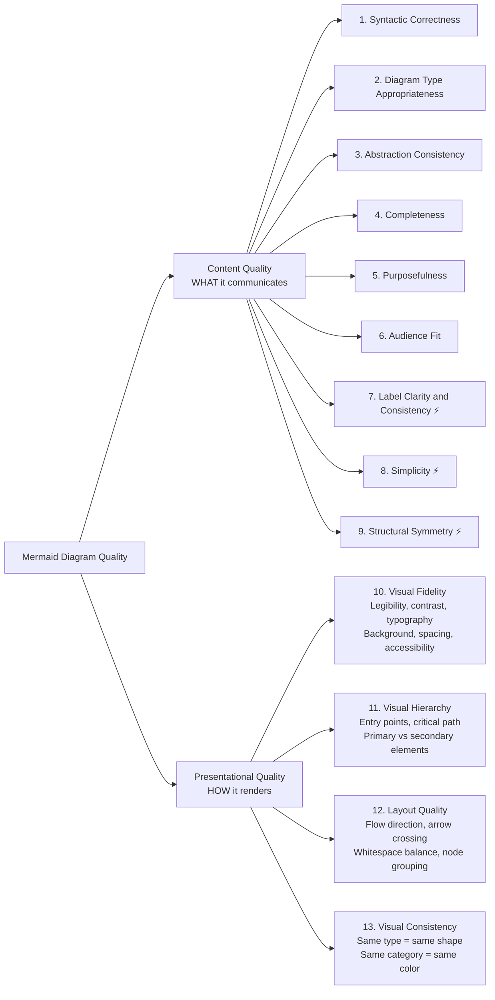
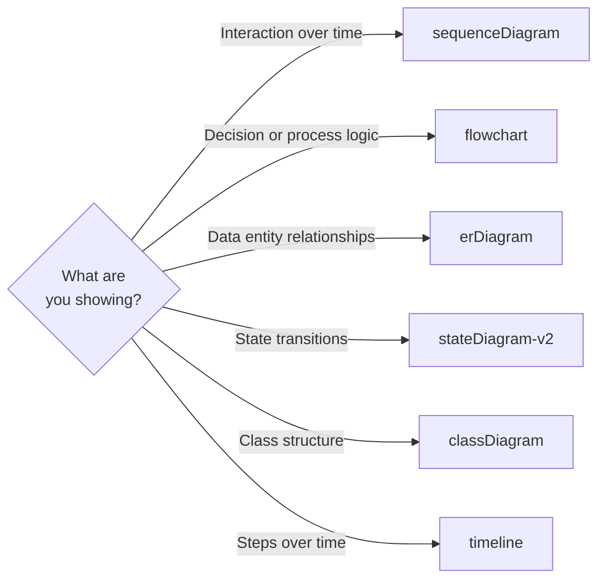
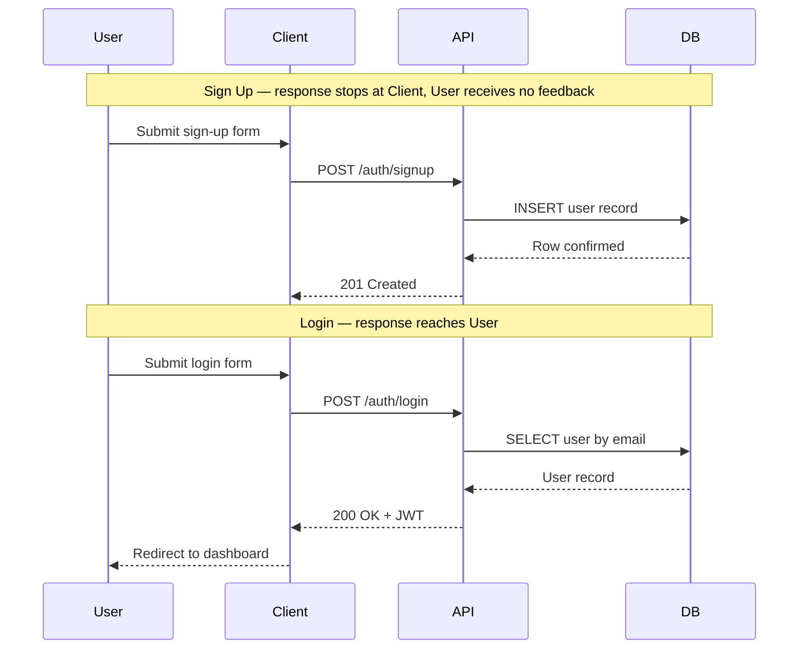
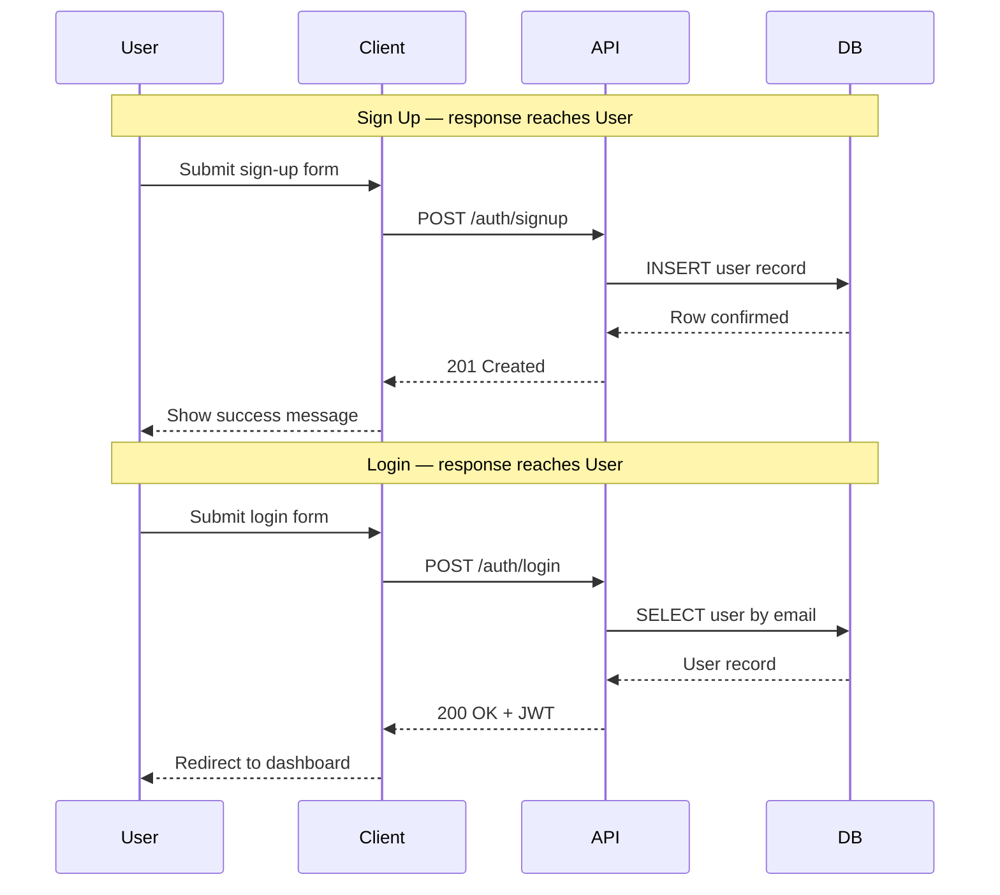
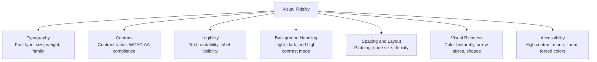
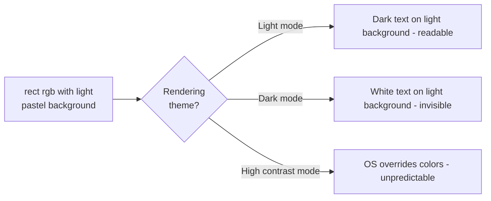
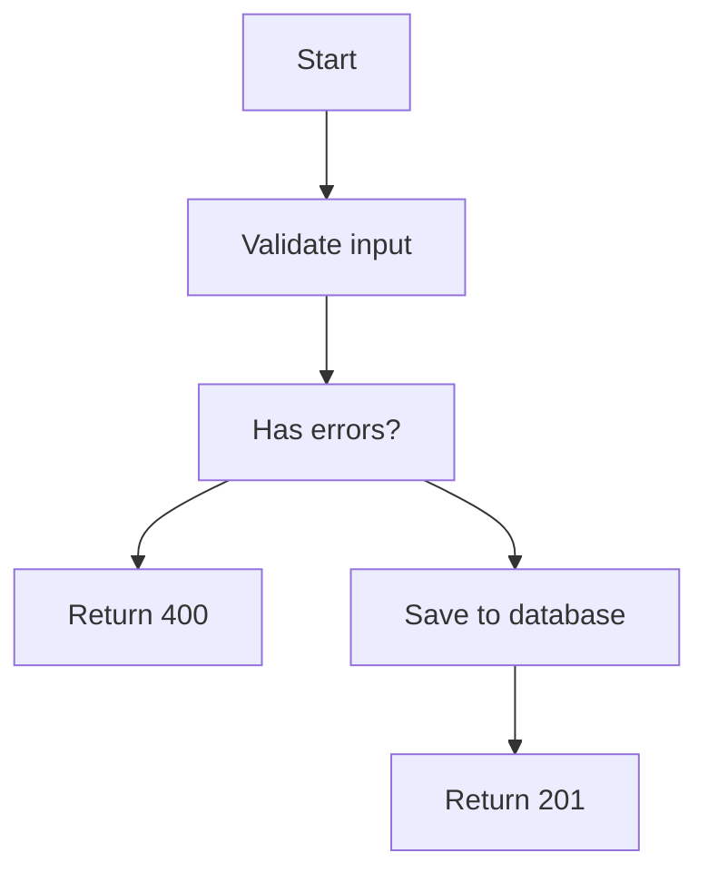
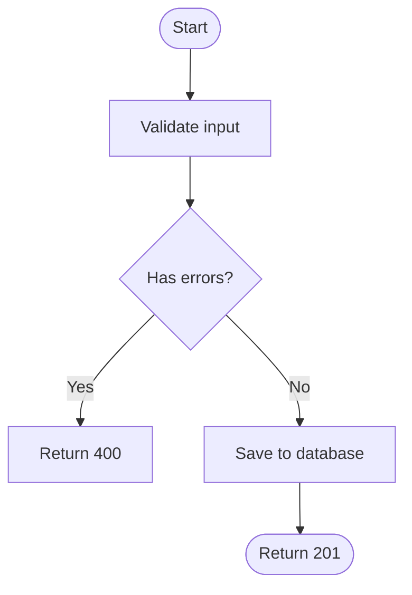
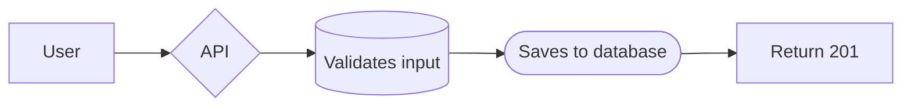
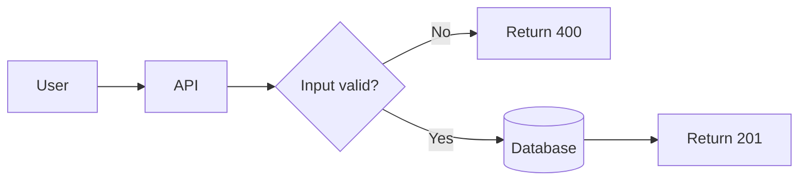

# Mermaid Diagram Quality Attributes

**Category:** Documentation > Diagramming > Mermaid  
**Tags:** `mermaid`, `diagram`, `quality`, `visual-fidelity`, `visual-hierarchy`, `layout-quality`, `visual-consistency`, `documentation`, `best-practices`  
**Last Updated:** 2026-06-24

---

## Overview

A Mermaid diagram is a text-based, code-rendered diagram embedded in Markdown. Because it is rendered — not drawn — its quality depends on two distinct, complementary dimensions:

- **Content quality** — what the diagram communicates: its structure, logic, and information
- **Presentational quality** — how the diagram renders: its legibility, visual hierarchy, spatial organization, consistency, and contrast

Poor diagrams mislead, confuse, or fail silently. This article defines 13 must-have quality attributes across both dimensions that ensure every Mermaid diagram is correct, clear, complete, and visually reliable.

---

## The Taxonomy: Content vs Presentation

This division is principled — it mirrors a fundamental separation of concerns across many disciplines:

| Domain | Content | Presentation |
|---|---|---|
| Web development | HTML structure and semantics | CSS styling and layout |
| Publishing | Manuscript copy | Typography and page design |
| MVC architecture | Model and business logic | View and template |
| Mermaid diagrams | What the diagram shows | How it renders visually |

### The Cross-Cutting Caveat

The split is useful but not perfectly clean. Three attributes straddle both dimensions:

| Attribute | Content Aspect | Presentational Aspect |
|---|---|---|
| **Label Clarity** | Does the label express the right meaning? | Does it fit without overflow or truncation? |
| **Simplicity** | Is the information minimal and non-redundant? | Is the visual noise minimal? |
| **Structural Symmetry** | Do parallel ideas align logically? | Do they appear visually aligned? |

These are **primarily content attributes with presentational consequences** — the content decision drives the presentation outcome.

### Overview



> ⚡ = cross-cutting attribute — has both a content and a presentational dimension.

---

## Content Quality Attributes

### 1. Syntactic Correctness

**The baseline.** A diagram that does not render communicates nothing. All other quality attributes are contingent on this one.

Common Mermaid syntax traps:

| Issue | Wrong | Correct |
|---|---|---|
| Special characters in labels | `A[Add Product (Admin)]` | `A["Add Product (Admin)"]` |
| Em dash unquoted | `A[label — text]` | `A["label — text"]` |
| HTML tags in labels | `A[<b>User</b>]` | `A["User"]` |
| Unbalanced brackets | `A[Login` | `A["Login"]` |
| Colon in label | `A[Status: Active]` | `A["Status: Active"]` |

> **Rule:** Always quote labels containing parentheses, dashes, colons, angle brackets, or other special characters.

---

### 2. Diagram Type Appropriateness

**The most impactful attribute.** Using the wrong diagram type breaks comprehension regardless of content quality — the format itself actively misleads.

> **Analogy:** Using a pie chart to show a process sequence is like using a map to explain a recipe.



---

### 3. Abstraction Consistency

Every element in a diagram must operate at the **same level of detail**. Mixing levels — inter-system calls alongside internal implementation logic — creates cognitive dissonance and misrepresents where responsibility lies.

**Sequence diagram example:**

```
Inconsistent — mixes inter-system and internal logic:
   C ->> API: POST /auth/login
   API ->> API: Iterate bcrypt rounds      ← implementation detail, wrong level
   API -->> C: 200 OK

Consistent — all inter-system communication:
   C ->> API: POST /auth/login
   note right of API: Verify credentials, generate JWT
   API -->> C: 200 OK
```

> **Rule:** Internal logic belongs in `note` annotations or a separate detail diagram — not as self-arrows in a sequence diagram.

---

### 4. Completeness

The diagram must represent **all material paths** — not just the success path. A happy-path-only diagram misrepresents the system.

| Diagram Type | Must Include |
|---|---|
| `sequenceDiagram` | All actors, DB acknowledgments, `alt/else` branches, user feedback on all outcomes |
| `flowchart` | All decision outcomes, terminal states for every branch |
| `stateDiagram-v2` | All transitions including error states, exit conditions, and recovery paths |

> **Claim:** Include all paths that are material to the learning objective.
> **Caveat:** Exhaustive edge cases belong in separate, scoped detail diagrams — not in a single overview diagram.

---

### 5. Purposefulness

A diagram must have **one clear communication goal**. A diagram that tries to serve multiple goals simultaneously serves none of them well — it becomes overloaded, difficult to read, and impossible to scope correctly.

| Audience | Appropriate diagram | Inappropriate diagram |
|---|---|---|
| Developer implementing auth | Detailed sequence with HTTP codes and error branches | High-level business flowchart |
| Stakeholder reviewing a flow | High-level process flowchart with business language | Sequence diagram with bcrypt internals |
| Beginner learning a concept | Step-by-step flow with `note` annotations | Dense ER diagram or multi-level flowchart |

---

### 6. Audience Fit

The diagram's vocabulary, level of detail, and visual complexity must be **calibrated to the prior knowledge of its intended reader**.

Purposefulness defines *what* the diagram is for. Audience Fit defines *who* it is for and ensures the diagram does not assume knowledge the reader does not yet have.

| Prior knowledge level | Vocabulary | Detail level | Visual density |
|---|---|---|---|
| Beginner | Plain language, no acronyms | High-level steps only | Low — few nodes |
| Intermediate | Domain terms acceptable | Moderate — key decision points | Medium |
| Expert | Technical terms, codes, standards | Full detail — all paths | Higher density acceptable |

---

### 7. Label Clarity and Consistency ⚡ Cross-Cutting

Labels must be short, unambiguous, and **formatted consistently** throughout the diagram. Inconsistent labels imply inconsistent meaning.

| Principle | Wrong | Correct |
|---|---|---|
| Consistent format | `user clicks submit` vs `POST /auth/login` | Both use verb-noun form |
| No overloaded labels | `GET /api/orders + Authorization: Bearer JWT` | `GET /api/orders [Authorization: Bearer JWT]` |
| Action-oriented | `form` | `Submit login form` |
| Consistent casing | `Sign Up` vs `LOGIN` vs `authenticated request` | `SIGN UP`, `LOGIN`, `AUTHENTICATED REQUEST` |
| Length | `The system validates the user's email and password format` | `Validate email and password` |

> **Presentational consequence:** Labels exceeding ~40 characters overflow or wrap, breaking layout and spacing.

---

### 8. Simplicity ⚡ Cross-Cutting

Every node, arrow, annotation, and label must earn its place. Anything that does not change what the diagram communicates should be removed.

```
Noise — internal client state is not a message exchange:
   C ->> C: Store JWT in memory

Signal — use a note annotation:
   note right of C: JWT stored in memory
```

> **Rule:** If removing an element does not change what the diagram communicates, remove it.
>
> **Presentational consequence:** Redundant elements increase visual density, reduce spacing, and degrade legibility.

---

### 9. Structural Symmetry ⚡ Cross-Cutting

Parallel concepts must have **parallel visual structure**. Asymmetry implies different meaning — even when none is intended.

**❌ Asymmetric — Sign Up and Login have different terminal points, implying an unintended difference:**



**✅ Symmetric — both flows share the same structure and terminal point:**



> **Presentational consequence:** Structural asymmetry also creates uneven visual weight and irregular node distribution, which degrades layout balance.

---

## Presentational Quality Attributes

### 10. Visual Fidelity

> The degree to which a diagram is **visually rendered correctly, accessibly, and legibly** across all contexts, themes, screen sizes, and rendering environments.

Visual Fidelity is composed of seven distinct sub-attributes, each independently violated:



#### Sub-Attributes Mapped to Concerns

| Concern | Sub-Attribute | Mermaid Context |
|---|---|---|
| Background color | Background Handling | `rect rgb()` fills, node backgrounds |
| Font type and size | Typography | Controlled by Mermaid theme or `%%{init}%%` |
| Text readability | Legibility + Typography | Label length, font size, character count |
| Visibility | Contrast | Text vs background color ratio |
| Visual richness | Aesthetic Hierarchy | Color coding, arrow styles, node shapes |
| Contrast ratios | Contrast — WCAG AA: 4.5:1 minimum | Hardcoded colors break contrast in dark mode |
| Background interaction | Background Handling | Node fill color vs text color pairing |
| High contrast mode | Accessibility | OS-level forced color override — custom styles lose effect |
| Spacing and layout | Spacing and Layout | Node spacing, diagram width, padding |

#### Why `rect rgb()` Violates Visual Fidelity



The root cause: `rect rgb()` applies a hardcoded background color. Mermaid renders text color based on the **active theme** — not the custom background. In dark mode, text becomes white; on a light pastel background, white text is invisible.

#### Visual Fidelity Rules

| Rule | Rationale |
|---|---|
| Never use `rect rgb()` with light pastel colors | Invisible text in dark mode |
| Never set `style A color:#000` without a contrasting `fill:` | Text becomes invisible on dark backgrounds |
| Keep labels ≤ 40 characters | Longer labels overflow or wrap, breaking layout |
| Avoid excessive node density in one diagram | Spacing collapses; nodes overlap |
| Use `note over` for section dividers, not colored rects | Theme-agnostic; always readable |
| Use `%%{init: {'theme': 'base'}}%%` for custom themes | Ensures rendering consistency across environments |
| Test in both light and dark mode before publishing | The authoring view is not the reader's view |
| Prefer Mermaid's default theme colors | They are contrast-safe and theme-consistent by design |

---

### 11. Visual Hierarchy

> The degree to which a diagram uses **visual prominence to guide the reader's eye** through the content in the intended order — making important elements look important and secondary elements look secondary.

Visual Hierarchy determines whether a reader can immediately identify: where to start, what the critical path is, and what is a primary action versus a secondary or conditional one.

**❌ Poor Visual Hierarchy — all elements use the same shape, conveying no distinction:**



**✅ Good Visual Hierarchy — node shapes signal element type, guiding the reader's eye:**



#### Node Shape Conventions

| Element Type | Shape | Mermaid Syntax | Rationale |
|---|---|---|---|
| Start / End | Stadium / Rounded | `(["text"])` | Signals diagram boundary — distinct from all other nodes |
| Process / Action | Rectangle | `["text"]` | Neutral default — the most common element |
| Decision | Diamond | `{"text"}` | Industry-standard branching signal |
| Database / Storage | Cylinder | `[("text")]` | Universal storage convention |
| Input / Output | Parallelogram | `[/"text"/]` | Signals data flow at system boundaries |

#### Visual Hierarchy Rules

| Rule | Rationale |
|---|---|
| Use diamonds for all decision nodes | Reader instantly recognizes branching points without reading the label |
| Use stadiums or rounded nodes for start and end points | Signals diagram entry and exit boundaries |
| Use cylinders for all database or storage nodes | Industry-standard convention — immediately understood |
| Apply the same shape to the same type of element throughout | Mixing shapes for the same type implies unintended distinction |
| Place the diagram entry point at the top or left | Matches the reader's natural reading direction |

---

### 12. Layout Quality

> The degree to which the diagram's **macro-level spatial organization** is logical, uncluttered, and easy to traverse — including flow direction, arrow crossing, whitespace distribution, and node grouping.

In Mermaid, layout is generated automatically by Dagre. The author influences layout indirectly through diagram direction, connection structure, node count, and subgraph usage. Layout quality is therefore primarily a product of content decisions — it cannot be corrected by styling alone.

| Concern | Poor | Good |
|---|---|---|
| **Flow direction** | Mixed or undefined; not matched to content | Single consistent direction — `LR` for processes, `TD` for hierarchies |
| **Arrow crossing** | Many arrows cross each other, obscuring paths | Minimal crossings — restructure connections or split into sub-diagrams |
| **Whitespace** | Nodes cramped or unevenly distributed | Even distribution — reduce node count if spacing collapses |
| **Node grouping** | Related nodes scattered across the diagram | Related nodes clustered using `subgraph` |
| **Diagram scope** | One diagram covering many unrelated concerns | One diagram per clearly scoped topic |
| **Depth vs breadth** | One branch is far deeper or wider than others | Balanced branching — extract deep branches into detail diagrams |

#### Layout Quality Rules

| Rule | Rationale |
|---|---|
| Choose `LR` for sequential processes, `TD` for hierarchies and trees | Direction should match how the content is naturally read |
| Limit each diagram to one clearly scoped topic | Reduces node count, arrow crossing, and cognitive load |
| Use `subgraph` to cluster logically related nodes | Communicates grouping without adding arrows |
| Split large diagrams into separate linked detail diagrams | Improves whitespace, focus, and individual diagram readability |
| Avoid circular or back-edge connections where possible | Cycles disrupt Dagre auto-layout and confuse visual flow |

> **Note:** Because layout is auto-generated, the most reliable way to improve layout quality is to reduce diagram complexity — not to attempt fine-grained styling overrides.

---

### 13. Visual Consistency

> The degree to which a diagram applies **the same visual language uniformly** throughout — so that the same type of element always looks the same, and different types always look visually distinct.

Visual Consistency is violated when the same visual element (shape, color, arrow style, label format) is used to mean different things, or when the same concept is represented differently in different parts of the diagram.

**❌ Inconsistent — different shapes used for equivalent element types:**



**✅ Consistent — each element type uses one defined shape throughout:**



#### Visual Consistency Conventions

| Convention | Rule | Violation Example |
|---|---|---|
| **Node shapes** | Same type always uses the same shape | Process shown as diamond in one place, rectangle in another |
| **Arrow styles** | Same relationship type always uses the same arrow | Synchronous calls sometimes solid, sometimes dotted |
| **Label format** | Same element type always formatted the same way | API calls as `POST /path` in one place, `call auth endpoint` in another |
| **Naming** | Same entity always uses the same name | Same system called "API", "Server", and "Backend" in one diagram |
| **Casing** | Same casing convention applied throughout | Node labels mix `Title Case`, `UPPER CASE`, and `lower case` |
| **Color** | Same category always uses the same color | Two different systems using the same highlight color |

#### Visual Consistency Rules

| Rule | Rationale |
|---|---|
| Define visual conventions before drawing | Convention applied inconsistently is worse than no convention |
| Use the same participant names throughout a sequence diagram | Renamed participants imply different actors |
| Never use the same shape for different element types | Breaks the reader's ability to identify element types by scanning |
| Never use different shapes for the same element type | Reader infers an unintended distinction |
| Apply color categories uniformly if used at all | A node that breaks the color pattern signals a special case — intentionally or not |

---

## Master Checklist

Use before publishing any Mermaid diagram:

### Content
- [ ] Diagram renders without errors (Syntactic Correctness)
- [ ] Diagram type matches the communication goal (Diagram Type Appropriateness)
- [ ] All elements are at the same abstraction level (Abstraction Consistency)
- [ ] All material paths shown — not just the happy path (Completeness)
- [ ] Diagram has one clear communication goal (Purposefulness)
- [ ] Vocabulary and detail level match the intended reader (Audience Fit)
- [ ] Labels are short, unambiguous, and consistently formatted (Label Clarity)
- [ ] No redundant elements — every node, arrow, and label earns its place (Simplicity)
- [ ] Parallel concepts have parallel visual structure (Structural Symmetry)

### Presentation
- [ ] No hardcoded light `rect rgb()` fills (Visual Fidelity)
- [ ] No hardcoded text colors without a contrasting fill (Visual Fidelity)
- [ ] All labels ≤ 40 characters (Visual Fidelity)
- [ ] Node density is low enough to preserve spacing (Visual Fidelity)
- [ ] Default Mermaid theme colors used where possible (Visual Fidelity)
- [ ] Tested and readable in both light mode and dark mode (Visual Fidelity)
- [ ] Entry point is visually prominent and placed at top or left (Visual Hierarchy)
- [ ] Decision nodes use diamonds, storage nodes use cylinders (Visual Hierarchy)
- [ ] Same shape is used for the same type of element throughout (Visual Hierarchy + Visual Consistency)
- [ ] Flow direction is consistent and appropriate to content type (Layout Quality)
- [ ] Arrow crossings are minimal — split diagram if needed (Layout Quality)
- [ ] Related nodes are grouped using `subgraph` where appropriate (Layout Quality)
- [ ] Same element type always uses the same shape, name, and label format (Visual Consistency)
- [ ] Same relationship type always uses the same arrow style (Visual Consistency)

---

## Summary

| # | Attribute | Dimension | Cross-Cutting | Core Question |
|---|---|---|:---:|---|
| 1 | Syntactic Correctness | Content | | Does it render without errors? |
| 2 | Diagram Type Appropriateness | Content | | Is it the right diagram type? |
| 3 | Abstraction Consistency | Content | | Are all elements at the same level of detail? |
| 4 | Completeness | Content | | Are all material paths represented? |
| 5 | Purposefulness | Content | | Does it have one clear communication goal? |
| 6 | Audience Fit | Content | | Is it calibrated to the reader's knowledge? |
| 7 | Label Clarity and Consistency | Content | ⚡ | Are labels short, unambiguous, and uniform? |
| 8 | Simplicity | Content | ⚡ | Does every element earn its place? |
| 9 | Structural Symmetry | Content | ⚡ | Do parallel concepts look parallel? |
| 10 | Visual Fidelity | Presentation | | Is text legible across all themes and environments? |
| 11 | Visual Hierarchy | Presentation | | Does it guide the eye to what matters most? |
| 12 | Layout Quality | Presentation | | Is the spatial organization logical and uncluttered? |
| 13 | Visual Consistency | Presentation | | Is the same visual language used for the same element type? |

> **The 20% that causes 80% of diagram failures:** wrong diagram type (#2), Visual Fidelity violations (#10), mixed abstraction levels (#3), and missing error paths (#4).

---

## Related Articles

- [User Sign Up and Login Authentication Flow](./user-signup-and-login-authentication-flow.md)
- [API Authentication and RBAC Authorization](./api-authentication-and-rbac-authorization.md)
- [HTTP Basic Authentication](./http-basic-authentication.md)
